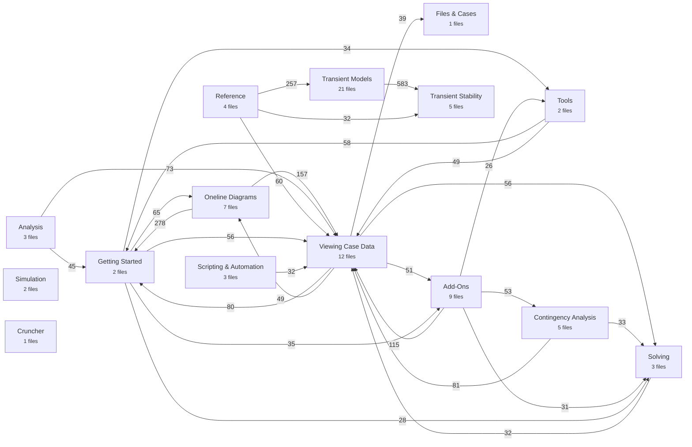

# PowerWorld Simulator Help — Structure Map

How the 1,670 help topics of the PowerWorld Simulator WebHelp are organised, and how that structure maps onto the 80 Markdown chapter files in this repository.

Source: <https://www.powerworld.com/WebHelp/> · captured 2026-09-18

## At a glance

- **1,670** topics: **1,603** from the official table of contents plus **67** reachable only by links
- **27** top-level books in the source help system
- **80** Markdown chapter files, **1,670** sections in total
- **6 MB** of Markdown, **1097** images, 3 reference PDFs

## The 27 source books

Each book below shows its second-level sections, the number of topics beneath them, and the chapter file(s) those topics landed in.

```
 1. Getting Started with PowerWorld  (36 topics)
    ├── About this Manual  (1)  →  01
    ├── Introduction to PowerWorld Simulator  (1)  →  01
    ├── Introduction to Simulator Add-On Tools  (1)  →  01
    ├── What's New  (1)  →  01
    ├── Getting Help  (1)  →  01
    ├── PowerWorld Interface  (10)  →  01
    └── Simulator Ribbon  (22)  →  02
 2. Creating, Loading, and Saving Simulator Cases  (32 topics)
    ├── File Menu  (1)  →  03
    ├── Case Formats  (1)  →  03
    ├── Aux File Browser  (1)  →  03
    ├── General File Browser  (1)  →  03
    ├── Auxiliary File Format (*.aux)  (1)  →  03
    ├── GE EPC File Load Options  (1)  →  03
    ├── PTI RAW File Load Options  (1)  →  03
    ├── Opening Files  (4)  →  03
    ├── Creating Files  (3)  →  03
    ├── Closing Files  (4)  →  03
    ├── Additional File Formats  (11)  →  03
    └── Project Files  (7)  →  03
 3. View Case Data  (231 topics)
    ├── Model Explorer and Case Information Displays  (122)  →  04, 04, 04, 05, 05, 05
    ├── Data View  (2)  →  08
    ├── Data Check  (4)  →  08
    ├── Properties of Simulator Objects  (99)  →  06, 06, 06, 07, 07, 15
    ├── Bus View  (2)  →  08
    ├── Substation View  (2)  →  08
    ├── Spatial View Oneline  (1)  →  08
    ├── Labels  (3)  →  -
    ├── Difference Case  (4)  →  08
    └── Fixed Number Buses  (6)  →  08
 4. Auxiliary Script/Data Files  (10 topics)
    ├── Auxiliary Files and Script Commands  (1)  →  -
    ├── Auxiliary File Format PDF  (1)  →  09
    ├── Auxiliary File Export Format Descriptions  (4)  →  09
    ├── PowerWorld Object Field Variable Names  (1)  →  09
    ├── ObjectID Field for use in Auxiliary Fiels  (1)  →  09
    ├── Script Command Execution Dialog  (1)  →  09
    └── Quick Auxiliary Files Dialog  (1)  →  09
 5. Solving and Simulating a Case  (32 topics)
    ├── Power Flow Solution Theory  (8)  →  10
    ├── Options  (18)  →  10, 10
    ├── Solution and Control  (6)  →  10, 10
    └── Voltage Conditioning Dialog  (1)  →  10
 6. Building and Editing Oneline Diagrams  (115 topics)
    ├── Building Oneline Diagrams  (93)  →  11, 12, 13
    └── Editing Oneline Diagrams  (23)  →  14
 7. Using Oneline Diagrams  (58 topics)
    ├── Oneline Diagram Overview  (1)  →  15
    ├── Relationship Between Display Objects and the Power System Model  (1)  →  15
    ├── Custom Hint Values  (1)  →  15
    ├── Oneline Tools and Options  (17)  →  15
    ├── GIS Tools  (18)  →  16
    ├── Changing the Oneline View  (7)  →  17
    ├── Printing Oneline Diagrams  (4)  →  17
    ├── Contouring  (7)  →  17
    ├── Dynamic Formatting  (3)  →  17
    ├── Difference Flows  (4)  →  -
    └── Fixed Number Buses  (2)  →  17
 8. General Tools  (29 topics)
    ├── Limit Monitoring  (4)  →  18
    ├── Difference Case  (4)  →  -
    ├── Scale Case  (2)  →  18
    ├── Connections Tools  (13)  →  18
    └── Other Tools  (11)  →  18
 9. Edit Mode Tools  (18 topics)
    ├── Equivalencing  (4)  →  19
    ├── Modify Case Tools  (11)  →  19
    └── Renumbering  (5)  →  19
10. Sensitivities  (24 topics)
    ├── Power Transfer Distribution Factors  (8)  →  20
    ├── Line Outage Distribution Factors  (4)  →  20
    ├── Shift Factor Sensitivities  (5)  →  20
    ├── Loss Sensitivities  (1)  →  20
    ├── Flow and Voltage Sensitivities  (6)  →  20
    ├── Line Loading Replicator  (1)  →  20
    └── LODF Screening  (1)  →  20
11. Contingency Analysis  (96 topics)
    ├── Contingency Analysis Overview  (1)  →  21
    ├── Available Contingency Actions  (1)  →  21
    ├── Contingency Analysis Power Flow Solution Options  (1)  →  21
    ├── Contingency Case References  (4)  →  21
    ├── Contingency Records  (12)  →  21
    ├── Contingency Analysis Dialog  (57)  →  22, 23
    ├── Contingency Element Dialog  (24)  →  24
    └── Dependency Explorer  (1)  →  21
12. CTG Combo Analysis  (24 topics)
    ├── CTG Combo Analysis Overview  (1)  →  25
    ├── CTG Combo Contingency Analysis Dialog  (1)  →  25
    └── Contingency Combination Element Dialog  (21)  →  25
13. Time Step Simulation  (34 topics)
    ├── Time Step Simulation  (1)  →  26
    ├── Time Step Simulation: Quick Start  (1)  →  26
    ├── Setup and Control  (20)  →  26
    ├── Schedules  (6)  →  26, 26
    ├── Controller Time Delays  (4)  →  26
    └── Running the Simulation  (4)  →  26
14. Fault Analysis  (10 topics)
    ├── Fault Analysis  (1)  →  27
    ├── Fault Analysis Dialog  (1)  →  27
    ├── Fault Analysis Bus Records  (1)  →  27
    ├── Fault Analysis Generator Records  (1)  →  27
    ├── Fault Analysis Line Records  (1)  →  27
    ├── Mutual Impedance Records  (1)  →  27
    ├── Mutual Impedance Record Dialog  (1)  →  27
    ├── Fault Analysis Load Records  (1)  →  27
    └── Fault Analysis Switched Shunt Records  (1)  →  27
15. Weather  (14 topics)
    ├── Weather Related Features  (1)  →  28
    ├── Weather Dependent Limits  (8)  →  28
    ├── Weather Related Models and Information Dialog  (1)  →  28
    └── Power Flow Weather Models  (4)  →  28
16. PV and QV Curve Add-On (PVQV)  (30 topics)
    ├── PowerWorld Simulator PVQV Overview  (1)  →  29
    ├── PV Curves  (17)  →  29, 37
    ├── QV Curves  (12)  →  29
    └── PV/QV Refine Model  (1)  →  29
17. Optimal Power Flow Add-On (OPF, SCOPF, OPR)  (69 topics)
    ├── Optimal Power Flow (OPF)  (40)  →  30, 30
    ├── Security Constrained OPF (SCOPF)  (20)  →  31
    └── OPF Reserves (OPFR)  (11)  →  31
18. Available Transfer Capability Add-On (ATC)  (24 topics)
    ├── Available Transfer Capability (ATC) Analysis  (1)  →  32
    ├── ATC Dialog  (19)  →  32
    └── ATC Analysis Methods  (5)  →  32
19. Automation Server Add-On (SimAuto)  (73 topics)
    ├── Automation Server  (1)  →  33
    ├── Starting Automation Server  (4)  →  33
    ├── Accessing Data  (3)  →  33
    ├── Automation Server Functions  (56)  →  34
    ├── Automation Server Properties  (11)  →  33
    └── PowerWorld Object Variables  (2)  →  -
20. Integrated Topology Processing Add-On (ITP)  (25 topics)
    ├── Topology Processing Overview  (1)  →  35
    ├── Full-Topology Model  (3)  →  35
    ├── Consolidation  (5)  →  35
    ├── Integrated Topology Processing Dialog  (1)  →  35
    ├── Power Flow Using Topology Processing  (2)  →  35
    ├── Contingency Analysis Using Integrated Topology Processing  (3)  →  35
    ├── Integrated Topology Processing in Applications  (1)  →  35
    ├── Saving the Planning Case  (3)  →  35
    ├── Breaker-to-Device Contingency Conversion  (1)  →  35
    ├── Device Derived Status  (1)  →  35
    ├── Open with Breakers  (1)  →  35
    ├── Close with Breakers  (1)  →  -
    └── Update Allow Open or Close Breakers  (1)  →  -
21. Transient Stability Add-On (TS)  (654 topics)
    ├── Transient Stability Overview  (27)  →  36, 36
    ├── Transient Stability Data Management  (6)  →  36
    ├── Transient Models  (581)  →  38, 39, 39, 39, 39, 39, 40, 40, 40, 40, 41, 42, 42, 43, 43, 43, 44, 44, 45, 45, 46
    └── Transient Stability Analysis Dialog  (41)  →  37, 37, 37
22. Geomagnetically Induced Currents (GIC)  (6 topics)
    ├── GIC Analysis  (1)  →  47
    ├── GIC Analysis Dialog  (1)  →  47
    ├── GIC Analysis Time Varying Input  (1)  →  47
    ├── GIC Analysis Time Varying Electric Field Inputs   (1)  →  47
    └── GIC Analysis Tables and Results  (1)  →  47
23. Scheduled Actions (Schedule)  (6 topics)
    ├── Scheduled Actions Tool  (1)  →  48
    ├── Scheduled Actions Dialog  (1)  →  48
    ├── Scheduled Action Group Dialog  (1)  →  48
    ├── Scheduled Action Dialog  (1)  →  48
    └── Scheduled Action Status Dialog  (1)  →  48
24. Distributed Computing Add-Ons  (1 topics)
25. Tutorials  (1 topics)
26. Cruncher Help  (19 topics)
    ├── Introduction  (1)  →  50
    ├── Cruncher Processing  (1)  →  50
    ├── SimAuto Manager  (1)  →  50
    ├── Main Structures  (5)  →  50
    ├── Processing Phases  (7)  →  50
    ├── Time-Varying CSV File Format  (1)  →  50
    ├── Alarms  (1)  →  50
    ├── Dynamic Snapshot Analysis  (1)  →  50
    └── User Settings  (1)  →  50
27. References  (9 topics)
    └── Open Source Software Licenses  (8)  →  51
```

## How the parts relate

Chapters are grouped into parts. Arrows show where topics in one part link into another (thicker traffic = more cross-references).



## Chapter files by part

### Getting Started

| File | Chapter | Topics | Size |
|---|---|---:|---:|
| [`01-getting-started.md`](01-getting-started.md) | Getting Started with Simulator | 14 | 88 KB |
| [`02-simulator-ribbon.md`](02-simulator-ribbon.md) | The Simulator Ribbon | 21 | 95 KB |

### Files & Cases

| File | Chapter | Topics | Size |
|---|---|---:|---:|
| [`03-cases-files-and-formats.md`](03-cases-files-and-formats.md) | Cases, Files and Formats | 31 | 97 KB |

### Viewing Case Data

| File | Chapter | Topics | Size |
|---|---|---:|---:|
| [`04-model-explorer-and-case-information-part1.md`](04-model-explorer-and-case-information-part1.md) | Model Explorer and Case Information Displays (Part 1 of 3) | 24 | 87 KB |
| [`04-model-explorer-and-case-information-part2.md`](04-model-explorer-and-case-information-part2.md) | Model Explorer and Case Information Displays (Part 2 of 3) | 13 | 56 KB |
| [`04-model-explorer-and-case-information-part3.md`](04-model-explorer-and-case-information-part3.md) | Model Explorer and Case Information Displays (Part 3 of 3) | 26 | 91 KB |
| [`05-case-information-displays-by-object-part1.md`](05-case-information-displays-by-object-part1.md) | Case Information Displays by Object Type (Part 1 of 3) | 18 | 64 KB |
| [`05-case-information-displays-by-object-part2.md`](05-case-information-displays-by-object-part2.md) | Case Information Displays by Object Type (Part 2 of 3) | 17 | 71 KB |
| [`05-case-information-displays-by-object-part3.md`](05-case-information-displays-by-object-part3.md) | Case Information Displays by Object Type (Part 3 of 3) | 23 | 92 KB |
| [`06-object-properties-edit-mode-part1.md`](06-object-properties-edit-mode-part1.md) | Object Properties — Edit Mode (Part 1 of 3) | 21 | 77 KB |
| [`06-object-properties-edit-mode-part2.md`](06-object-properties-edit-mode-part2.md) | Object Properties — Edit Mode (Part 2 of 3) | 12 | 60 KB |
| [`06-object-properties-edit-mode-part3.md`](06-object-properties-edit-mode-part3.md) | Object Properties — Edit Mode (Part 3 of 3) | 18 | 62 KB |
| [`07-object-properties-run-mode-and-general-part1.md`](07-object-properties-run-mode-and-general-part1.md) | Object Properties — Run Mode and General (Part 1 of 2) | 12 | 75 KB |
| [`07-object-properties-run-mode-and-general-part2.md`](07-object-properties-run-mode-and-general-part2.md) | Object Properties — Run Mode and General (Part 2 of 2) | 30 | 103 KB |
| [`08-view-case-data-tools.md`](08-view-case-data-tools.md) | Data View, Data Check and Other Case Data Tools | 15 | 103 KB |

### Scripting & Automation

| File | Chapter | Topics | Size |
|---|---|---:|---:|
| [`09-auxiliary-files-and-script-commands.md`](09-auxiliary-files-and-script-commands.md) | Auxiliary Files and Script Commands | 8 | 40 KB |
| [`33-simauto-overview-and-setup.md`](33-simauto-overview-and-setup.md) | SimAuto — Overview and Setup | 16 | 23 KB |
| [`34-simauto-functions.md`](34-simauto-functions.md) | SimAuto — Function Reference | 55 | 97 KB |

### Solving

| File | Chapter | Topics | Size |
|---|---|---:|---:|
| [`10-power-flow-solution-and-options-part1.md`](10-power-flow-solution-and-options-part1.md) | Power Flow Solution and Simulator Options (Part 1 of 3) | 10 | 58 KB |
| [`10-power-flow-solution-and-options-part2.md`](10-power-flow-solution-and-options-part2.md) | Power Flow Solution and Simulator Options (Part 2 of 3) | 16 | 107 KB |
| [`10-power-flow-solution-and-options-part3.md`](10-power-flow-solution-and-options-part3.md) | Power Flow Solution and Simulator Options (Part 3 of 3) | 4 | 43 KB |

### Oneline Diagrams

| File | Chapter | Topics | Size |
|---|---|---:|---:|
| [`11-building-onelines-network-objects.md`](11-building-onelines-network-objects.md) | Building Onelines — Network Objects | 28 | 83 KB |
| [`12-building-onelines-branches-and-devices.md`](12-building-onelines-branches-and-devices.md) | Building Onelines — Branches and Devices | 26 | 84 KB |
| [`13-building-onelines-graphics-and-insertion.md`](13-building-onelines-graphics-and-insertion.md) | Building Onelines — Graphics and Insertion | 36 | 107 KB |
| [`14-editing-onelines.md`](14-editing-onelines.md) | Editing Oneline Diagrams | 19 | 44 KB |
| [`15-using-onelines-tools-and-options.md`](15-using-onelines-tools-and-options.md) | Using Onelines — Tools and Options | 19 | 63 KB |
| [`16-oneline-gis-tools.md`](16-oneline-gis-tools.md) | Oneline GIS Tools | 17 | 42 KB |
| [`17-oneline-view-printing-and-contouring.md`](17-oneline-view-printing-and-contouring.md) | Oneline View, Printing and Contouring | 17 | 70 KB |

### Tools

| File | Chapter | Topics | Size |
|---|---|---:|---:|
| [`18-general-tools.md`](18-general-tools.md) | General Tools | 22 | 102 KB |
| [`19-edit-mode-tools.md`](19-edit-mode-tools.md) | Edit Mode Tools | 16 | 56 KB |

### Analysis

| File | Chapter | Topics | Size |
|---|---|---:|---:|
| [`20-sensitivities.md`](20-sensitivities.md) | Sensitivities | 23 | 129 KB |
| [`27-fault-analysis.md`](27-fault-analysis.md) | Fault Analysis | 9 | 16 KB |
| [`28-weather.md`](28-weather.md) | Weather Modelling | 13 | 92 KB |

### Contingency Analysis

| File | Chapter | Topics | Size |
|---|---|---:|---:|
| [`21-contingency-analysis-overview-and-records.md`](21-contingency-analysis-overview-and-records.md) | Contingency Analysis — Overview and Records | 19 | 73 KB |
| [`22-contingency-analysis-options.md`](22-contingency-analysis-options.md) | Contingency Analysis — Dialog Options | 29 | 151 KB |
| [`23-contingency-analysis-running-and-results.md`](23-contingency-analysis-running-and-results.md) | Contingency Analysis — Running and Results | 19 | 116 KB |
| [`24-contingency-element-dialog.md`](24-contingency-element-dialog.md) | Contingency Element Dialog | 24 | 121 KB |
| [`25-ctg-combo-analysis.md`](25-ctg-combo-analysis.md) | CTG Combo Analysis | 3 | 15 KB |

### Simulation

| File | Chapter | Topics | Size |
|---|---|---:|---:|
| [`26-time-step-simulation-part1.md`](26-time-step-simulation-part1.md) | Time Step Simulation (Part 1 of 2) | 22 | 72 KB |
| [`26-time-step-simulation-part2.md`](26-time-step-simulation-part2.md) | Time Step Simulation (Part 2 of 2) | 11 | 68 KB |

### Add-Ons

| File | Chapter | Topics | Size |
|---|---|---:|---:|
| [`29-pv-and-qv-curves.md`](29-pv-and-qv-curves.md) | PV and QV Curves (PVQV) | 26 | 144 KB |
| [`30-optimal-power-flow-part1.md`](30-optimal-power-flow-part1.md) | Optimal Power Flow (OPF) (Part 1 of 2) | 25 | 68 KB |
| [`30-optimal-power-flow-part2.md`](30-optimal-power-flow-part2.md) | Optimal Power Flow (OPF) (Part 2 of 2) | 14 | 41 KB |
| [`31-scopf-and-opf-reserves.md`](31-scopf-and-opf-reserves.md) | Security Constrained OPF and OPF Reserves | 29 | 64 KB |
| [`32-available-transfer-capability.md`](32-available-transfer-capability.md) | Available Transfer Capability (ATC) | 23 | 148 KB |
| [`35-integrated-topology-processing.md`](35-integrated-topology-processing.md) | Integrated Topology Processing (ITP) | 21 | 59 KB |
| [`47-geomagnetically-induced-currents.md`](47-geomagnetically-induced-currents.md) | Geomagnetically Induced Currents (GIC) | 5 | 27 KB |
| [`48-scheduled-actions.md`](48-scheduled-actions.md) | Scheduled Actions | 5 | 10 KB |
| [`49-distributed-computing-and-tutorials.md`](49-distributed-computing-and-tutorials.md) | Distributed Computing and Tutorials | 1 | 2 KB |

### Transient Stability

| File | Chapter | Topics | Size |
|---|---|---:|---:|
| [`36-transient-stability-overview-and-data-part1.md`](36-transient-stability-overview-and-data-part1.md) | Transient Stability — Overview and Data (Part 1 of 2) | 21 | 103 KB |
| [`36-transient-stability-overview-and-data-part2.md`](36-transient-stability-overview-and-data-part2.md) | Transient Stability — Overview and Data (Part 2 of 2) | 11 | 54 KB |
| [`37-transient-stability-analysis-dialog-part1.md`](37-transient-stability-analysis-dialog-part1.md) | Transient Stability — Analysis Dialog (Part 1 of 3) | 13 | 81 KB |
| [`37-transient-stability-analysis-dialog-part2.md`](37-transient-stability-analysis-dialog-part2.md) | Transient Stability — Analysis Dialog (Part 2 of 3) | 16 | 79 KB |
| [`37-transient-stability-analysis-dialog-part3.md`](37-transient-stability-analysis-dialog-part3.md) | Transient Stability — Analysis Dialog (Part 3 of 3) | 11 | 66 KB |

### Transient Models

| File | Chapter | Topics | Size |
|---|---|---:|---:|
| [`38-ts-models-machine.md`](38-ts-models-machine.md) | TS Models — Machines and Converters | 64 | 143 KB |
| [`39-ts-models-exciters-part1.md`](39-ts-models-exciters-part1.md) | TS Models — Exciters (Part 1 of 5) | 26 | 99 KB |
| [`39-ts-models-exciters-part2.md`](39-ts-models-exciters-part2.md) | TS Models — Exciters (Part 2 of 5) | 30 | 98 KB |
| [`39-ts-models-exciters-part3.md`](39-ts-models-exciters-part3.md) | TS Models — Exciters (Part 3 of 5) | 33 | 96 KB |
| [`39-ts-models-exciters-part4.md`](39-ts-models-exciters-part4.md) | TS Models — Exciters (Part 4 of 5) | 15 | 109 KB |
| [`39-ts-models-exciters-part5.md`](39-ts-models-exciters-part5.md) | TS Models — Exciters (Part 5 of 5) | 50 | 72 KB |
| [`40-ts-models-governors-part1.md`](40-ts-models-governors-part1.md) | TS Models — Governors (Part 1 of 4) | 19 | 75 KB |
| [`40-ts-models-governors-part2.md`](40-ts-models-governors-part2.md) | TS Models — Governors (Part 2 of 4) | 8 | 54 KB |
| [`40-ts-models-governors-part3.md`](40-ts-models-governors-part3.md) | TS Models — Governors (Part 3 of 4) | 25 | 97 KB |
| [`40-ts-models-governors-part4.md`](40-ts-models-governors-part4.md) | TS Models — Governors (Part 4 of 4) | 32 | 38 KB |
| [`41-ts-models-stabilizers.md`](41-ts-models-stabilizers.md) | TS Models — Stabilizers | 40 | 135 KB |
| [`42-ts-models-generator-other-part1.md`](42-ts-models-generator-other-part1.md) | TS Models — Other Generator Models (Part 1 of 2) | 32 | 127 KB |
| [`42-ts-models-generator-other-part2.md`](42-ts-models-generator-other-part2.md) | TS Models — Other Generator Models (Part 2 of 2) | 37 | 91 KB |
| [`43-ts-models-load-part1.md`](43-ts-models-load-part1.md) | TS Models — Loads (Part 1 of 3) | 21 | 118 KB |
| [`43-ts-models-load-part2.md`](43-ts-models-load-part2.md) | TS Models — Loads (Part 2 of 3) | 10 | 47 KB |
| [`43-ts-models-load-part3.md`](43-ts-models-load-part3.md) | TS Models — Loads (Part 3 of 3) | 38 | 72 KB |
| [`44-ts-models-branch-and-shunt-part1.md`](44-ts-models-branch-and-shunt-part1.md) | TS Models — Branches and Shunts (Part 1 of 2) | 41 | 156 KB |
| [`44-ts-models-branch-and-shunt-part2.md`](44-ts-models-branch-and-shunt-part2.md) | TS Models — Branches and Shunts (Part 2 of 2) | 16 | 62 KB |
| [`45-ts-models-hvdc-part1.md`](45-ts-models-hvdc-part1.md) | TS Models — HVDC (Part 1 of 2) | 30 | 87 KB |
| [`45-ts-models-hvdc-part2.md`](45-ts-models-hvdc-part2.md) | TS Models — HVDC (Part 2 of 2) | 4 | 19 KB |
| [`46-ts-models-other.md`](46-ts-models-other.md) | TS Models — Buses, AGC and Measurement | 9 | 10 KB |

### Cruncher

| File | Chapter | Topics | Size |
|---|---|---:|---:|
| [`50-cruncher.md`](50-cruncher.md) | PowerWorld Cruncher | 18 | 47 KB |

### Reference

| File | Chapter | Topics | Size |
|---|---|---:|---:|
| [`51-references-and-licenses.md`](51-references-and-licenses.md) | References and Licences | 8 | 2 KB |
| [`52-additional-linked-topics-part1.md`](52-additional-linked-topics-part1.md) | Additional Linked Topics (Part 1 of 3) | 41 | 112 KB |
| [`52-additional-linked-topics-part2.md`](52-additional-linked-topics-part2.md) | Additional Linked Topics (Part 2 of 3) | 17 | 59 KB |
| [`52-additional-linked-topics-part3.md`](52-additional-linked-topics-part3.md) | Additional Linked Topics (Part 3 of 3) | 9 | 331 KB |
