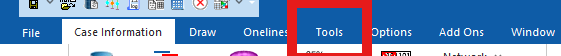
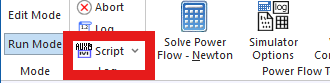
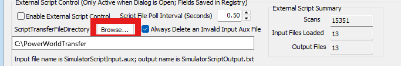
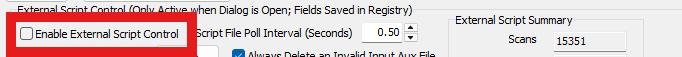
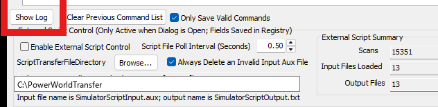

# PowerWorldHiveMind - complete knowledge bundle

Single-file bundle of the PowerWorldHiveMind knowledge base for chat tools that
cannot clone a repository. Source: https://github.com/ChunSikPark/PowerWorldHiveMind

NOTE: a chat interface cannot open your .pwb, run Python, or reach SimAuto. Use
this to have it WRITE code that you then run yourself.

---

# ==== AGENTS.md ====

# PowerWorldHiveMind — agent instructions

You have a knowledge base for **PowerWorld Simulator automation**: driving PowerWorld
from Python with `esapp`, including PowerWorld's own weather features (PWW files and
TimeStep simulation).

## The rule that overrides your defaults

**Consult this knowledge base before you reason. Do not work it out yourself.**

Your instinct on an unfamiliar API is to infer the answer from naming, from similar
libraries, from what looks reasonable. Here that instinct is wrong, and wrong in a
specific way: PowerWorld's failures are **silent**. It accepts your call, returns
success, and gives a wrong answer. You will not get an exception telling you to look
things up. By the time a mistake surfaces, it looks like a modelling result rather than
a bug.

So, without exception:

1. **Before writing any PowerWorld or weather code, open the page that covers it** and
   say which page you are following. Not after your first attempt fails — before the
   first line.
2. **When you do not know something, look it up here first.** Check
   [index.md](index.md) before reasoning from general knowledge. Assume this base
   contradicts what you would have guessed, because it usually does.
3. **When code fails, re-read the page before inventing a fix.** The failure is almost
   always something the page already warns about. Guessing a second time repeats the
   first mistake more expensively.
4. **When no page covers it, say so out loud** and mark the answer as outside the
   knowledge base. Do not quietly improvise and present it with the same confidence as
   sourced work. An unmarked guess is the one failure mode this base cannot fix.
5. **Never contradict a page from memory.** If you believe a page is wrong, say that
   explicitly and give your evidence — do not silently substitute your own answer.

You are not being asked to be less capable. You are being asked to spend two hundred
tokens reading before you spend twenty thousand debugging something this base already
knew.

## How to find the page — and how much of it to read

The kit is 47 pages — 20 in `concepts/`, 16 in `methods/`, 7 in `demos/`, 4 in
`references/` — and you will need three to five of them. The ladder below is about
**finding** the right page cheaply. It is not a budget on how much of that page you read.

1. **Search all four content directories first.** Search the page text, not the catalog
   and not the routing table below. Put several terms in one pass, and include **both**
   the plain-English phrasing and the identifier it probably maps to: "save the case"
   *and* `SaveCase`; "tighten the limits" *and* `LimitSet`; "what's overloaded" *and*
   `ViolationCTG`. You do not know which vocabulary a page uses, so search both and let
   the page tell you. Then **rank a page by how many of your terms land on it** — three
   of five terms on one page is your page; one common word is noise.

   Whatever your tool calls it, you want a full-text search across `concepts/`,
   `methods/`, `demos/` and `references/` — **all four relative to the kit root, not to the
   working directory.** The kit root is `${CLAUDE_PLUGIN_ROOT}` when installed as a plugin,
   and otherwise the directory holding this file. `$KIT` below means that path: substitute
   it before running anything, or the search hits the wrong tree and returns nothing.
   - **Claude Code** — the `Grep` tool with `path` set to the kit root and
     `output_mode: "files_with_matches"`, one call per term or an alternation.
   - **Any shell with ripgrep** — `rg -il "savecase|save the case" "$KIT/concepts" "$KIT/methods" "$KIT/demos" "$KIT/references"`
   - **Cursor** — project-wide find (Ctrl+Shift+F), or a codebase search scoped to those
     four directories.
   - **Windows with neither `rg` nor `grep`** — PowerShell:
     `Select-String -Pattern "SaveCase" -Path $KIT\concepts\*.md,$KIT\methods\*.md,$KIT\demos\*.md,$KIT
eferences\*.md`

   Search is step one because it was measured against the alternatives. 48 agents, 16
   questions with human-written answers, 2026-09-07: searching found the right page 10
   times out of 16, the routing table 8, and starting from `index.md` 7.

2. **A page's `## Abstract` and `## Connections`** — enough to know if it is the right
   page, and which link to follow if it is not.

3. **The page's `## Content`** — the actual procedure. **Read it in full.** Once a page
   is the right page there is no budget: a half-read page is how you end up guessing at
   the exact step it warned you about.

4. **A `references/*-backend.md`** — only when writing code, and only the one you need.

The limit is on **breadth, not depth**. Opening eight pages while hunting for the right
one means your search terms were wrong — change the terms rather than reading a ninth.
Opening one page and reading all of it is the entire point of this base.

**When search comes back thin, [index.md](index.md) and the routing table below are
disambiguators, not routers.** Both name topics, and a topic is coarser than a page. That
gap is what cost them the measurement: agents read a row, picked the right *area*, then
opened the wrong page inside it — the project page instead of the method page. Use them to
see what areas exist, or to choose between two candidates search already found. Do not
start there, and do not stop at whatever page a row happens to mention.

**Never conclude "not in the knowledge base" from a routing-table miss alone.** A miss
there means the table has no row matching your phrasing, which is not the same as the kit
having no page. The rows describe what a page *covers* without saying what it *says*, so
they share little vocabulary with the way a question actually gets asked — in the same
measurement, routing produced two confident "not here" answers on pages it does route.
Report an absence only after searching all four directories for both the plain-English and
the identifier phrasing and finding nothing.

## When the user hands you a case file

Do this in order. Do not skip step 1.

1. **Run the preflight** in [methods/preflight-powerworld.md](methods/preflight-powerworld.md).
   Five seconds. It tells you whether this machine can drive PowerWorld at all. Failing
   here is a fact about the machine, not a bug in your code — report which check failed
   and stop rather than rewriting the analysis. Preflight also prints the Simulator
   **build date** — include it in your report, because behaviour shifts between versions
   and it shifts silently. See
   [concepts/version-requirements.md](concepts/version-requirements.md).
2. **Open and summarize** the case using [methods/esapp-overview.md](methods/esapp-overview.md).
   Report bus/branch/generator counts and whether it solves before doing anything else.
3. **Then** find the page for the actual task in the table below.

## You are here to run studies, not answer queries

The user rarely wants a number. They want the work that number is for. When asked
"what's overloaded", the useful answer usually continues: *why*, *what would fix it*, and
*what you verified*.

So: **diagnose before proposing, and test before recommending.** Group symptoms into
causes — 12 violations on 4 parallel circuits is one problem, not twelve. Then test
candidate fixes on a fresh case each and measure the result, because reinforcing a
network can make it worse and you cannot tell which by reasoning. See
[demos/violation-remediation.md](demos/violation-remediation.md), where 2 of 5 plausible
reinforcements degraded N-1.

Track **count and severity separately** — they disagree, and which one matters is the
user's call, not yours.

Say what you tested, what you rejected, and what you did **not** save.

## Task routing

| The user wants… | Read |
|---|---|
| To know which PowerWorld version is needed | [concepts/version-requirements.md](concepts/version-requirements.md) |
| To know what a term or acronym means | [concepts/glossary.md](concepts/glossary.md) |
| To compare two cases / find what a plan builds | [demos/comparing-planning-cases.md](demos/comparing-planning-cases.md) |
| To fix violations, not just report them | [demos/violation-remediation.md](demos/violation-remediation.md) |
| A worked example of any of this | [demos/start-here.md](demos/start-here.md) |
| **Anything to fail, at any point** | [methods/handling-errors.md](methods/handling-errors.md) |
| Anything at all, first | [methods/preflight-powerworld.md](methods/preflight-powerworld.md) |
| Open a case, read data, solve power flow | [methods/esapp-overview.md](methods/esapp-overview.md) |
| To know what esapp can do | [concepts/esapp.md](concepts/esapp.md) · [concepts/esapp-environment.md](concepts/esapp-environment.md) |
| Weather data downloaded | [methods/teamoverbyeweather-client.md](methods/teamoverbyeweather-client.md) |
| Hourly renewable output from weather | [concepts/timestep-workflow.md](concepts/timestep-workflow.md) → [methods/timestep-simulation-setup.md](methods/timestep-simulation-setup.md) |
| To read timestep result CSVs | [methods/how-to-analyze-results.md](methods/how-to-analyze-results.md) |
| To add buses, lines, loads, generators | [methods/adding-devices-esapp.md](methods/adding-devices-esapp.md) |
| To apply a dispatch to a case | [methods/applying-a-dispatch-to-a-case.md](methods/applying-a-dispatch-to-a-case.md) |
| To save a case to disk | [methods/save-powerworld-case.md](methods/save-powerworld-case.md) |
| Contingency analysis results | [methods/reading-violationctg.md](methods/reading-violationctg.md) |
| A contingency set for chosen devices | [methods/new-device-contingency-aux.md](methods/new-device-contingency-aux.md) |
| Devices ranked by violation severity | [methods/ranking-new-devices-by-severity.md](methods/ranking-new-devices-by-severity.md) |
| To change limit-monitoring thresholds | [methods/powerworld-limitset-setdata.md](methods/powerworld-limitset-setdata.md) |
| To reclassify lines as transformers | [methods/converting-lines-to-transformers.md](methods/converting-lines-to-transformers.md) |
| To drive Simulator without SimAuto, by dropping aux files | [methods/aux-file-mode.md](methods/aux-file-mode.md) for the rules and a working template; [concepts/powerworld-script-transfer.md](concepts/powerworld-script-transfer.md) for how the channel itself works. Read the first one before writing a script |
| A SCRIPT action but does not know its name | [references/aux-script-commands.md](references/aux-script-commands.md) |
| Exact field names and signatures | [references/esapp-schema-reference.md](references/esapp-schema-reference.md) |

## Rules that apply to every line of code you write

These are not style preferences. Each one fails **silently** — no exception, no warning,
just a wrong answer or a write that did nothing.

1. **Keep key fields in any DataFrame you write back.** `BusNum` for a bus, `BusNum` +
   `GenID` for a generator, bus pair + circuit for a branch. Without them PowerWorld
   cannot tell which row you mean and the write is a no-op that reports success.

2. **`pw[Obj, field] = values` is positional over the whole table.** The two write forms
   behave differently, and mixing them up is how a write silently hits the wrong objects:

   - `pw[Obj, field] = values` — **positional, whole table.** A scalar broadcasts to every
     object of that type; a list must be one value per object, in table order. There is no
     row matching here, so a list built from a filtered subset lands on the wrong rows.
     Build the full column and assign that.
   - `pw[Obj] = df` — **matched by key field.** A filtered subset is fine and correct:
     writing 3 rows changes exactly those 3 objects, provided the DataFrame carries a
     complete key set (rule 1).

   So "filter, then write" works — just do it with the DataFrame form, not the field form.

3. **Prefer `esapp` over the standalone `esa` package.** Same SimAuto underneath, better
   documented. Do not mix them.

4. **Call the named esapp method, not a hand-written script string.**

   ```python
   pw.esa.TimeStepDoRun()                          # correct
   pw.esa.RunScriptCommand("TimeStepDoRun;")       # wrong
   ```

   esapp 0.2.1 wraps **310 SCRIPT commands** as typed methods across 20 SAW mixins —
   roughly 300 of the ~370 actions Simulator defines. Both forms reach the same COM call, so the
   win is not runtime validation: it is a Python-side signature check, correct argument
   building (bracket lists, quoting, filter and solver enums), and above all **one place
   the maintainer can patch when PowerWorld changes a command's syntax.** A hand-written
   string is a call site nobody can reach. The dangerous case is not a command that
   disappears — that raises — but one whose parameter order or meaning changes, so the
   string "succeeds" and does the wrong thing.

   Use `RunScriptCommand` only where no wrapper exists — about 41 actions, mostly
   oneline/GUI (`OpenOneline`, `ExportOneline`), dialogs, and a few writers. Check the
   command against esapp's own method list before concluding a wrapper is missing —
   absence from `references/aux-script-commands.md` proves nothing, since that page is a
   working subset. Leave a comment saying why whenever you do fall back to a string.

5. **`SaveCase` is the exception, and it is not one of the 310.** esapp routes it through
   COM, not the script builder, and `pw.esa.SaveCase(...)` is a **silent no-op** — returns
   success, writes no file. **`pw.save(...)` is the same trap**: it is a one-line
   passthrough to `esa.SaveCase`, so it also writes nothing and says nothing. The no-op is
   below esapp — the raw `SimAuto.SaveCase(path, "PWB", True)` returns `('',)`, SimAuto's
   success value, and creates no file. Use the script form, exactly two parameters, and
   assert the file exists:

   ```python
   pw.esa.RunScriptCommand(f'SaveCase("{out}", PWB);')
   assert os.path.exists(out), "SaveCase reported success but wrote nothing"
   ```

   `OpenCase` and `CloseCase` are likewise absent from the SCRIPT index.

6. **A DC solve always reports zero mismatch.** It cannot tell you a generation schedule
   is short — the slack bus absorbs the shortfall. Check the schedule against total load
   directly, never the post-solve mismatch.

7. **Use absolute paths.** Relative paths resolve against PowerWorld's working
   directory, not your script's.

8. **Clear contingency results before solving.** They persist stale inside the `.pwb`,
   so a fresh-looking read can be from a previous run.

9. **`UserWarning: Read-only field(s)` is usually wrong — do not code around it.** On
   esapp 0.2.1 a write to a field its generated schema calls read-only **warns and then
   writes anyway**. The schema keeps only fields Simulator reports as unconditionally
   `enterable` and drops every conditional one, so it under-reports badly: 112 `Branch`
   fields, 33 `Bus`, 5 `Gen` (including `GenMVR`), 1 `Load`. `Branch.LineStatus` is the
   one you will hit first — PowerWorld's own answer is *"Depends: Normally enterable except
   when field Lockout is YES"*, and `pw[Branch, 'LineStatus'] = 'Open'` works.

   Ask PowerWorld, not esapp:

   ```python
   fl = pw.esa.GetFieldList('branch')     # 'enterable' is PowerWorld's answer
   fl[fl.internal_field_name == 'LineStatus'][['enterable']]
   ```

   A genuinely read-only field has `enterable` blank (e.g. `Shunt.SSMinMVR`) and its write
   vanishes with no error. Both directions therefore land in the same place: **assert the
   effect — read the field back and compare — never the absence of an exception** (see
   *When something goes wrong* below). And never run under `-W error::UserWarning`: it
   converts these false alarms into hard failures on code that works.

## When something goes wrong

Read [methods/handling-errors.md](methods/handling-errors.md). The short version: most
failures are yours to fix silently — a missing package, a wrong access path, a field name
you guessed. Fix them and keep going; the user asked for an analysis, not a debugging log.

Stop and ask in exactly three cases: the SimAuto licence is missing (no code change can
fix it), the action is destructive, or it is a genuine modelling decision.

**And the harder case: PowerWorld often fails without failing.** It accepts a malformed
request, reports success, and does nothing. Assert the *effect* — count objects before
and after — never the absence of an exception. See
[demos/adding-a-device.md](demos/adding-a-device.md) for a real three-failure run.

## Reporting back

Say which pages you used. If your answer turns out to be wrong, that makes it traceable
to a specific page rather than to "the AI got it wrong" — which is how this knowledge
base gets fixed.

State plainly when something is outside what these pages cover. This kit is about
**PowerWorld automation** — operating Simulator from Python. It does not cover
contingency analysis fundamentals, OPF formulation, PV/QV curve studies, transient
stability theory, or weather science such as dynamic line ratings and IEEE 738 thermal
modelling. Say so rather than improvising.

## Filing a defect against this knowledge base

The two reports worth making, both rare:

1. **No page covers it.** Only after searching `concepts/`, `methods/`, `demos/` and
   `references/` on both the plain-English and the identifier phrasing and finding
   nothing. A routing-table miss is not evidence of absence — see the false-absent rule
   above. Between `esapp-schema-reference.md` and `aux-script-commands.md` the API surface
   is close to fully covered, so a genuine gap is unusual and therefore worth recording.
2. **A page is wrong.** You followed it, the code failed or returned a wrong answer, and
   re-reading it did not resolve the failure. This is the more valuable report: every page
   here exists because someone lost time to the thing it documents.

**Offer the report. Do not file one on your own.** Build a pre-filled link and hand it to
the user, who clicks it, reviews the issue on GitHub, and submits:

```
https://github.com/ChunSikPark/PowerWorldHiveMind/issues/new?title=TITLE&body=BODY&labels=LABEL
```

Percent-encode `TITLE` and `BODY`. Use `Page wrong: methods/<page>.md` or
`No page: <topic>` as the title and `page-defect` or `missing-page` as the label. The body
should carry: the page you followed, the code you ran, what PowerWorld did instead of what
the page predicted, the Simulator build date from preflight, and the esapp version. Keep it
compact — a URL past roughly 8,000 characters will not open, so link to a gist or ask the
user to paste a long traceback into the issue themselves.

If `gh` is installed and authenticated on this machine, this files it in one step:

```bash
gh issue create --repo ChunSikPark/PowerWorldHiveMind \
  --title "Page wrong: methods/save-powerworld-case.md" \
  --label page-defect --body "..."
```

**Either way, show the user the exact text first and say that the tracker is public.** A
traceback carries case filenames, bus numbers, and substation or utility names, and the
cases this kit drives are frequently CEII or otherwise restricted. Let the user edit the
text or decline entirely; a report is never worth leaking a case.

Before reporting a page wrong, rule yourself out: re-read the page in full, confirm you
kept the key fields, and confirm you asserted the effect rather than the absence of an
exception. Most first-guess "the page is wrong" turns out to be one of those three.

## What you cannot do here

PowerWorld automation needs Windows, an installed Simulator, and a **separately licensed
SimAuto add-on**. If preflight fails on the licence check, no code change fixes it.

Fetching weather data and inspecting PWW files is pure Python and works anywhere — see
[methods/teamoverbyeweather-client.md](methods/teamoverbyeweather-client.md). But
*applying* that weather needs PowerWorld, because TimeStep runs inside Simulator.


---

# ==== index.md ====

# Index — every page in PowerWorldHiveMind

One line per page. Read this to decide what to open; do not open everything.

## Demos — worked examples with real output

Complete runs on a real 37-bus case, including what goes wrong and how it was fixed.

| Page | What it covers |
|---|---|
| [aux-file-cookbook](demos/aux-file-cookbook.md) | Claude in one window, Simulator in the other. Four recipes in order: turn the channel on, prove it with a four-line script, inventory a case, then take a bus out and measure it. Start here if you are working through files rather than Python. |
| [adding-a-device](demos/adding-a-device.md) | Three attempts that reported success and created nothing, then the fix. `CreateData` accepts a malformed call and builds nothing. If you read one demo, read this one. |
| [comparing-planning-cases](demos/comparing-planning-cases.md) | Diff a 2016 and a 2024 case to find what the plan builds — 691 new branches, 199 new generators — then solve a contingency set for only the new devices. Includes the scoping trap that makes the naive answer 87% wrong. |
| [contingency-and-aux](demos/contingency-and-aux.md) | Run N-1 from nothing, then write a filter and contingency `.aux` from the result and load it back. 89 auto-inserted contingencies, 12 violations, 5 targeted ones merged. |
| [power-flow-and-sensitivities](demos/power-flow-and-sensitivities.md) | AC and DC solves plus LODF and PTDF, including the `1e8` sentinel that makes LODF output look insane and a PTDF failure whose obvious fix fails the same way. |
| [start-here](demos/start-here.md) | The one-line prompts to open with, and worked runs on a 37-bus case with every failure left in on purpose. |
| [timestep-and-pfw](demos/timestep-and-pfw.md) | Turn a weather file into hourly wind and solar output, starting with the check that decides whether the case can do it at all: do its renewable units carry PFW model strings? Here, 9 of 45 did. |
| [violation-remediation](demos/violation-remediation.md) | The full study: find 12 N-1 violations, work out why they happen, test five reinforcements, and rank them by measured effect. Two of the five made the system worse. |

## Methods — how to do a thing

Step-by-step procedures. Read the one that matches your task.

| Page | What it covers |
|---|---|
| [adding-devices-esapp](methods/adding-devices-esapp.md) | Create buses, branches and loads in an open case, then solve a DC OPF and screen N-1. The write-side counterpart to esapp-overview. |
| [aux-file-mode](methods/aux-file-mode.md) | PowerWorld and LLM interaction through files: the agent writes `.aux`, you drop it into a watched folder, results come back as CSVs. The GUI setup handshake an agent cannot perform itself, the rules (never `OpenCase`, never `LogClear`, always read back), and a working template to copy. |
| [applying-a-dispatch-to-a-case](methods/applying-a-dispatch-to-a-case.md) | Turn a MW-per-generator dispatch into a runnable scenario case. The DC solve fakes a balance rather than telling you the fleet is short. |
| [converting-lines-to-transformers](methods/converting-lines-to-transformers.md) | Reclassify branches as transformers when a case models every branch as a line. `BranchDeviceType` is read-only; the real switch is `LineXFMR = "YES"` plus the nominal kV fields. |
| [esapp-overview](methods/esapp-overview.md) | The starting page: open a case, read and write data, solve power flow, and use `snapshot()` to experiment without damaging anything. |
| [handling-errors](methods/handling-errors.md) | What to do when something fails, sorted into fix it yourself, fix it and mention it, and stop and ask. |
| [how-to-analyze-results](methods/how-to-analyze-results.md) | Read the solar and wind CSVs a timestep run produces: the two-file naming, the 8-row metadata header, and the UTC timestamp conversion. |
| [new-device-contingency-aux](methods/new-device-contingency-aux.md) | Turn a list of devices into a contingency set plus an area-restricted violation filter, shipped as one `.aux` that loads without saving the case. |
| [powerworld-limitset-setdata](methods/powerworld-limitset-setdata.md) | Change PowerWorld's limit-monitoring thresholds. `SetData` on `LimitSet` fails with a missing-key-field error unless you supply the entire field row. |
| [preflight-powerworld](methods/preflight-powerworld.md) | Five checks in five seconds: can this machine drive PowerWorld from Python at all? Run it before writing any analysis code. |
| [ranking-new-devices-by-severity](methods/ranking-new-devices-by-severity.md) | Solve a new-device contingency set and answer which new device is worst. Produces one `devices.csv`, ranked worst first. |
| [reading-violationctg](methods/reading-violationctg.md) | Get which contingency caused which violation, keyed by `CTGLabel`, by reading `ViolationCTG` after `CTGSolveAll()`. |
| [reducing-a-contingency-set](methods/reducing-a-contingency-set.md) | `CTGSkip` and `Delete` do different jobs and get confused for each other. `CTGSkip` partitions a set without shrinking it. |
| [save-powerworld-case](methods/save-powerworld-case.md) | Write an open case back to disk. The COM `SaveCase` returns success and writes no file, so use the script form and check the file exists. |
| [teamoverbyeweather-client](methods/teamoverbyeweather-client.md) | Download a weather dataset, crop it to a region and a time window, and get `.pww` files ready for PowerWorld. Pure Python — no PowerWorld licence needed. |
| [timestep-simulation-setup](methods/timestep-simulation-setup.md) | Drive TimeStep to turn `.pww` files into hourly generation CSVs, including the per-generator prerequisites a case must satisfy first. |
| [visualize-renewable-output](methods/visualize-renewable-output.md) | Plot the timestep CSVs: fleet totals over time, per-ISO and per-state breakdowns, capacity-factor curves, and peak and trough hours. |

## Concepts — what a thing is

Background. Read when a method references something you do not recognise.

| Page | What it covers |
|---|---|
| [aux-only-powerworld](concepts/aux-only-powerworld.md) | A `.aux` file is a complete program — open a case, edit it, solve it, export CSVs, write the log and exit, with no Python and no SimAuto call at all. Field names must come from esapp's schema or PowerWorld's own field export, never from the *Auxiliary File Format* manual, which has no per-object field catalog. |
| [case-impedance-completeness](concepts/case-impedance-completeness.md) | A case can solve DC power flow for years while carrying no resistance and no line charging at all. DC reads only `X`, so nothing ever complains. |
| [case-to-case-device-transplant](concepts/case-to-case-device-transplant.md) | Copy a set of devices from one case into another without rebuilding the chain that produced them, by carving a filtered AUX out of the source case. |
| [copper-plate](concepts/copper-plate.md) | Strip every branch, load and shunt and leave a single slack bus, so generators dispatch to total system load with no transmission constraints. |
| [esapp-environment](concepts/esapp-environment.md) | What `esapp` is, what it needs to run, and how the `PowerWorld` entry point, the bracket interface and the `SAW` wrapper fit together. |
| [esapp-script-command-wrappers](concepts/esapp-script-command-wrappers.md) | Why you call `pw.esa.TimeStepDoRun()` rather than `RunScriptCommand("TimeStepDoRun;")`, and the roughly 41 actions where no wrapper exists. |
| [esapp](concepts/esapp.md) | The full API map for `esapp`: top-level imports, architecture, and what the package can actually do. |
| [gic](concepts/gic.md) | Geomagnetically induced currents: what they do to transformers during a geomagnetic disturbance, and what PowerWorld models. |
| [glossary](concepts/glossary.md) | Every acronym and piece of jargon this kit uses, defined once. Read the confused-pairs section even if you skip the rest — PWW versus PFW has cost people whole afternoons. |
| [lodf](concepts/lodf.md) | Every branch's post-outage flow for every single-branch outage, from one matrix factorization. Measured live it is not an approximation of DC contingency analysis; it is the same answer. |
| [opf-preconditions](concepts/opf-preconditions.md) | LP OPF needs three independent preconditions at once — an area under `BGAGC = "OPF"`, AGC-able generators, and a real cost model — and misses a fatal error rather than a degraded solve. Synthetic cases routinely ship with all three off. |
| [parallel-contingency-solve](concepts/parallel-contingency-solve.md) | PowerWorld's own distributed `CTGSolveAll` never spawns workers here and silently degrades to serial. Split the contingency set across N processes instead. |
| [per-unit-basis-discipline](concepts/per-unit-basis-discipline.md) | A per-unit value is meaningless without the base it was normalized against, and it looks like a plain scalar, so it gets copied between sources and summed. |
| [powerworld-inertia-and-cost-data](concepts/powerworld-inertia-and-cost-data.md) | Four case-data facts to know before touching generator inertia or cost, starting with `Gen.TSH` being H on a 100 MVA system base rather than the unit's own. |
| [powerworld-script-transfer](concepts/powerworld-script-transfer.md) | Simulator 25 beta watches a directory and executes any `.aux` dropped in it, writing the log back to a text file — a channel into PowerWorld that needs no COM, no SimAuto and no SimAuto licence. Undocumented in the manual. |
| [powerworld-simauto](concepts/powerworld-simauto.md) | The Windows COM server every PowerWorld Python script ultimately talks to, its SAW mixin architecture, and the verified raw COM calls. |
| [pww-data](concepts/pww-data.md) | The PWW binary weather format: gridded variables packed as uint8 per timestep and grid point, with 255 as the NaN sentinel. |
| [timestep-simulation](concepts/timestep-simulation.md) | What a timestep simulation is here: hourly renewable output computed quasi-statically from weather data. It is not a transient-stability study. |
| [timestep-workflow](concepts/timestep-workflow.md) | The whole chain from a `.pww` file to per-generator hourly CSVs, in the order PowerWorld requires it. |
| [version-requirements](concepts/version-requirements.md) | Which Simulator version you need and what this kit was verified against: build 24.2026.7.22, with 13 of 14 feature areas confirmed working. |

## References — the heavy code layer

Exact backend mechanics. Open ONLY when writing code, and only the one you need.

| Page | What it covers |
|---|---|
| [aux-script-commands](references/aux-script-commands.md) | Which SCRIPT command does a job, organized by task. Argument lists and exact syntax live in PowerWorld's own *Auxiliary File Format* manual, not here. |
| [esapp-package-backend](references/esapp-package-backend.md) | esapp internals: bracket-interface mechanics, SAW mixin composition, the component-generation pipeline, the schema model, and the exception hierarchy. |
| [esapp-schema-reference](references/esapp-schema-reference.md) | The exact key fields and command names for writing esapp code. Open it when a read-modify-write has to round-trip. |
| [time-step-simulation-backend](references/time-step-simulation-backend.md) | The timestep worker's PowerWorld call sequence, its generator field list, and the CSV post-processing that skips the 8 header rows. |


---

# ==== demos/adding-a-device.md ====

---
type: method
domain: tooling
aliases: [demo-adding-device, add-line-demo, createdata-demo, silent-no-op-demo]
tags: [demo, esapp, createdata, branch, n-1, worked-example]
---

# Demo: Adding a line — and the silent failure that hides it

## Abstract

A complete worked run on a real 37-bus case. **Everything below actually happened**,
including three failed attempts that raised no error at all. This is the single most
important demo in the kit: `CreateData` accepts a malformed call, reports success, and
creates nothing. If you read only one demo, read this one.

## Connections

- **Up:** [Home](../index.md) · demos index
- **Across:** [adding-devices-esapp](../methods/adding-devices-esapp.md) · [handling-errors](../methods/handling-errors.md) · [esapp-environment](../concepts/esapp-environment.md)

## Content

### The user's prompt

> *"Add a line between bus 27 and bus 31 and tell me if it helps with N-1."*

That is all a user should have to say.

### Step 1 — establish the baseline

```python
from esapp import PowerWorld
from esapp.components import Branch, Bus, ViolationCTG

CASE = r"C:\path\to\Synth40.pwb"
pw = PowerWorld(CASE)
pw.pflow()

n0 = len(pw[Branch])
print("branches before:", n0)
```

```
branches before: 89
```

Baseline N-1, so there is something to compare against:

```python
pw.esa.RunScriptCommand("CTGClearAllResults")
pw.esa.RunScriptCommand("CTGAutoInsert")
pw.esa.RunScriptCommand("CTGSolveAll")
print("base violations:", len(pw[ViolationCTG, ["CTGLabel", "LimViolPct"]]))
```

```
base violations: 12
```

### Step 2 — three attempts that all "succeeded" and did nothing

These are the natural things to try. Each ran without raising:

```python
# attempt A
pw.esa.RunScriptCommand(
    'CreateData(BRANCH,[BusNum,BusNum:1,LineCircuit,LineR,LineX,LineC,LineLimMVA,LineStatus],'
    '[27,31,"9",0.01,0.05,0.0,100.0,"Closed"])')

# attempt B - fewer fields
pw.esa.RunScriptCommand(
    'CreateData(BRANCH,[BusNum,BusNum:1,LineCircuit,LineR,LineX],[27,31,"8",0.01,0.05])')

# attempt C - same thing, but inside EDIT mode
pw.edit_mode()
pw.esa.RunScriptCommand(
    'CreateData(BRANCH,[BusNum,BusNum:1,LineCircuit,LineR,LineX],[27,31,"7",0.01,0.05])')
pw.run_mode()
```

The observed result of all three:

```
  A: quoted circuit, Closed: no exception
     -> branches now 89
  B: no status field: no exception
     -> branches now 89
  C: in EDIT mode: no exception
     -> branches now 89
```

**No exception. No warning. No device.** The buses both exist, no branch 27–31 was
already there, and the call reported success three different ways.

An agent that trusts the absence of an error will now happily run N-1, get the same 12
violations, and report "adding this line does not help" — a conclusion drawn from a line
that was never added. That is the failure mode this whole knowledge base exists to
prevent.

### Step 3 — stop guessing, read the page

The fix is in [adding-devices-esapp](../methods/adding-devices-esapp.md), and it is not something you would arrive at by
trying variations:

1. Use the **`pw.esa.CreateData(...)` method**, not a `RunScriptCommand` string.
2. Supply **every** primary, secondary, and required field. For a `Branch` that means
   `BusName_NomVolt` for *both* ends, not just the bus numbers.
3. Supply **all three** MVA limits — `LineAMVA`, `LineAMVA:1`, `LineAMVA:2`. Giving only
   the A limit silently skips the branch.

```python
# build the name/nominal-voltage map first; both ends must resolve
nv = {int(r["BusNum"]): r["BusName_NomVolt"]
      for _, r in pw[Bus, ["BusName_NomVolt"]].iterrows()}

frm, to, mva = 27, 31, 100.0

pw.edit_mode()
pw.esa.CreateData(
    "Branch",
    ["BusNum", "BusName_NomVolt", "BusNum:1", "BusName_NomVolt:1", "LineCircuit",
     "LineR", "LineX", "LineAMVA", "LineAMVA:1", "LineAMVA:2", "LineStatus"],
    [frm, nv[frm], to, nv[to], "N1", 0.01, 0.05, mva, mva, mva, "Closed"])
pw.run_mode()

n1 = len(pw[Branch])
print(f"branches after: {n1}  (created {n1 - n0})")
assert n1 - n0 == 1, "CreateData silently skipped the device"
```

```
branches before: 89
branches after : 90   (created 1)
ASSERTION PASSED - device really created
```

### Step 4 — always assert the count

```python
assert n1 - n0 == expected, "CreateData silently skipped the device"
```

**Never skip this line.** It is the only thing standing between a silent no-op and a
confident wrong answer. Count before, count after, assert the difference. Do it for
every `CreateData` call, every time.

### Step 5 — answer the actual question

```python
pw.pflow()
pw.esa.RunScriptCommand("CTGClearAllResults")
pw.esa.RunScriptCommand("CTGSolveAll")
print("violations with the new line:", len(pw[ViolationCTG, ["CTGLabel", "LimViolPct"]]))
```

```
N-1 violations WITH the new line: 10  (base case was 12)
```

### What to report back

> Added a 69 kV line from bus 27 to bus 31 (circuit N1, R=0.01, X=0.05, 100 MVA on all
> three limits) and verified the branch count went 89 → 90.
>
> N-1 violations dropped from **12 to 10**. The line helps.
>
> The case was **not saved** — this ran in memory. Say the word and I will write it out.
>
> Pages used: `methods/adding-devices-esapp.md`, `methods/reading-violationctg.md`.

Note the last two points. Say plainly that nothing was written to disk, and cite the
pages so a wrong answer is traceable.

### The lesson

The correct call is not guessable. Three reasonable attempts failed identically and
silently.


---

# ==== demos/aux-file-cookbook.md ====

---
type: reference
domain: tooling
aliases: [aux-cookbook, two-window-workflow, script-transfer-walkthrough, first-drop,
  getting-started-aux, external-script-control-setup]
tags: [demo, aux, script-transfer, walkthrough, getting-started, two-window]
---

# Cookbook: Claude in one window, Simulator in the other

## Abstract

A start-to-finish walkthrough of the file-based workflow, written for someone sitting in
front of two windows. Four recipes, in order: turn the channel on, prove it is alive with a
four-line script (skip that one once you trust it), let the agent scan the case for its
devices, then change something and measure it. Every number here came from a real run on a
small sample case, failures included.

## Connections

- **Up:** [Home](../index.md)
- **The reference:** [aux-file-mode](../methods/aux-file-mode.md), the rules and the full
  template this page walks you through
- **The channel:** [powerworld-script-transfer](../concepts/powerworld-script-transfer.md)
- **The language:** [aux-only-powerworld](../concepts/aux-only-powerworld.md)
- **Other demos:** [start-here](start-here.md)

## Content

### How this works

Two windows, side by side: Simulator with your case open, and Claude. They never talk to
each other directly. They pass files through one folder you nominate.

Claude writes a script. You copy it into the folder. Simulator notices it, runs it, deletes
it, and writes back a log plus whatever CSVs the script asked for. Claude reads those. That
is the whole loop.

This page assumes you are the one moving the file, which is the case when Claude is somewhere
it cannot reach that folder. If Claude is running on the same machine and can write there, it
copies its own scripts in and reads its own results, and your job shrinks to the setup in
recipe 1. Simulator behaves the same either way: it polls the folder and picks up whatever it
finds.

You choose the folder. Any empty one will do, on any drive you can write to — and if
Simulator already has a transfer folder configured from an earlier session, use that one
rather than making a second. Decide now and tell Claude the full path; it should ask rather
than assume, and it has no way to see your filesystem layout.

Everything below writes `<your transfer folder>` where that path goes.

---

### Recipe 1 — Turn the channel on

Do this in Simulator. Claude cannot do any of it, and will ask you to.

**1. Open PowerWorld Simulator.**

**2. Open your case.** Any `.pwb` will do. The numbers further down came from a small 7-bus
sample, so yours will differ. Follow the shape of each step rather than the values.

**3. Switch to Run Mode, then open the Tools tab.** The source deck specifies Run Mode here.
Do not skip it and assume a script can switch modes for you later.



**4. Click Script** to open the Script Command Execution Dialog.



**5. Set ScriptTransferFileDirectory.** Click **Browse...** and pick your folder. The
screenshot below shows one machine's path; yours will differ, and that box is the
authoritative answer to "which folder is Simulator actually watching".



Everything you need is on that one panel. Two things on it before you move on:

- The heading says **"Only Active when Dialog is Open; Fields Saved in Registry"**. That is
  the whole story on persistence: the folder and the tick survive a restart, the open dialog
  does not.
- **"Always Delete an Invalid Input Aux File"** makes Simulator throw away a script it cannot
  parse instead of leaving it in the folder. Leave it ticked. It does not cover everything
  (see [When it goes wrong](#when-it-goes-wrong)), but it removes the most common way a run
  gets stuck repeating.

**6. Tick Enable External Script Control.**



**7. Leave the dialog open.** Closing it stops Simulator watching the folder, and the settings
keep reading as enabled either way, so everything still looks configured while nothing
happens.

**8. Click Show Log** and keep that window where you can see it. Every script writes its
progress there as it runs.



Watch that log. The output file appears only once a run finishes, so while something is wrong
the folder tells you nothing. The log separates two failures that otherwise look identical to
waiting:

- A looping run repeats the same block of lines every poll interval.
- A failed run prints its error in full, including the cases where no output file is ever
  written.

Then tell Claude, in these words or your own:

> *"Aux-file mode. My transfer folder is `<your transfer folder>` and I have my case loaded."*

Steps 5 and 6 are once per machine; the registry keeps them across restarts. Steps 1, 2, 3,
7 and 8 are every session.

---

### Recipe 2 — Prove it is alive before you trust it

**Skip this if you have used the channel before and know it works.** It is here for your
first run on a machine, where a broken script and a channel that was never running look
exactly the same from the folder: nothing happens either way.

Do not debug a real script against an unproven channel. Ask for the smallest possible one:

> *"Give me a four-line aux that just writes a marker to the log, so I can check the channel
> works."*

You get something like this. Save it anywhere except the transfer folder:

```
SCRIPT
{
  LogAdd("HELLO -- the channel works");
  LogAddDateTime;
}
```

Now copy it into your transfer folder and rename it to exactly `SimulatorScriptInput.aux`.

> Copy it in finished. Do not save into the folder from an editor. Simulator cannot tell a
> finished file from one you are still writing, and a half-written script is still valid up
> to the cut. It will run the fragment.

Within a second, two things happen:

| | |
|---|---|
| `SimulatorScriptInput.aux` disappears | Simulator consumed it. The deletion is the acknowledgement |
| `SimulatorScriptOutput.Txt` appears | The log from that run |

Open it. The last line is what you are looking for:

```
Automatic loading of file ...\SimulatorScriptInput.Aux started at 2026-09-21T14:43:01.314Z
Starting load of auxiliary file: ...\SimulatorScriptInput.Aux
HELLO -- the channel works
September 21, 2026 09:43:01.342
Finished load of auxiliary file: ...\SimulatorScriptInput.Aux
Automatic loading of file finished successfully in 0.083 seconds
```

`finished successfully in N seconds` is the completion signal. A small case runs in
0.08–0.5 s; a large one takes longer and prints the same line. If you see it, the channel
works, and every later problem is in your script rather than your setup.

If the file does not disappear, the channel is not running. In order of likelihood: the
Script dialog got closed, the checkbox is not ticked, or the folder in the dialog is not the
folder you copied into. Delete `SimulatorScriptInput.aux` before you retry, or it will run
the moment you fix the setting.

**Read the folder back to each other.** Nothing on the file side can tell you whether
Simulator is watching the folder you are writing to: there is no heartbeat file and no echo
of the setting. So when a drop goes unanswered, the first move is for whoever is at the GUI
to read the **ScriptTransferFileDirectory** box out loud, character for character, and
compare it to the path the script is being copied into. A trailing space, a different drive
letter or a near-identical folder name all produce exactly the silence you are looking at,
and the file side cannot distinguish any of them from a closed dialog.

---

### Recipe 3 — Let it scan the case first

Once you confirm the setup, the agent should raise this on its own, **and then wait for you
to answer:**

> *"Channel is live. I cannot see your case from here. Do you want me to scan it first and
> list what devices are in it? It is read-only, it writes CSVs and changes nothing."*

It should not drop anything until you reply. Your Simulator is live and your case is loaded,
so the first file that lands runs against your session — that decision is yours, even for a
read-only scan. If an agent scans without asking, it is not following this page.

It should also not raise this **until you have said the setup is done**. Recipe 1's steps and
this proposal belong in two separate messages: activation first, ending there, and the scan
offered only after you confirm the dialog is up. An agent that hands you the setup steps and a
script to approve in the same breath is asking you to consent to a drop on a channel that does
not exist yet.

Say yes. Until it runs, the agent knows nothing about your case: not the bus numbers, not
whether there are transformers, not whether a contingency set already exists. One drop
replaces all of that guessing.

The script it hands you writes the case summary plus one CSV per device class: buses,
branches, substations, generators, loads, shunts, contingencies, areas, zones. The pattern
repeats:

```
//--- STAGE A: where the CSVs go -------------------------------------------
SCRIPT
{
  // <<< EDIT: your transfer folder. YES = create the subfolder if absent.
  SetCurrentDirectory("<your transfer folder>\scan", YES);
  CaseSummaryGet("", "SCAN_00_case_identity.txt", 3);
}

//--- STAGE B: the network -------------------------------------------------
SCRIPT
{
  // KEY: BusNum
  SaveData("SCAN_bus.csv", CSV, Bus,
           [BusNum,BusName_NomVolt,BusNomVolt,SubNum,SubName,AreaNum,ZoneNum,
            BusStatus,BusSlack,BusPUVolt,BusAngle,BusGenMW,BusLoadMW],
           [], "", [], NO, NO);

  // KEY: BusNum, BusNum:1, LineCircuit
  // BranchDeviceType is what separates a Line from a Transformer.
  SaveData("SCAN_branch.csv", CSV, Branch,
           [BusNum,BusNum:1,LineCircuit,BranchDeviceType,LineStatus,
            LineR,LineX,LineAMVA,LineMW,LinePercent],
           [], "", [], NO, NO);
}

//--- STAGE C: the injections ----------------------------------------------
SCRIPT
{
  // KEY: BusNum, GenID
  // GenMVRMax/Min is capability, not dispatch. A unit idling at 0 MVAr with
  // 200 MVAr of range is reactive support; GenMVR alone would call it nothing.
  SaveData("SCAN_gen.csv", CSV, Gen,
           [BusNum,GenID,GenStatus,GenMW,GenMVR,GenMVRMax,GenMVRMin],
           [], "", [], NO, NO);

  LogAdd("SCAN COMPLETE");
}
```

The remaining classes follow the same shape. Field names below were read out of
PowerWorld's own object-field export, which is the only authority; do not invent names or
take them from the *Auxiliary File Format* manual, which has no per-object field catalog.

```
  // KEY: BusNum, LoadID
  SaveData("SCAN_load.csv", CSV, Load,
           [BusNum,LoadID,BusName_NomVolt,LoadStatus,LoadMW,LoadMVR,LoadSMW,LoadSMVR,
            AreaNum,ZoneNum],
           [], "", [], NO, NO);

  // KEY: BusNum, ShuntID
  SaveData("SCAN_shunt.csv", CSV, Shunt,
           [BusNum,ShuntID,BusName_NomVolt,SSStatus,SSNMVR,SSCMode,AreaNum,ZoneNum],
           [], "", [], NO, NO);

  // KEY: SubNum
  SaveData("SCAN_substation.csv", CSV, Substation,
           [SubNum,SubName,Latitude,Longitude,AreaNum,ZoneNum],
           [], "", [], NO, NO);

  // KEY: AreaNum   -- note the MW fields are BG-prefixed, NOT AreaLoadMW
  SaveData("SCAN_area.csv", CSV, Area,
           [AreaNum,AreaName,BGLoadMW,BGGenMW,BGLossMW,BusLoadNum],
           [], "", [], NO, NO);

  // KEY: ZoneNum   -- same BG prefix here
  SaveData("SCAN_zone.csv", CSV, Zone,
           [ZoneNum,ZoneName,BGLoadMW,BGGenMW,BGLossMW,BusLoadNum],
           [], "", [], NO, NO);

  // KEY: CTGLabel  -- empty file just means no contingency set is defined
  SaveData("SCAN_contingency.csv", CSV, Contingency,
           [CTGLabel,CTGSkip,CTGSolved,CTGViol,CTGProc],
           [], "", [], NO, NO);
```

The Area and Zone lines are worth a second look, because guessing here is exactly what the
warning trap catches. Their MW totals are **`BGLoadMW` / `BGGenMW` / `BGLossMW`**, on a
balancing-group prefix. The names you would reach for by analogy, `AreaLoadMW` and
`ZoneLoadMW`, do not exist. Asking for them produces a `Warning:`, not an error, and a CSV
holding the key column and nothing else while the run reports success.

Every table leads with its key fields. A bus row is keyed by `BusNum`, a generator by
`BusNum` + `GenID`, a branch by `BusNum` + `BusNum:1` + `LineCircuit`. Drop the key and you
cannot join the CSV to anything, and if you write it back PowerWorld cannot tell which device
you meant: the change does nothing and still reports success.

Three things to know when you read the results:

- **A zero-byte CSV means the case has none of that class**, not that the scan failed. No
  header row is written for an empty type. An empty `SCAN_shunt.csv` is a real answer.
- **The summary header and the CSVs can disagree, on purpose.** `SCAN_00_case_identity.txt`
  describes the `.pwb` on disk; the CSVs describe what is loaded right now. If you changed
  something without saving, the CSVs are the truthful half.
- **Search the log for `Warning:`.** A scan asks for many field names at once, and a wrong
  one is only a warning:

  ```
  Warning: unknown fields will not be written to the file
  Warning: Variable name 'AREALOADMW' is not defined for Area objects.
  ```

  That run wrote a 75-byte `SCAN_area.csv` containing the key column and nothing else, and
  reported success. Nothing else tells you the numbers you asked for are missing.

With those CSVs the agent answers follow-ups without another drop: what the voltage range is,
how many transformers there are, which branches are most loaded, whether a contingency set
already exists.

### Recipe 4 — Change something and measure it

> *"Take bus 4 out of service and tell me what it does to the system."*

What comes back is one script that baselines the case, opens the three branches touching bus
4, re-solves, writes everything to CSV, then closes those branches again so your case is
where you left it. Copy in, rename, watch it go. It takes about 0.4 s.

Bus 4 was carrying 93.71 MW of generation and 80 MW of load. Diffing the before and after
CSVs:

| | before | after |
|---|---|---|
| bus 4 status | `Connected` | `Disconnected` |
| bus 4 voltage | 1.000000 pu | 0.000000 |
| bus 3 voltage | 0.992669 pu | 0.961330 |
| slack output | 200.63 MW | 215.83 MW |
| worst branch loading | 68.7 % | 91.9 % |

Only bus 3 moves, because it was the one leaning on bus 4's local generation. Line 1–3 goes
from comfortable to nearly loaded. All of that came out of the CSVs; the log never contained
it.

**Why the script opens branches instead of the bus.** You cannot switch a bus off by setting
its status. That field reports whether the bus is energised; it does not control it, and
writing to it does nothing while still reporting success. The script opens the branches, lets
the status follow, then reads it back to prove it worked.

---

### When it goes wrong

Three failure shapes, all of which look similar from your side of the folder.

**The file sits there and nothing happens.** A setup problem: dialog closed, checkbox
unticked, or wrong folder. Delete the file, fix the setting, drop again.

How long to wait before calling it dead: **30 seconds on a small case, a couple of minutes on
a large one.** Successful round trips here run 0.08-0.5 s on a seven-bus case, so anything
past a few seconds is already abnormal; the extra margin is only for a case big enough that
the solve itself is slow. If the input file has not been touched in 30 seconds, stop waiting.
It is not slow, it is not running.

**The file sits there but files keep being written.** The script failed partway and Simulator
is re-running it every poll interval, forever. Output timestamps advance while the input file
stays put. Delete `SimulatorScriptInput.aux` yourself.

`Always Delete an Invalid Input Aux File` in the setup panel is aimed at exactly this, and
you should have it ticked. It is not a complete guard, though: a run was observed looping on
2026-09-21 with a script that parsed fine and then crashed Simulator partway through, which
is not the same thing as an invalid file. Keep a timeout on anything that drops files
automatically.

**Everything completed, but a column is missing from a CSV.** A bad field name is a
`Warning:`, not an error. The column is dropped and the run still reports success. Search the
log for `Warning:` after every run:

```
Warning: unknown fields will not be written to the file
Warning: Variable name 'AREALOADMW' is not defined for Area objects.
```

That run produced a 75-byte CSV with the key column and nothing else, and reported success.

### What this mode costs you

- **It is not headless.** A dialog has to stay open, so nothing batches or runs in parallel.
- **Something has to move the file.** Whoever can write to the watched folder triggers the
  run. If Claude is running on the same machine and can write there, it drops its own scripts
  and reads its own results, and you only supply the GUI setup. If it cannot reach the folder,
  which is the hand-off case this mode exists for, every run waits on you.
- **Claude never makes Simulator do anything.** It writes a file. Simulator decides, on its
  own poll interval, to pick it up. That is the whole extent of the control it has, and it is
  why a dropped script cannot leave your case somewhere you did not ask for.

In exchange, every script is reviewable before it touches your case, every artifact is a file
you can read and keep, and you end up with a script you own rather than a session that
happened once.


---

# ==== demos/comparing-planning-cases.md ====

---
type: method
domain: tooling
aliases: [comparing-planning-cases, case-diff, case-comparison, planning-delta, what-changed, new-devices]
tags: [demo, planning, case-diff, contingency, aux, esapp, worked-example]
---

# Demo: Comparing two planning cases, and testing what the plan builds

## Abstract

Two vintages of the same system — a 2016 summer peak and a 2024 summer peak — diffed to
find what the plan actually builds, then a contingency set generated for **only the new
devices** and solved. Real numbers throughout: 691 new branches, 199 new generators, and
a scoping trap that would have made the headline answer **87% wrong**.

## Connections

- **Up:** [Home](../index.md) · demos index
- **Across:** [new-device-contingency-aux](../methods/new-device-contingency-aux.md) · [ranking-new-devices-by-severity](../methods/ranking-new-devices-by-severity.md) · [contingency-and-aux](contingency-and-aux.md) · [reading-violationctg](../methods/reading-violationctg.md) · [adding-devices-esapp](../methods/adding-devices-esapp.md)

## Content

### The user's prompt

> *"Compare my 2016 and 2024 cases, work out what the plan builds, and tell me whether
> the new devices cause problems."*

### Step 1 — the two cases

```python
from esapp import PowerWorld
from esapp.components import Bus, Branch, Gen

a = PowerWorld(r"C:\cases\Synth2k_case1.pwb")
b = PowerWorld(r"C:\cases\Synth2k_case.PWB")
for name, s in (("2016", a.summary()), ("2024", b.summary())):
    print(f"{name}: {s['n_bus']} buses / {s['n_branch']} branches / "
          f"{s['n_gen']} gens / load {s['total_load_mw']:.0f} MW")
```

```
2016 summerpeak: 2000 buses / 3220 branches / 544 gens / load 67109 MW
2024 summerpeak: 2000 buses / 3911 branches / 743 gens / load 87578 MW
```

Load grows 67.1 GW → 87.6 GW, **+30.5%** over eight years. That framing matters: the
build is a response to that growth, and it is the first thing to report.

### Step 2 — diff, but guard against false construction

**A naive diff is wrong in the direction that looks right.** A renumbered bus, a
relabelled circuit, or a swapped from/to each produce a RETIRED row *and* a matching NEW
row. An unguarded comparison reports construction that never happened, and the output
looks entirely plausible.

So run the naive diff and the guarded one, and compare them:

```python
# --- buses: naive by number, then paired by (name, kV) ---
ba, bb = a[Bus, ["BusName", "BusNomVolt"]], b[Bus, ["BusName", "BusNomVolt"]]
na, nb = set(ba["BusNum"].astype(int)), set(bb["BusNum"].astype(int))

key = lambda d: set(zip(d["BusName"].astype(str).str.strip(), d["BusNomVolt"].round(2)))
ka, kb = key(ba), key(bb)

renumbered = (len(na - nb) + len(nb - na)) - (len(ka - kb) + len(kb - ka))
```

```
BUSES  naive by BusNum  : retired-looking 0, new-looking 0
       paired by (name,kV): only-2016 0, only-2024 0
       => 0 bus rows differ by NUMBERING only
```

Same for branches, normalising the endpoint order:

```python
bf = lambda pw: set(zip(pw[Branch]["BusNum"].astype(int),
                        pw[Branch]["BusNum:1"].astype(int),
                        pw[Branch]["LineCircuit"].astype(str).str.strip()))
norm = lambda s: {(min(x, y), max(x, y), c) for x, y, c in s}
```

```
BRANCHES naive             : retired-looking 0, new-looking 691
         from/to normalised: retired 0, NEW 691
         => 0 were FROM/TO SWAPS, not construction

GENERATORS: retired 0, NEW 199
```

**This pair is clean** — no renumbering, no swaps, nothing retired. Pure expansion: 691
branches and 199 generators added.

That is a finding, not a formality. Run the guarded diff *anyway*, every time. When the
two counts agree you have earned the right to trust the number; when they disagree, the
naive answer was fiction and you would never have known.

Devices present in both but with changed parameters are a third category — **UPGRADED**
— found by comparing ratings and impedances on the common keys, not by set difference.

### Step 3 — a contingency set for only the new devices

```python
kv = {int(r["BusNum"]): float(r["BusNomVolt"]) for _, r in b[Bus, ["BusNomVolt"]].iterrows()}
new = sorted(bf(b) - bf(a))
hv = [t for t in new if max(kv.get(t[0], 0), kv.get(t[1], 0)) >= 345]
```

```
new branches: 691
of which >=345 kV: 31
```

Scope before you solve. 691 contingencies on a 2000-bus case is a long wait; the 31
highest-voltage additions answer the question that matters first.

```python
sel = hv[:25]
lines  = ["CONTINGENCY (Name, Skip)", "{"]
lines += [f'"NEW_{f}_{t}_{c}" "NO"' for f, t, c in sel] + ["}", ""]
lines += ["CONTINGENCYELEMENT (Contingency, Object, Action, Status)", "{"]
lines += [f'"NEW_{f}_{t}_{c}" "BRANCH {f} {t} {c}" "OPEN" "CHECK"' for f, t, c in sel] + ["}"]

aux = os.path.abspath(r"C:\out\tx_new_devices.aux")
open(aux, "w", encoding="utf-8").write("\n".join(lines))

b.esa.RunScriptCommand("CTGClearAllResults")
n0 = len(b[Contingency])
b.esa.RunScriptCommand(f'LoadAux("{aux}", YES)')
n1 = len(b[Contingency])
assert n1 - n0 == len(sel)
```

```
wrote aux: 2216 bytes, 25 contingencies
contingencies in case before LoadAux: 3875
after LoadAux: 3900  (added 25)
```

**Note that first number.** The 2024 case already carried **3,875 contingencies** of its
own. Which sets up the trap.

### Step 4 — the trap that makes the answer 87% wrong

```python
b.esa.RunScriptCommand("CTGSolveAll")
v = b[ViolationCTG, ["CTGLabel", "LimViolValue", "LimViolLimit"]]
print("total violation rows:", len(v))
```

```
total violation rows: 240
```

Report that and you have said the plan's new 345 kV devices cause 240 violations. Now
filter by the labels you actually created:

```python
labs = v["CTGLabel"].astype(str).str.strip()
mine = labs.str.startswith("NEW_")
print("from MY new-device contingencies :", int(mine.sum()))
print("from contingencies already in the case:", int((~mine).sum()))
```

```
from MY new-device contingencies : 32
from OTHER contingencies already in the case: 208
```

**`LoadAux` adds contingencies. It does not scope the solve.** `CTGSolveAll` solved all
3,900, and 208 of the 240 violations belong to contingencies that were already in the
case and have nothing to do with the plan. The honest number is **32**, not 240 — the
naive answer overstates by 87%.

Two ways to get this right, and you should do both:

1. **Filter results by your label prefix**, as above. Cheap, and it also documents intent.
2. **Restrict what solves.** Set `Skip` to `YES` on the pre-existing contingencies, or
   build a case that carries only your set. This is the autoinsert-then-restrict pattern
   in [new-device-contingency-aux](../methods/new-device-contingency-aux.md).

Filtering alone still *solves* 3,900 contingencies, so on a large case do the restriction
too — for the runtime, not just the arithmetic.

And remember PowerWorld **trims whitespace from `CTGLabel` on load**, so strip before
matching on a prefix. A label that fails to match looks exactly like a contingency with
no violations.

### Step 5 — rank the new devices

With the correct 32 rows, group by contingency and rank:

```python
v = v[mine].copy()
v["pct"] = v["LimViolValue"] / v["LimViolLimit"] * 100
agg = (v.groupby(labs[mine])
        .agg(rows=("pct", "size"), worst=("pct", "max"))
        .sort_values(["rows", "worst"], ascending=False))
```

Rank on **rows and worst severity together**. A device causing one 130% violation is a
different problem from one causing eight at 101%, and which is worse is a planning call.
Full scoring method, including why voltage must not rank on `LimViolPct`, is in
[ranking-new-devices-by-severity](../methods/ranking-new-devices-by-severity.md).

### What to report back

> **The plan.** Between 2016 and 2024 summer peak, load grows 67.1 → 87.6 GW (+30.5%).
> The build adds **691 branches and 199 generators**, retires nothing, and renumbers
> nothing — I checked, by pairing buses on (name, kV) and normalising branch endpoint
> order, so none of those additions are diff artifacts.
>
> **Testing.** I built a contingency set for the 25 highest-voltage new branches
> (31 are ≥345 kV) and solved.
>
> **Result: 32 violations attributable to the new devices.** The raw solve reported 240,
> but 208 belong to the 3,875 contingencies already in the case and are not part of this
> plan.
>
> Nothing was saved. The aux is on disk for reuse.
>
> Pages used: `methods/new-device-contingency-aux.md`,
> `methods/reading-violationctg.md`, `demos/contingency-and-aux.md`.

### The two lessons

**Guard the diff.** Numbering, labelling and endpoint order all manufacture fake
construction. Run both the naive and guarded comparisons and report when they disagree.

**Scope the solve, or scope the results.** Adding contingencies does not remove the ones
already there. Attribute every violation to the contingency that produced it before
attributing anything to the plan.


---

# ==== demos/contingency-and-aux.md ====

---
type: method
domain: tooling
aliases: [demo-contingency, n-1-demo, aux-generation-demo, ctg-demo, filter-demo]
tags: [demo, contingency, n-1, aux, filter, esapp, worked-example]
---

# Demo: N-1 contingency analysis, and generating an aux file

## Abstract

Running N-1 from nothing on a real 37-bus case, then **writing a filter and contingency
`.aux` automatically** from the analysis result and loading it back. All numbers are from
an actual run: 89 auto-inserted contingencies, 12 violations, then 5 targeted
contingencies generated and merged.

## Connections

- **Up:** [Home](../index.md) · demos index
- **Across:** [reading-violationctg](../methods/reading-violationctg.md) · [new-device-contingency-aux](../methods/new-device-contingency-aux.md) · [aux-script-commands](../references/aux-script-commands.md) · [handling-errors](../methods/handling-errors.md)

## Content

### The user's prompts

> *"Run N-1 on everything and tell me what breaks."*
> *"Build me a contingency file for the five most loaded lines."*

### Part 1 — N-1 from scratch

Three script actions, in this order:

```python
from esapp import PowerWorld
from esapp.components import Contingency, ViolationCTG

pw = PowerWorld(r"C:\path\to\Synth40.pwb")
pw.pflow()

pw.esa.RunScriptCommand("CTGClearAllResults")   # do not skip this
pw.esa.RunScriptCommand("CTGAutoInsert")
pw.esa.RunScriptCommand("CTGSolveAll")

print("contingencies:", len(pw[Contingency]))
```

```
auto-inserted 89 contingencies
```

**`CTGClearAllResults` first, always.** Contingency results persist inside the `.pwb`, so
a freshly opened case can hand you results from someone else's run last month. They look
exactly like yours.

### Reading the violations

```python
v = pw[ViolationCTG, ["CTGLabel", "ObjectType", "LimViolPct",
                      "LimViolValue", "LimViolLimit"]]
print("violation rows:", len(v))
```

```
violation rows: 12
L_000019PEARLCITY69-000023WA   val=100.525  lim=100.300  pct=100.224
```

> **That field list is Python-side only. Do not paste it into an aux `SaveData`.**
> `ViolationCTG` has no `ObjectType` in the aux object-field vocabulary; the violation
> category there is **`LimViolCat`** (concise `LV_Type`). Asking an aux for `ObjectType`
> produces a `Warning:` rather than an error, so the column is silently missing and the run
> still reports success. A field list verified against the export, with no warnings:
> `[CTGLabel,LimViolID:1,LimViolLimit,LimViolValue,LimViolPct,LimViolCat,BusNum,BusNum:1]`.
> The aux keys are `CTGLabel` and `LimViolID:1`. See
> [aux-file-mode](../methods/aux-file-mode.md).

Three things to know before you interpret this:

- **A bare read returns 2 of 15 columns.** Ask for the fields you need by name, or you
  get `CTGLabel` and an id and nothing useful.
- **`pw[ViolationCTG, :]` returns 394 columns** on this case. Never do that casually.
- **Repeated labels are usually parallel circuits**, not duplicates — the same
  PEARLCITY–WAIPAHU corridor appearing several times. Check before reporting a data
  problem.

Here the worst violation is a 69 kV line at **100.22%** of its 100.3 MVA rating: real,
but marginal. Say "marginally over" rather than "overloaded", because those mean
different things to a planner.

More traps — polarity, tie-line `AreaNum` reading 0, `LimViolLimit` being the branch's
MVA rating rather than 100 — are in [reading-violationctg](../methods/reading-violationctg.md).

### Part 2 — generate an aux file automatically

The user wants a contingency set for the five most loaded lines. Build it from the solved
case rather than by hand:

```python
from pathlib import Path
from esapp.components import Branch

br = pw[Branch, ["LineMVA", "LinePercent", "LineStatus"]]
top = br.sort_values("LinePercent", ascending=False).head(5)

def label(r):
    return f'L_{int(r["BusNum"])}_{int(r["BusNum:1"])}_{str(r["LineCircuit"]).strip()}'

lines = ["// auto-generated contingency + filter set", ""]

lines += ["FILTER (Filter, ObjectType, FilterLogic, FilterPre, Enabled)", "{",
          '"HighLoad" "Branch" "AND" "NO" "YES"', "}", ""]

lines += ["CONTINGENCY (Name, Skip)", "{"]
lines += [f'"{label(r)}" "NO"' for _, r in top.iterrows()]
lines += ["}", ""]

lines += ["CONTINGENCYELEMENT (Contingency, Object, Action, Status)", "{"]
for _, r in top.iterrows():
    obj = f'BRANCH {int(r["BusNum"])} {int(r["BusNum:1"])} {str(r["LineCircuit"]).strip()}'
    lines.append(f'"{label(r)}" "{obj}" "OPEN" "CHECK"')
lines += ["}"]

out = Path(r"C:\path\to\demo_ctg.aux")     # absolute
out.write_text("\n".join(lines), encoding="utf-8")
```

What it produced:

```
// auto-generated contingency + filter set

FILTER (Filter, ObjectType, FilterLogic, FilterPre, Enabled)
{
"HighLoad" "Branch" "AND" "NO" "YES"
}

CONTINGENCY (Name, Skip)
{
"L_27_29_1" "NO"
"L_19_23_2" "NO"
"L_19_23_3" "NO"
"L_19_23_1" "NO"
"L_19_23_4" "NO"
}
```

565 bytes.

### Loading it back

```python
before = len(pw[Contingency])
pw.esa.RunScriptCommand(f'LoadAux("{out}", YES)')
after = len(pw[Contingency])
print(f"contingencies {before} -> {after}  (added {after - before})")
```

```
contingencies before: 89
after: 94  (added 5)
```

**Four rules the aux format will punish you for breaking:**

1. **Absolute paths.** A relative path resolves against PowerWorld's working directory,
   not your script's.
2. **`LoadAux` merges.** It does not replace. Loading twice duplicates everything —
   which is exactly why the count check above matters.
3. **Quote the action string.** An unquoted `CTGElement` action loads only the first
   contingency and silently drops the rest.
4. **`ElementType=GEN` is silently ignored.** The keyword is `GENERATOR`.

And a fifth that will confuse you later: **PowerWorld trims whitespace from `CTGLabel`
on load**, so the label you wrote is not always the label you read back. Do not match on
labels you have not round-tripped.

### Verify, do not assume

```python
assert after - before == 5, "LoadAux merged the wrong number of contingencies"
```

An aux that fails to parse can leave the case unchanged without raising. Count.

### What to report back

> Auto-inserted **89** N-1 contingencies and solved them all. **12 violations**, the worst
> a 69 kV PEARLCITY–WAIPAHU circuit at **100.22%** of its 100.3 MVA rating — marginally
> over, not severe.
>
> Also generated `demo_ctg.aux` with a `HighLoad` branch filter and 5 targeted
> contingencies for the most loaded lines, and confirmed it loaded: 89 → 94.
>
> The case was not saved. The aux is on disk if you want to reuse it.
>
> Pages used: `methods/reading-violationctg.md`, `methods/new-device-contingency-aux.md`,
> `references/aux-script-commands.md`.


---

# ==== demos/power-flow-and-sensitivities.md ====

---
type: method
domain: tooling
aliases: [demo-power-flow, dcpf-demo, ptdf-demo, lodf-demo, sensitivities-demo]
tags: [demo, powerflow, dcpf, ptdf, lodf, esapp, worked-example]
---

# Demo: Power flow, DC mode, LODF and PTDF

## Abstract

Solving a case and asking the three standard sensitivity questions, on a real 37-bus
system. Includes the `1e8` sentinel that makes LODF results look insane, and a PTDF
failure whose obvious recovery **also fails** — both encountered in an actual run, both
recovered without asking the user.

## Connections

- **Up:** [Home](../index.md) · demos index
- **Across:** [esapp-overview](../methods/esapp-overview.md) · [lodf](../concepts/lodf.md) · [handling-errors](../methods/handling-errors.md) · [esapp-environment](../concepts/esapp-environment.md)

## Content

### The user's prompts

> *"Open my case and tell me which branches are most heavily loaded."*
> *"Run it as a DC power flow instead."*
> *"If the most loaded line trips, where does the flow go?"*

### AC power flow

```python
from esapp import PowerWorld
from esapp.components import Bus, Branch, Gen, Load

pw = PowerWorld(r"C:\path\to\Synth40.pwb")
pw.pflow()

v = pw[Bus, "BusPUVolt"]["BusPUVolt"]
print(f"V {v.min():.4f} - {v.max():.4f} pu, overloads {len(pw.overloads())}")
```

```
V 0.9749-1.0034 pu, overloads 0
```

`overloads()`, `violations()`, `mismatch()`, `flows()`, `ptdf()`, `lodf()`, `ybus()` are
**all methods** — call them. Referencing one without parentheses hands you a bound method
that fails confusingly further down.

Ranking by loading:

```python
br = pw[Branch, ["LineMVA", "LineLimMVA", "LinePercent"]]
top = br.sort_values("LinePercent", ascending=False).head(5)
```

```
  27 ->  29 ckt 1     54.65 /   67.50 MVA =  80.96%
  19 ->  23 ckt 2     78.14 /  100.30 MVA =  77.90%
  19 ->  23 ckt 3     78.14 /  100.30 MVA =  77.90%
  19 ->  23 ckt 1     78.14 /  100.30 MVA =  77.90%
  19 ->  23 ckt 4     78.14 /  100.30 MVA =  77.90%
```

Four identical rows for 19→23 are four **parallel circuits**, not duplicates. Check the
circuit id before reporting a repeated bus pair as a data error.

### DC power flow — an option, not a method

```python
pw.dc_mode = True      # NOT pw.dc_mode(True)
pw.pflow()
print(f"max loading {pw[Branch, 'LinePercent']['LinePercent'].max():.2f}%")
pw.dc_mode = False     # put it back
pw.pflow()
```

```
max loading 80.96%  |  branches >90%: 0
```

`pw.dc_mode(True)` raises `TypeError: 'bool' object is not callable`. It is an assignable
solver option. Same for the other solver flags: `flat_start`, `max_iterations`,
`enforce_gen_mw_limits`.

**A DC solve always reports zero mismatch.** It cannot tell you generation is short — the
slack bus absorbs the shortfall silently. Check the schedule against load directly, and
say plainly when a result is DC.

### LODF — and the sentinel that ruins it

```python
L = pw.lodf((27, 29, "1"))       # (from_bus, to_bus, circuit)
```

Ranked naively, the answer is nonsense:

```
    1 ->   2  +100000000.0000
    1 ->   2  +100000000.0000
    1 ->   5  +100000000.0000
```

`1e8` is PowerWorld's **"undefined"** marker, not a distribution factor. Nothing receives
a hundred million times the flow. Filter it:

```python
real = L[L["LineLODF"].abs() < 1e7]
top = real.reindex(real["LineLODF"].abs().sort_values(ascending=False).index).head(5)
```

```
rows total 89, sentinel rows 88, real 1
    27 ->  29 ckt 1  LODF -100.0000
```

Only the outaged branch itself has a defined factor: it loses 100% of its own flow. On
this small system that outage does not redistribute onto anything with a defined LODF,
which is a finding about the topology — report it as such, not as "the calculation
failed."

**A result that looks absurd is your bug until proven otherwise.** Never report a
100,000,000 anything.

### PTDF — a failure, and a recovery that also fails

The obvious first attempt:

```python
areas = pw[Area]
P = pw.ptdf(seller=int(areas["AreaNum"].iloc[0]), buyer=int(areas["AreaNum"].iloc[-1]))
```

```
PowerWorldError: Error in script action execution:
Seller and Buyer can not be the same in script action CalculatePTDF
```

The case has exactly **one** area, so first and last are the same. Recovery: use buses.

```python
g = pw[Gen, "GenMW"].groupby("BusNum")["GenMW"].sum().sort_values(ascending=False)
l = pw[Load, "LoadSMW"].groupby("BusNum")["LoadSMW"].sum().sort_values(ascending=False)
P = pw.ptdf(seller=int(g.index[0]), buyer=int(l.index[0]))
```

```
biggest gen bus 23, biggest load bus 23
PowerWorldError: Seller and Buyer can not be the same
```

**The recovery failed the same way.** On this case the largest generator and the largest
load are the same bus. Force them apart:

```python
src = int(g.index[0])
snk = int(next(b for b in l.index if int(b) != src))
P = pw.ptdf(seller=src, buyer=snk)
```

```
seller bus 23 (460.8 MW gen), buyer bus 26 (75.3 MW load)
OK  89 branches, 89 with real PTDF
    2 ->  26 ckt 2   PTDF +27.2714
    2 ->  26 ckt 1   PTDF +27.2714
   24 ->  33 ckt 1   PTDF -21.3910
   25 ->  26 ckt 1   PTDF +12.0331
   25 ->  26 ckt 2   PTDF +12.0331
```

Two lessons. First, **an error's obvious fix can reproduce the same error** — check that
the recovery actually satisfies the constraint. Second, do not ask the user about any of
this. They wanted sensitivities, not a report on area counts.

Signatures, verified:

```python
pw.ptdf(seller: int, buyer: int, method: str = "DC") -> DataFrame
pw.lodf(branch: tuple, method: str = "DC")           -> DataFrame
pw.ybus(dense: bool = False)                          # csr_matrix (37, 37)
```

### What to report back

> Case solved: 37 buses, voltage 0.975–1.003 pu, no base-case overloads. The most loaded
> branch is 27→29 at **80.96%** of its 67.5 MVA rating; the four parallel 19→23 circuits
> each sit at 77.9%.
>
> Outaging 27→29 produces no defined LODF onto other branches — on this system that
> outage does not redistribute measurably.
>
> The case has one area, so I computed PTDFs for a bus-to-bus transfer, bus 23 → bus 26.
> Most sensitive: 2→26 at +27.3.
>
> Pages used: `methods/esapp-overview.md`, `concepts/lodf.md`, `methods/handling-errors.md`.


---

# ==== demos/start-here.md ====

---
type: method
domain: tooling
aliases: [demos-index, demos, demo-index, examples, worked-examples]
tags: [demo, index, examples, prompts, getting-started]
---

# Demos: what to say, and what happens

## Abstract

Worked runs on a real 37-bus case (Synth40: 37 buses, 89 branches, 45 generators).
Every number on these pages came from an actual run — including the failures, which were
left in on purpose. Start with the one-line prompts below: you should not have to know
which page covers what.

## Connections

- **Up:** [Home](../index.md)
- **Across:** [handling-errors](../methods/handling-errors.md) · [preflight-powerworld](../methods/preflight-powerworld.md) · [esapp-overview](../methods/esapp-overview.md)

## Content

### Just say this

You do not need to name a function, a field, or a file. Say the thing you want:

| Say this | The agent will |
|---|---|
| *"Is PowerWorld working on this machine?"* | Run the 5-check preflight and tell you what is missing |
| *"Open my case and summarize it."* | Load it, solve, report buses/branches/generators and voltage range |
| *"Which branches are most heavily loaded?"* | AC solve, rank by percent of rating |
| *"Anything overloaded?"* | Solve and check limits, base case and N-1 |
| *"Run a DC power flow instead."* | Switch solver mode and re-solve |
| *"If line 27–29 trips, where does the flow go?"* | LODF, sentinel values filtered |
| *"How sensitive are the lines to a transfer from bus 23 to bus 26?"* | PTDF |
| *"Add a line between bus 27 and bus 31 and tell me if it helps N-1."* | Create it, verify it was really created, re-run N-1, compare |
| *"Run N-1 on everything."* | Auto-insert contingencies, solve, report violations |
| *"Build me a contingency file for the five most loaded lines."* | Generate an `.aux` and load it |
| *"Get February 2021 weather for Texas."* | Download a cropped `.pww` |
| *"How much wind and solar would these units produce?"* | Set up and run a TimeStep simulation |
| *"Run N-1, work out what's wrong, and tell me what to build to fix it."*  | Diagnose the cause, test candidate reinforcements, rank them, and say which to reject |
| *"Compare my 2016 and 2024 cases and tell me what the plan builds."* | Diff both, guard against renumbering artifacts, classify NEW / RETIRED / UPGRADED |
| *"Do the new devices in this plan cause violations?"* | Build a contingency set for just those devices, solve, and attribute correctly |
| *"Can this case run a weather study?"* | Check whether its renewable units carry PFW models |
| *"Save the case."* | Write it out — after asking where, since that is destructive |

If a prompt fails, that is a defect worth reporting. The routing is
[AGENTS.md](../AGENTS.md)'s job, not yours.

### The demos

| Demo | Shows |
|---|---|
| [comparing-planning-cases](comparing-planning-cases.md) | **Multi-case.** 2016 vs 2024: 691 new branches, 199 new generators, and a scoping trap that makes the naive answer 87% wrong |
| [violation-remediation](violation-remediation.md) | **The full study.** 12 violations diagnosed to one cause, five reinforcements tested and ranked, two of which make things worse |
| [adding-a-device](adding-a-device.md) | **Read this one.** Three attempts that succeeded and did nothing, then the fix. The silent-failure problem in full |
| [power-flow-and-sensitivities](power-flow-and-sensitivities.md) | AC, DC, LODF, PTDF — with the `1e8` sentinel and a two-step error recovery |
| [contingency-and-aux](contingency-and-aux.md) | N-1 from scratch, and generating a filter + contingency `.aux` automatically |
| [timestep-and-pfw](timestep-and-pfw.md) | Weather to megawatts: PFW models, TimeStep, and reading the output |

### Queries versus studies

The first few prompts above are queries — one number, one answer. The interesting ones
are studies: *diagnose the cause, propose a fix, apply it, re-verify, and report what you
rejected.*

That second kind is what this kit is really for. A voltage readout needs no knowledge
base. Knowing that reinforcing the most loaded branch can make N-1 **worse** — and having
measured it rather than argued it — does.

### Measuring whether this actually works — in progress

The traversal protocol claims a fresh agent needs three to five pages for a typical task.
**That is a design target, not yet a measured result.** The check:

1. Start a fresh session with no prior PowerWorld context, in a clean clone.
2. Give it one prompt from the table above.
3. Count the pages it opens before it writes code.

**Pass is fewer than 8 of 41.** Reading 25 means the router's traversal instructions are
too weak and belong in the next revision — a defect in this knowledge base, not in the
agent.

If you run it, the page count and the prompt you used are worth an issue on the
repository either way. A failure here is more useful than a pass.

### What every demo assumes

Preflight passed. If it did not, nothing here runs — see [preflight-powerworld](../methods/preflight-powerworld.md).

### The case used

```
Synth40.pwb
  37 buses, 89 branches, 45 generators, 27 loads
  1154.7 MW generation vs 1136.3 MW load
  voltage 0.9749 - 1.0034 pu, Sbase 100 MVA
  base case: 0 overloads
  N-1: 12 violations across 89 auto-inserted contingencies
```

It is small enough that a wrong answer is visibly wrong, which is exactly why it was
chosen. A synthetic case, so nothing here is sensitive.

### Two habits these demos are trying to teach

**Assert the effect, not the absence of an error.** PowerWorld will accept a malformed
request, report success, and do nothing. Count before, count after, assert the delta.

**Say what you did not do.** None of these demos saved the case. Every one of them says
so. An analysis that quietly wrote to disk is worse than one that quietly did not.


---

# ==== demos/timestep-and-pfw.md ====

---
type: method
domain: weather
aliases: [demo-timestep, pfw-demo, weather-to-mw-demo, timestep-demo]
tags: [demo, timestep, pfw, pww, weather, renewables, esapp, worked-example]
---

# Demo: Weather to megawatts — PFW models and TimeStep

## Abstract

Turning a weather file into hourly wind and solar output. Covers the check that decides
whether the case can do this at all — **do its renewable units carry PFW model
strings?** — verified on a real case where 9 of 45 generators do. Getting that check
wrong is why TimeStep runs "successfully" and produces nothing.

## Connections

- **Up:** [Home](../index.md) · demos index
- **Across:** [timestep-workflow](../concepts/timestep-workflow.md) · [timestep-simulation-setup](../methods/timestep-simulation-setup.md) · [teamoverbyeweather-client](../methods/teamoverbyeweather-client.md) · [pww-data](../concepts/pww-data.md) · [how-to-analyze-results](../methods/how-to-analyze-results.md)

## Content

### The user's prompts

> *"Can this case do a weather simulation?"*
> *"Get February 2021 weather and tell me how much wind and solar these units produce."*

### Step 1 — can this case do it at all?

Ask before setting anything up. TimeStep does not convert weather to power — **each
generator's embedded PFW model does**. A unit without one produces nothing, and nothing
warns you.

```python
from esapp import PowerWorld
from esapp.components import Gen

pw = PowerWorld(r"C:\path\to\Synth40_with_PFW.pwb")

g = pw[Gen, ["GenFuelType", "GenMW", "GenMWMax", "TSPFWModelString"]]
ft = g["GenFuelType"].astype(str).str.strip()
print(ft.value_counts().to_dict())

ren = g[ft.str.contains("WND|SUN", na=False)]
has_pfw = g["TSPFWModelString"].astype(str).str.len() > 2
print(f"renewable units: {len(ren)}   with a PFW model: {has_pfw.sum()}")
```

```
fuel types: {'DFO (Distillate Fuel Oil)': 23, 'OBL (Other Biomass Liquids)': 12,
             'SUN (Solar)': 6, 'WND (Wind)': 3, 'BIT (Bituminous Coal)': 1}
renewable units: 9
with a PFW model: 9
```

9 renewables — 6 solar, 3 wind — and all 9 carry a PFW model. This case is ready.

**If that second number were 0**, stop and say so. Do not run TimeStep and report zero
output as a finding; report that the case has no weather models. Those are completely
different answers, and only one of them is true.

Note the two case files here. The base `Synth40.pwb` and
`Synth40_with_PFW.pwb` differ precisely in this: the `_with_PFW` variant has the
models. Check which one you were handed.

### PWW is not PFW

The single most expensive confusion in this workflow:

| | What it is | Where it lives |
|---|---|---|
| **PWW** | PowerWorld **Weather** data — measurements at stations over time | A `.pww` file you load |
| **PFW** | Power **Flow Weather** — the model converting weather to MW for one unit | A string inside each generator |

One letter apart. You load a PWW; a PFW is already in the case. If output is zero, the
question is which of the two is missing — and the answer is usually PFW.

### Step 2 — get the weather

```python
from TeamOverbyeWeather import WeatherClient

client = WeatherClient()
files = client.download("era5", "2021-02", region="TX", dest="./weather")
```

Crop at download time, not after. See [teamoverbyeweather-client](../methods/teamoverbyeweather-client.md) for regions, ISO
footprints, bounding boxes, and the `RegionTooLargeError` recovery.

Match the weather footprint to the case. Loading Texas weather against the Synth40 case
produces a run with no matching stations — and it will not tell you.

### Step 3 — run TimeStep

```python
pw.esa.RunScriptCommand(rf'TimeStepLoadPWWRangeLatLon("{pww}", ...)')
pw.esa.RunScriptCommand('TimeStepSaveFieldsSet(GEN, [GenMW])')
pw.esa.RunScriptCommand('TimeStepDoSinglePoint')        # debug ONE point first
pw.esa.RunScriptCommand('TimeStepDoRun')
pw.esa.RunScriptCommand(rf'TimeStepSaveResultsByTypeCSV("{out}", GEN)')
```

Four things worth internalising:

1. **`TimeStepDoSinglePoint` before `TimeStepDoRun`.** One timestamp fails in seconds; a
   full run fails after a long wait, with the same error.
2. **Fields not named in `TimeStepSaveFieldsSet` are simply absent** from the output. No
   warning.
3. **Only selected units produce output.** Select the renewables explicitly.
4. **Work on a copy of the case.** The run mutates it.

Full sequence and field lists: [timestep-simulation-setup](../methods/timestep-simulation-setup.md).

### Step 4 — read the output

The exported CSV is **not** a plain table. Expect **8 metadata header rows** before the
data. Read past them or every column parses as text and your first plot is empty.

Timestamps commonly need a timezone conversion, and the natural last step is splitting
solar from wind. See [how-to-analyze-results](../methods/how-to-analyze-results.md).

### When output is zero

Walk this in order — it is almost never the weather file:

| Check | If it fails |
|---|---|
| Do the units have PFW models? | The case cannot do this. Say so |
| Are the renewables actually selected? | Only selected units produce output |
| Does the weather footprint cover the case? | Texas weather, the Synth40 case — no matching stations |
| Was `GenMW` in `TimeStepSaveFieldsSet`? | The column is absent, not zero |
| Did `TimeStepDoSinglePoint` work? | Fix that before running the whole series |

Zero output is a setup failure until proven otherwise. Reporting "these units generate
nothing" when the real answer is "this case has no weather models" is exactly the
confident wrong answer this kit exists to prevent.

### What to report back

> The `_with_PFW` case has 9 renewable units — 6 solar, 3 wind — and **all 9 carry PFW
> model strings**, so it is set up for a weather simulation. The base case is not; make
> sure you are pointing me at the `_with_PFW` variant.
>
> Note the weather footprint has to match the case. This is the Synth40 system, so Texas
> ERA5 data will produce a run with no matching stations.
>
> Pages used: `concepts/timestep-workflow.md`, `methods/timestep-simulation-setup.md`,
> `methods/teamoverbyeweather-client.md`.


---

# ==== demos/violation-remediation.md ====

---
type: method
domain: tooling
aliases: [violation-remediation, remediation, fix-violations, reinforcement-study, n-1-remediation]
tags: [demo, remediation, contingency, n-1, reinforcement, esapp, worked-example]
---

# Demo: Violation remediation — diagnose, propose, test, rank

## Abstract

The full study, not a readout: find the N-1 violations, work out *why* they happen,
propose candidate reinforcements, test each one independently, and rank them by measured
effect. Real numbers from a real 37-bus case. The headline result is one you cannot reach
by intuition — **two of five plausible reinforcements made the system worse**, and a
third reduced the violation count while making the worst violation more severe.

## Connections

- **Up:** [Home](../index.md) · demos index
- **Across:** [reading-violationctg](../methods/reading-violationctg.md) · [adding-devices-esapp](../methods/adding-devices-esapp.md) · [ranking-new-devices-by-severity](../methods/ranking-new-devices-by-severity.md) · [contingency-and-aux](contingency-and-aux.md) · [handling-errors](../methods/handling-errors.md)

## Content

### The user's prompt

> *"Run N-1, work out what's wrong, and tell me what to build to fix it."*

That is a study, not a query. Everything below is what answering it properly looks like.

### Step 1 — measure the baseline

```python
from esapp import PowerWorld
from esapp.components import Bus, Branch, ViolationCTG

def n1(pw):
    """Solve N-1 and return (violation rows, worst severity as % of limit)."""
    pw.esa.RunScriptCommand("CTGClearAllResults")
    pw.esa.RunScriptCommand("CTGSolveAll")
    v = pw[ViolationCTG, ["CTGLabel", "LimViolValue", "LimViolLimit"]]
    worst = float((v["LimViolValue"] / v["LimViolLimit"] * 100).max()) if len(v) else 0.0
    return len(v), worst

CASE = r"C:\path\to\Synth40.pwb"
pw = PowerWorld(CASE)
pw.pflow()
pw.esa.RunScriptCommand("CTGClearAllResults")
pw.esa.RunScriptCommand("CTGAutoInsert")

base_n, base_w = n1(pw)
print(f"BASE: {base_n} violation rows, worst {base_w:.2f}% of limit")
```

```
BASE: 12 violation rows, worst 100.22% of limit
```

**Track two numbers, not one.** Count and severity move independently, and a change that
improves one can degrade the other — as Step 4 shows.

### Step 2 — diagnose before proposing anything

Do not jump to a fix. Ask which contingencies are producing the violations:

```python
v = pw[ViolationCTG, ["CTGLabel", "LimViolValue", "LimViolLimit"]]
print(v["CTGLabel"].astype(str).str.strip().unique())
```

```
L_000019PEARLCITY69-000023WAIPAHU69C1
L_000019PEARLCITY69-000023WAIPAHU69C2
L_000019PEARLCITY69-000023WAIPAHU69C3
L_000019PEARLCITY69-000023WAIPAHU69C4
```

All twelve violations come from **one corridor**: the four parallel 69 kV circuits
between PEARLCITY (bus 19) and WAIPAHU (bus 23). Circuits C1 through C4.

That is the whole diagnosis. Losing any one of the four pushes the surviving three over
their limit. This is not twelve problems; it is **one problem seen four times**, and it
tells you exactly where reinforcement belongs.

Reporting "12 violations" without this step is a readout. Reporting "the 19–23 corridor
is N-1 insecure against loss of any of its four parallel circuits" is an answer.

### Step 3 — test candidates independently

Each candidate is tested on a **fresh case**, not stacked onto the previous one.
Otherwise you measure combinations while believing you are measuring individuals.

```python
CANDIDATES = [(19, 23), (27, 29), (19, 25), (23, 26), (2, 26)]
results = []

for frm, to in CANDIDATES:
    p = PowerWorld(CASE)                 # fresh every time
    p.pflow()
    p.esa.RunScriptCommand("CTGClearAllResults")
    p.esa.RunScriptCommand("CTGAutoInsert")

    nv = {int(r["BusNum"]): r["BusName_NomVolt"]
          for _, r in p[Bus, ["BusName_NomVolt"]].iterrows()}

    n0 = len(p[Branch])
    p.edit_mode()
    p.esa.CreateData(
        "Branch",
        ["BusNum", "BusName_NomVolt", "BusNum:1", "BusName_NomVolt:1", "LineCircuit",
         "LineR", "LineX", "LineAMVA", "LineAMVA:1", "LineAMVA:2", "LineStatus"],
        [frm, nv[frm], to, nv[to], "R1", 0.01, 0.05, 150.0, 150.0, 150.0, "Closed"])
    p.run_mode()

    if len(p[Branch]) - n0 != 1:         # the guard that makes this trustworthy
        print(f"{frm}->{to} SKIPPED - CreateData no-op")
        p.close()
        continue

    p.pflow()
    n, w = n1(p)
    results.append((f"{frm}->{to}", n, w, n - base_n))
    p.close()
```

**The `!= 1` guard is not optional.** Without it, a silently skipped `CreateData` yields
"this reinforcement changes nothing" — a confident, completely wrong recommendation. See
[adding-a-device](adding-a-device.md).

### Step 4 — the results, and the surprise

```
candidate      viol rows   worst %   delta
19->23                 2    100.19     -10
27->29                15    100.23      +3
19->25                 7    105.76      -5
23->26                 4    102.05      -8
2->26                 13    100.23      +1
```

Ranked:

| Rank | Reinforcement | Violations | Worst | vs base |
|---|---|---|---|---|
| 1 | **19→23** | **2** | 100.19% | **−10** |
| 2 | 23→26 | 4 | 102.05% | −8 |
| 3 | 19→25 | 7 | **105.76%** | −5 |
| 4 | 2→26 | 13 | 100.23% | **+1** |
| 5 | 27→29 | 15 | 100.23% | **+3** |

Three findings worth more than the ranking itself:

**Two candidates made it worse.** Adding a line to 2→26 or 27→29 *increased* violations,
by 1 and 3. Reinforcing a network can redistribute flow onto elements that were
previously fine — the same intuition failure Braess's paradox describes. **This is why
you test rather than reason.** An agent that proposed 27→29 because it was the most
loaded branch would have recommended making the system worse.

**Count and severity can disagree.** 19→25 removes 5 violations but pushes the worst one
from 100.22% to **105.76%**. Fewer problems, each one worse. Which is preferable is a
planning judgement, not an arithmetic one — so present both numbers and let the user
decide.

**The diagnosis predicted the winner.** Step 2 said the 19–23 corridor was the problem;
reinforcing 19–23 directly was best by a wide margin. Diagnosing first is not ceremony,
it is what makes the candidate list intelligent instead of a sweep.

### What to report back

> **Diagnosis.** All 12 N-1 violations come from a single corridor: the four parallel
> 69 kV circuits between PEARLCITY (19) and WAIPAHU (23). Losing any one overloads the
> surviving three. One problem, seen four times.
>
> **Recommendation.** A new 150 MVA circuit on **19→23** takes violations from 12 to
> **2** and drops the worst from 100.22% to 100.19%. Best of the five tested.
>
> **Alternative.** 23→26 gets to 4 violations — worth considering if a fifth parallel
> circuit on an existing corridor is undesirable for right-of-way or common-mode reasons.
>
> **Do not build 27→29 or 2→26.** Both make N-1 *worse* (+3 and +1). 27→29 is the most
> loaded branch in the base case, so it is the intuitive choice and it is wrong.
>
> **Caveat.** 19→25 removes 5 violations but raises the worst to 105.76%. If your
> criterion is severity rather than count, it is a bad option despite the improvement.
>
> All five were tested independently from a clean case, and each device creation was
> verified by branch count. Nothing was saved to disk.
>
> Pages used: `methods/reading-violationctg.md`, `methods/adding-devices-esapp.md`,
> `demos/contingency-and-aux.md`.

### What makes this a study and not a query

- The **diagnosis** turned 12 symptoms into 1 cause
- Candidates were **tested, not argued** — and 2 of 5 refuted the intuition
- **Two metrics** were tracked, because they disagreed
- Every device creation was **verified**, so no result rests on a silent no-op
- The recommendation includes what **not** to build, which is often the more valuable half

### Going further

This loop generalises. The same shape covers redispatch instead of reinforcement
([applying-a-dispatch-to-a-case](../methods/applying-a-dispatch-to-a-case.md)), adjusting limit monitoring
([powerworld-limitset-setdata](../methods/powerworld-limitset-setdata.md)), scoring a large candidate set by severity rather than
count ([ranking-new-devices-by-severity](../methods/ranking-new-devices-by-severity.md)), and restricting contingencies to a chosen
device list ([new-device-contingency-aux](../methods/new-device-contingency-aux.md)).

For a weather-driven study — where the violations depend on the hour rather than a single
snapshot — the same diagnose-propose-test-rank loop runs on top of
[timestep-workflow](../concepts/timestep-workflow.md).


---

# ==== methods/adding-devices-esapp.md ====

---
type: method
domain: tooling
aliases: [add-devices, create-devices, createdata, add-buses-branches]
tags: [esapp, powerworld, createdata, device-creation, dcopf, contingency, n-1]
---

# Adding devices to a PowerWorld case via esapp

## Abstract

How to programmatically create buses, branches (lines/transformers) and set loads in an open
PowerWorld case with `esapp`, then solve a DC OPF and screen N-1 — the write-side mechanics the
read-focused [esapp-overview](esapp-overview.md) doesn't cover. Read this before writing any transmission-expansion /
what-if code. The headline gotcha: `CreateData` **silently no-ops** unless every primary + secondary
+ required key field is supplied, and PowerWorld truncates `LineCircuit` to **2 characters**. All
symbols below were live-verified against the installed package (not guessed).

## Connections

- **Up:** [esapp](../concepts/esapp.md) · esa pp llm
- **Across:** [esapp-overview](esapp-overview.md) · [esapp-schema-reference](../references/esapp-schema-reference.md) · [powerworld-simauto](../concepts/powerworld-simauto.md)
- **Deeper:** [esapp-package-backend](../references/esapp-package-backend.md)

## Content

### The write path: `pw.esa.CreateData` (not the bracket writer)

For creating objects use the SAW script command `CreateData` on `pw.esa`. Wrap creation in EDIT mode:

> **Why not the bracket writer?** Through esapp 0.1.x it *rejected* read-only key/status fields
> outright, which settled the question. On **0.2.1 it only warns and writes anyway**, so
> `pw[GType] = df` can now create objects too (EDIT mode + `CreateIfNotFound=True` + a complete
> key set). `CreateData` is still preferred here because it states the intent to create, fails
> loudly on a malformed field list, and does not bury a real problem under a
> `UserWarning: Read-only field(s)` that is usually a false alarm — see
> [esapp](../concepts/esapp.md).

```python
pw.edit_mode()
pw.esa.CreateData("Bus", ["BusNum", "BusName", "BusNomVolt", "AreaNum", "ZoneNum"],
                  [9100, "NEW500", 500.0, 1, 1])
pw.run_mode()
```

**The #1 gotcha — silent no-op on missing key fields.** `CreateData` writes nothing (no error, no
change) unless EVERY *primary + secondary + required* field for that object type is present. For a
**Branch** that means all of:

- primary: `BusNum`, `BusNum:1`, `LineCircuit`
- secondary/composite: `BusName_NomVolt`, `BusName_NomVolt:1` (the "name_nomvolt" bus identifiers)
- required: `LineR`, `LineX`, `LineAMVA`, **`LineAMVA:1`, `LineAMVA:2`** — all THREE MVA limits, even
  if the study only uses the A limit. Supplying only `LineAMVA` silently skips the branch.

```python
# build the BusName_NomVolt map AFTER creating any new buses so both ends resolve
nv = {int(x["BusNum"]): x["BusName_NomVolt"] for _, x in pw[Bus, ["BusName_NomVolt"]].iterrows()}
pw.esa.CreateData(
    "Branch",
    ["BusNum", "BusName_NomVolt", "BusNum:1", "BusName_NomVolt:1", "LineCircuit",
     "LineR", "LineX", "LineAMVA", "LineAMVA:1", "LineAMVA:2", "LineStatus"],
    [frm, nv[frm], to, nv[to], "N1", 0.0, x_pu, mva, mva, mva, "Closed"])
```

Check `GType.keys()` / `.secondary()` / `.identifiers()` (classmethods, call with `()`) to see the
full required set for any type — see [esapp-schema-reference](../references/esapp-schema-reference.md).

**Always verify the count went up.** Because failures are silent, assert `pw.n_bus` / `pw.n_branch`
increased by the expected amount after creation and raise otherwise — never solve a partially-applied
design:

```python
n0 = int(pw.n_branch)
# ... create branches ...
assert int(pw.n_branch) - n0 == n_expected, "CreateData silently skipped devices — check key fields"
```

### Parallel-circuit IDs: any distinct short string (mind the 2-char cap)

Parallel circuits between the same bus pair just need **distinct** `LineCircuit` IDs — any short
string works: `1`, `2`, `11`, `22`, `33`. The only trap is PowerWorld's ~2-char cap: a 3-char ID gets
truncated, so distinct-*looking* IDs can collide — `NE1` and `NE2` both become `NE`, and the second
silently no-ops. Keep circuit IDs ≤ 2 chars and distinct per pair.

> The `esa_pp_llm` pipeline tagged its new circuits with an `N` prefix (`N1`, `N2`) **only** so its
> own code could detect which devices were new — that prefix is a project convention, not a
> PowerWorld requirement.

### Setting a load: write `LoadSMW`

`LoadSMW` is the scheduled ("pure") load value — the constant-power setpoint you specify. `LoadMW` is
the load's actual MW **when it is connected / in service**. So to place or change a load, write
`LoadSMW`; read `LoadMW` for the connected value.

```python
pw.esa.CreateData("Load", ["BusNum", "LoadID", "LoadSMW", "LoadSMVR", "LoadStatus"],
                  [bus, "1", 1000.0, 0.0, "Closed"])
```

### Creating a switched shunt: the bracket writer DOES work, and three fields are traps

Measured 2026-09-07 on Synth9k (10,476 buses, 1,187 existing shunts), adding 11 capacitor banks.

**`ChangeParametersMultipleElement` cannot create a shunt** - it answers `Object not found` for
every row, because it only modifies objects that already exist. Creation goes through the bracket
writer, which despite this page's general advice above *does* work for `Shunt`:

```python
from esapp.components import Shunt
pw.edit_mode()
pw[Shunt] = df          # one row per new bank
pw.run_mode()
assert len(pw.esa.GetParametersMultipleElement("Shunt", ["BusNum","ShuntID"])) - n0 == n_expected
```

**`SSMinMVR` and `SSMaxMVR` are NOT writable.** They are *derived* from the blocks. Pass them and
esapp 0.1.x raised `Cannot set read-only field(s)`; **0.2.1 only warns, sends the write, and
PowerWorld discards it** — so on 0.2.1 you get a silent no-op instead of an error. Size the bank
through the block instead and read the limits back afterwards to confirm.

Unlike the `Branch`/`Gen` false alarms in [esapp](../concepts/esapp.md), this one is a **true**
read-only: PowerWorld's own `enterable` column is blank for both fields, which is why the write
vanishes. That is the test to apply whenever you see the warning —

```python
fl = pw.esa.GetFieldList('shunt')
fl[fl.internal_field_name.isin(['SSMinMVR','SSMaxMVR'])][['internal_field_name','enterable']]
```

✅ **Verified live 2026-09-10** (~2,000-bus synthetic case, 157 shunts, build 2026-07-22, esapp 0.2.1):
`enterable` blank for both; `pw[Shunt] = df` with `SSMinMVR = -999.0` raised nothing and left
the value at `-15.0`.

**The block spelling is `SSBlockMVarPerStep` - capital V, and block 0 carries NO `:0` suffix**
(`:1` through `:9` are blocks 1-9). Same for `SSBlockNumSteps`. This is settled by esapp's own
`Shunt.settable()`, not inferred: `SSBlockMvarPerStep:0` is tolerated on the READ side, which is
exactly what makes the wrong spelling survive - PowerWorld accepts an unrecognised field silently,
so a misspelled block name leaves a shunt with capacity and no block definition and no error.

A complete, working continuous capacitor bank regulating its own bus:

```python
{"BusNum": n, "ShuntID": "1", "BusName_NomVolt": name_nomvolt[n],
 "SSStatus": "Closed", "SSCMode": "Continuous", "AutoControl": "YES",
 "SSRegulates": "Volt", "SSRegNum": n,          # SSRegNum, not SSRegBusNum
 "SSVLow": 0.96, "SSVHigh": 1.06,               # SSVLow < SSVHigh is mandatory
 "SSBlockMVarPerStep": mvar, "SSBlockNumSteps": 1,
 "SSNMVR": mvar,                                # seed to dispatch, NEVER 0
 "AreaNum": area, "ZoneNum": zone}
```

`SSNMVR` seeded at 0 can diverge a stressed case by yanking reactive sources to zero as the
solver's initial guess - see remediating base case violations.

**Sizing: let PowerWorld measure it, do not estimate.** Install a deliberately oversized continuous
bank, solve, and read back `SSNMVR` - the dispatched value IS the requirement. Then reinstall at
that value (rounded up to a standard bank size) and confirm nothing rails at its own cap, which
would mean the requirement was truncated by the probe. Required MVAr does not track depth of
violation: on Synth9k a bus needing +0.0335 pu took 10 MVAr while one needing +0.0277 took 50,
because the difference is system strength at the bus, not how far it had sagged.

**Regulation is a deadband, not a target.** With `[SSVLow, SSVHigh] = [0.96, 1.06]`, a bank that
lands the bus anywhere inside that band has no reason to back off, so the final dispatch depends on
where the solve started. If you need provably-minimal dispatch, tighten the band - do not shrink
the bank.

### Transformer vs line: you MUST flag it — kV mismatch is not enough

A branch whose two ends sit at different nominal kV is *physically* a transformer, but PowerWorld will
**not** infer that. `BranchDeviceType` is **read-only** ("determined by other settings"), so a plain
`CreateData` with only line fields lands the device as a `Line` even across a 500→230 kV step — the
exact bug that put 500/230 transformers into a case as lines. Flag it explicitly with `LineXfmr="YES"`
plus the transformer nominal fields:

```python
fields = [..., "LineStatus"]                       # the usual line fields
values = [..., "Closed"]
if from_kv != to_kv:                               # or a design "Xfrmr"/"DeviceType" flag
    fields += ["LineXfmr", "XFNominalKV", "XFNominalKV:1", "XFMVABase", "LineTap"]
    values += ["YES", from_kv, to_kv, mva, 1.0]    # XFNominalKV per side; tap ratio 1.0
pw.esa.CreateData("Branch", fields, values)
```

After creation, verify: `pw[Branch, ["BranchDeviceType"]]` should read `Transformer` (not `Line`) for
those rows. `LineXfmr="YES"` alone flips `BranchDeviceType`; `XFNominalKV(:1)`, `XFMVABase`, and
`LineTap=1.0` give it a well-defined turns ratio so the DC OPF solves unchanged. Live-verified on
Synth2k: agent design → 10 lines + 10 transformers; expert → 13 + 12.

### Substations

Substations have **no key fields** and are **not needed for DC power flow** — don't create them for a
DC study. Their lat/lon is only useful for right-of-way / distance (cost) calculations.

### Solving a DC OPF and reading the objective

```python
pw.dc_mode = True          # DC approximation
pw.run_mode()
pw.esa.SolvePrimalLP()     # the LP OPF; with dc_mode this is the DC OPF
tfc = float(pw[OPFSolutionSummary, :]["LPOPFCostFunction"].iloc[0])   # "Total Final Cost"
```

`OPFSolutionSummary.LPOPFCostFunction` is the OPF objective ("Total Final Cost").

### Overloads: tolerate the binding-at-limit edge

`pw.overloads(threshold=100.0)` returns branches at/over `threshold` percent. The LP OPF **binds lines
to exactly 100.000% of rating** at the economic optimum, and solver float noise then reads
~100.000001% — a fully-loaded (not overloaded) line. Use a small tolerance so a binding constraint
isn't misreported as a violation:

```python
overloaded = pw.overloads(threshold=100.1)   # >100.1% = a real overload; <=100.1% = at-limit
```

### N-1 on new devices — just run the contingency analysis (don't hand-roll it)

PowerWorld's built-in **contingency analysis** applies each outare-solves, records
violations/non-convergence, and **restores the base case automatge, ically** — you never open or re-close
anything yourself. Run it in DC mode by setting `DCApprox=YES` and the CTG method to `DC`. Verified
call sequence (from `esa_pp_llm/Functions/contingency.py`):

```python
# DC contingency analysis
pw.esa.SetData("Sim_Solution_Options", ["DCApprox"], ["YES"])          # DC power flow
pw.esa.SetData("CTG_Options", ["CTG_CalculationMethod"], ["DC"])
pw.esa.SolvePowerFlow()
pw.esa.CTGClearAllResults()
pw.esa.CTGSolveAll()                                                    # solves all defined contingencies

# read results (per-contingency solve/violation flags + branch loading)
ctg    = pw[Contingency, [Contingency.CTGSolved, Contingency.CTGViol]]   # CTGSolved=="YES", CTGViol>0
branch = pw[Branch, [Branch.CTGViol, Branch.LineMaxPercentContingency, Branch.CTGSolved]]
n_diverged  = int((ctg["CTGSolved"] != "YES").sum())
n_violating = int((ctg["CTGViol"] > 0).sum())
```

The contingencies themselves must exist in the case first — define one per new device (open that
line/transformer), e.g. via `ContingencyBuilder`/`SimAction` (`esapp.utils`) or by auto-inserting
N-1 branch contingencies. `CTGViol`/`CTGSolved` on the `Contingency` object give per-contingency
violation counts and convergence; `Branch.LineMaxPercentContingency` gives the worst loading seen.

The `esa_pp_llm` bench wraps all of this as **`run_contingency(pw, method="DC", ...)`** →
`solve_contingency` (the `SetData`/`CTGSolveAll` above) + `get_contingency_results` (the result
frames) + an optional summary. For AC, pass `method="AC"` (`DCApprox=NO`).
A manual snapshot→open→re-solve
loop is unnecessary — it just re-implements, worse, what `CTGSolveAll` already does.

### Recovering the devices a case already added (diff a modified vs base case)

To reverse-engineer what a solved/modified case added over its base, diff the branch-key sets:

```python
def branch_keys(pw):
    df = pw[Branch, ["BusNum", "BusNum:1", "LineCircuit"]]
    return {(int(r["BusNum"]), int(r["BusNum:1"]), str(r["LineCircuit"])) for _, r in df.iterrows()}

added_branches = branch_keys(modified_pw) - branch_keys(base_pw)   # (f, t, ckt) tuples
added_buses    = set(bus_kv(modified_pw)) - set(bus_kv(base_pw))
```

A branch whose two endpoint buses have different nominal kV is a transformer; equal kV is a line.

> House rules honored: drive SimAuto via `esapp` (not raw `esa`); always keep an object's key
> field(s) on any write or it silently no-ops (see [esapp](../concepts/esapp.md)).


---

# ==== methods/applying-a-dispatch-to-a-case.md ====

---
type: method
domain: tooling
aliases: [applying-a-dispatch, apply-dispatch, dispatch-to-case, scenario-case-build, write-genmw, open-unused-generators]
tags: [esapp, powerworld, simauto, dispatch, scenario, dcpf, genmw, genstatus, slack, load-scaling]
---

# Applying a dispatch to a PowerWorld case (and saving it as a scenario `.pwb`)

## Abstract

How to turn a computed dispatch (a MW number per generator) into a runnable scenario case:
write `GenMW`, switch the unused units `Open`, scale load to the scenario's level, solve DC,
and save. The headline gotcha is **the DC solve will fake a balance rather than tell you the
fleet is short** — it pushes the entire deficit through the slack *bus's* generators, past
nameplate, and the resulting branch overloads look like a transmission finding while being a
pure artifact. Verify the schedule against load **before** you trust any flow. Second trap:
esapp's `pw[Obj, field] = values` setter is **positional over the whole object table**, so a
filtered subset writes nothing, silently. Live-verified on Synth9k/Synth8k 2031, 2026-08-18.

## Connections

- **Up:** [esapp](../concepts/esapp.md) · dispatch
- **Across:** [save-powerworld-case](save-powerworld-case.md) (the `SaveCase` no-op trap this depends on) ·
  [adding-devices-esapp](adding-devices-esapp.md) (same key-field discipline, and the `CreateData` silent no-op) ·
  [converting-lines-to-transformers](converting-lines-to-transformers.md) (the other place esapp's static whitelist is wrong) ·
  [case-impedance-completeness](../concepts/case-impedance-completeness.md) (**check this before promising anyone AC** — the cases
  these scenarios are built from are DC-only skeletons) · artifact-level validation
  (reopen the saved `.pwb` cold; a save that "succeeded" is not evidence)

## Content

### Steps

1. **Compute the dispatch first, in pure pandas, against a read-only pull.** Keep the
   allocation logic in a module with no `SaveCase` in it, so it can be tested and re-run
   without a license risk. The case write is a separate, dumb step.

2. **Scale load to the scenario level.** Write `LoadSMW` (and `LoadSMVR` by the same factor,
   to hold power factor — DC ignores Q, but the case stays usable later). Do **not** assume
   every load scales: on the 2031 planning cases the 224 buses named `*_DataCenter` /
   `*_LargeLoad` (41,465.0 MW) are flat 24/7 and are held fixed, so the scenario % applies
   only to the 6,880 ordinary loads. That tag lives **only in `Load.BusName`** — `Label`,
   `CustomString*` are empty and `Interruptible` is `NO` on every record.

3. **Write `GenMW` and `GenStatus` together, as full-length columns.**

   ```python
   pw.edit_mode()
   for col in ("GenMW", "GenStatus"):          # full table, original row order
       s = gens_full[col]
       pw[Gen, col] = s.astype(str).tolist() if s.dtype == object else s.tolist()
   ```

   `GenStatus` is `"Open"` for every unit dispatched to 0 MW — that is what "take it out of
   service for this scenario" means.

4. **Keep every generator on the slack BUS closed**, even at 0 MW, or the solve has nothing
   to swing. Note *bus*, not unit: bus 7738 hosts **11** generators on both the 8k and 9k
   planning cases, and a naive "keep the first gen at the slack bus" rule under-reports the
   swing by 10×.

5. **Solve and save.** `pw.run_mode()` before `SolvePowerFlow`, then the aux-script save form
   from [save-powerworld-case](save-powerworld-case.md):

   ```python
   pw.run_mode()
   pw.esa.RunScriptCommand("SolvePowerFlow(DC);")
   pw.esa.RunScriptCommand(f'SaveCase("{out}", PWB);')
   assert os.path.exists(out)
   ```

### The trap: a DC solve fakes the balance at the slack bus

**Post-solve generation always equals load. That is not evidence of anything.** If the
scheduled dispatch cannot meet the load, PowerWorld closes the gap by driving the slack bus's
generators as far past their own `GenMWMax` as it takes.

Measured on `Synth8k_draft`, Scenario 4 (High Load – No Solar), short **31,248.5
MW**: each of the 11 generators at bus 7738 was pushed **+2,840.8 MW over nameplate** — a
44.5 MW unit landed at 2,885 MW — producing **366 branches over 100% and a 683.4% maximum**.
Those overloads are entirely an artifact of 31 GW injected at one 345 kV bus.

It is **not** AGC doing this, so do not go looking there: area `AGC_AGCStatus` is `0` on all
8 zones and exactly **1 of 1,467** generators is `GenAGCAble`.

The check that actually works, before reading a single flow:

```python
short = abs(scheduled_gen_mw - target_load_mw) >= 1.0   # compare the SCHEDULE, not the solve
```

and a post-hoc confirmation on the saved file:

```python
(post_solve_gen_mw > gen_mwmax + 0.1).sum() == 0        # nothing above nameplate
```

Refuse to save a scenario that fails the first check (a `--strict` flag), or you ship a case
whose branch loading is fiction.

### The trap: the positional setter

`pw[Obj, field] = values` is **positional over the entire object table**. Handing it a
filtered subset resolves every record to NAN and writes nothing — no exception, no warning.
Build the full-length column (edit by key into a copy of the full table) and write that. Same
family as the `CreateData` silent no-op in [adding-devices-esapp](adding-devices-esapp.md): **assert the effect,
never trust the absence of an error.**

### Verify it worked

Reopen every saved `.pwb` **cold** (fresh `PowerWorld(path)`, not the handle you wrote with)
and check all five:

- every dispatch key present in the case's `Gen` table (outer-join indicator, no `left_only`);
- `max|GenMW − DispatchMW|` at rounding noise (observed **3.4e-5** across 8 cases);
- `GenStatus` matches the intended Open/Closed set exactly (0 mismatches);
- closed-load MW equals the scenario target;
- **zero generators above nameplate**, and post-solve gen − load ≈ 0.

### Worked result (2026-08-18)

Five scenarios × two fleets, same loads (143,590.9 MW peak, same 41,465.0 MW fixed block):

| Fleet | Conventional | Outcome |
|---|---|---|
| Synth9k 2031 (post-swap, +thermal) | 102,099.4 MW | **5 of 5 balance at exactly 0.0 MW** |
| Synth8k 2031 draft (pre-swap) | 65,313.9 MW | 3 of 5; **Sce2 short 4,283.0 MW, Sce4 short 31,248.5 MW** |

The 8k shortfalls are genuine nameplate deficits — the whole conventional fleet runs flat out
— consistent with an earlier real-hour dispatch rebuild, larger here only because the datacenter block is held at full load while the rest scales down.

**Both base cases are DC-only skeletons** (`LineR ≤ 1e-6` and `LineC == 0` on 97.5% / 100% of
closed lines; median X/R **100,010** and **113,465**), so every scenario case built from them
inherits that and can never carry an AC study. See [case-impedance-completeness](../concepts/case-impedance-completeness.md).


---

# ==== methods/aux-file-mode.md ====

---
type: method
domain: tooling
aliases: [aux-file-mode, aux-mode, no-python-mode, powerworld-llm-interaction,
  llm-interaction-programming, drop-file-mode, agent-operating-mode]
tags: [powerworld, aux, script-transfer, llm, agent, operating-mode, template]
---

# Aux-file mode: PowerWorld and LLM interaction through files

## Abstract

A working mode where the exchange between an agent and Simulator is files, not function
calls: the agent writes a `.aux`, drops it in a folder Simulator watches, and reads the
results back out of CSVs. No code of yours talks to PowerWorld, but plenty of code runs on
your side, parsing the log and the CSVs, because that is the only way to find out what
happened. It costs you return values, branching, headless operation and the ability to test
your own work. This page is the setup handshake, the rules, and a working template to copy.

## Connections

- **Up:** [Home](../index.md)
- **The channel:** [powerworld-script-transfer](../concepts/powerworld-script-transfer.md),
  how the drop folder works
- **The language:** [aux-only-powerworld](../concepts/aux-only-powerworld.md), what a `.aux`
  can do unaided, and the syntax traps
- **The alternative:** [esapp](../concepts/esapp.md), the Python mode this one replaces
- **Command names:** [aux-script-commands](../references/aux-script-commands.md)
- **Build floor:** [version-requirements](../concepts/version-requirements.md)

## Content

### What this mode is for

This is **PowerWorld and LLM interaction programming**: the unit of exchange between the
agent and Simulator is a file, not a function call. The agent writes a script, you drop it
in, Simulator runs it and writes back. Both sides read the same artifacts.

That shape has its own advantages, independent of tooling:

- **Everything is inspectable.** The script, the log and the results are all files on disk
  that you can read, diff, archive and send to someone. There is no opaque call whose
  behaviour you have to take on trust.
- **The human is in the loop by construction.** You see every script before it runs. For work
  that edits a case, that is a feature rather than friction.
- **The deliverable is the script.** What the agent produces is a `.aux` you keep and re-run
  yourself, not a transcript of an API session that only existed once.
- **No code of yours touches PowerWorld.** Nothing imports a COM library, nothing holds a
  handle on Simulator, nothing can leave it in a state you did not ask for.

That last point draws a boundary around PowerWorld, not around code in general.

### You still write code, it just runs on your side

This mode is not "no scripting". The log is English prose and the answers are in CSVs, so
the caller does real work to find out what happened, and an agent working this way writes and
runs that code constantly. Four jobs:

- **Delivery.** Copy the file in, poll for the input file to disappear, and pull your own
  file on a timeout. A run that fails the wrong way is never cleaned up, so without a timeout
  you wait forever while Simulator re-executes it.
- **Reading the outcome.** Grep the output for the trailing `finished successfully in N
  seconds`, then for `Successful Power Flow Solution`, then for `Warning:` lines. An unknown
  field name is a warning rather than an error, so the column goes missing from the CSV while
  the run reports success.
- **Getting the answer.** Load the CSVs and diff them. The log never contains the answer.
- **Validating before you drop.** Check the object types and field names against PowerWorld's
  field export, and check that every `DATA` block carries its full key, before the file goes
  in. A bad name costs a re-execution loop and a manual recovery; catching it costs a lookup.

Code on your side, files across the boundary. What you give up is an automation surface into
Simulator, not automation.

Use [esapp](../concepts/esapp.md) when you want speed and automation: it returns real values,
branches on them, runs headless and in parallel, and needs nobody to move a file between
steps.

Pick one and stay in it. An aux deliverable that was secretly debugged through the Python
path is no longer a self-contained script, and nobody finds that out until someone else runs
it.

> **On licensing, be careful what you claim.** Published material describes this channel as
> needing no COM and no SimAuto call. What has *not* been established here is whether a
> Simulator install lacking the SimAuto add-on will run dropped scripts. The script actions
> are the same action set SimAuto invokes, and where the licence check sits is an open
> question. Do not sell this mode as a licence workaround until someone has tested it on a
> machine without the add-on. Treat it as an interaction pattern.

### Step 1 — the setup handshake

Five things have to happen in the GUI, and an agent cannot do any of them. If you are an
agent entering this mode, your first output is these five steps with the real folder path
filled in, before you write a single line of aux:

1. Open Simulator.
2. **Load the case by hand.** Do not script this; see the `OpenCase` warning below.
3. **Switch to Run Mode**, then Tools → Script. Set *ScriptTransferFileDirectory* by
   browsing to the folder **they chose**. Run Mode at this step is specified by the source
   deck.
4. Tick **Enabled External Script Control**, and leave that dialog open.
5. **Click Show Log** in that dialog, and keep the log window visible.

After that, any file copied into the folder as `SimulatorScriptInput.aux` runs automatically,
one poll interval later.

Step 5 earns its place. The output file appears only once a run finishes, so for every
failure that never finishes (an abort, a loop, a poller that is not running) the folder stays
silent and the log is the only thing that says which one you have. A looping run shows the
same block of lines once per poll interval.

Two things here cost time when you do not know them:

- **The settings persist in the registry, the dialog does not.** The panel says so itself:
  its heading reads *External Script Control (Only Active when Dialog is Open; Fields Saved
  in Registry)*. `ScriptTransferFileEnabled`, `ScriptTransferFileDirectory` and
  `ScriptInputOutputPollSec` survive a restart, so the browsing step is once per machine.
- **Tick `Always Delete an Invalid Input Aux File` while you are in there.** It makes
  Simulator discard a script it cannot parse rather than leaving it in the folder to be
  retried. It is not a complete guard against the re-execution loop, since a script can parse
  cleanly and still fail mid-run, but it removes the most common cause.
- **Closing the dialog stops the poller while the flag still reads enabled.** The dropped
  file sits there, which looks exactly like a crash, a failed run, and a run still in
  progress. If a drop is not picked up, check the dialog before you debug the aux.

Once the user confirms the setup, the agent should propose a device scan without being
asked, **then stop and wait for an answer:**

> *"Channel is live. I cannot see your case from here. Do you want me to scan it first and
> list what devices are in it? It is read-only, it writes CSVs and changes nothing."*

**Ask which folder. Do not pick one.** The transfer folder is the user's choice — they may
already have one configured from a previous session, they may want it on a particular drive,
and on a shared or managed machine the obvious location may not be writable. Ask, and use the
answer verbatim. `<your transfer folder>` below stands for whatever they tell you; it is a
placeholder, not a suggestion.

**Two turns, never one.**

**Turn 1 — activation only.** List the setup steps, name the transfer folder, and **end the
message there.** Do not propose a script, do not name a file you would like to drop, do not
say "say the word and I will run X". The user has not opened the dialog yet; there is nothing
to consent to, and bundling the two makes them approve a drop before the channel exists.
Close with nothing more than: *tell me when the dialog is up.*

**Turn 2 — only after they say it is ready.** Now propose the first script, say what it
writes and that it is read-only, and wait again.

Collapsing these into one message is the most common way this goes wrong, and it reads as
pressure to skip the setup.

**Propose, then wait. Do not drop the file until they answer.** Volunteering the idea is the
helpful part; running it unasked is not. The user is sitting in front of a live Simulator
with their own case loaded, and a dropped script executes against it the moment it lands —
so the first drop of a session is theirs to approve, even when it only reads.

Until that runs the agent knows nothing about the case: not the bus numbers, not whether
there are transformers, not whether a contingency set already exists. Anything it proposes
beforehand is a guess, and one read-only drop replaces all of it. See
[aux-file-cookbook](../demos/aux-file-cookbook.md) for the script and how to read what comes
back.

### Step 2 — deliver by copy, never by authoring in place

Write the aux somewhere else, then copy it in as `SimulatorScriptInput.aux`. The poller
cannot tell a finished file from one still being written, and a truncated aux stays valid up
to the cut, so authoring in place races the poll interval and can feed Simulator half a
script that runs and reports success.

Simulator deletes the input file once it has read it. That deletion is the acknowledgement,
which means the script destroys itself. Archive a copy before you drop it, or you end up with
results and no record of what produced them.

### The rules

**Never:**

- **`OpenCase`.** It raises an access violation, aborts the file, and the poller then re-runs
  it every interval *forever*. Measured 2026-09-21 with a file containing nothing but
  `OpenCase` and three log markers, on a freshly started Simulator with no case loaded, so
  this is not a case-swap problem. Load the case by hand. `CaseSummaryGet` on a named `.pwb`
  works fine, so you can read a case file, just not load one.
- **`LogClear`.** Anywhere in a dropped file it suppresses `SimulatorScriptOutput.txt`
  entirely: the script runs and the channel returns nothing.
- **A `("", STOP)` failure slot**, unless you mean it. A file that stops early is never
  consumed, so it loops.
- **Writing a derived field to cause a state.** A status field that *reports* a condition
  cannot set it. `BusStatus` is the classic: PowerWorld's field export leaves its `Enterable`
  column empty, so writing it is a no-op that still reports success. Open the branches and call
  `UpdateIslandsAndBusStatus`; the status follows.

**Always:**

- **Get a yes before the first drop of a session.** The user is at a live Simulator with
  their case loaded, and the file runs the moment it lands. Show the script, say what it
  does, wait. Read-only follow-ups after that first yes are fine; anything that modifies the
  case needs its own.
- **Read back.** The channel returns a log transcript, not a return value. If the answer
  matters, `SaveData` it to CSV and read the CSV. `Simulation: Successful Power Flow Solution`
  is worth grepping for, but its absence is not a diagnosis.
- **Carry the key fields** in every table you write or intend to write back: `BusNum`+`GenID`,
  `BusNum`+`BusNum:1`+`LineCircuit`, `BusNum`+`ShuntID`. Drop one and PowerWorld cannot tell
  which row you mean; the write no-ops and reports success.
- **Get field names from PowerWorld's own field export**, never from the manual and never from
  memory. The *Auxiliary File Format* manual has no per-object field catalog. The vocabularies
  also differ between the Python and aux sides: a Python class name is not always the aux
  object type, and using one for the other is a hard validation error.

**Cannot, and say so rather than fake it:**

- Return a value, or branch on a result. There is no query-then-act, so a choice that depends
  on the case is made by a human reading an exported CSV between two runs. Asked to "pick one
  at random", say the language has no RNG and no variables, and expose the choice as an edit
  point instead of hardcoding a pick and calling it random.
- Run headless, batched or in parallel. A visible dialog is required.
- **Make Simulator run anything.** An agent writes a file; Simulator picks it up on its own
  poll interval. Whether the agent can *trigger* a run depends on access, not on the mode: if
  it can write to the watched folder it drops its own scripts and reads its own results, and
  if it cannot, every run waits on a human. Either way, reaching for the Python channel "just
  to check" has left the mode. Validate statically before dropping (object types, field names,
  full keys on every `DATA` block), because a bad name costs a re-execution loop whoever
  drops it.

### Knowing whether it worked

A completed run writes `SimulatorScriptOutput.txt`, framed like this:

```
Automatic loading of file ...\SimulatorScriptInput.Aux started at 2026-09-21T14:43:01.314Z
Starting load of auxiliary file: ...\SimulatorScriptInput.Aux
  ... your LogAdd markers and PowerWorld's own lines ...
Finished load of auxiliary file: ...\SimulatorScriptInput.Aux
Automatic loading of file finished successfully in 0.083 seconds
```

That trailing line is the completion signal, and it is parseable. Typical round trips are
0.08–0.5 s for a small case.

The failure shape is the input file still sitting there with no output file written. That
happens on an abort, and, measured 2026-09-21, it also happens on a fully successful run that
called `OpenCase`: all stages ran, both solves converged, every output file was correct, zero
errors logged, and the poller still re-ran the whole thing five times. Any harness must pull
its own input file on a timeout rather than wait for a signal that is not coming.

### CaseSummaryGet describes the file, not your edits

`CaseSummaryGet` with a blank first argument describes the `.pwb` file behind the current
case rather than the case as you have edited it. The spec says "the pwb file for the current
case" and means it literally. Unsaved in-memory changes are invisible to it, so diffing two
summaries across an unsaved edit shows no difference at all, which reads exactly like a
change that never happened. Read the CSVs.

### Template

A complete working file. It identifies the loaded case, surveys the folder for other cases,
baselines, opens a bus by opening the branches that touch it, solves, and restores. Change the
two marked lines to match your own case and it runs.

```
//=============================================================================
// Identify the case -> baseline -> open a bus -> solve -> restore.
// Read-only on disk: edits memory, never calls SaveCase.
//
// BEFORE DROPPING:
//   1. Load the case by hand. Stage E names its bus numbers.
//   2. Tools -> Script open, "Enabled External Script Control" ticked.
//   3. Copy in as SimulatorScriptInput.aux. Never author in place.
//
// FOUR RULES (each a silent failure if ignored):
//   - No OpenCase. Access violation, then the poller re-runs the file forever.
//   - No LogClear. It suppresses SimulatorScriptOutput.txt entirely.
//   - CaseSummaryGet reads the .pwb FILE, not your edited case.
//   - BusStatus is derived, not settable. Open the branches, not the bus.
//=============================================================================


//--- A: output folder --------------------------------------------------------
SCRIPT
{
  // <<< EDIT: where the CSVs go, under the folder you chose. YES = create it if absent.
  SetCurrentDirectory("<your transfer folder>\out", YES);
  LogAdd("A1 output dir set");
  LogAddDateTime;
}


//--- B: what case is loaded? -------------------------------------------------
SCRIPT
{
  // Blank name = the file behind the current case. Detail 3 = the most fields.
  CaseSummaryGet("", "01_case_identity.txt", 3);

  // "# of Breakers" decides how you open a bus:
  //   0  -> bus-branch. Open the incident branches (stage E).
  //   >0 -> node-breaker. Use OpenWithBreakers instead.
  LogAdd("B1 01_case_identity.txt -- check '# of Buses' and '# of Breakers'");
}


//--- C: survey the folder ----------------------------------------------------
SCRIPT
{
  // Reads .pwb files WITHOUT opening them -- identify a case with no OpenCase.
  // <<< EDIT: the folder to survey.
  CaseDirectorySummaryGet("<your transfer folder>", NO,
                          "00_directory_survey.txt", 1);   // NO = skip subfolders
  LogAdd("C1 00_directory_survey.txt");
}


//--- D: baseline -------------------------------------------------------------
SCRIPT
{
  EnterMode(RUN);
  SolvePowerFlow(RECTNEWT);     // no ("",STOP) slot: a bad solve is a result
  LogAdd("D1 base solve -- grep above for 'Successful Power Flow Solution'");

  SaveData("base_bus.csv", CSV, Bus,
           [BusNum,BusName_NomVolt,BusStatus,BusSlack,BusPUVolt,BusAngle,BusGenMW,BusLoadMW],
           [], "", [], NO, NO);

  // Read this file to choose the bus for stage E. Aux has no RNG.
  SaveData("base_branch.csv", CSV, Branch,
           [BusNum,BusNum:1,LineCircuit,LineStatus,LineMW,LineMVA,LinePercent],
           [], "", [], NO, NO);
  LogAdd("D2 base_bus.csv + base_branch.csv");
}


//--- E: open the bus ---------------------------------------------------------
// <<< EDIT: one line per branch touching your chosen bus, from base_branch.csv.
// KEY = BusNum + BusNum:1 + LineCircuit. All three, or the write no-ops and
// still reports success.
// Pick a bus with gen and load that is NOT the slack, so the case still solves.
DATA (Branch, [BusNum,BusNum:1,LineCircuit,LineStatus])
{
2 4 "1" "Open"
3 4 "1" "Open"
4 5 "1" "Open"
}

SCRIPT
{
  UpdateIslandsAndBusStatus;    // without this the bus stays "Connected"
  LogAdd("E1 branches opened, islands updated");

  // Proof the flip is topological: the bus is already dead here, no solve yet.
  SaveData("pre_solve_bus.csv", CSV, Bus,
           [BusNum,BusName_NomVolt,BusStatus,BusPUVolt,BusGenMW,BusLoadMW],
           [], "", [], NO, NO);
  LogAdd("E2 pre_solve_bus.csv -- bus Disconnected BEFORE any solve");
}


//--- F: solve and read back --------------------------------------------------
SCRIPT
{
  SolvePowerFlow(RECTNEWT);
  LogAdd("F1 post-outage solve");

  SaveData("post_bus.csv", CSV, Bus,
           [BusNum,BusName_NomVolt,BusStatus,BusSlack,BusPUVolt,BusAngle,BusGenMW,BusLoadMW],
           [], "", [], NO, NO);
  SaveData("post_branch.csv", CSV, Branch,
           [BusNum,BusNum:1,LineCircuit,LineStatus,LineMW,LineMVA,LinePercent],
           [], "", [], NO, NO);

  // Wrong on purpose: shows the as-saved totals, not the outaged ones.
  CaseSummaryGet("", "03_summary_AFTER_outage.txt", 3);

  LogAdd("F2 post_bus.csv + post_branch.csv written");
  LogAdd("F3 ANSWER = diff base_bus.csv vs post_bus.csv");
}


//--- G: restore --------------------------------------------------------------
DATA (Branch, [BusNum,BusNum:1,LineCircuit,LineStatus])
{
2 4 "1" "Closed"
3 4 "1" "Closed"
4 5 "1" "Closed"
}

SCRIPT
{
  UpdateIslandsAndBusStatus;
  SolvePowerFlow(RECTNEWT);
  SaveData("restored_bus.csv", CSV, Bus,
           [BusNum,BusName_NomVolt,BusStatus,BusSlack,BusPUVolt,BusAngle,BusGenMW,BusLoadMW],
           [], "", [], NO, NO);

  // Matches base_bus.csv on status and voltage. Angles differ in the 5th
  // decimal -- solver tolerance from a different start point, not a failure.
  LogAdd("G1 restored, re-solved, restored_bus.csv");
  LogAddDateTime;
  LogSave("run.log.txt", NO);
}
```

### What that template produces

On the 7-bus sample this was measured on, the outaged bus carried 93.71 MW of generation and
80 MW of load. Your numbers will differ. The result is visible in one diff:

| | base | post-outage |
|---|---|---|
| bus 4 status | `Connected` | `Disconnected` |
| bus 4 voltage | 1.000000 pu | 0.000000 |
| bus 3 voltage | 0.992669 pu | 0.961330 |
| slack output | 200.63 MW | 215.83 MW |
| worst branch loading | 68.7 % | 91.9 % |

Only one surviving bus moves, because it was the one leaning on the outaged bus's local
generation. The five voltage-controlled buses hold their setpoints exactly.

The restore returns every bus to `Connected` with voltage magnitudes identical to six decimals.
Angles differ in the fifth decimal and the slack by about a kilowatt: Newton–Raphson
converging from the outaged solution rather than the loaded state. **That is solver tolerance,
not a failed restore**, and expecting an exact match will make a correct run look broken.


---

# ==== methods/converting-lines-to-transformers.md ====

---
type: method
domain: tooling
aliases: [line-to-transformer, linexfmr, make-branch-a-transformer, branchdevicetype]
tags: [esapp, powerworld, simauto, branch, transformer, linexfmr, editmode]
---

# Converting a PowerWorld branch from Line to Transformer

## Abstract

How to reclassify existing `Branch` objects as transformers when a case models every branch as a
line even where the two ends sit at different nominal kV. Two gotchas, both live-verified on
Synth8k: **(1)** `BranchDeviceType` is derived and read-only — the real switch is `LineXFMR = "YES"`
plus `XFNominalKV`/`XFNominalKV:1`; **(2)** esapp flags every `XF*` field read-only from its own
**static whitelist**, which is wrong — the fields are writable in PowerWorld EDIT mode. On esapp
0.2.1 that flag is only a `UserWarning` and `pw[Branch] = df` works; on 0.1.x it raised and you had
to go around esapp via `pw.esa.ChangeParametersMultipleElement`. With `XFFixedTap = 1.0`
and `LineC = 0`, the conversion is electrically a **no-op** (verified: max |ΔV| = 0.0 pu,
max |ΔMW| = 0.0) — pure reclassification, R+jX untouched.

## Connections

- **Up:** [esapp](../concepts/esapp.md) · esapp package
- **Across:** [adding-devices-esapp](adding-devices-esapp.md) · [save-powerworld-case](save-powerworld-case.md) · [powerworld-limitset-setdata](powerworld-limitset-setdata.md) · [esapp-overview](esapp-overview.md)
- **Deeper:** [esapp-package-backend](../references/esapp-package-backend.md)

## Content

### When you need this

A case where transmission was built branch-by-branch (synthetic-grid pipelines do this) can end up
with every branch typed `Line`, including the step-down connections. Symptom: `pw.transformers()`
returns empty and `BranchDeviceType.value_counts()` is 100% `Line`, yet many branches have
`BusNomVolt != BusNomVolt:1`.

The mismatched-nominal-kV test is the right detector — check the pairs it finds are sane step-downs
before trusting it. On Synth8k the only pairs were 765/345, 345/138, 138/69 (1586 of 13523 branches).

### The two traps

**`BranchDeviceType` is derived.** You cannot set it. It reports `Transformer` once `LineXFMR` is
`YES`. Setting `LineXFMR` alone is the switch; the `XF*` fields are the transformer's parameters.

**esapp's read-only list is a static whitelist, not PowerWorld truth.** It marks every `XF*`
field read-only — `['LineXFMR', 'XFAuto', 'XFNominalKV', 'XFNominalKV:1', 'XFFixedTap',
'XFMVABase', 'XFTapMin', 'XFTapMax', 'XFStep', 'XFTapDegree', 'XFRegMin', 'XFRegMax',
'XFRegBus', 'XFUseLineZ', 'XFPhaseType']` — and PowerWorld disagrees. What that costs you
depends on your esapp version:

| esapp | `pw[Branch] = df` with `XF*` columns |
|---|---|
| 0.1.x | **raises** `ValueError: Cannot set read-only field(s) on Branch: [...]` — the bypass below was mandatory |
| 0.2.1 | **warns** `UserWarning: Read-only field(s) on Branch: [...]` and the write goes through |

✅ **Verified live 2026-09-10** (~2,000-bus synthetic case, Simulator build 2026-07-22, esapp 0.2.1): a
2-row `pw[Branch] = df` carrying `LineXFMR='YES'` raised nothing and flipped
`BranchDeviceType` from `Line` to `Transformer`.

So **on 0.2.1 the bracket writer is the recipe** — just don't run under
`-W error::UserWarning`, which turns that harmless warning back into a hard failure.

### The recipe (esapp 0.2.1)

```python
pw.edit_mode()                     # required — these are EDIT-mode fields
pw[Branch] = df                    # keys + XF* columns; warns, writes
pw.run_mode()
```

`df` must carry the key columns (`BusNum`, `BusNum:1`, `LineCircuit`) — the bracket read
includes them automatically, so a read-modify-write round-trip is safe. A filtered subset
is fine: PowerWorld matches rows by key, so writing 1586 of 13523 branches touches only
those 1586.

**On 0.1.x**, or any time you want to skip the warning entirely, go around esapp:

```python
pw.edit_mode()                     # required — these are EDIT-mode fields
pw.esa.ChangeParametersMultipleElement("Branch", fields, values)
pw.esa.EnterMode("RUN")
```

with `fields` (keys first, as always):

```python
["BusNum", "BusNum:1", "LineCircuit",      # keys — omit and it silently no-ops
 "LineXFMR", "XFAuto",                     # "YES", "NO"
 "XFNominalKV", "XFNominalKV:1",           # = each end's BusNomVolt
 "XFTapPos", "XFFixedTap", "XFMVABase",    # 0.0, 1.0, 100.0
 "XFTapMin", "XFTapMax", "XFStep",         # 0.51, 1.5, 0.00625
 "XFTapDegree", "XFRegMin", "XFRegMax"]    # 0.0, 0.51, 1.5
```

`LineCircuit` must be a **string** (`"1"`, not `1`). `XFConfiguration` is derived — it self-populates
to `Unknown`; don't try to set it.

### House defaults (from Synth2k_series2)

Worth knowing these are not invented: all 1351 transformers in
`Synth2k_series2_case1` share **identical** settings, so this is the series' convention:

| Field | Value | Meaning |
|---|---|---|
| `LineXFMR` | `YES` | the actual type switch |
| `XFAuto` | `NO` | not an autotransformer |
| `XFNominalKV` / `:1` | each end's `BusNomVolt` | |
| `XFFixedTap` | `1.0` | **fixed tap** — no LTC control |
| `XFTapPos` | `0.0` | |
| `XFMVABase` | `100.0` | matches system base |
| `XFTapMin` / `XFTapMax` / `XFStep` | `0.51` / `1.5` / `0.00625` | 160 steps |
| `XFRegMin` / `XFRegMax` | `0.51` / `1.5` | regulation range |
| `XFTapDegree`, `XFUseLineZ`, `XFPhaseType`, `XFRegBus` | `0` | not a phase shifter |
| `LineC` | `0.0` | transformers carry no line charging |

`XFAuto=NO` + `XFTapPos=0` + `XFFixedTap=1.0` means **fixed-tap, non-regulating**. If a study needs
these regulating voltage (e.g. reactive power planning), that is a separate setup — regulated bus
and setpoint scheme — not covered here.

### Verify it was a no-op

The whole point of copying `XFFixedTap = 1.0` is that the power flow should not move. Solve before
and after and assert it:

```python
pw.pflow(); before = pw[Branch, "LineMW"]["LineMW"]; vb = pw.voltage(complex=False)[0]
# ...convert...
pw.pflow(); after = pw[Branch, "LineMW"]["LineMW"]; va = pw.voltage(complex=False)[0]
assert (va - vb).abs().max() == 0.0 and (after - before).abs().max() == 0.0
```

This holds **only if** the converted branches already had `LineC == 0`. Check that first — a branch
with real line charging will move when reclassified, because a transformer's `LineC` is magnetizing
susceptance, not π-model charging. Zeroing nonzero charging is a modelling decision, not a cleanup;
surface it rather than doing it silently.

Then save via the aux script command, never the COM function — see [save-powerworld-case](save-powerworld-case.md):

```python
pw.esa.RunScriptCommand(f'SaveCase("{out}", PWB);')
assert os.path.exists(out)
```

Reopen the saved file and re-check `BranchDeviceType.value_counts()`; EDIT-mode writes that look fine
in-session are worth confirming survived the round-trip.

### Worked application

an 8,000-bus working model (reactive power planning inputs):
13523 branches, all typed `Line`, 1586 with mismatched nominal kV and all with `LineC = 0`.
Converted to 1586 transformers with the table above; power flow bit-identical; written to
`..._xfmr.pwb` (a new file — the source WIP case was left untouched).


---

# ==== methods/esapp-overview.md ====

---
type: method
domain: tooling
aliases: [esapp-howto, using-esapp, esapp-getting-started]
tags: [esapp, powerworld, simauto, python, getting-started]
---

# Method: Getting started with ESA++ (esapp)

## Abstract

The entry-point how-to for driving PowerWorld from Python with `esapp`: open a case, read and write data with the bracket interface, solve power flow, inspect results, and use `snapshot()` for safe experimentation. All code snippets are verified against the `esapp` source at `C:\path\to\esapp`. This is Step 1 of the flagship trail; for the full API map see [esapp](../concepts/esapp.md).

## Connections

- **Up:** [Home](../index.md) · esapp package
- **Across:** [esapp](../concepts/esapp.md) · [powerworld-simauto](../concepts/powerworld-simauto.md) · esa pp llm · flagship step 1 — next: [timestep-simulation-setup](timestep-simulation-setup.md) · [pww-data](../concepts/pww-data.md) · [how-to-analyze-results](how-to-analyze-results.md)

## Content

**Step 1 of the flagship trail** → next: [timestep-simulation-setup](timestep-simulation-setup.md).
What esapp *is* (the full API map): [esapp](../concepts/esapp.md). The COM server underneath:
[powerworld-simauto](../concepts/powerworld-simauto.md).

This is the "how do I actually drive a PowerWorld case from Python" entry point.
All snippets below are verified against `C:\path\to\esapp`.

## 0. Prereqs

Windows + PowerWorld Simulator installed (SimAuto is a COM server). Use the
project venv `C:\path\to\.venv` (Python 3.13, `esapp` editable).
See esapp package for the exact environment.

## 1. Open a case

```python
from esapp import PowerWorld
from esapp.components import Bus, Gen, Load, Branch, Shunt, Area, Zone

pw = PowerWorld(r"D:\path\to\case.pwb")   # opens via SAW(..., CreateIfNotFound=True)
pw.summary()          # dict: n_bus, n_branch, n_gen, n_load, total_gen_mw,
                      #       total_load_mw, v_min, v_max, sbase
pw.n_bus, pw.n_gen    # quick integer properties
```

## 2. Read data — bracket syntax

Everything comes back as a pandas DataFrame; primary-key columns are always
included.

```python
pw[Bus]                                   # key columns only
pw[Bus, "BusPUVolt"]                      # keys + one field
pw[Gen, ["GenMW", "GenMVR", "GenStatus"]] # keys + several
pw[Bus, :]                                # keys + every defined field
```

Convenience tables exist for the common ones: `pw.gens()`, `pw.loads()`,
`pw.shunts()`, `pw.lines()`, `pw.transformers()`, `pw.flows()`,
`pw.overloads(threshold=100.0)`, `pw.areas()`, `pw.zones()`.

## 3. Write data — same syntax (sent to PowerWorld immediately)

```python
pw[Gen, "GenMW"] = 100.0              # broadcast scalar to all existing gens
pw[Gen, "GenMW"] = [100, 150, 200]    # per-element (length must match)

# read-modify-write a whole table
loads = pw[Load, ["LoadMW", "LoadMVR"]]
loads[["LoadMW", "LoadMVR"]] *= 1.10
pw[Load] = loads                      # bulk update; must carry primary keys
```

Bulk `pw[Type] = df` can also create new objects — but only in EDIT mode
(`pw.edit_mode()`) with `CreateIfNotFound=True`, and the DataFrame must carry a complete
key set. A filtered subset is fine: PowerWorld matches rows by key, so writing 3 rows
touches 3 objects.

On esapp 0.1.x a read-only column made the whole write raise. **On 0.2.1 it only emits
`UserWarning: Read-only field(s)` and the write is attempted anyway** — and that warning is
more often wrong than right (112 `Branch` fields, 33 `Bus`, 5 `Gen`, 1 `Load` are enterable
in PowerWorld but flagged read-only by esapp). Treat it as advisory, check
`pw.esa.GetFieldList(<type>)`'s `enterable` column for the real answer, and confirm writes
by reading the field back. See [esapp](../concepts/esapp.md).

## 4. Solve and inspect

```python
V = pw.pflow()                  # solve power flow -> complex voltage Series
mag, ang = pw.voltage(complex=False)   # (magnitude pu, angle rad)
P, Q = pw.mismatch()            # bus power mismatches
pw.violations(v_min=0.9, v_max=1.1)    # DataFrame of Low/High voltage violations
```

Matrices and sensitivities when you need them:

```python
Y = pw.ybus()                   # sparse Y-bus (dense=True for ndarray)
J = pw.jacobian()               # power-flow Jacobian
pw.ptdf(seller=101, buyer=205)  # PTDF column on branches
pw.lodf((101, 205, "1"))        # LODF for a branch outage
```

## 5. Safe experimentation

`snapshot()` is a context manager that calls `SaveState` on entry and
`LoadState` on exit, so the case is restored no matter what:

```python
with pw.snapshot():             # auto-saves/restores case state
    pw[Gen, "GenMW"] = scaled
    pw.pflow()
    v = pw.voltage()
# state restored here
```

Tune the solver via descriptor attributes before solving:
`pw.flat_start = True`, `pw.max_iterations = 30`, `pw.dc_mode = True`, etc.

## Where to go next

> **Note:** Older repos import `esa`; esapp is the updated, better-documented version of the same thing — write esapp. (Library choice only — unrelated to the TimeStep-vs-Transient-Stability distinction.)

- Run a study over time → [timestep-simulation-setup](timestep-simulation-setup.md) (then time step simulation)
- Pull weather into the study → [pww-data](../concepts/pww-data.md)
- Make sense of the outputs → [how-to-analyze-results](how-to-analyze-results.md)
- Full tool reference (matrices, GIC, network, TS) → [esapp](../concepts/esapp.md)

> esapp symbols on this page validated against `esapp` source
> (`C:\path\to\workbench.py` + `indexable.py`).


---

# ==== methods/handling-errors.md ====

---
type: method
domain: tooling
aliases: [handling-errors, error-handling, troubleshooting, recovery, agent-errors]
tags: [errors, troubleshooting, recovery, agent-behaviour, powerworld, esapp]
---

# Method: Handling errors without bothering the user

## Abstract

What to do when something fails. Most PowerWorld failures are recoverable by the agent
alone, so recover and keep going — the user asked for an analysis, not a running
commentary on your debugging. This page sorts failures into **fix it yourself**,
**fix it and mention it**, and **stop and ask**, and gives the recovery for each. It
also covers the harder case: the call that did not fail but did nothing.

## Connections

- **Up:** [Home](../index.md)
- **Across:** [preflight-powerworld](preflight-powerworld.md) · [esapp-environment](../concepts/esapp-environment.md) · [adding-devices-esapp](adding-devices-esapp.md)
- **Demo:** [adding-a-device](../demos/adding-a-device.md) — a real three-failure recovery, start to finish

## Content

### The three tiers

| Tier | Meaning | What you do |
|---|---|---|
| **1 — Fix silently** | The environment is missing something, or you made a recoverable mistake | Fix it and continue. Do not narrate it |
| **2 — Fix and mention** | You recovered, but the recovery changed the answer's meaning | Fix it, continue, and state it in the final report |
| **3 — Stop and ask** | A fact about the machine, or a decision that is genuinely the user's | Stop. Say exactly what is blocked and why |

The default is tier 1. Escalating a tier-1 problem to the user is itself a failure —
"should I install pandas?" is not a question worth a human's attention.

---

### Tier 1 — fix it yourself, say nothing

**A package is missing.**

```
ModuleNotFoundError: No module named 'esapp'
ModuleNotFoundError: No module named 'win32com'
ModuleNotFoundError: No module named 'pandas'
```

Install it and carry on. `pip install esapp`, `pip install pywin32`,
`pip install TeamOverbyeWeather`. Dependencies are plumbing; the user asked for an
analysis. If `pip` itself fails on permissions, retry with `--user` before escalating.

**You used the wrong access path.** These are the common ones, all verified:

| You wrote | Correct | Why |
|---|---|---|
| `pw.RunScriptCommand(...)` | `pw.esa.RunScriptCommand(...)` | The SAW wrapper is on `.esa` |
| `pw.overloads` | `pw.overloads()` | It is a method |
| `pw.flows`, `pw.ptdf`, `pw.lodf`, `pw.ybus` | all methods — call them | Same |
| `pw.dc_mode(True)` | `pw.dc_mode = True` | It is an assignable solver option, not a method |

**A field name is wrong.** Do not guess a second time. Read the whole table and look:

```python
df = pw[Branch, :]
print([c for c in df.columns if "mva" in c.lower()])
```

Then check [esapp-schema-reference](../references/esapp-schema-reference.md). Guessing field names is how you spend an hour.

**A write was rejected.** Many writes require EDIT mode. Wrap them:

```python
pw.edit_mode()
...
pw.run_mode()
```

**A relative path was not found.** Use an absolute path and retry. Relative paths
resolve against PowerWorld's working directory, not your script's.

---

### The dangerous case: it did not fail, it did nothing

This deserves its own section because no exception handler will catch it.

PowerWorld frequently accepts a malformed request, reports success, and changes nothing.
An agent that treats "no exception" as "it worked" produces a confident wrong answer,
which is worse than a crash.

**Assert the effect, never the absence of an error.**

```python
n0 = len(pw[Branch])
pw.esa.CreateData("Branch", fields, values)
assert len(pw[Branch]) - n0 == 1, "CreateData silently skipped the device"
```

Known silent failures, all verified:

| Operation | Silent failure | Guard |
|---|---|---|
| `CreateData` | Writes nothing if any required key field is missing | Count objects before and after; assert the delta |
| `pw[Obj, field] = values` | Positional over the whole table; a filtered subset writes nothing | Build the full column and assign that |
| COM `SaveCase` | No-ops | Use `pw.esa.RunScriptCommand('SaveCase(...)')`, then confirm the file's timestamp |
| DC solve | Reports zero mismatch even when generation is short | Compare the generation schedule against total load directly |
| Contingency results | Persist stale inside the `.pwb` | `CTGClearAllResults` before solving |
| `LODF` / `PTDF` | Returns `1e8` as an "undefined" sentinel, not a real value | Filter `abs(value) < 1e7` before ranking |
| Writes without key fields | Report success, change nothing | Keep `BusNum`, `GenID`, circuit id in every DataFrame you write back |

**A result that looks absurd is a bug, not a finding.** A branch with a 100,000,000
LODF, a 683% overload, a line at 12,000 MVA — treat these as your own error until you
have proven otherwise. Never report them as results.

---

### Tier 2 — recover, then say so

**The recovery changed what the answer means.** A real example from this case:

```
PowerWorldError: Error in script action execution:
Seller and Buyer can not be the same in script action CalculatePTDF
```

The case has exactly one area, so an area-to-area PTDF is impossible. The recovery is a
bus-to-bus transfer instead:

```python
g = pw[Gen, "GenMW"].groupby("BusNum")["GenMW"].sum().sort_values(ascending=False)
l = pw[Load, "LoadSMW"].groupby("BusNum")["LoadSMW"].sum().sort_values(ascending=False)
src = int(g.index[0])
snk = int(next(b for b in l.index if int(b) != src))   # must differ
P = pw.ptdf(seller=src, buyer=snk)
```

Note the second failure hiding inside the first: on this case the largest generator and
the largest load are **the same bus**, so the naive recovery reproduces the original
error. Force the buses to differ.

Report it as: *"the case has a single area, so I computed a bus-to-bus PTDF from bus 23
to bus 26 instead"* — because the user's mental model of the answer is now different.

**Power flow did not converge.** Escalate through the ladder, do not give up at step 1:

```python
pw.pflow(method="POLARNEWT")     # default
pw.pflow(method="RECTNEWT")      # different formulation
pw.flat_start = True             # reset the starting point
pw.dc_mode = True                # DC, if the study tolerates it
```

If only the DC solve converges, **say so** — a DC answer is not an AC answer.

**The result is empty.** A filter that returns nothing is usually a filter bug, not a
finding. Loosen it, confirm the unfiltered set is non-empty, then narrow again. Report
"no violations found" only after proving the query itself works.

---

### Tier 3 — stop and ask

Three cases, and only three.

**1. The SimAuto licence.** [preflight-powerworld](preflight-powerworld.md) failed on the COM check.

> PowerWorld's SimAuto add-on is licensed separately from Simulator, and this machine's
> licence does not appear to include it. Simulator itself may work fine. No code change
> can work around this — it needs whoever administers your PowerWorld licence.

Do not attempt workarounds. There are none.

**2. Something destructive.** Overwriting a case, deleting devices, writing outside a
scratch directory. Ask first, always. Default to saving somewhere new rather than in
place.

**3. A genuine modelling decision.** Which contingency set, which limit set, which
scenario, what counts as a violation. These change what the answer *means*, and guessing
produces a confident answer to a question the user did not ask.

Everything else you handle yourself.

---

### How to report a failure you could not fix

Bad:

> I encountered an error while trying to run the analysis.

Good:

> Preflight failed at check 4 of 5: the SimAuto COM server would not start
> (`com_error -2147221005, 'Invalid class string'`). That means PowerWorld automation is
> unavailable on this machine — most likely Simulator is not installed, or the licence
> does not include the SimAuto add-on. Simulator's own interface is unaffected.
>
> Nothing in the PowerWorld half of this kit can run until that is resolved. The weather
> side still works if that is useful.

State the check, the exact error, what it means, what you tried, and what remains
possible.

---

### The loop

1. **Read the error.** PowerWorld's messages are terse but usually accurate.
2. **Consult the page**, do not guess again. A second guess repeats the first mistake
   more expensively.
3. **Try the documented fix.**
4. **Assert the effect** — not the absence of an error.
5. **Two failed attempts at the same thing?** Change approach entirely rather than
   varying parameters.
6. **Only then** consider whether it is genuinely tier 3.

Track which pages you used. When you finish, cite them — a wrong answer then points at a
page that needs fixing, rather than at "the AI got it wrong."


---

# ==== methods/how-to-analyze-results.md ====

---
type: method
domain: cross-cutting
aliases: [analyze-results, results-analysis, post-processing]
tags: [powerworld, analysis, post-processing, csv, solar, wind, renewables]
---

# Method: Writing code to analyze timestep-simulation results

## Abstract

How to write code that reads and analyzes the solar/wind generation CSVs produced by the timestep simulation. Covers the two-CSV-per-run naming convention, the 8-row metadata header layout (ISO, fuel type, PFW model string, max MW, state, utility, lat, lon), UTC timestamp conversion from PowerWorld's CST Excel-serial format, and typical pandas reductions for fleet profiles, capacity factors, and regional totals. This is Step 4 of the flagship trail; to plot the results see [visualize-renewable-output](visualize-renewable-output.md).

## Connections

- **Up:** [Home](../index.md) · time step simulation
- **Across:** flagship step 4 — prev: [pww-data](../concepts/pww-data.md) · next: [visualize-renewable-output](visualize-renewable-output.md) · start: [esapp-overview](esapp-overview.md) · [timestep-simulation-setup](timestep-simulation-setup.md)

## Content

**Step 4 (final) of the flagship trail.** ← prev: [pww-data](../concepts/pww-data.md) · start over:
[esapp-overview](esapp-overview.md). Owning project: time step simulation.

You've written the simulation ([timestep-simulation-setup](timestep-simulation-setup.md)) and produced the output
CSVs — this page is how those CSVs are structured and how to write code that reads
and reduces them. The analysis target here is the **solar/wind generation files**,
not a network/contingency report.

## What the simulation produces
Each run writes **two CSVs**: one solar, one wind. Naming:

| Run type | Solar file | Wind file |
|---|---|---|
| Historical (a full year of quarter files) | `Historical_2025_solar.csv` | `Historical_2025_wind.csv` |
| Forecast (a single `.pww`) | `Forecast_..._solar.csv` | `Forecast_..._wind.csv` |

## File layout (8 metadata rows, then hourly data)
`process_results(gen, df)` in `function.py` builds each CSV. The first column is
`DateTimeUTCExcelFormat`; every other column is one renewable generator. The file
opens with **8 metadata header rows**, then the hourly time series. The header rows,
in order, come from these generator fields:

| Header row | Source field |
|---|---|
| `ISO` | `CustomString:2` (assigned by the PFW_Insertion step) |
| `PV / Wind` | `GenFuelType` (`SUN` / `WND`) |
| `PV / Wind Types` | `TSPFWModelString` (the PFW model on the unit) |
| `Gen Max MW` | `GenMWMax` |
| `State` | `ZoneName` |
| `Utility` | `AreaName` |
| `Latitude` | `Latitude` |
| `Longitude` | `Longitude` |

Below the header rows, each data row is one UTC hour and each cell is that
generator's MW for that hour. The conversion has already happened by this point —
this file is post-conversion, so parse the column as UTC and do **not** shift it
again. The CST figure under *Timestamps* below describes PowerWorld's raw export,
not this CSV.

## How the values get there
- **Timestamps:** PowerWorld's **raw** export uses Excel-serial timestamps in CST
  (this is the input to the pipeline, not the CSV described above).
  `time_utils.convert_to_utc` shifts CST→UTC, subtracts an hour during US DST
  (second Sunday in March → first Sunday in November), rounds to the nearest hour,
  and writes ISO-8601 UTC strings. (`time_utils.py` is verified against real runs —
  don't change it without a reason.)
- **Solar vs wind split:** columns are matched to generators whose `GenFuelType`
  contains `SUN` (solar file) or `WND` (wind file), keyed by `'BusNum' 'GenID'`.

> **Note on forecast pre-processing:** `interpolate_to_hourly` exists in
> `time_utils.py` for forecast pre-processing but is NOT invoked by the current run
> path (`function.py` / `process_results` / `main.py`).

## Reading / analyzing the CSVs
Because the first 8 rows are metadata, load with pandas accordingly, e.g.:

```python
import pandas as pd
raw = pd.read_csv("Historical_2025_solar.csv")
meta = raw.iloc[:8]            # the 8 description rows (ISO, type, max MW, lat/lon...)
data = raw.iloc[8:].copy()     # hourly time series
data["DateTimeUTCExcelFormat"] = pd.to_datetime(data["DateTimeUTCExcelFormat"])
data.iloc[:, 1:] = data.iloc[:, 1:].astype(float)
```

Typical reductions once loaded: sum across generator columns for a fleet
solar/wind profile; group columns by the `ISO` / `State` / `Utility` metadata rows
for regional totals; divide by `Gen Max MW` for capacity factors; find peak/trough
hours for extreme-scenario screening.

To write matplotlib code that plots these reductions → [visualize-renewable-output](visualize-renewable-output.md).

## File the answer back
A good analysis is a wiki asset, not chat exhaust. Per [CLAUDE](../AGENTS.md), save notable
comparisons or charts as a new `concept`/`method` page, link it from
time step simulation and [index](../index.md), and append to log.

## Next

Plot the results → [visualize-renewable-output](visualize-renewable-output.md)

## Trail complete
[esapp-overview](esapp-overview.md) → [timestep-simulation-setup](timestep-simulation-setup.md) → [pww-data](../concepts/pww-data.md) →
**how-to-analyze-results** → [visualize-renewable-output](visualize-renewable-output.md) ✅


---

# ==== methods/new-device-contingency-aux.md ====

---
type: method
domain: tooling
aliases: [contingency-aux, ctgautoinsert, bgreportlimits, monitored-areas, ctgelement-subdata, new-device-contingency]
tags: [esapp, powerworld, simauto, contingency, aux, n-1, limit-monitoring, areas, synth2k]
---

# Building a Contingency Set for Chosen Devices, and an AUX That Carries It

## Abstract

How to turn **a list of devices** (e.g. the branches and generators that are new in a
planning case) into a PowerWorld contingency set, restrict violation reporting to **the
areas you care about**, and ship both as one `.aux` file that loads into the case — without
ever saving the case. The mechanism is **autoinsert-then-restrict**: run the case's own
`CTGAutoInsert`, match your devices to the labels it produced, and write only those out.
Hand-writing `Contingency` records from scratch invents labels PowerWorld would not use.

Five things here are silent failures, all live-measured on
`Synth2k_case` on 2026-08-17 — each produces a plausible wrong
answer, not an error:

> **`ElementType`, `DeleteExisting` and `Handle3WXF` are *concise* names.** PowerWorld's
> object-field export lists two names per field, and these three appear only in the Concise
> Variable Name column. Grep the export for them and you find nothing, which reads as "the
> field does not exist". Their full variable names are `CtgAutoInsElementType`,
> `CtgAutoInsDeleteExistCtgs` and `Include3WXfifFoundWithXf`. Both spellings are accepted;
> search the export on either column before concluding a field is missing.

1. **`CTG_AutoInsert_Options` rejects `ElementType=GEN` without complaining** and leaves it
   at `BRANCH`. You ask for 743 generator outages and get 3,911 branch ones.
2. **The `CTGElement` SUBDATA action string must be quoted.** Unquoted, PowerWorld parses
   the *first* contingency and drops the other 690 with no error.
3. **`LoadAux` needs an ABSOLUTE path** — a relative one resolves against `pwrworld.exe`'s
   working directory, not yours.
4. **`LoadAux` merges, it does not replace.** Loading a 220-contingency list into a case
   that already has a set gives you both.
5. **`Ctg_Options.CTG_ReportMonitoredAreas` is a decoy** — it only affects text-file report
   writing. The real area switch is `Area.BGReportLimits`.

## Connections

- **Up:** [esapp](../concepts/esapp.md) · esapp package
- **Input from:** identify differences — produces the device list this method turns into a contingency set
- **Across:** [reading-violationctg](reading-violationctg.md) (what you read back after solving this set) ·
  [powerworld-limitset-setdata](powerworld-limitset-setdata.md) (the limit *thresholds*; this page is the limit *scope*) ·
  [save-powerworld-case](save-powerworld-case.md) · [adding-devices-esapp](adding-devices-esapp.md) · [parallel-contingency-solve](../concepts/parallel-contingency-solve.md)
- **Deeper:** aux script catalog for the full SCRIPT action list; the working
  implementation is `Power_System/regional-contingency/main.py`, which consumes the
  `new_devices_for_contingencies*.xlsx` produced by `identify_differences`.

## Content

### Step 1 — build the full N-1 set in memory, then keep only what you want

```python
pw.esa.RunScriptCommand("EnterMode(EDIT);")
pw.esa.RunScriptCommand("Delete(Contingency);")
pw.esa.RunScriptCommand(
    "SetData(CTG_AutoInsert_Options, "
    "[ElementType, DeleteExisting, Handle3WXF], [BRANCH, YES, INSERT3WXF]);")
pw.esa.RunScriptCommand("CTGAutoInsert;")
pw.esa.RunScriptCommand("EnterMode(RUN);")
```

`ElementType` is `BRANCH` or **`GENERATOR`** — **never `GEN`**. `GEN` is accepted by the
parser, silently ignored, and leaves the previous value in place:

```python
pw.esa.RunScriptCommand("SetData(CTG_AutoInsert_Options,[ElementType],[GEN]);")
pw.esa.GetParametersSingleElement("CTG_AutoInsert_Options", ["ElementType"], [""])
# -> 'BRANCH'          <- the write did not happen, and nothing said so
# 'GENERATOR' and 'Gen' both -> 'GENERATOR'
```

**Always read the option back and assert it** before `CTGAutoInsert`. `Handle3WXF` applies
to branches only. On case 3 this yields **3,911 branch** contingencies (= its branch count)
and **743 generator** ones (= its generator count).

### Step 2 — match your devices to the labels autoinsert chose

Read `ContingencyElement` with an explicit field list
(`CTGLabel, BusNum, BusNum:1, ElementID, Object, Action`):

| device | `Object` | `BusNum` / `BusNum:1` | `ElementID` | example `CTGLabel` |
|---|---|---|---|---|
| branch | `BRANCH 1001 1064 1` | both ends | **the circuit ID** | `L_001001ODESSA20-001064ODESSA30C1` |
| 3W xfmr | `BRANCH …` | both ends | circuit | `T_…` prefix |
| generator | `GEN 1004 1` | bus / **`0`** | **the `GenID`** | `G_001004ODONNELL11U1` |

Two matching rules that are easy to get wrong, both inherited from [reading-violationctg](reading-violationctg.md):

- **`ContingencyElement` has no `LineCircuit`.** The circuit ID is `ElementID` (verified on
  a 3-circuit bank: `'1'`, `'10'`, `'20'`). For generators `ElementID` is the `GenID`.
- **Match the bus pair UNORDERED and never parse the `CTGLabel`.** A case may store a branch
  either way round, and the label embeds *truncated* substation names, which collide.

### Step 3 — write the AUX, in PowerWorld's own shape

Get the ground truth from PowerWorld rather than guessing — it will export the set it is
holding:

```python
# Write ONLY through RunScriptCommand -- the COM SaveCase method silently no-ops,
# see methods/save-powerworld-case.md. This applies to every PowerWorld file write, not
# cases: SaveData through RunScriptCommand produced a real 523 KB file here.
# NOTE: SaveContingencies is NOT a script command ("Unknown script command").
# The filter argument is a bare string; the sort lists MUST be bracketed.
pw.esa.RunScriptCommand(
    f'SaveData("{abs_path}",AUX,Contingency,[CTGLabel,CTGSkip],[CTGElement],"",[],[],YES);')
```

which writes (3,911 contingencies → 523 KB):

```
Contingency (Name,Skip)
{
"L_001001ODESSA20-001064ODESSA30C1" "NO "
   <SUBDATA CTGElement>
     "BRANCH 1001 1064 1 OPEN" "" CHECK 0 NO
   </SUBDATA>
}
```

Copy that shape when writing a **subset** by hand in Python. `Contingency (CTGLabel,CTGSkip)`
works as the header too. **The action string must be quoted**: written as bare
`BRANCH 1001 1064 1 OPEN`, a 691-contingency file loads as **one** contingency and the load
reports success.

### Step 4 — scope the violations to your areas, in the same file

`Area.BGReportLimits` — *"Set to NO to not monitor elements (buses, branches or
interfaces)"* — is PowerWorld's own limit-monitoring switch (the `Zone` object carries it
too). Write every area, not just yours, or you inherit whatever the case already restricted:

```
Area (AreaNum,BGReportLimits)
{
"1" "NO"
"5" "YES"
}
```

Measured on case 3 (8 areas, 2,000 buses, 3,911 branches), reading the **effective** flags
`Bus.BusMonEle:1` / `Branch.LineMonEle:1` — not the requested ones:

| monitored areas | buses monitored | branches monitored |
|---|---|---|
| all 8, as shipped | 2000 | 3878 |
| `5` (North Central) | 483 = area 5 exactly | 866 = its own 822 **+ 44 ties** |
| `3, 5` | 630 | 1341 |

**A bus is monitored when its area is; a branch when EITHER end is** — so tie lines into the
region are included automatically, which is the opposite of the `ViolationCTG.AreaNum` trap
in [reading-violationctg](reading-violationctg.md), where a naive filter *drops* them. Related knobs found in the
same field-list dig: `Area.BGReportLimMinKV` / `BGReportLimMaxKV` (monitor only a kV band)
and `Branch.LineMonEle` / `Bus.BusMonEle` (switch off one device).

### Verify it worked

Load the file back into the open case and assert — never trust the write:

```python
pw.esa.RunScriptCommand("EnterMode(EDIT);")
pw.esa.RunScriptCommand("Delete(Contingency);")     # LoadAux MERGES; delete to replace
pw.esa.RunScriptCommand(f'LoadAux("{absolute_path}", NO);')
pw.esa.RunScriptCommand("EnterMode(RUN);")
```

Assert **three** things, because each failure looks like success:

1. the loaded `CTGLabel` set equals what you wrote — a parse failure loads a prefix;
2. the `ContingencyElement` **count** equals what you wrote — a contingency with no element
   loads fine and outages nothing, which reads as "the grid survives everything";
3. every area's `BGReportLimits` came back as intended.

### Gotchas beyond the five in the Abstract

- **A device that gets no contingency is normal, not a bug.** Autoinsert requires both ends
  ≥ 69 kV **and** `LineStatus == 'Closed'`, and `Handle3WXF=INSERT3WXF` collapses a
  3-winding transformer's three branch rows into **one** contingency — so three device rows
  legitimately map to one label. Report the bucket with a per-device reason; do not abort.
- **The dominant unmatched cause on a real planning model is the 3-winding transformer's
  star bus, and it presents as a kV failure, not as a 3WXF one.** A 3W transformer is
  modelled as three branches meeting at a **fictitious star/tertiary bus carried at ~1 kV
  nominal**, so the winding branches touching it fail the 69 kV floor and autoinsert never
  builds a branch contingency for them. (measured 2026-08-17, on regional planning cases: 111
  of 273 new branches.) Do not read that bucket as missing coverage — the transformer
  itself is covered by the single collapsed `T_…` contingency; what is absent is a separate
  outage of an internal winding, which is not a real N-1 event.
- **`GetFieldList` on an object name that does not exist can fault `pwrworld.exe`** with an
  access violation rather than returning an error. Do not fuzz object names.
- Autoinsert labels are **not** unique-safe to parse: `L_`/`T_`/`G_` + truncated substation
  names. Treat them as opaque keys.


---

# ==== methods/powerworld-limitset-setdata.md ====

---
type: method
domain: tooling
aliases: [limitset, ctg-voltage-band, setdata-key-fields, limit-monitoring]
tags: [esapp, powerworld, simauto, setdata, limitset, contingency, key-fields]
---

# Changing PowerWorld Limit Monitoring (LimitSet) via SetData

## Abstract

How to change PowerWorld's own limit-monitoring thresholds (`LimitSet` object — normal-ops
`LSPULow`/`LSPUHigh` and N-1 contingency `LSCtgPULow`/`LSCtgPUHigh`) from a script command or from
esapp. The headline gotcha: **`SetData` on `LimitSet` errors "some of the key fields is missing"
unless you supply the ENTIRE field row**, not just the key field(s) plus the fields you want to
change — unlike most other PowerWorld objects, where key + changed fields is enough. Live-verified
by round-tripping the same case's `LimitSet` values through a CSV export/reimport and a
`SetData` script command.

## Connections

- **Up:** [esapp](../concepts/esapp.md) · esapp package
- **Across:** [save-powerworld-case](save-powerworld-case.md) · [adding-devices-esapp](adding-devices-esapp.md) · [powerworld-simauto](../concepts/powerworld-simauto.md) · reactive power planning
- **Deeper:** [esapp-package-backend](../references/esapp-package-backend.md)

## Content

### The gotcha

A short `SetData` call naming only the key field and the fields you want to change —

```
SetData(LimitSet, [LSNum, LSPULow, LSPUHigh, LSCtgPULow, LSCtgPUHigh], [1, 0.920, 1.080, 0.880, 1.120]);
```

— fails with **"some of the key fields is missing"**, even though `LSNum` (the object's key field)
*is* in the list. `LimitSet` (unlike `Bus`/`Gen`/`Shunt`) apparently needs its full row supplied to
resolve unambiguously. The only proven-working shape is to supply **every field PowerWorld exports
for the object**, changed values included, unchanged values copied through verbatim:

```
SetData(LimitSet, [LSNum,LSName,LSPULow,LSPUHigh,LSLinePercent,LSInterfacePercent,
   LSInterfacePercent:1,LSLineRateSet,LSLineRateSet:1,LSInterfaceRateSet,
   LSInterfaceRateSet:1,LSDisabled,LSAmpMVA,Selected,CTG_WhatToDoWithBC:1,
   CTG_WhatToDoWithBC:2,CTG_WhatToDoWithBC:3,CTG_BCFlows:1,CTG_BCFlows:2,
   CTG_BCLowVolt:1,CTG_BCLowVolt:2,CTG_BCHighVolt:1,CTG_BCHighVolt:2,
   CTG_BCInterface:1,CTG_BCInterface:2,LSEndMonitor,LSLowVSuspectCutoff,
   LSUseLimitCost,LSBusLowRateSet,LSBusHighRateSet,LSCtgBusLowRateSet,
   LSCtgBusHighRateSet,LSCtgPULow,LSCtgPUHigh,CTG_BCDiscBusReporting,
   LSGroupSpecificAdvancedLimMon,DataMaintainer,DataMaintainerAssign,
   ScreenPercent,ScreenPercent:1,ScreenPercent:3,ScreenTol,ScreenTol:1,
   ScreenTol:2,LSBusPairPercent,LSBusPairRateSet,LSBusPairRateSet:1,ScreenMult],
   [1,"Default",0.920,1.080,100.000,100.000,100.000,"A","A","A","A","NO ","MVA",
   "NO ","NO ","NO ","NO ",0.000,999.000,0.000,2.000,0.000,2.000,0.000,999.000,
   "Higher",0.000,"No","A","A","A","A",0.880,1.120,"NO ","NO ","","",90.000,
   90.000,90.000,0.010,0.010,0.010,100.000,"A","A",1.000]);
```

This round-tripped clean on Synth2k (verified: reopened the LimitSet case info display, the 4
changed fields read back exactly as set, nothing else on the row moved).

#### A rate-set field can read back as its DISPLAY string, not the bare letter

Asserting the read-back is right, but comparing rate-set fields as **raw strings** is not.
`LSLineRateSet` is a choice list, and PowerWorld may return the letter **plus that rate
set's name on the case**:

```
wrote 'A'  ->  read back 'A: RATE1'
```

Measured on a regional planning case (2026-08-17). **Synth2k returns the bare `'A'`**, so this
never appears there — it shows up only on a case whose rate sets are *named*, which a real
planning model's are.

The write took. A raw comparison nonetheless fails it, and the natural error message
("the limits did not take — every violation would be measured against the wrong limit") is
then the exact opposite of the truth, on a run that is fine. **Compare the letter before the
colon**, so a genuine mismatch (`A` wanted, `B` stored) is still caught:

```python
def rate_set_letter(value) -> str:
    return str(value).strip().split(":")[0].strip().upper()
```

Related, and load-bearing if you subtract a base case from post-contingency results:
`LSLineRateSet` and `LSLineRateSet:1` are the **normal** and **contingency** rate sets. Write
both to the same value and a pre-contingency `Branch.LinePercent` is directly comparable to a
post-contingency `ViolationCTG.LimViolPct`; leave them different and the two percentages
divide by different ratings, silently.

### Field semantics

| Field | Meaning |
|---|---|
| `LSNum` / `LSName` | key fields — `1` / `"Default"` is the case's default (usually only) LimitSet |
| `LSPULow` / `LSPUHigh` | **normal-operations** voltage band (pu) |
| `LSCtgPULow` / `LSCtgPUHigh` | **N-1 contingency** voltage band (pu) — this is the threshold PowerWorld's own CTG/limit-monitoring flags violations against, distinct from any Python-side `v_min`/`v_max` check a pipeline does after reading `BusMin/MaxVoltageContingency` |

### Two ways to apply it

**1. Manual, in the PowerWorld script command bar** — paste the single-line `SetData(...)` block
above (values edited to taste). Useful for a one-off manual test/round-trip check.

**2. From Python (esapp)** — do NOT hand-write the full-field `SetData` call in code; read the
current full row, patch only the target columns, write the full row back. `pw.esa.SetData(...)` and
`pw.esa.ChangeParametersMultipleElement(...)` are both thin passthroughs to the raw SimAuto call (no
key-field auto-resolution, no partial-write convenience) — so the same "supply everything" rule
applies programmatically. Pattern:

```python
LIMITSET_FIELDS = ["LSNum", "LSName", "LSPULow", "LSPUHigh", ...]   # all ~48 fields, PowerWorld's own export order

def set_ctg_voltage_limits(pw, v_min=0.90, v_max=1.10):
    ls = pw.esa.GetParametersMultipleElement("LimitSet", LIMITSET_FIELDS)
    ls["LSCtgPULow"] = v_min
    ls["LSCtgPUHigh"] = v_max
    pw.esa.RunScriptCommand("EnterMode(EDIT);")
    pw.esa.ChangeParametersMultipleElement("LimitSet", LIMITSET_FIELDS, ls[LIMITSET_FIELDS].values.tolist())
    pw.esa.RunScriptCommand("EnterMode(RUN);")
```

This generalizes to any case (reads whatever LimitSet rows actually exist, rather than hardcoding
one case's original values) and touches only the 2 target columns while carrying every other field
through unchanged — the read-modify-write shape sidesteps hand-transcribing values entirely.

### Why this matters for N-1 work

A reactive planning pipeline checked contingency voltage violations in Python
(`Bus.BusMin/MaxVoltageContingency` against a hardcoded `[0.90, 1.10]` band). That
Python-side check was never actually tied
to PowerWorld's own `LimitSet.LSCtgPULow/LSCtgPUHigh` — the case's native limit monitoring could
silently disagree with the band the Python code assumes. Setting the contingency limits
explicitly closes that gap:
call it once after opening/building a case to force the case's own contingency band to match the
band the rest of the pipeline checks against.

> House rules honored: full-row read-modify-write via `esapp` (not a hand-maintained partial
> `SetData` literal in code); values verified by reading them back, mirroring the assert-after-save
> discipline in [save-powerworld-case](save-powerworld-case.md).


---

# ==== methods/preflight-powerworld.md ====

---
type: method
domain: tooling
aliases: [preflight, preflight-powerworld, powerworld-check, simauto-check, license-check]
tags: [powerworld, simauto, esapp, setup, troubleshooting, preflight]
---

# Method: Preflight — is PowerWorld actually usable here?

## Abstract

Run this before writing any analysis code. It takes about five seconds and answers the
only question that matters at the start of a session: can this machine drive PowerWorld
from Python at all? Five checks, each with the exact error you get when it fails and
what that error actually means. Skipping this is why an agent writes two hundred lines
of a study and then discovers on the last line that SimAuto was never licensed.

## Connections

- **Up:** [Home](../index.md)
- **Across:** [esapp-overview](esapp-overview.md) · [powerworld-simauto](../concepts/powerworld-simauto.md) · [esapp](../concepts/esapp.md)
- **Next:** [esapp-overview](esapp-overview.md) once every check passes

## Content

> **Agents: run this first.** Do not write analysis code before the preflight passes.
> A failure here is not a bug in your code — it is a fact about the machine, and no
> amount of rewriting the analysis will fix it. Report which check failed and stop.

### The preflight script

Paste this and run it. It prints a line per check and stops at the first failure.

Checks 1-4 are about the **machine** and need no case file; check 5 opens **your case**.
Call `preflight_machine()` on its own when you do not have a case yet — during setup, say —
and `preflight(case_path)` when you do.

```python
"""PowerWorld preflight. Run before writing any analysis code."""

import sys
from pathlib import Path

CASE = r"C:\path\to\your_case.pwb"   # <- change this


def preflight_machine() -> bool:
    """Checks 1-4: can this machine drive PowerWorld? No case file needed."""
    # 1. Platform. SimAuto is a Windows COM server; there is no Linux or macOS path.
    if not sys.platform.startswith("win"):
        print(f"FAIL 1/5  platform is {sys.platform!r}, SimAuto requires Windows")
        return False
    print("ok   1/5  platform is Windows")

    # 2. pywin32, the COM bridge esapp calls through.
    try:
        import win32com.client  # noqa: F401
    except ImportError:
        print("FAIL 2/5  pywin32 missing -> pip install pywin32")
        return False
    print("ok   2/5  pywin32 importable")

    # 3. esapp itself.
    try:
        from esapp import PowerWorld  # noqa: F401
    except ImportError:
        print("FAIL 3/5  esapp missing -> pip install esapp")
        return False
    print("ok   3/5  esapp importable")

    # 4. The SimAuto COM server. This is where an unlicensed add-on shows up.
    #    Also record the build date, so the version is on file before any analysis.
    try:
        import win32com.client
        from datetime import date, timedelta

        sa = win32com.client.Dispatch("pwrworld.SimulatorAuto")
        try:
            # RequestBuildDate is a Delphi serial date: days since 1899-12-30
            build = date(1899, 12, 30) + timedelta(days=int(sa.RequestBuildDate))
            version = f", build {build.isoformat()}"
        except Exception:  # noqa: BLE001 - version is useful, not required
            version = ", build unknown"
    except Exception as exc:  # noqa: BLE001 - the message is the diagnosis
        print(f"FAIL 4/5  cannot start SimAuto: {exc}")
        print("          see the failure table: this is usually 'not installed'")
        print("          or 'installed but the SimAuto add-on is not licensed'")
        return False
    print(f"ok   4/5  SimAuto COM server responds{version}")
    return True


def preflight_case(case_path: str) -> bool:
    """Check 5: this particular case opens. Run preflight_machine() first."""
    # 5. The case itself opens and solves.
    if not Path(case_path).is_file():
        print(f"FAIL 5/5  case not found: {case_path}")
        return False
    try:
        from esapp import PowerWorld

        pw = PowerWorld(case_path)
        info = pw.summary()
    except Exception as exc:  # noqa: BLE001
        print(f"FAIL 5/5  case will not open: {exc}")
        return False
    print(f"ok   5/5  case opens: {info['n_bus']} buses, {info['n_gen']} generators")
    return True


def preflight(case_path: str) -> bool:
    """All five checks, stopping at the first failure."""
    return preflight_machine() and preflight_case(case_path)


if __name__ == "__main__":
    ok = preflight(CASE)
    print("\nPREFLIGHT PASSED" if ok else "\nPREFLIGHT FAILED - fix the above before continuing")
    raise SystemExit(0 if ok else 1)
```

### What each failure actually means

| Error you see | What is wrong | Fix |
|---|---|---|
| `platform is 'linux'` / `'darwin'` | SimAuto is a Windows COM server. There is no port | Use Windows. The weather half of this kit still works — see [teamoverbyeweather-client](teamoverbyeweather-client.md) |
| `ModuleNotFoundError: No module named 'win32com'` | pywin32 is not installed | `pip install pywin32` |
| `ModuleNotFoundError: No module named 'esapp'` | esapp is not installed, or you are in the wrong interpreter | `pip install esapp`, and check `sys.executable` is the interpreter you think it is |
| `com_error: (-2147221005, 'Invalid class string', ...)` | SimAuto is not registered. Usually PowerWorld Simulator is not installed at all | Install Simulator. If it *is* installed, run it once as administrator so it registers its COM server |
| `com_error: (-2147221164, 'Class not registered', ...)` | Same as above, or a 32/64-bit mismatch between Python and Simulator | Match the bitness. A 32-bit Simulator will not serve a 64-bit Python |
| A COM error mentioning **licence**, **not authorized**, or **add-on** | Simulator is installed and licensed, but the **SimAuto add-on is a separate licence** and yours does not include it | This cannot be fixed in code. Talk to whoever administers your PowerWorld licence |
| SimAuto starts but a feature errors | Possibly a version difference | Check the build date against [version-requirements](../concepts/version-requirements.md) before assuming a page is wrong |
| `PowerWorldPrerequisiteError` | **Not** a version or licence problem — the case lacks a prerequisite state | e.g. clearing TimeStep results that do not exist yet. Do the prerequisite step first |
| `case not found` | Path typo, or a relative path resolving somewhere unexpected | Use an absolute path. Always |
| Case opens but `n_bus` is 0 | The file opened but is not a valid case | Confirm the `.pwb` is not corrupt; try opening it in Simulator directly |

### The licence check, specifically

This is the check people forget, so it gets its own note.

**PowerWorld Simulator and the SimAuto add-on are licensed separately.** A machine can
have a fully valid, fully working Simulator installation and still be unable to run a
single line of this kit, because automation is a different SKU. Simulator's own GUI will
give you no hint of this — it works fine.

The symptom is that check 4 fails while Simulator itself launches normally. If you can
open your case by double-clicking it but `Dispatch("pwrworld.SimulatorAuto")` raises,
that is the licence, not your code.

### Record the version before you analyse anything

Check 4 prints the Simulator build date. Put it in your report. Field availability and
script-action behaviour both shift between releases, and they shift silently, so when a
result later looks wrong the build date is the first thing worth checking.

`RequestBuildDate` is a Delphi serial date (days since 1899-12-30), not a version number.
For the full version string and what this kit was verified against, see
[version-requirements](../concepts/version-requirements.md).

### Quick version

If you only want the one-line answer:

```python
import win32com.client
win32com.client.Dispatch("pwrworld.SimulatorAuto")   # raises if PowerWorld automation is unavailable
```

If that line runs without raising, everything downstream in this kit is available to
you. If it raises, nothing is, and no rewrite of the analysis will change that.

### What preflight does not tell you

It confirms you can *drive* PowerWorld. It says nothing about whether the case is
suitable for the study you have in mind — whether it solves, whether it has the
generators or weather models you need, whether its limits are configured. Those are
questions for the analysis itself, starting at [esapp-overview](esapp-overview.md).


---

# ==== methods/ranking-new-devices-by-severity.md ====

---
type: method
domain: tooling
aliases: [rank-new-devices, contingency-severity-ranking, base-case-subtraction,
  configuring-a-rank-run, min-kv, only-new, transmission-only-violations,
  worsening-tolerance, three-way-ranking, relative-severity, fraction-beyond-limit, devices-csv, ranking-new-devices-by-severity]
tags: [esapp, powerworld, simauto, contingency, n-1, ranking, severity, violations, planning-model, synth2k]
---

# Ranking New Devices by the Severity of the Violations Their Outage Causes

## Abstract

Given a contingency AUX built by [new-device-contingency-aux](new-device-contingency-aux.md) — one N-1 contingency per
device that is new in a planning case — solve it and answer **which new device is worst**.

**One file comes out: `devices.csv`, one row per new device, ranked worst first.** It is
the only file at the top of the output directory; the per-metric sorts and the
per-violation-row evidence live one level down in `_audit/`. The question it answers is the
one that gets asked out loud — *without device X, what does this case experience?* — so a
device that was never tested must still have a row, or "absent" and "harmless" become the
same thing.

**The single ordering rests on one idea: the FRACTION BEYOND THE LIMIT.** Percent-of-rating
and per-unit volts genuinely do not share a unit — but each quantity *divided by the limit
it actually violated* is dimensionless, and those are comparable without inventing an
exchange rate. That is what makes a 0.80 pu bus (0.158 beyond a 0.95 floor) outrank a 101%
branch (0.010 beyond its rating), which no per-metric sort does. It still asserts that a 5%
overload and a 5% voltage excursion are comparably bad — but that claim is visible and
checkable, which "percent vs per-unit" never was. The per-metric sorts in `_audit/` keep
the two apart on their own units; this is the one sanctioned crossing.

Six things here decide whether the ranking means anything, and each fails silently:

1. **Subtract the base case — AND attribute the magnitude.** A branch already at 105%
   appears under *every* contingency, so without subtraction every device inherits the same
   overloads (**38% of all rows** on one measured run, 464,794 of 1,218,162). But the
   subtraction only decides *whether* a row counts: a branch at 220% nudged to 221% survives
   it legitimately and then reports **221%** for a device that caused **+1%**. Score
   `min(exceedance, addition)` — see *Attribution* below. Measured at a 60% threshold:
   **97.8% of caused thermal rows are on an already-violating branch, the reported
   exceedance is a median 82.6x what the device added, and 883 of 890 devices move.**
2. **Rank voltage on distance OUTSIDE the band, never on `LimViolPct`.** Low and high volts
   have opposite polarity; one percent key orders one of them backwards.
3. **A device with no violation of a category gets `NaN`, not `0`.** Zero is a real severity
   and sorts above a device that was never measured.
4. **A diverged, missing, or islanding contingency is not a safe device.** Each produces no
   violation rows and is indistinguishable from "caused nothing" unless handled explicitly.
   A diverged device scores `NaN` and ranks **first**: an unknown outranks any measured
   damage, and burying it below hundreds of harmless devices is how an incomplete run reads
   as complete.
5. **Report the bus AS IT SITS, not only its excursion.** `0.037 pu outside the band` and
   `0.913 pu` are the same bus, and only one of them reads as serious. The excursion is
   measured against whichever band the run was configured with, so a reader who forgets the
   band reads a severe bus as trivial. Carry both — the score is built from the excursion
   and must stay auditable.
6. **A device's own area is not the reporting scope.** They routinely differ, and the file
   gives no hint that they do. See *The area trap* below.

## Connections

- **Up:** [esapp](../concepts/esapp.md) · esapp package
- **Input from:** [new-device-contingency-aux](new-device-contingency-aux.md) — builds the AUX this solves;
  identify differences — decides which devices are new
- **Across:** [reading-violationctg](reading-violationctg.md) (the read this ranks, and its traps) ·
  [powerworld-limitset-setdata](powerworld-limitset-setdata.md) (the thresholds it ranks against) ·
  [parallel-contingency-solve](../concepts/parallel-contingency-solve.md) (solving the set across processes) ·
  [lodf](../concepts/lodf.md) (the unbuilt fix for the islanding gap) · critical branch screening ·
  percentile auc scoring (a different severity-scoring approach, for comparison)
- **Deeper:** the implementation is `Power_System/regional-contingency` —
  `rank_main.py` (batch driver), `regional_contingency/rank.py`, `baseline.py`,
  `ranking.py`, `parallel.py`.

## Content

### Attribution: what the outage is actually responsible for

Subtracting the base case is only half the job, and the missing half is invisible: the row
set is corrected while the *magnitudes* are not. Score each row as the smaller of

    exceedance   how far past the limit the element ended up
    addition     how far the outage moved it

| branch | base | post | limit | exceedance | addition | score |
|---|---|---|---|---|---|---|
| A | 220% | 221% | 100% | 121 | 1 | **1** |
| B | 80% | 150% | 100% | 50 | 70 | **50** |
| C | 105% | 150% | 100% | 50 | 45 | **45** |

You can blame a device for neither more damage than exists, nor more than it put there. The
`min` self-corrects when the base was *below* the limit as well: a branch at 88% taken to
157% has addition 69 but exceedance 57, and only 57 points of it are a violation at all.
A row with no base value was clean, so the whole exceedance is the device's — missing base
data must never silently zero a real violation.

| category | exceedance | addition |
|---|---|---|
| `thermal` | `(pct - T)/T` | `(pct - base_pct)/T` |
| `voltage_low` | `(limit - V)/limit` | `(base_V - V)/limit` |
| `voltage_high` | `(V - limit)/limit` | `(V - base_V)/limit` |

`T` is the run's thermal threshold, so thermal normalizes exactly as voltage does. **Read
the base value with the SAME key the subtraction uses** — unordered bus pair plus
normalized circuit — or a row is filtered against one baseline and scored against another,
which is worse than either alone.

**`LimViolLimit` on a thermal row is the branch's MVA RATING, not 100.** Measured 21, 46,
57, 4352. Thermal must score off `LimViolPct` and voltage off `LimViolLimit`; borrowing the
other's field yields percent-minus-MVA, which is a plausible-looking number.

**Average as well as worst, on the attributed quantity.** The mean over a device's rows
separates one catastrophic element from twenty mildly-over ones — which the count only
half-answers. Computed on absolute percent it would re-inherit the whole base-case
contamination. Measured: the top devices score ~1.16 on their worst element and average
~0.010 across ~190 rows.

### The output table: natural units only

**A number the reader cannot interpret is not a result.** The score below is correct,
dimensionless, and unreadable to someone opening a spreadsheet — and requiring them to
learn the scoring scheme before they can read the answer is the wrong trade for a file
whose whole purpose is to be opened by other people. So the file carries **only** percent
of rating, per unit, and counts; the arithmetic that produced the ordering moves to a
sidecar. The rank stays auditable, it is just not in the way.

| column | unit |
|---|---|
| `rank` | 1..N, dense, worst first |
| `device` `device_type` `from_bus` `to_bus` `kv` `area` | identity and location |
| `ranked_by` | words: `overload` / `low voltage` / `high voltage` / `no violation` / `did not solve` |
| `worst_overload_pct` `avg_overload_pct` | percent of the branch's own rating |
| `worst_voltage_pu` `avg_voltage_pu` `worst_voltage_pct` | per unit, plus PowerWorld's own percent |
| `n_overloads` `n_voltage_violations` `n_violations` | counts |
| `converged` `count_verified` | integrity flags |

**`count_verified` means "no row was dropped between the solve and this table", and it
covers TWO ways rows go missing, not one.** It was originally keyed only off the row-count
mismatch guard, which let a run discard **2,972 unclassified violation rows on one planning model and
still write `count_verified = True` on all 297 devices** — the audit trail was correct and
the file people open was not. An unclassified row now taints its device exactly as a count
mismatch does. The general rule: a
bucket that means *"rows were dropped"* must reach the summary artifact, because `_audit/`
is not what gets mailed.

**Worst and average answer different questions**, and the count answers neither. A device
whose worst overload is 157% and whose average is also 157% overloads exactly one branch;
one with a high worst and a low average has a single hot spot among many marginal
violations. Averages must be taken in the SAME natural unit as the worst — an average of
the dimensionless score reads as noise (`0.064`), and an average of two different units at
once is meaningless even though it is well-defined.

**`worst_*` means most attributable, not highest number.** The reported rows are the ones
that drove the rank. Once the base case is attributed those need not be the arithmetic
maximum — a 221%-on-a-220%-branch loses to a 150%-from-clean one — and printing the
maximum beside a rank derived from a different row is how the two disagree in public.

**What was deliberately taken OFF the file**, and the cost: `severity_score`,
`severity_from`, `avg_severity`, the band excursion, and the per-device *how much did this
device add* figures. All are still computed and written to a sidecar. The accepted cost is
that on a case whose base already carries big overloads, a `221%` row reads as a 221%
device with nothing on the page to say the device only added 1%. That is a real loss; it
was traded for a table anyone can read.

### The one ordering: fraction beyond the limit

`rank` is dense `1..N` — no ties, no gaps — and orders **diverged first**, then
`severity_score` descending, then `CTGLabel` ascending so two runs of the same case agree.

`severity_score` is each violation's fraction beyond the limit it actually violated:

| category | score | example |
|---|---|---|
| `thermal` | `pct/100 - 1` | 157% loading -> `0.571` |
| `voltage_low` | `(limit - V)/limit` | 0.80 pu vs a 0.95 floor -> `0.158` |
| `voltage_high` | `(V - limit)/limit` | 1.10 pu vs a 1.05 ceiling -> `0.048` |

The units cancel, so this is a real dimensionless quantity rather than a fudge factor. **Do
not collapse it to `abs(pct/100 - 1)`** — it is arithmetically identical on all three
categories today, but it gets `voltage_low` right for the wrong reason and would keep
"working" silently if a polarity were ever redefined.

A device that solved and broke nothing scores a measured `0.0` and ranks last; a diverged
one scores `NaN` and ranks first. **There is deliberately no `status` column**: `converged
== False` *is* the diverged set and `n_violations == 0` *is* the silent set, so both facts
stay filterable data rather than a string to parse, and `ranked_by` says which in words.

Derive those labels from the COUNTS, never from the score. A silent device carries a real
`0.0`, not `NaN`, so a test keyed on a missing score never fires for it — a mistake that
leaves the label silently blank on exactly the rows it was written for.

The percentage for voltage is `LimViolPct` **for the row already chosen as worst by
severity**, never a re-max on pct — for `voltage_low`, *lower* pct is worse, so re-maxing
selects the least severe bus while looking entirely correct.

### The per-metric sorts, and why they survive in `_audit/`

| list | sort key | unit |
|---|---|---|
| thermal | worst `LimViolPct` | percent of the branch's own rating |
| voltage | worst pu distance **outside** the band | per unit |
| count | violations the outage caused | count |

Percent-of-rating is what makes differently-rated branches comparable — a 250% overload
outranks a 200% regardless of the MVA behind it. Voltage cannot use percent: measured,
`Bus Low Volts` rows sit *below* their limit with `LimViolPct` in 94-100 (lower is worse)
while `Bus High Volts` sit *above* with pct 100-103 (higher is worse). Ranking both on pct
orders overvoltages exactly backwards. Distance outside the band fixes it: 0.87 pu against a
0.90 floor and 1.13 against a 1.10 ceiling both score 0.03, and are genuinely equally bad.

"Worst single violation" and "broke the most things" are different questions, which is why
the count is its own axis rather than a tiebreaker — and why the single `severity_score`
ordering does not retire these. It answers the first question only.

### The area trap

A device's own area and the **reporting scope** are different things, and nothing in the
file says so. Violations are scoped by `Area.BGReportLimits` in the AUX, which monitors
*violated elements*, not outaged devices — so a device far outside the monitored region is
still solved and still counted, because its outage can violate something inside.

Measured on Synth2k with two of eight areas monitored: **364 of the 531 out-of-area devices
caused in-region violations.** So `n_violations = 0` on an out-of-area device means "causes
nothing in the monitored region", never "was not checked" — and filtering the device table
on area to "recover the region" silently discards 364 real results while looking like a
sensible narrowing.

### Subtracting the base case

Solve the base power flow first and record what was **already** violating, from
`Branch.LinePercent` and `Bus.BusPUVolt` — *not* from `ViolationCTG`, which is
per-contingency and says nothing about the base state. Then a post-contingency violation
counts only if the outage **caused it or made it worse**:

| category | already violating when | worse when |
|---|---|---|
| thermal | `LinePercent >= threshold` | post pct > base pct |
| voltage low | `BusPUVolt < v_min` | post pu < base pu |
| voltage high | `BusPUVolt > v_max` | post pu > base pu |

Three identity rules, each of which silently subtracts nothing if got wrong:

- **The branch key is the UNORDERED bus pair.** Identity is direction-sensitive in the raw
  data, so an ordered key matches nothing — which looks exactly like a base case with no
  violations.
- **The circuit ID is compared as normalized text.** `'10'` from one table, `10.0` after a
  CSV round-trip.
- **Read the base frames AFTER applying the limits**, because `LinePercent` is evaluated
  against the monitored rate set the limit write patches.

**Comparing percent to percent is only valid because both rate sets are pinned.** Write
`LSLineRateSet` *and* `LSLineRateSet:1` to the same value and assert it (see
[powerworld-limitset-setdata](powerworld-limitset-setdata.md)); then the base percent and the contingency percent share a
denominator. Do **not** "fix" this by comparing MVA instead — it was tried: `LinePercent` is
a *from-end* percent (from-end MVA ÷ LinePercent recovers exact ratings — 149.000001,
221.000004, 4352.000046 — while the larger of the two ends gives 149.46, 221.11, which are
not ratings), but `LimViolValue` is not guaranteed to be that same end. The swap moved 5,092
rows on a measured run for no gain, trading a denominator pinned by construction for an
end-mismatch pinned by nothing.

### What must never read as a safe device

An empty result and a clean grid look identical, so each of these is handled explicitly:

- **Diverged** (`CTGSolved != 'YES'`) — no rows. Report separately; never file as "caused
  nothing".
- **Absent from the `Contingency` table** — the run learned nothing about it, which is not
  the same as learning it is clean.
- **Islanding** — solves `YES`, emits **zero** violation rows, and ranks as harmless. Nothing
  in `CTGSolveAll` detects it (see [reading-violationctg](reading-violationctg.md)); [lodf](../concepts/lodf.md)'s `1 − ψ_kk → 0`
  catches it from topology with no solve. Until that is built, say so on every run.
- **All violations pre-existing** — a real result, but keep the raw pre-subtraction count on
  the row, because that device is the one most worth auditing and it leaves no ranked entry.
- **No area monitored** — if every `Area.BGReportLimits` is `NO`, PowerWorld reports nothing
  anywhere and *every* device ranks harmless. Abort; do not warn.

### The bus's own voltage limit, not the band you configured

`Bus.BusVoltCtgLimHigh` / `BusVoltCtgLimLow` are PowerWorld's **effective** per-bus
contingency limits — "Ctg Limit PU Volt presently being used by bus, as specified by its
limit group". A bus carrying `BusVoltLim = YES` overrides the `LimitSet` band the tool
writes, so **the configured band is not necessarily the criterion any given bus was judged
against**, and a baseline that assumes it is will be blind in exactly one direction.

MEASURED on a planning model: three buses carry a **1.05** ceiling while the run was configured for
**1.10**. Sitting at ~1.053 they are inside the configured band, so the baseline never
recorded them; their post-contingency rows carried no `base_value`, were read as violations
the outage CREATED, and survived `--only-new`. **657 of 673 reported rows were those three
buses under all 219 devices** — 219 of 220 devices ranked as causing something, off a
base-case condition. Overlap with the base-case high-voltage set: **0 of 3**. A flat band
cannot detect this; the buses never exceed 1.10 at all.

Two traps in the fix itself:

- **Compare the limits with a RELATIVE tolerance.** They come back single-precision: write
  1.10, read 1.10000002; write 0.90, read 0.89999998. An exact test reported **4000
  phantom overrides on Synth2k**, where all 2000 buses carry exactly the band and
  `BusVoltLim = NO`. Third instance of this trap in one codebase.
- **A zero or missing limit means "not reported", not "a ceiling of zero".** Taken
  literally it puts every bus in the baseline and subtracts the whole case away.

### `CTG_WhatToDoWithBC` and `--only-new` are the same answer

PowerWorld's own `CTG_Options.CTG_WhatToDoWithBC` (0 = do not report base-case violations;
1 = report all; 2 = change-from-base criteria) and this tool's Python-side `--only-new` are
**redundant, not conflicting** — verified rather than assumed. Setting the option to `0` on
Synth2k case4 and running with `--include-worsened` yields **the identical 36-row set** that
`--only-new` yields on the unmodified case: same rows, zero difference either way. Two
independent mechanisms, one inside PowerWorld's contingency engine and one in Python,
agreeing exactly.

Two honest qualifications. The `CTGViol` COUNTS differ (82 vs 153 summed over those 36
rows), because PowerWorld reports fewer violations per contingency when it is suppressing
base-case ones — the row SET is identical, the per-contingency tallies are not. And the two
runs were not config-identical: the `= 0` run screened every voltage level while the
`--only-new` run used a 69 kV floor. The comparison still holds because the kV filter
dropped nothing on this case (its lowest violated element is 115 kV), but that is a
property of Synth2k rather than of the equivalence.

`base_case_violations.csv` is unaffected by the option, because it is read from
`Branch.LinePercent` / `Bus.BusPUVolt` and never from `ViolationCTG` — a `= 0` run still
records its 6 base-case violations and simply drops 0 of them as pre-existing.

**So there is no reason to modify and re-save a case for this.** The flag does the same job
and leaves the case untouched, which matters when the cases are CEII and read-only.

### Measured: what the base case does to the answer

| | case3 (0 base viol.) | | case4 (6 base viol.) | |
|---|---|---|---|---|
| | WITH | WITHOUT | WITH | WITHOUT |
| violation rows | 29 | 29 | 278 | **36** |
| devices causing something | 18 | 18 | 252 | **20** |
| voltage_low rows | 0 | 0 | 8 | **8** |

case3 is the control: zero base-case violations, so the filter is a proven no-op. On case4
**87.1% of the WITH rows were already-broken elements**, six pre-existing violations
inflated the device count **12.6x**, and the thermal median moved `100.125 -> 104.383` while
the **maximum stayed at 153.647** — the worst outage survives either way. The 8
low-voltage rows survive both ways too, which is what shows the filter discriminating
rather than just cutting.

### Configuring a run

**Two CONFIG blocks answering different questions.** `main.py`'s decides WHICH DEVICES get
a contingency and is baked into the AUX. `rank_main.py`'s decides WHAT COUNTS AS A
VIOLATION when that AUX is solved. Changing the second never needs the AUX rebuilt;
changing the first always does. Every `rank_main.py` setting also has a flag and **the flag
wins** — CONFIG is the study's standing answer, a flag is a one-off.

| setting | flag | default | decides |
|---|---|---|---|
| `V_MIN` / `V_MAX` | `--v-min` / `--v-max` | 0.90 / 1.10 | post-contingency band, pu — written to `LimitSet`, so it is PowerWorld's own criterion |
| `THERMAL_PCT` | `--thermal-pct` | 100.0 | percent of rating that counts as overloaded |
| `RATE_SET` | `--rate-set` | `A` | which rate set — written to BOTH normal and contingency sets |
| `MIN_KV` | `--min-kv` | 69.0 | report only where the VIOLATED element is above this kV; 0 disables |
| `ONLY_NEW` | `--only-new` / `--include-worsened` | True | report only elements CLEAN in the base case |
| `SERIAL` | `--serial` / `--parallel` | False | one process (reference path) or many |

**The three filters stack and each can empty the report.** `MIN_KV`, `ONLY_NEW` and the
base-case subtraction are independent and compound hard. Measured on Synth2k case4: 786
attributable rows, subtraction drops 508, `--only-new` drops 242, **36 survive** (890
devices to 20 ranked). A near-empty result is far likelier to be three filters stacking than
a clean grid, so the run header prints the band, the kV floor and the reporting mode, and
every silent device carries three counters — `n_violations_raw` (pre-filter),
`n_below_kv`, `n_worsened_only`. **Never add a filter without a per-device counter beside
it**: it shipped once without one, and at `--min-kv 200` the branch ranked #2 at 133.9% of
rating came out at rank 585 reading `n_violations = 0`.

**`MIN_KV` screens the VIOLATED element, on its HIGHER end, strictly above.** Not the
outaged device — a generator sits at its terminal kV (13.8-20 kV on Synth2k), so screening
devices would delete every generator contingency while looking like a voltage filter. The
higher end is a deliberate trade, and NOT (as first written) for consistency with
`device_attributes`, whose `kv` is an identity label rather than a membership test: the
strict both-ends rule is cleaner on distribution but drops a 500/161 autotransformer from a
200 kV screen, and a vanished bulk asset beats clutter. Consequence to know: at
`--min-kv 100` every 115/13.8 step-down passes. `element_kv_low` is carried so the strict
rule can be applied afterwards without re-solving. A transformer overload is ONE MVA limit
on the whole device, so `element_kv` is a convention about the ASSET, not a property of the
row.

**`ONLY_NEW` discards real N-1 effects on purpose.** A pre-existing violation the outage
worsened is a genuine failure, and the attribution already credits only the increment. This
narrows the question from *what does this make worse* to *what does this BREAK*. Rows go to
`_audit/worsened_preexisting.csv`, counted per device — excluded by policy, not as noise.

**`WORSENING_REL_TOL = 1e-4` is a constant, not a knob.** The floor below which a
difference is solver noise, RELATIVE to the base value. Deliberately not a flag: a
solver-precision number is a property of the numerics, not a planner's decision, and a flag
invites silencing a flaky run by inflating it into a materiality threshold.

**Do not confuse any of this with `set_limit_monitoring.py`.** That standalone script sets
`CTG_Options.CTG_WhatToDoWithBC` (0 = do not report base-case violations; 1 = report all;
2 = change-from-base criteria) and is **not part of this pipeline**. Applying 0 to a case
this tool consumes double-filters: PowerWorld suppresses base-case violations before Python
sees them, deleting the worsened rows the subtraction deliberately keeps.

### Solving it across processes

The set comes from an AUX, so each worker can `Delete(Contingency)` + `LoadAux` the **same
file** and solve its own chunk — provably the same set, and no saved case required (see
[parallel-contingency-solve](../concepts/parallel-contingency-solve.md), whose original form needed one). The merge is a plain
**concat** of per-contingency `ViolationCTG` rows, not that page's per-bus envelope merge,
which cannot say *which* outage caused what.

Assert the merged result covers **every dispatched label**: a worker that dies after
returning an empty frame contributes nothing and its share of the grid reads as clean.

Measured on Synth2k case 3, 890 new-device contingencies: **27.1 s serial vs 38.8 s across 7
workers** — parallel is *slower* here, because each worker pays a fixed 20-45 s PowerWorld
`open()` that does not parallelize away. It earns its keep on a planning model, not on a 2k
case.

**"Byte-identical ranked CSVs" was claimed here and is FALSE — measured 2026-08-22.** The
two paths reach the same operating point by different Newton trajectories, so solved values
differ in their last digits, and a threshold applied to a noisy float is a coin flip near
the boundary. On case 4 the old absolute tolerance gave **460 caused rows serial vs 459
parallel**, flipping one device between ranked and silent. What holds after the relative
tolerance fix, and what to actually assert:

- the caused violation **set** is identical, row for row;
- the **ranked/silent partition** is identical;
- `rank` may differ only among devices whose `severity_score` differs by less than
  `WORSENING_REL_TOL`. Measured: 10 of 890 devices REORDER, by at most 5 positions, all in
  ranks 131-238, none in the material band, with a maximum severity difference among those
  ten of **8.5e-07**. That is not a suite-wide bound and must not be quoted as one — 110
  devices carry a nonzero severity difference, the largest being **1.1e-06**. They simply
  do not reorder, because the gap to their neighbour is wider than the wobble.

## Provenance

**2026-08-22 (b)** — **the baseline was judging buses against the wrong number.** A bus can
carry its own contingency voltage limits that override the `LimitSet` band the tool writes,
and the baseline was testing every bus against the configured `v_min`/`v_max`. On that planning model
three buses at a 1.05 ceiling, sitting at ~1.053, were therefore invisible to it — and
**657 of 673 reported rows were those three buses re-reported under all 219 devices**, with
219 of 220 devices ranked as causing something. `from_case` now reads
`BusVoltCtgLimHigh`/`Low` and judges each bus against the limit PowerWorld applied,
falling back to the band only where a case reports none. Comparing those limits needs the
relative floor too: they come back single-precision (1.10 -> 1.10000002), and an exact test
reported 4000 phantom overrides on a Synth2k case where every bus carries exactly the band.

Separately verified, and it settles a question that had been assumed both ways:
**`CTG_WhatToDoWithBC = 0` and `--only-new` produce the identical 36-row set** on Synth2k
case4. Redundant, not conflicting; no case needs modifying or re-saving to get the
behaviour. `set_limit_monitoring.py`, which sets that option, turned out never to have run
at all — its input path pointed at a case that does not exist — and it verified its own
write from memory BEFORE saving, so a no-op save would have passed. Both fixed.

Suite 292 -> 305 tests.


**2026-08-22** — **two scope filters added, one absolute tolerance replaced, and a
reproducibility claim retracted.** `MIN_KV` (report only violations above a nominal kV,
judged on the violated element's higher end) and `ONLY_NEW` (report only elements clean in
the base case) are now the study defaults at 69.0 / True. Three defects caught by review
before either shipped: the per-device pre-filter count was computed DOWNSTREAM of the kV
filter, so a device whose every violation was out of scope read identically to one that
breaks nothing (at `--min-kv 200` on case3, 14 of 18 offending devices, including the
branch ranked #2 at 133.9% of rating landing at rank 585 with `n_violations = 0`); a branch
with one unresolvable end was screened on the other, so a 345/13.8 transformer missing its
345 kV bus would be deleted as distribution; and `min_kv` was echoed nowhere, making a
filtered and an unfiltered run byte-identical on disk.

`THERMAL_TOL`/`VOLTAGE_TOL` (absolute 1e-6) replaced by one **relative**
`WORSENING_REL_TOL = 1e-4` via `baseline.worsened()`, mirroring the fix `limits.py` had
already made for its own read-back check. An absolute 1e-6 on a percent near 100 asks for
~1e-8 relative precision — below one float32 ULP there (7.6e-6) and far below solver
repeatability, so it was not a tolerance, it was `>`. Measured: a branch at 100.072085% in
the base case read 100.072148% after one outage, 6.3e-5 pp, and the absolute test admitted
it. Effect on case4: caused rows 460 serial / 459 parallel to **278 / 278, identical row for
row**; devices "causing a violation" 431 to 252, with all 36 material devices still in the
top 36. **The "byte-identical ranked CSVs" claim recorded here on 2026-08-18 is retracted**
-- see *Solving it across processes* for the invariant that does hold.

Suite 238 to 292 tests. The regression test pins the DERIVATION, not the number: the floor
must exceed float32 resolution at a base of 100, which is what would have caught the
original.


**2026-08-18 (b)** — **attribution added, and it changes the answer.** Subtracting the base
case was only filtering rows, not correcting magnitudes, so a device that nudged an
already-broken branch outranked one that broke a healthy line. Measured on Synth2k with the
threshold at 60%: 878 base thermal violations, **97.8% of caused thermal rows on an
already-violating branch**, reported exceedance a **median 82.6x** what the device added,
and **883 of 890 devices change position** once scored on `min(exceedance, addition)`.
At the default 100% threshold Synth2k has no base thermal violations so the thermal top-10
is unchanged, but its 13 base *voltage* violations still move 624 of 890. `severity_score`
and `avg_severity` were both recomputed independently from the raw rows and matched to
**2.8e-16** and **1.05e-16**.

Two facts found along the way, each of which produces a plausible wrong number rather than
an error: **`LimViolLimit` on a thermal row is the branch's MVA rating** (21, 46, 57, 4352),
not 100 — so thermal must score off `LimViolPct`; and the LimitSet read-back used an
**absolute** `1e-6` tolerance on `LSLinePercent`, which lives near 100 where float32 cannot
resolve that finely. Wrote 60.0, read back 60.00000238418579, run aborted claiming every
violation was measured against the wrong limit. The default 100.0 passed **only because 1.0
is exactly representable in binary**, hiding it for every threshold except the default; the
tolerance is now relative to the value's magnitude.

**2026-08-18 (a)** — the three ranked lists were collapsed into a single ranked `devices.csv`
with the `relative_severity` ordering, on `Synth2k_case` (890
new-device contingencies, band squeezed to `[0.95, 1.05]` to force voltage rows). Exit 0 in
40.5 s across 7 workers. Every number in the file was recomputed independently from the raw
violation rows: `severity_score` matched to **2.6e-16**, thermal percent to **0.00e+00**,
and the counts exactly. Two consecutive parallel runs produced a **byte-identical** file
(sha256), confirming the `CTGLabel` tiebreak holds under real worker scheduling. The shared
scale visibly reorders: thermal and voltage interleave between ranks 16 and 20, a voltage
device at `0.0386` outranking a ~103% overload at `0.0310`.

Two paths that case could **not** exercise, and which stay unit-test-only until a planning-model run:
zero diverged contingencies (so `converged=False` and the NaN-ranks-first rule), and zero
`voltage_high` rows — all 4,238 voltage rows were `voltage_low`, leaving the polarity half
of the severity function unmeasured on real data.

Measured 2026-08-17 by `C:\path\to\regional-contingency`
(`rank_main.py`, `regional_contingency/rank.py`, `baseline.py`), on
`Synth2k_case` with the 890-contingency new-device AUX, and against
the regional planning models for the base-subtraction and parallel figures. The 38%
pre-existing figure comes from a deliberately squeezed band (`[0.99, 1.01]` pu, 25% thermal)
run to force every violation category to appear — the same technique used in
[reading-violationctg](reading-violationctg.md).


---

# ==== methods/reading-violationctg.md ====

---
type: method
domain: tooling
aliases: [violationctg, per-contingency-violations, limviolcat, limviolpct, areanum-tie-line, branch-amp]
tags: [esapp, powerworld, simauto, contingency, violations, limitset, n-1, synth2k]
---

# Reading Per-Contingency Violations (`ViolationCTG`)

## Abstract

How to get **which contingency caused which violation** out of PowerWorld — thermal, voltage
and interface, keyed by `CTGLabel` — by reading the `ViolationCTG` object after
`CTGSolveAll()`. This is the only read path that gives per-contingency attribution from a
single solve; the per-bus envelope (`BusMin/MaxVoltageContingency`) collapses everything to
one worst case and cannot say *which* outage did it.

Five traps, each of which produces a **plausible wrong answer rather than an error**. The
first four were live-measured on `Synth2k_case` on 2026-08-16; the
fifth only appears on a case Synth2k cannot produce, which is the point of it:

1. **`AreaNum` is the branch's OWN area and reads `0` on a tie-line.** Filtering on it
   silently drops every cross-area violation. The endpoint areas are `AreaNum:1` / `:2`.
2. **`LimViolPct` polarity is three-way, not two-way.** `Bus Low Volts` is a violation
   where *lower* pct is worse; `Bus High Volts` inverts. One sort key ranks one of them
   backwards.
3. **Results persist in the `.pwb`** and read back fine with no solve at all. 148 stale
   rows came out of a freshly-opened case.
4. **A bare `pw[ViolationCTG]` returns 2 columns.** You must pass an explicit field list.
5. **The `LimViolCat` vocabulary is case-dependent, not fixed.** An amp-rated branch
   reports `Branch Amp`, which Synth2k never emits — so a classifier measured there drops
   every one of those overloads as an unknown category and still completes, still writes
   plausible CSVs, and still reports a grid it never screened.

Also settled here: the claim in `contingency_esapp.py`'s module docstring that esapp's typed
read of `ViolationCTG` errors *"interface unknown"* on Synth2k **does not reproduce**.

## Connections

- **Up:** [esapp](../concepts/esapp.md) · esapp package
- **Across:** [new-device-contingency-aux](new-device-contingency-aux.md) (building the set you solve, and scoping
  monitoring to an area) · [powerworld-limitset-setdata](powerworld-limitset-setdata.md) · [parallel-contingency-solve](../concepts/parallel-contingency-solve.md) · [lodf](../concepts/lodf.md) ·
  [powerworld-simauto](../concepts/powerworld-simauto.md) · critical-branch screening
- **Deeper:** [esapp-package-backend](../references/esapp-package-backend.md)

## Content

### The read

```python
from esapp.components import ViolationCTG

VIOLATION_FIELDS = [
    "CTGLabel", "LimViolCat", "LimViolValue", "LimViolLimit", "LimViolPct",
    "AreaNum", "AreaNum:1", "AreaNum:2", "BusNum", "BusNum:1", "BusNum:2",
    "LineCircuit", "CTGViol", "CTGNVoltViol", "LimViolID",
]

pw.esa.SetData("Sim_Solution_Options", ["DCApprox"], ["NO"])
pw.esa.SetData("CTG_Options", ["CTG_CalculationMethod"], ["AC"])
pw.esa.SolvePowerFlow()
pw.esa.CTGClearAllResults()          # MANDATORY -- see trap 3
pw.esa.CTGSolveAll()

violations = pw[ViolationCTG, VIOLATION_FIELDS]
```

**Field spelling is `AreaNum:1`, with a colon.** `ViolationCTG.fields()` has 394 entries and
none of them use a `__1` double-underscore form. There is no `ObjectString` field on
`ContingencyElement` either, despite what you may have been told.

### `LimViolCat` — the vocabulary

| `LimViolCat` | means | first seen on |
|---|---|---|
| `Branch MVA` | thermal overload, branch rated in MVA | Synth2k |
| `Branch Amp` | thermal overload, branch rated in **amps** | planning model |
| `Bus Low Volts` | undervoltage | Synth2k |
| `Bus High Volts` | overvoltage | Synth2k |
| `Interface MW` | interface flow (Synth2k carries weather-zone interfaces natively) | Synth2k |
| `Unsolved` | pseudo-row for a contingency that did not solve — a divergence, **not** a violation | planning model |

The original four were observed by squeezing both bands on Synth2k until every category had
to appear, with the note *"treat this as a vocabulary to fail loudly against, not an
exhaustive enum."* **That note was right, and ignoring it cost a wrong answer.** Synth2k
rates every branch in MVA, so `Branch Amp` was never seen there; a real utility planning
model rates part of its system in amps and PowerWorld emits **both strings from the same
solve**, on disjoint sets of branches. In one measured run, 2,972 real overloads on a
planning model
(101.7%–240.7% of rating, all 297 contingencies) were classified `unknown` and dropped
while the run reported 18 violations and looked clean.

Two rules follow, and they are not the same rule:

- **`Branch Amp` is thermal.** Score it off `LimViolPct` exactly as `Branch MVA` — percent
  is percent regardless of the rating's unit, so the two never need an exchange rate. But
  `LimViolValue` / `LimViolLimit` on those rows **are amps** (284–2,176 A on that model) and
  must never be compared against an MVA row's.
- **`Unsolved` is not.** It is `CTGSolved = NO` arriving through the violation table.
  Ranking it as a violation scores a contingency the run established *nothing* about.

Before trusting a thermal count on a new case, check what the case rates in:
`LimitSet.LSAmpMVA` says which, and `LSEndMonitor` says which end.

### Trap 1 — `AreaNum` is the branch's own area, and it is `0` on a tie-line

This is the expensive one. The four `AreaNum` slots are not four copies of the same thing:

| slot | meaning |
|---|---|
| `AreaNum` | the **object's own** area — `0` when a branch spans two areas |
| `AreaNum:1` | the FROM-bus's area |
| `AreaNum:2` | the TO-bus's area |
| `AreaNum:3` | tracked `AreaNum:1` on every observed row |

Measured on branch 1004 (Far West) → 3133 (West):
`AreaNum=0, AreaNum:1=1, AreaNum:2=3, AreaNum:3=1`.

On an intra-area branch all four read the same number, which is exactly why this is easy to
miss — you have to look at a tie-line to see the difference at all. **1,933 of 36,122
thermal rows** on the observed run were tie-lines, i.e. `AreaNum == 0`.

> **A region filter written as `AreaNum in R` drops every tie-line violation and looks
> completely correct while doing it.** The safe rule is to join `BusNum` / `BusNum:1` to
> the `Bus` table and use those areas; keep `AreaNum:1` / `:2` only as a cross-check.

### Trap 2 — `LimViolPct` polarity is three-way

| category | value vs limit | worse means | observed pct range |
|---|---|---|---|
| `Branch MVA` | above | **higher** pct | >100 |
| `Bus Low Volts` | below (6,385/6,385 rows) | **lower** pct | 94.06 – 100 |
| `Bus High Volts` | above (7,956/7,956 rows) | **higher** pct | 100 – 102.97 |

So a `{thermal, voltage}` two-way split ranks over-voltages backwards. Rank **thermal on
`LimViolPct`** (percent of its own rating is what makes differently-rated branches
comparable) and **voltage on the signed pu deviation** from `LimViolValue`. Per-bus rate
sets (`LSCtgBusLowRateSet` / `LSCtgBusHighRateSet`) also mean `LimViolLimit` need not be
constant across rows, so percent is not comparable bus-to-bus either.

`LimViolValue == LimViolLimit * LimViolPct / 100` held on **120,428 of 120,428 rows** — so
the typed value is trustworthy, and the arithmetic is a good cross-check assertion.

### Trap 3 — results persist in the `.pwb`

`ViolationCTG` survives in the saved case. Opening a case and reading it immediately
returned **148 rows** from some previous run, full of real-looking numbers.

Call `CTGClearAllResults()` before every solve, and assert every returned `CTGLabel` is in
the set you meant to solve.

### Trap 4 — never use a bare read

```python
pw[ViolationCTG]                    # -> 2 columns: CTGLabel, LimViolID:1
pw[ViolationCTG, VIOLATION_FIELDS]  # -> everything you asked for
```

### The per-category column contract

Which identity slots are populated, by category (`1.0` = always, `0.0` = never):

| `LimViolCat` | `AreaNum` | `AreaNum:1` | `AreaNum:2` | `BusNum` | `BusNum:1` | `BusNum:2` | `LineCircuit` |
|---|---|---|---|---|---|---|---|
| `Branch MVA` | 1.0 intra / **0 tie** | 1.0 | 1.0 | 1.0 | 1.0 | 1.0 | 1.0 |
| `Branch Amp` | 1.0 intra / **0 tie** | 1.0 | 1.0 | 1.0 | 1.0 | 1.0 | 1.0 |
| `Bus High Volts` | 1.0 | 1.0 | 0.0 | 1.0 | **0.0** | 1.0 | 0.0 |
| `Bus Low Volts` | 1.0 | 1.0 | 0.0 | 1.0 | **0.0** | 1.0 | 0.0 |
| `Interface MW` | 0.0 | 0.0 | 0.0 | 0.0 | 0.0 | 0.0 | 0.0 |

Two consequences worth internalising:

- **A bus violation carries a populated `AreaNum:1`.** So a two-endpoint OR applied
  unconditionally attributes a bus to an unrelated area. `BusNum:1` is the clean
  discriminator — populated for branch rows, empty for bus rows.
- **Interface rows carry no identity at all.** They cannot be attributed to a region; drop
  them deliberately and print the count.

### Row-count integrity, and why not to deduplicate

`rows_per_label == CTGViol` held exactly on **40/40** labels. Assert it — it catches
duplication *and* dropped rows for free.

**But it does NOT hold on every model, and the reason matters.** On a regional
planning model (2026-08-17) a label returned 1 row while its own `CTGViol` read `0`.

The tempting explanation — that `CTGViol` counts only branch violations, so a voltage-only
contingency reads 0 — is **wrong, and was tested**:

- esapp's schema defines `CTGViol` as *"the number of violations that occurred under this
  contingency"*, unqualified (`esapp/components/grid.py`, class `Contingency`), while
  `CTGNBranchViol` / `CTGNVoltViol` / `CTGNInterfaceViol` are the branch / **bus** /
  interface counts.
- Synth2k confirms it is the sum: `3010 + 1 + 1195 = 4206` exactly, on a label carrying all
  three kinds (Stage 0b, Q4).

So `CTGViol` **does** include voltage violations, and a disagreement is a real signal rather
than a scope quirk. The live candidates are a **stale or duplicate-labelled `Contingency`
record** — a label-keyed join silently collapses duplicates to whichever side wins, and
`Contingency` aggregates persist in the `.pwb` exactly like `ViolationCTG` does (trap 3) —
or rows genuinely dropped.

The discriminating probe, from data you have already read:

| check | what it means |
|---|---|
| more than one `Contingency` row shares the label | duplicate record; the count you read is the wrong record's |
| `rows == 0` while `CTGViol > 0` | rows were dropped — and that device will read as causing nothing |
| `CTGViol != CTGNBranchViol + CTGNVoltViol + CTGNInterfaceViol` | the aggregate is stale for that label |

Note the guard is worth keeping but **not worth aborting on after an expensive solve** —
report the evidence and mark the run unverified instead, or you destroy the rows you would
need to tell these three apart.

`LimViolCTGSpecifiedLimit` (*"If YES, Limit was specified during a contingency action. This
Limit overrides all Limit Monitoring Settings."*) is a separate, real mechanism for a
violation whose limit differs from the standing `LimitSet`. It read `NO` on those rows
above, so it did not explain them — but it is not in the default field list and is worth
reading when limits and violations disagree.

Do **not** deduplicate on `(label, category, element)`. Repeated-looking rows are usually
real: four parallel circuits on one bus pair produce one contingency each, and outaging any
one overloads the other three. That is 3 rows per label with identical bus numbers and
*different* `LineCircuit` values — a dedup on the bus pair would silently eat them.

### `ContingencyElement` has no `LineCircuit`

To map a branch to its auto-inserted contingency label, the third key comes from
**`ElementID`**, verified to distinguish parallel circuits on three bus pairs including a
three-circuit transformer bank (`'1'`, `'10'`, `'20'`). `Object` (`"BRANCH 1001 1064 1"`)
works equally well.

**Never parse the `CTGLabel` string.** It embeds *truncated* substation names
(`L_001068MIDLAND10-001016GARDENCITY0C1`) and truncation collides.

### Islanding is not detectable from `CTGSolveAll`

`CTGSolved` catches divergence reliably. Islanding it does not, and neither does anything
else that was probed against eight outages that provably island a bus:

- `BusMinVoltageContingency == 0` is **not** an islanding signal — 1,466 of 2,000 buses read
  0.0 on an ordinary run. It means "the band was never breached in that direction for that
  bus". (This is the same `0.0` that `n1_voltage_violations` already treats as
  "not evaluated".)
- All eight islanding contingencies reported `CTGSolved='YES'` with thousands of ordinary
  violations — indistinguishable from any other contingency.
- `CTGWhatOccurredCount`/`:1`/`:2`, `CTGAltPFBusCount`, `CTGAltPFPossible` and
  `CTGRemedialActionApplied` are identically zero/`"Not Checked"` either way.
- No `Bus Low Volts` row anywhere read near 0 pu (minimum 0.9312) — **islanded buses emit no
  violation rows at all.**

If you need islanding detection, `CTGSolveAll` alone will not give it to you — **but
[lodf](../concepts/lodf.md) will, for free and without a solve.** When the LODF denominator `1 − ψ_kk → 0`
there is no alternate path, i.e. outaging that branch splits the network; the math flags it
before any solve is attempted. Measured on Synth8k: **420 of 13,470** outages, found in the
~6 s it takes to build the PTDF. That page reached the same conclusion from the other
direction — *"in a PowerWorld CTG sweep, islanded buses read 0 and get skipped, so stranding
a 138 kV pocket reports CLEAN"* — and this page is the independent confirmation of that hole
from inside `ViolationCTG`.

**So the correct pairing is: `CTGSolveAll` for the violations, the LODF denominator for the
islanding list.** Neither one covers the other.

### Rate sets on Synth2k series-24

Only rate set **A** carries any limit — 3,911 branches, median 221 MVA, max 4,352. `LineAMVA:1`
through `:7` (B–H) are entirely unpopulated, and the case ships monitoring `LSLineRateSet="A"`.

**There is no separate emergency rating on these cases.** Do not assume `"B"`; read
`LineAMVA:N` and see which letters actually carry numbers before claiming a result is against
an emergency criterion.

### Aggregates you get for free

`Contingency` also carries per-contingency aggregates PowerWorld computes itself:
`CTGViolMaxLine`, `CTGViolMaxVolt`, `CTGViolMinVolt`, `CTGNBranchViol`, `CTGNInterfaceViol`,
`AggrMVAOverload`, `AggrPercentOverload`. They are **not** region-filtered, so they cannot
replace a regional study — but they are a free whole-system cross-check on a ranking.

## Provenance

Measured live on 2026-08-16 against
`Synth2k_case.PWB` by the Stage-0 spike of
`C:\path\to\regional-contingency` — `spike/stage0_spike.py` and
`spike/stage0b_spike.py`, with the full output tables in that repo's
`docs/stage0_findings.md` and `docs/stage0b_findings.md`.

Numbers quoted here come from a run with the bands deliberately squeezed
(`LSLinePercent=25`, band `[0.99, 1.01]`) so that every category was forced to appear.


---

# ==== methods/reducing-a-contingency-set.md ====

---
type: method
domain: cross-cutting
aliases: [ctgskip, ctg-skip, reducing-the-ctg-set, contingency-subset, skip-column]
tags: [powerworld, contingency, ctg, esapp, simauto, n-1]
---

# Method: Reducing or partitioning a contingency set

## Abstract

`CTGSkip` and `Delete(Contingency, <filter>)` do two different jobs and are
routinely confused. **`CTGSkip` partitions a set without shrinking it** — every
contingency stays in the case and the skipped ones are simply not solved this
pass, which is how the parallel solver gives each worker a slice. **`Delete` with
a violation filter is the only thing that actually reduces the set**, and it is
destructive, so it needs a backup first. This page collects the mechanism, the
three places it is used, and the three silent failures around it; before this,
`CTGSkip` was mentioned on five pages and owned by none.

## Connections

- **Up:** [Home](../index.md) · contingency remediation
- **Across:** [parallel-contingency-solve](../concepts/parallel-contingency-solve.md) — the chunking use ·
  [new-device-contingency-aux](new-device-contingency-aux.md) — writing a subset to `.aux` ·
  [reading-violationctg](reading-violationctg.md) — where the violation columns the filter uses come from

## Content

### The two mechanisms, and which one you want

| you want | use | destructive? |
|---|---|---|
| solve part of the set now, keep all of it | `CTGSkip` = `YES` / `NO` | no |
| permanently drop contingencies that did nothing | `Delete(Contingency, "<filter>")` | **yes** |

**"Are you reducing the ctg set by setting SKIP to YES?"** — no. Setting
`CTGSkip="YES"` excludes a contingency from *this* `CTGSolveAll` and leaves it in
the case. The set is the same size afterwards. That is the right tool for
partitioning and the wrong tool for reduction.

### `CTGSkip` — partitioning

`CTGSkip` is a field on the `Contingency` object, per contingency. Write it with
`change_parameters_multiple_element_df`, and **keep the `Contingency` key field
in the DataFrame** or the write silently no-ops.

Three recorded uses:

1. **Parallel chunking** ([parallel-contingency-solve](../concepts/parallel-contingency-solve.md)). Split the existing
   `CTGLabel` set with `np.array_split`; each OS process sets `CTGSkip=NO` for
   only its own chunk's labels and `YES` for everything else, then runs a plain
   serial `CTGSolveAll`. The full set is intact in every worker's case; each just
   solves its slice.
2. **Reactivating everything.** Read the
   `Contingency` key plus `CTGSkip`, set `CTGSkip="NO"` across the frame, write
   it back. This is the reset before a full sweep.
3. **Persisting a subset** ([new-device-contingency-aux](new-device-contingency-aux.md)). `CTGSkip` travels in
   the `.aux` alongside `CTGLabel`, so a saved subset remembers what was skipped.

### `Delete` — the actual reduction

To shrink the set to what actually violated, filter on the violation counts that
the previous solve wrote:

```
Delete(Contingency, "CTGNVoltViol = 0")    # drop those with no voltage violation
Delete(Contingency, "CTGNBranchViol = 0")  # drop those with no overload
Delete(Contingency, "CTGViol = 0")         # drop those with neither
EnterMode(RUN);
```

**One condition only. `AND` is not supported in this filter.** If you need both,
delete twice or use `CTGViol`.

**Back up first, because this is destructive:**

```
CTGWriteAuxUsingOptions("<path>", NO);   # save the full set
Delete(Contingency);                      # ... work ...
LoadAux("<path>");                        # restore
```

### Multi-round: full sweep, then violations only

The pattern of *"first round full CTG, later rounds only the ones that violated"*
is assembled from the two mechanisms above and is **not** a single built feature:

1. Solve the full set (partition with `CTGSkip` across processes if it is large).
2. Back up with `CTGWriteAuxUsingOptions`.
3. `Delete(Contingency, "CTGViol = 0")` — the survivors are the reduced set.
4. Re-solve the survivors each later round.
5. `LoadAux` the backup when a round needs the full set again.

Step 3 reads violation counts populated by step 1, so the ordering is not
optional. [parallel-contingency-solve](../concepts/parallel-contingency-solve.md) explicitly scopes *out* per-contingency
remediation walks that mutate state between rounds, so do not expect its parallel
helper to carry this loop for you.

### Three silent failures

- **An unquoted action string in a hand-written `.aux`.** Written bare as
  `BRANCH 1001 1064 1 OPEN` instead of quoted, a 691-contingency file loads as
  **one** contingency — and the load **reports success**. Always quote the action.
- **`SaveContingencies` is not a script command** ("Unknown script command"). Use
  `SaveData(<path>,AUX,Contingency,[CTGLabel,CTGSkip],[CTGElement],"",[],[],YES);`
  — the filter argument is a bare string and the sort lists must be bracketed.
- **A missing key field on the write-back.** `change_parameters_multiple_element_df`
  needs the object's key field present or the `CTGSkip` change does nothing and
  says nothing.

### Where the filter's columns come from

`CTGNVoltViol`, `CTGNBranchViol` and `CTGViol` are populated by the solve.
[reading-violationctg](reading-violationctg.md) covers reading per-contingency violations back;
`CTGSolved` and `CTGViol` are among the fields the contingency object exposes.

## Provenance

Every fact here was already recorded and is consolidated rather than derived:
the chunking scheme from [parallel-contingency-solve](../concepts/parallel-contingency-solve.md), the `.aux` shape and its
quoting trap from [new-device-contingency-aux](new-device-contingency-aux.md), the `Delete` filters, the
single-condition limit, the backup/restore pair, and the contingency field list.

Written 2026-09-07 because the A/B measurement found `CTGSkip` mentioned on five
pages and owned by none: asked *"are you reducing the ctg set as well by setting
the SKIP column to YES?"*, three independent agents each picked a **different**
wrong page.


---

# ==== methods/save-powerworld-case.md ====

---
type: method
domain: tooling
aliases: [save-case, savecase, save-pwb, write-case, export-pwb]
tags: [esapp, powerworld, simauto, savecase, runscriptcommand, pwb]
---

# Saving a PowerWorld case (.pwb) from esapp

## Abstract

How to write an open PowerWorld case back to disk as a `.pwb` so it can be reopened and inspected in
the GUI. The headline gotcha: **do NOT use the SimAuto `SaveCase` COM function** (`pw.esa.SaveCase(...)`)
— on our setup it returns success (`('',)`, no error raised) yet **silently writes no file**. Use the
PowerWorld aux **script** command `SaveCase` via `RunScriptCommand` instead, which actually writes.
The second trap: the aux `SaveCase` takes **exactly two parameters** `(FileName, FileType)` — adding a
third overwrite/`YES` arg raises `Invalid number of parameters`. All behavior below was live-verified
against the installed package.

## Connections

- **Up:** [esapp](../concepts/esapp.md) · esa pp llm
- **Across:** [adding-devices-esapp](adding-devices-esapp.md) · [esapp-overview](esapp-overview.md) · [powerworld-simauto](../concepts/powerworld-simauto.md) · [powerworld-limitset-setdata](powerworld-limitset-setdata.md) · [converting-lines-to-transformers](converting-lines-to-transformers.md)
- **Deeper:** [esapp-package-backend](../references/esapp-package-backend.md)

## Content

### The one-liner that works

```python
import os
out = os.path.abspath(r"D:\path\to\Outputs\case_out.pwb")
os.makedirs(os.path.dirname(out), exist_ok=True)
pw.esa.RunScriptCommand(f'SaveCase("{out}", PWB);')   # 2 args only; overwrites by default
assert os.path.exists(out), "SaveCase reported success but wrote nothing"
```

- `FileType` is the bare keyword `PWB` (unquoted also works; `"PWB"` is accepted too). This saves the
  current binary format for the running Simulator version.
- The command **overwrites** an existing file silently — there is no separate overwrite flag.
- Use an **absolute** path (`os.path.abspath`). The SimAuto server is a separate process; a relative
  path resolves against *its* working directory — the PowerWorld **install folder** — not your
  script's. Symptom when you forget: `RunScriptCommand: Exception: Access is denied` (PowerWorld can't
  write into its own program dir). A relative-path arg from a README example or CLI is the usual cause;
  `abspath` the output path inside any save wrapper so a caller can pass a relative path safely.

### Why not `pw.esa.SaveCase(...)` (the COM function)

esapp exposes a COM wrapper `SaveCase(FileName, FileType="PWB", Overwrite=True)` in
`saw/case_actions.py`. It looks right and raises nothing, but on this machine it is a **silent no-op**:

```python
pw.esa.SaveCase(out, "PWB", True)     # returns None, no exception
pw.esa._pwcom.SaveCase(out, "PWB", True)  # raw COM returns ('',) == "success"
os.path.exists(out)                    # -> False.  No file. No error.
```

Because `_com_call` only raises when SimAuto returns a non-empty error string, a "success" that writes
nothing sails straight through. **Always `assert os.path.exists(out)` after any save** — a save that
"worked" but produced no file is the failure mode to guard against, mirroring the silent-no-op
discipline in [adding-devices-esapp](adding-devices-esapp.md).

### The 2-parameter rule (the other silent trap)

The aux script command signature is `SaveCase(FileName, FileType);`. Live-probed on the Synth2k case:

| Statement | Result |
|---|---|
| `SaveCase("out.pwb", PWB);` | ✅ file written |
| `SaveCase("out.pwb", "PWB");` | ✅ file written |
| `SaveCase("out.pwb", PWB, YES);` | ❌ `RunScriptCommand: Error in script action validation: Invalid number of parameters.` |

So the aux command does not take an overwrite argument — it always overwrites. (This differs from the
COM function's 3-arg `(FileName, FileType, Overwrite)` shape, which is another reason the two are easy
to confuse.)

### Typical use: save a solved design so a human can open it

Open the base case, apply a design, solve, then save — the pattern used by
`esa_pp_llm/Functions/save_cases.py` to emit inspectable cases for the agent-vs-expert demo:

```python
pw = tep.open_case(scenario_path)
try:
    tep.set_target_loads(pw)
    tep.apply_design(pw, design)     # CreateData buses/branches/loads — see methods/adding-devices-esapp.md
    tep.solve_dcopf(pw)
    out = os.path.abspath(r"D:\...\Outputs\Synth2k_scenarioA.pwb")
    os.makedirs(os.path.dirname(out), exist_ok=True)
    pw.esa.RunScriptCommand(f'SaveCase("{out}", PWB);')
    assert os.path.exists(out)
finally:
    pw.close()
```

Saving before `pw.close()` captures the in-memory edits (new devices + solved state); the reopened
`.pwb` shows exactly what the pipeline built.

> House rules honored: drive SimAuto via `esapp` `RunScriptCommand` (not raw `esa`, not the flaky COM
> `SaveCase`); verify the artifact exists before claiming success (see [esapp](../concepts/esapp.md)).


---

# ==== methods/teamoverbyeweather-client.md ====

---
type: method
domain: weather
aliases: [teamoverbyeweather, team-overbye-weather, weather-client, weather-sdk, TeamOverbyeWeather]
tags: [weather, pww, era5, hrrr, noaa, python, client, download]
---

# Method: Getting weather data with the TeamOverbyeWeather client

## Abstract

`TeamOverbyeWeather` is a pip-installable Python client for the Team Overbye weather
portal. One call downloads a weather dataset, crops it to a region, and crops it to a
time window, returning `.pww` files ready for PowerWorld. This is the kit's front door
for getting the `.pww` files PowerWorld's TimeStep feature consumes, and the **one part
that needs no PowerWorld licence** — the client, the PWW reader, and the cropping tools
are pure Python. Verified against version 0.4.0.

## Connections

- **Up:** [Home](../index.md)
- **Across:** [pww-data](../concepts/pww-data.md) · [timestep-workflow](../concepts/timestep-workflow.md)
- **Next:** [timestep-simulation-setup](timestep-simulation-setup.md) to feed the downloaded PWW into PowerWorld

## Content

### Install

```bash
pip install TeamOverbyeWeather
```

Depends only on `numpy`, `requests`, and `tqdm`. No PowerWorld, no Windows requirement.

### The whole thing in five lines

```python
from TeamOverbyeWeather import WeatherClient

client = WeatherClient()
files = client.download("era5", "2021-02", region="TX", dest="./weather")
print(files)   # [PosixPath('weather/era5_texas_2021-02.pww')]
```

`download()` fetches, crops to the region, and crops to the time window server- or
client-side as appropriate, then writes `.pww`. Everything else on this page is detail.

### What data is available

Do not guess source or type names — ask the server:

```python
client.sources()          # ['era5', 'extreme', 'hrrr', 'noaa']
client.types("era5")      # ['historical', 'na', 'north_america', 'texas', 'tx']
client.types("hrrr")      # ['archive', 'current', 'forecast', 'history',
                          #  'hourly_archive', 'hourly_current']
client.types("noaa")      # ['archive', 'forecast', 'recent']
client.types("extreme")   # ['events']
client.catalog()          # everything, as a dict
client.status()           # server health
```

The four sources, and when to reach for each:

| Source | What it is | Use it for |
|---|---|---|
| `era5` | ECMWF reanalysis, hourly, ~0.25° | Long historical records. The default for screening a whole year |
| `hrrr` | NOAA High-Resolution Rapid Refresh, ~3 km, sub-hourly | Refining a specific event once screening has found it |
| `noaa` | NOAA GFS forecasts and archive | Forward-looking studies |
| `extreme` | The portal's curated extreme-event catalogue | Jumping straight to a known event without hunting for its dates |

Screen wide with `era5`, then refine a specific window with `hrrr`. Downloading HRRR for
a full year is neither necessary nor kind to the server.

### Selecting a region

Four mutually exclusive ways, in increasing order of precision:

```python
client.download("era5", "2021-02", region="TX")                       # a state
client.download("era5", "2021-02", iso="<ISO>")                        # an ISO footprint
client.download("era5", "2021-02", bbox=(25.8, -106.7, 36.5, -93.5))  # lat/lon box
client.download("era5", "2021-02")                                    # everything, usually too much
```

Discover valid identifiers rather than guessing:

```python
client.regions()                    # every layer the server knows
client.region_ids("states")         # ['AL', 'AK', 'AZ', 'AR', 'CA', ...]
```

`bbox` is `(lat_min, lon_min, lat_max, lon_max)`. West longitudes are negative.

**A too-large request raises `RegionTooLargeError` rather than silently truncating.**
That is the server protecting itself; narrow the region or shorten the window.

### Selecting a time window

`dates` accepts a single date, a month string, or a list. For sub-day precision, add
`time_start` and `time_end`:

```python
files = client.download(
    "era5",
    "2021-02",
    region="TX",
    time_start="2021-02-14T00:00:00Z",
    time_end="2021-02-19T23:00:00Z",
    dest="./winter_storm_uri",
)
```

### The full signature

```python
client.download(
    source,                # 'era5' | 'hrrr' | 'noaa' | 'extreme'
    dates,                 # date, month string, or list
    type=None,             # from client.types(source)
    region=None,           # state/region id
    iso=None,              # ISO footprint
    bbox=None,             # (lat_min, lon_min, lat_max, lon_max)
    time_start=None,
    time_end=None,
    dest=".",              # output directory
    show_progress=None,    # overrides the client-level setting
    local_crop=True,       # crop client-side after download
    keep_raw=False,        # keep the uncropped download too
) -> list[Path]
```

Two flags:

- `local_crop=True` (the default) crops on your machine after downloading. Set it
  `False` only if you want exactly what the server sent.
- `keep_raw=True` keeps the uncropped file alongside the cropped one. Useful when you
  expect to re-crop the same download several ways; wasteful otherwise.

### Errors it raises

| Exception | Meaning | What to do |
|---|---|---|
| `RegionTooLargeError` | The requested region × time window exceeds the server's limit | Narrow the region, or split the time window and concatenate |
| `ServerBusyError` | The portal is under load | Back off and retry. Do not hammer it in a loop |
| `WeatherAPIError` | Anything else from the API | Read the message; usually a bad source/type/region name. Call `client.sources()` and `client.types()` to check |

```python
from TeamOverbyeWeather import RegionTooLargeError, ServerBusyError, WeatherAPIError
```

### Working with PWW files locally, without PowerWorld

The package reads and writes the PWW format directly. This is how you inspect weather
data on a machine with no PowerWorld licence.

```python
from TeamOverbyeWeather import pww_io

header, stations, arr = pww_io.read_pww_file("weather/era5_texas_2021-02.pww")
print(header)              # metadata: fields, time base, counts
print(len(stations))       # weather stations in the file
print(arr.shape)           # (time, station, field) numpy array
```

Crop, concatenate, and write back:

```python
from TeamOverbyeWeather import pww_io, localcrop

# crop an existing file on disk in one call
localcrop.crop_file("big.pww", "texas_only.pww",
                    bbox=(25.8, -106.7, 36.5, -93.5))

# or work in memory
header, stations, arr = pww_io.crop_to_bbox(header, stations, arr,
                                            (25.8, -106.7, 36.5, -93.5))
header, arr = pww_io.crop_to_timerange(header, arr, t_start, t_end)

# stitch several downloads into one continuous series
header, stations, arr = pww_io.concat_time([piece1, piece2, piece3])

open("combined.pww", "wb").write(pww_io.write_pww(header, stations, arr))
```

`concat_time` is the client-side answer to a region-too-large or window-too-long
rejection: download the pieces separately, then join them.

### Handing the result to PowerWorld

The `.pww` file this produces is the input to PowerWorld's TimeStep simulation. Continue
at [timestep-simulation-setup](timestep-simulation-setup.md), which loads it with `TimeStepLoadPWWRangeLatLon` and
runs the weather-to-MW conversion.

Crop before loading, not after. PowerWorld will happily ingest a continental PWW and
then spend a long time on stations you do not care about.

### What this client is not

It serves the Team Overbye portal specifically. It is not a general ERA5 or HRRR client
— for raw upstream access, see weather sources. Its value is that the region crop,
the time crop, and the PWW conversion are already done, which is normally the tedious
part.


---

# ==== methods/timestep-simulation-setup.md ====

---
type: method
domain: cross-cutting
aliases: [timestep-setup, ts-setup, timestep-simulation-howto]
tags: [powerworld, simauto, timestep, simulation, weather, renewables, pww]
---

# Method: Writing a timestep simulation

## Abstract

How to drive PowerWorld's TimeStep simulation — turning `.pww` weather files into hourly solar/wind generation CSVs. Covers the prerequisites a case must satisfy per renewable generator (`GenFuelType` WND/SUN, valid Lat/Lon, ISO in `CustomString:2`, a `TSPFWModelString` PFW model), the one-time ISO insertion step, and the `_simulation_worker` function sequence. This is Step 2 of the flagship trail; for the PWW weather files see [pww-data](../concepts/pww-data.md).

> 🔧 **Writing the backend code?** → **[time-step-simulation-backend](../references/time-step-simulation-backend.md)** has the full `_simulation_worker` call sequence, the required `TIMESTEPSaveSelectedModifyStart/Finish` wrapper, the `_GEN_PARAM` field list, and the key-field rule. That page is the *rebuild-the-code* reference; this page is the *write-it* guide.

## Connections

- **Up:** [Home](../index.md) · time step simulation
- **Deeper (backend code):** [time-step-simulation-backend](../references/time-step-simulation-backend.md) — exact call sequence, field lists, gotchas (read this for the backend, not just running it)
- **Across:** [timestep-simulation](../concepts/timestep-simulation.md) · pfw copperplate · [esapp](../concepts/esapp.md) · flagship step 2 — prev: [esapp-overview](esapp-overview.md) · next: [pww-data](../concepts/pww-data.md) · final: [how-to-analyze-results](how-to-analyze-results.md)

## Content

**Step 2 of the flagship trail.** ← prev: [esapp-overview](esapp-overview.md) · next: [pww-data](../concepts/pww-data.md).
Owning project: time step simulation. The concept behind it: [timestep-simulation](../concepts/timestep-simulation.md).

This is the how-to for **writing** a PowerWorld TimeStep simulation — code that drives PowerWorld through SimAuto to turn weather files (`.pww`) into hourly solar/wind generation CSVs. It is *not* a transient-stability study.

> **Library note — prefer `esapp` over `esa`.** Older repos import the standalone `esa` (Easy SimAuto) package. `esapp` (ESA++) is the updated, better-documented version of the same thing — write esapp. Every `RunScriptCommand` / `TimeStep*` script command is identical via `pw.esa.RunScriptCommand(...)`, and the bracket interface (`pw[Type, fields]`, `pw[Type] = df`) replaces esa's `GetParametersMultipleElement` / `change_parameters_multiple_element_df`. See [esapp-overview](esapp-overview.md). (Library choice only — unrelated to the TimeStep-vs-Transient-Stability distinction.)

## 0. Prerequisites

The case must already have, on each renewable generator: a `GenFuelType` of `WND`
or `SUN`, valid `Latitude`/`Longitude`, an ISO assigned in `CustomString:2`, and a
PFW model string (`TSPFWModelString`). The ISO is filled in by the one-time
case-prep step below.

## 1. (One time) Insert ISO regions into the case

`PFW_Insertion/ISO_Insertion_code_shape_file.ipynb` does a geopandas spatial join
of every generator's lat/long against ISO-region shapefiles (nearest-neighbor for
units outside any boundary) and writes the ISO assignment back into the case. This
populates the ISO that later appears as the first metadata header row. Run it once
per case; skip it if the case already has ISO assignments.

> **Resolved:** `PFW_Insertion` (`ISO_Insertion_code_shape_file.ipynb`) writes
> **only `CustomString:2`** (the ISO region via geopandas spatial join). It does
> **not** touch `TSPFWModelString`. PFW model strings are assumed already present in
> the case — they are assigned by pfw copperplate as a separate one-time step
> before this pipeline is run.

## 2. What your code does (`_simulation_worker`)

`_simulation_worker(case, pww_list, result_csv)` is the core function to implement:
1. Copies the case to a temp `.pwb`, opens it with `PowerWorld(tmp_case)` from esapp.
2. Pulls generator metadata (`GetParametersMultipleElement('gen', ...)` / `pw[Gen, fields]`).
3. Loads weather: `TimeStepLoadPWW("...","Weather Only")` then
   `TimeStepAppendPWW(...)` for any additional files.
4. Selects renewables (`GenFuelType` contains `WND|SUN`) and marks them
   `TimeDomainSelected`.
5. Picks the saved fields:
   `TimeStepSaveFieldsSet(GEN, [BGGenMWFuelTypeGeneric:10, BGGenMWFuelTypeGeneric:12], SELECTED)`.
6. Runs `TimeStepDoRun()` and exports via `TimeStepSaveResultsByTypeCSV(gen, ...)`.

> The simulation is **generator-level** by construction — `TimeStepSaveFieldsSet`
> targets `GEN`. Area/substation-level output is a noted future extension.

## 3. Inputs and outputs

- **In:** one case + one or more `.pww` weather files ([pww-data](../concepts/pww-data.md)).
- **Out:** per run, two CSVs (solar + wind). Historical quarter files grouped by
  year are named `Historical_{year}_solar.csv` / `_wind.csv`; a forecast file is
  named after its stem. Resume-safe: a run is skipped if both its CSVs already
  exist (delete them to re-run).

## Next

- Get the weather inputs → [pww-data](../concepts/pww-data.md)
- Analyze the CSVs → [how-to-analyze-results](how-to-analyze-results.md)


---

# ==== methods/visualize-renewable-output.md ====

---
type: method
domain: cross-cutting
aliases: [viz-renewable, plot-solar-wind, visualize-timestep-output]
tags: [powerworld, analysis, visualization, matplotlib, solar, wind, renewables, pandas]
---

# Method: Writing code to visualize renewable output

## Abstract

How to write matplotlib code that visualizes the solar/wind CSVs produced by the timestep simulation. Covers loading the 8-row metadata + hourly data structure, parsing timestamps, and the four key plot patterns: fleet total solar+wind stacked over time, per-ISO or per-State totals, capacity factor curves, and peak/trough hour identification. This is Step 5 (final) of the flagship trail.

## Connections

- **Up:** [Home](../index.md) · time step simulation
- **Across:** prev in flow: [how-to-analyze-results](how-to-analyze-results.md) · [pww-data](../concepts/pww-data.md) · start: [esapp-overview](esapp-overview.md)

## Content

**Step 5 (final) of the flagship trail.** ← prev: [how-to-analyze-results](how-to-analyze-results.md).
Owning project: time step simulation.

This page teaches you to write visualization code for the CSVs that come out of the timestep simulation. The data format is described fully in [how-to-analyze-results](how-to-analyze-results.md); this page focuses on the plotting patterns.

## 1. Load the CSV

The first 8 rows are metadata, everything below is hourly MW data.

```python
import pandas as pd
import matplotlib.pyplot as plt
import matplotlib.dates as mdates

raw = pd.read_csv("Historical_2025_solar.csv")

# Split metadata from time series
meta = raw.iloc[:8]          # rows: ISO / PV-Wind / Types / Gen Max MW /
                             #        State / Utility / Latitude / Longitude
data = raw.iloc[8:].copy()

# Parse timestamp and cast generation columns to float
data["DateTimeUTCExcelFormat"] = pd.to_datetime(data["DateTimeUTCExcelFormat"])
data = data.set_index("DateTimeUTCExcelFormat")
data = data.astype(float)
```

`meta.columns` gives the generator names (same order as `data.columns`). Pull any
metadata row by its position:

```python
iso_row    = meta.iloc[0]   # ISO assignment per generator
type_row   = meta.iloc[1]   # SUN / WND
maxmw_row  = meta.iloc[3].astype(float)  # Gen Max MW
state_row  = meta.iloc[4]
```

## 2. Fleet total — solar + wind stacked

Load both CSVs and sum across all generator columns for each:

```python
raw_s = pd.read_csv("Historical_2025_solar.csv")
raw_w = pd.read_csv("Historical_2025_wind.csv")

def load_series(raw):
    d = raw.iloc[8:].copy()
    d["DateTimeUTCExcelFormat"] = pd.to_datetime(d["DateTimeUTCExcelFormat"])
    d = d.set_index("DateTimeUTCExcelFormat").astype(float)
    return d.sum(axis=1)   # fleet total MW

solar_total = load_series(raw_s)
wind_total  = load_series(raw_w)

fig, ax = plt.subplots(figsize=(14, 4))
ax.stackplot(solar_total.index, solar_total, wind_total,
             labels=["Solar", "Wind"], colors=["#f4a261", "#457b9d"], alpha=0.85)
ax.xaxis.set_major_formatter(mdates.DateFormatter("%b"))
ax.set_ylabel("Generation (MW)")
ax.set_title("Fleet Solar + Wind — 2025")
ax.legend(loc="upper left")
plt.tight_layout()
```

## 3. Per-ISO or per-State totals

Group generator columns by a metadata row value, then sum within each group:

```python
def group_by_meta(data, meta_row):
    """Sum generator columns by the value in meta_row (e.g. ISO or State)."""
    groups = {}
    for gen_col in data.columns:
        key = meta_row[gen_col]
        groups.setdefault(key, []).append(gen_col)
    return {k: data[cols].sum(axis=1) for k, cols in groups.items()}

iso_totals = group_by_meta(data, iso_row)    # dict: ISO → hourly MW Series

fig, ax = plt.subplots(figsize=(14, 4))
for iso, series in iso_totals.items():
    ax.plot(series.index, series, label=iso, linewidth=0.8)
ax.xaxis.set_major_formatter(mdates.DateFormatter("%b"))
ax.set_ylabel("Solar MW")
ax.set_title("Solar by ISO — 2025")
ax.legend(fontsize=7)
plt.tight_layout()
```

Replace `iso_row` with `state_row` to group by state instead.

## 4. Capacity factor

Divide hourly MW by the `Gen Max MW` metadata row (row index 3):

```python
cf = data.div(maxmw_row, axis=1)   # per-generator capacity factor (0–1)
fleet_cf = cf.mean(axis=1)         # fleet-average capacity factor

fig, ax = plt.subplots(figsize=(14, 3))
ax.plot(fleet_cf.index, fleet_cf, linewidth=0.7, color="#2a9d8f")
ax.set_ylim(0, 1)
ax.set_ylabel("Capacity Factor")
ax.set_title("Fleet Solar Capacity Factor — 2025")
ax.xaxis.set_major_formatter(mdates.DateFormatter("%b"))
plt.tight_layout()
```

## 5. Peak and trough hours

Useful for extreme-scenario screening:

```python
fleet_mw = data.sum(axis=1)

peak_hour  = fleet_mw.idxmax()
trough_hour = fleet_mw[fleet_mw > 0].idxmin()   # exclude zero (nighttime)

print(f"Peak:   {peak_hour}  →  {fleet_mw[peak_hour]:.0f} MW")
print(f"Trough: {trough_hour}  →  {fleet_mw[trough_hour]:.0f} MW")

# Mark on the fleet total plot
fig, ax = plt.subplots(figsize=(14, 4))
ax.plot(fleet_mw.index, fleet_mw, linewidth=0.7, color="#457b9d")
ax.axvline(peak_hour,   color="red",   linestyle="--", label=f"Peak {peak_hour:%Y-%m-%d %H:%M}")
ax.axvline(trough_hour, color="orange",linestyle="--", label=f"Trough {trough_hour:%Y-%m-%d %H:%M}")
ax.legend()
plt.tight_layout()
```

## Trail complete

[esapp-overview](esapp-overview.md) → [timestep-simulation-setup](timestep-simulation-setup.md) → [pww-data](../concepts/pww-data.md) →
[how-to-analyze-results](how-to-analyze-results.md) → **visualize-renewable-output** ✅


---

# ==== concepts/aux-only-powerworld.md ====

---
type: concept
domain: tooling
aliases: [aux-only, aux-without-esapp, aux-without-simauto, headless-aux, pure-aux]
tags: [powerworld, aux, script, simauto, esapp, provenance, house-rule]
---

# Driving PowerWorld with aux files alone

## Abstract

A PowerWorld `.aux` file is a complete program, not a fragment: one loaded file can open a
case, edit it, solve it, export results to CSV, write the message log to a text file and
exit, with **no Python and no SimAuto call of your own**. Live-verified 2026-09-11 on a
regional synthetic planning model. This page records what the aux language can do
unaided, the capabilities it structurally lacks (no return values, almost no control flow,
no assertions) and the read-back discipline that substitutes for them, the two conditional
constructs it *does* have — the solve-failure `STOP` slots and, since the September 2026
patch, `SetElseCreateData`'s exists-check — the syntax traps
measured the same day, and — most importantly — **the field-name provenance rule**: the
*Auxiliary File Format* manual is a syntax manual with no per-object field catalog, so
field names must come from esapp's generated schema or PowerWorld's own field export,
never from the manual and never from memory. Read before writing any `.aux` by hand.

## Connections

- **Up:** [powerworld-simauto](powerworld-simauto.md) · esapp package · [Home](../index.md)
- **Across:** aux script catalog (the 344-action name index) ·
  [esapp-script-command-wrappers](esapp-script-command-wrappers.md) (the inverse house rule for the *Python* side) ·
  [opf-preconditions](opf-preconditions.md) (the first real study run this way) ·
  artifact level validation (the "it reported success and wrote nothing" family this
  page's read-back rule belongs to) · esapp settable vs enterable
- **Applied in:** [new-device-contingency-aux](../methods/new-device-contingency-aux.md) · [case-to-case-device-transplant](case-to-case-device-transplant.md)
- **Across:** [powerworld-script-transfer](powerworld-script-transfer.md) (the same aux text, delivered by drop file instead of a launcher)
- **Deeper:** [esapp-schema-reference](../references/esapp-schema-reference.md) · Simulator's *Auxiliary File Format* manual (Help menu)

## Content

### It works, and the whole loop closes

Verified 2026-09-11, ~9k-bus synthetic planning model, Simulator 24 build 577. A single
`.aux` loaded through the GUI performed, unattended, in file order:

```
OpenCase -> EnterMode(RUN) -> SolvePowerFlow(RECTNEWT) -> SaveData x2 -> LogSave
```

The log recorded `Simulation: Successful Power Flow Solution` and both CSVs landed on
disk. Nothing in the chain went through `pw.esa`, `RunScriptCommand`, `LoadAux` or
`ProcessAuxFile` from the caller's side — the file was simply opened.

The self-contained shape is:

```
SCRIPT
{
  LogClear;  LogAdd("start");  LogAddDateTime;
  OpenCase("<absolute path>.pwb");
  EnterMode(RUN);
  SolvePowerFlow(RECTNEWT);
  SaveData("<absolute path>.csv", CSV, Branch, [<fields>], [], "", [], NO, NO);
  LogSave("<absolute path>.txt", NO);
  ExitProgram;                     // omit to leave the GUI open
}
```

`LogSave` is the cheapest and only general feedback channel — everything PowerWorld says
during the run, including warnings you would otherwise never see, lands in that text file.

**Unnamed `SCRIPT { }` blocks auto-execute on load.** The manual never says so in a
positive sentence, but `StopAuxFile` is documented as suppressing every later SCRIPT and
DATA block in the file (which presupposes they would otherwise run), and `LoadScript` is
described as executing only the section it names — a restriction stated against normal
open-the-file behaviour. Naming a block makes it
*additionally* addressable via `LoadScript`; it does not gate it. Several `SCRIPT` blocks
interleaved with `DATA` blocks in one file is the manual's own canonical layout.

### The one branch aux does have: conditional-response slots

Several analysis actions take a pair of optional filename slots that fire on success and
on failure, and either slot accepts the literal `STOP`, which halts **all** aux execution:

```
SolvePrimalLP("", STOP);        // succeed: continue.  fail: halt the file.
```

The manual describes all four parameters as optional, and says they specify what should
happen conditionally on whether a solution was found. `InitializePrimalLP`,
`SolveSinglePrimalLPOuterLoop` and `SolveFullSCOPF` carry the same slots.

**Use them on every solve whose failure would invalidate what follows.** The bare form has
no failure handler, so a solve that does not converge lets every later stage run against
an unsolved case and write plausible-looking numbers to correctly-named files — the exact
silent failure this page's read-back rule exists to catch, arriving through the one door a
read-back does not cover.

### What the aux language cannot do, and what to do instead

Beyond those slots and `SetElseCreateData` below: no return values, no general branching,
no arithmetic over a table, no assertions. Consequently:

- **A failed edit is indistinguishable from a successful one at runtime.** The same family
  as [case-to-case-device-transplant](case-to-case-device-transplant.md)'s `ProcessAuxFile` trap — reports success, changes
  nothing.
- **Substitute a read-back CSV for every assertion.** After a write, `SaveData` the fields
  you just wrote, *before* any solve, to a file named for the check. Then read it. A run
  whose edit silently no-opped otherwise produces the unchanged case under new filenames,
  with plausible numbers throughout — the failure mode that ruins a study quietly.
- **Per-object arithmetic is impossible.** `SetData` writes one literal to every object
  matching a filter, so "set each unit to 80% of its own maximum" cannot be expressed.
  That is the honest boundary at which to go back to Python.

### The one exists-check: `SetElseCreateData`

Added in the **September 2026 patch of Simulator 24** — older builds do not have it, and
the aux will fail on a machine running one. PowerWorld's own justification names the gap
this page describes: *"Because AUX scripts provide no process control to determine if a
power flow case contains a particular object, this command provides a way to do that."*

```
SetElseCreateData(objecttype, [fieldlist], [SetValueList], [DefaultValueList]);
```

If the object exists it is updated; if it does not, it is created, and **Simulator switches
itself to EDIT mode to do so**. It affects exactly one object — there is no filter form, so
this is not a way to conditionally update a set.

The two value lists are where it goes wrong quietly:

- `[fieldlist]` must carry the key fields, and `[SetValueList]` must give them non-blank
  values. Same rule as everywhere else in this kit.
- **A blank entry (nothing between the commas) means "fall through to the default".** An
  empty pair of double-quotes `""` does *not* — it is a real value and suppresses the
  default. PowerWorld's own worked example turns on exactly this distinction: with
  `Status` written as `""` the command errors when the generator is absent, and with
  `Status` left blank it creates the generator using the default `"Closed"`.
- `[DefaultValueList]` is optional; omit it and Simulator's own defaults apply. Key fields
  in it are ignored.
- Creation still needs every **required** field to end up non-blank across the two lists.
  Most object types silently decline to create when a required field is blank.

```
SetElseCreateData(Bus, [Number, Name, AreaNumber, ZoneNumber, NomkV],
                       [1,,,3,], [1, "NewBus", 1, 3, 138]);
```

It does not lift the read-back rule. It tells you nothing about which branch it took, so
if the distinction matters, `SaveData` the object afterwards and look.

### The field-name provenance rule

**Simulator's own *Auxiliary File Format* manual documents script syntax and contains no
per-object field catalog.** Measured 2026-09-11: across ~10,300 lines, zero hits for any of
the Area or generator field names needed for an OPF setup. Re-confirmed 2026-09-12 against
the **September 1, 2026** edition — same result. **Check the `Last Updated` line on page 1
before trusting a claim sourced from it**: the manual gains actions between editions, and
the November 6, 2025 edition is missing four that exist by September 2026,
`SetElseCreateData` among them. The manual says so itself — it directs
you to *Window → Export Case Object Fields* in the GUI instead. It therefore cannot confirm
or refute a field name, ever.

So do not guess field names, and do not take them from prose pages in this vault either —
one such page in this wiki carried an Area field name that does not exist in the schema.

**Verify against esapp's generated schema first, then emit the aux.** This costs seconds,
needs no PowerWorld session, and is the correct workflow for authoring aux by hand:

```python
from esapp.components import Area
[f for f in Area.fields() if "AGC" in f.upper()]   # does the name exist?
Area.is_editable("BGAGC")                           # can it be written?
Area.is_edit_mode_only("BGAGC")                     # does it need EnterMode(EDIT)?
Area.keys()                                         # what identifies the object?
```

`is_edit_mode_only` is the one that decides whether an `EnterMode(EDIT)` wrapper is
required or merely noise. `keys()` matters because a `SetData` with no filter needs the
full key row (see below). Within a script, `SaveObjectFields` gets the same metadata —
variable name, field, column header and description — straight from the running program.

### Syntax traps, all measured 2026-09-11 against the manual

| Trap | Correct form |
|---|---|
| `SetData`'s "all objects" token is the **bare keyword** `ALL`. `""` is not legal — the quotes make it parse as a filter *named* empty string | `SetData(Area, [Field], ["Value"], ALL);` |
| With **no** filter, `SetData` requires the object's full key row in the field list | see `Type.keys()` |
| `SaveObjectFields` takes **three required** arguments; the field list is not optional | `SaveObjectFields("f.csv", Area, [FieldA, FieldB]);` |
| `SaveData`'s `Transpose` and `Append` are **scalars**, not lists — a `[]` there is wrong even when it appears to work | `..., filter, [SortFieldList], NO, NO);` |
| `SaveData`'s filter *may* be blank (unlike `SetData`'s) — blank means all objects | `..., [], "", [], NO, NO);` |
| The `ALL` keyword is documented as usable "instead of a list of fields" on the Save commands, but the manual gives **no worked example anywhere** — bare `ALL` vs `[ALL]` is undocumented | use an explicit field list |
| Every file path must be **absolute**; a relative path resolves against `pwrworld.exe`'s working directory, not yours | — |
| **Smart quotes silently break a script.** Straight quotes only | never paste from Word or a PDF |
| Solver token is `POLARNEWTON`, not the commonly written `POLARNEWT` | `RECTNEWT`, `POLARNEWTON`, `GAUSSSEIDEL`, `FASTDEC`, `ROBUST`, `DC` |
| `EnterMode(EDIT)` is required only to **create** topology objects. Modifying an existing one is not documented as needing it | keep the wrapper anyway; it costs nothing and the manual never positively blesses modify-in-RUN |

`DATA (Object, [fields]) { rows }` is the legacy header form and is correct; omitting the
file-type specifier means space-delimited rows. `BusNum:1` is the to-bus (`variablename:location`,
where `:0` may be omitted). Quoting string values is optional but advisable.

### When to use this, and when not to

Aux-only is right when the logic is declarative and the value is auditability: the whole
study is one reviewable text file, diffable and version-controllable, with no Python
environment to reproduce. It is wrong the moment you need to branch on a result, compute
per-object values, or assert anything beyond "read it back and look".

The middle path costs five lines and keeps both: author the whole study as `.aux` text and
use Python purely as the launcher via `exec_aux`, which buys back the read-back assertion
without moving any logic into Python. stochastic model backend already runs this way.


---

# ==== concepts/case-impedance-completeness.md ====

---
type: concept
domain: cross-cutting
aliases: [case-impedance-completeness, dc-only-skeleton, missing-r-and-b, impedance-health-check]
tags: [technique, cross-cutting, validation, powerworld, impedance, case-quality, acpf]
---

# Case impedance completeness — a case that solves in DC may carry no R and no B at all

## Abstract

A PowerWorld case can solve DC power flow perfectly, report sensible flows, and be handed
between projects for years while carrying **no resistance and no line charging whatsoever**.
DC power flow reads only `X`, so nothing in a DC pipeline ever touches `R` or `C` and nothing
complains. The Synth9k 2031 case had `LineR ≤ 1e-6` and `LineC == 0` on **97.2% of its closed
lines** — undetected because every consumer up to that point was DC. **Check X/R before
trusting any case you did not build**, and especially before promising anyone an AC study.

## Connections

- **Up:** [Home](../index.md)
- **Found in:** a real-power planning study — the Synth9k 2031 case, 2026-08-18 — and
  independently confirmed on a second lineage the same day: `LineR <= 1e-6`
  and `LineC == 0` on **97.5%** of `Synth9k_case` and
  **100.0%** of `Synth8k_draft` (median X/R 100,010 and 113,465), so the five
  scenario cases built from them in [applying-a-dispatch-to-a-case](../methods/applying-a-dispatch-to-a-case.md) inherit it
- **💡 Applies to:** any study whose input is exactly such a case · synthetic case
  construction, where the handoff between build stages is where this is introduced · case
  diffing, since a diff that ignores R/C will not see it · grid statistics · any project
  that receives a `.pwb` from another project or vintage
- **Across:** deriving a quantity by ratio (a ratio on a placeholder zero stays zero —
  check this first) · artifact-level validation (same family: the artifact exists, but is
  it real?)

## Content

### The check

One line, and it is decisive:

```python
xr = (br.LineX / br.LineR.replace(0, np.nan)).median()      # closed, non-transformer lines
```

| median X/R | verdict |
|---|---|
| **2 – 20** | normal overhead transmission |
| **> 1000** | R is placeholder. The case cannot do losses, and AC will not mean anything. |
| **74,195** | what the Synth9k 2031 case actually measured |

Alongside it, count `LineC == 0`. Legitimate zeros exist — genuine intra-substation bus ties,
3,474 of them in this case — so compare the count against the number of zero-length branches
rather than expecting zero.

### Why it survives so long

**DC power flow reads only `X`.** Losses, charging, voltage and reactive power are the only
things that read `R` and `B`, and none of them appear in a DC pipeline. So a case can pass
through case-building, dispatch, DC screening and a conductor-planning loop with two-thirds of
its impedance missing, and every stage reports success.

The failure surfaces only when someone finally runs AC — typically a different person, in a
different project, months later, who then debugs *their* code.

### The trap inside the trap

A conductor-resizing or reinforcement loop **does not fix this**, even though it writes
impedance. It only writes R/X/C on the lines it upgrades — 335 of 11,888 in the Aug-13
Synth9k run, 2.8%. Running it and declaring the case AC-ready is exactly wrong: you get a case
that is 97% DC-skeleton and 3% real, with **no way to tell the two apart** by inspection.

### The fix is usually a restore, not a model

Do not model R and B back in if they exist somewhere. In this case the same 13,470 branch keys
had healthy impedance in an older vintage of the same network, whose `X` agreed with the
current case on **96.2%** of lines — so the repair was a keyed copy of R and C, not a
reconstruction. Median X/R went 74,195 → 5.40.

Checklist for a restore:
1. **Key on the real key fields** (`BusNum`, `BusNum:1`, `LineCircuit` as a *stripped string* —
   see [per-unit-basis-discipline](per-unit-basis-discipline.md)'s cousin trap, a CSV round-trip turns `'01'` into `1`).
2. **Assert zero unmatched rows on both sides.** A partial join silently leaves placeholders.
3. **Check the donor's `X` agrees** with the target's. If it does not, you are transplanting
   R and C onto a different network's reactance — count and list those lines rather than
   hiding them (448 of 11,888 here).
4. **Prefer a donor untouched by known-buggy code.** 352 lines in the chosen donor carried R/C
   written by a defective recomputation and were sourced from its pre-upgrade ancestor instead.

### Do not confuse "solves" with "is physical"

The 2031 case solved DC fine throughout. Convergence is not evidence of a complete model — it
is evidence that the subset of the model your solver reads is self-consistent.


---

# ==== concepts/case-to-case-device-transplant.md ====

---
type: concept
domain: cross-cutting
aliases: [AUX transplant, device delta transplant, LoadAux create]
tags: [powerworld, esapp, aux, technique, case-diff]
---

# Case-to-case device transplant

## Abstract

How to copy a set of devices from one PowerWorld case into another without rebuilding the chain
that produced them — useful whenever a feature was developed on one scenario and the others are
stranded behind unscripted stages. Carve a **filtered AUX out of the source case's own
`SaveCase(AUX)` dump** so the field lists are PowerWorld's rather than hand-written, and load it
with `LoadAux(create_if_not_found=True)`. To *move* a device between buses, carve its record out
of the **target** case and re-point the bus number, so the whole schema transfers by construction.
Proven 2026-09-01 on four Synth9k scenarios: 869 buses, 1,207 shunts, 1,019 branches, 724 gen
moves, 147 load moves, criterion-10 clean on all four.

## Connections

- Used in a scenario-envelope study, to answer an accepted migration risk.
- Complements reading a case diff — that is about *reading* a diff across two model
  vintages, this one is about *applying* one.
- Depends on the same key-field constraint as circuit-ID renaming: some fields can only be changed
  through an AUX text round-trip, never by a write.
- 💡 **Could transfer to:** any study where one scenario got a
  feature and the rest need it, or where a chain is unreproducible and only the *result* survives.

## Content

### The method

1. `SaveCase(AUX)` the **source** case. Its per-object blocks (`Bus (…) { … }`) carry PowerWorld's
   own complete field lists — never hand-write one, and never assume a field name.
2. Keep only the records you want, by key. Watch for **duplicate blocks**: a full dump writes
   `Bus`, `Gen`, `Load` and `Branch` more than once (the extras carry cost / OPF fields). Filter
   every occurrence, not the first.
3. Write them back out ordered **Bus → Shunt → Branch → Transformer** so references resolve.
4. Load into the **target** with `LoadAux(path, create_if_not_found=True)`.

### The trap that eats an hour

**`ProcessAuxFile` on a data aux creates nothing and reports success.** No error, no warning, and
the device counts are simply unchanged. `LoadAux(..., create_if_not_found=True)` is the working
call; the create flag is the entire difference. Assert on device counts after the load, never on
the absence of an exception — a discipline guards that report evidence they did not gather
argues for generally.

### Moving a device between buses

There is no move operation. Delete-and-recreate risks dropping fields silently — the
`LoadGrounded` bug hit all 147 loads in the original migration and was invisible to a diff over
the write set, because a dropped field is by definition absent from it.

**Carve the record out of the TARGET case's own aux and re-point only the leading bus-number
token, then delete the original.** The whole schema then transfers by construction: there is no
field list to get wrong, and no value from the source case can leak in. This is what makes the
technique safe across scenarios — a moved generator keeps *its own* scenario's dispatch, not the
donor's.

### Always undo the text rounding

The aux writes R/X/C to 6 decimals and MW / limits to 3. Snapshot exact values before the
round-trip and write them back afterwards, confirming on read-back. Skipping this left 147 moved
loads 7.3e-3 MW light — small enough to pass a loose tolerance and wrong enough to poison a
conservation check later.

### esapp notes

- esapp has **no `change_and_confirm_params_multiple_element`** (the older `esa` package does).
  Write with `ChangeParametersMultipleElement`, then read back and compare yourself.
- `GetParametersMultipleElement` returns **`None`**, not an empty frame, for an object type with
  zero instances — a case with no shunts will crash a naive `len()`.
- See [esapp](esapp.md) and the `SaveCase` script-command trap: `pw.save()` writes nothing silently.

### When the numbering cooperates, check for it first

The Synth9k transplant needed **no renumbering at all**, because the target topped out at bus 8528
and every new bus in the source was 8529–9397. That is worth two minutes of checking before
designing a remap: disjoint ranges turn a hard problem into a copy.


---

# ==== concepts/copper-plate.md ====

---
type: concept
domain: cross-cutting
aliases: [copper-plate, copperplate, copper-plate-model, network-collapse, unconstrained-dispatch]
tags: [copper-plate, dispatch, transmission, network, slack-bus, power-flow, technique, cross-cutting]
---

# Copper-Plate Model

## Abstract
Collapse the entire transmission network — strip all branches, loads, and shunts, then add a single slack bus — so generators dispatch to serve total system load **without any transmission constraints**. Every generator sees infinite capacity between itself and every other bus; hence "copper plate" (ideal conductor). Used in pfw copperplate to let weather-driven renewable output dispatch freely, isolating the weather → MW signal from network topology artifacts. The build sequence (delete Branch/Load/Shunt → add slack bus 999999 → large slack gen) is documented in pfw copperplate backend.

## Connections
- **Up:** [Home](../index.md)
- **Used in:** pfw copperplate (weather-driven renewable dispatch without network limits — see pfw copperplate backend for exact build steps)
- **💡 Could apply to (idea transfer):** renewable resource/potential assessment · max-generation studies · isolating a weather → MW signal from any network study
- **Across:** time step simulation (copper-plate runs are typically time-step simulations over a weather period)

## Content

### What it does and why

A full power-flow model enforces transmission constraints: a wind farm may be curtailed because a nearby line is at thermal limit, even if the wind is blowing. For studies that ask "how much energy could these generators produce given this weather?" — not "how much does the network allow?" — those constraints are noise. Copper-plate removes them.

With all branches deleted:
- No line flow limits to violate.
- No voltage constraints (no shunts, no reactive power coupling).
- Total generation = total load, balanced by the slack bus.
- Each generator dispatches to its weather-driven maximum (wind speed → MW, solar irradiance → MW).

The slack bus absorbs any imbalance (positive or negative), so the power balance always closes regardless of the renewable dispatch profile.

### Build steps (from pfw copperplate backend)

Starting from a full PowerWorld case:
1. **Delete Branch objects** — removes all transmission lines and transformers, eliminating all flow constraints.
2. **Delete Load objects** — removes all bus loads (load is represented as a net system-wide value, served by the slack).
3. **Delete Shunt objects** — removes all capacitors/reactors (no reactive power devices needed in a copper-plate model).
4. **Add slack bus 999999** — a synthetic bus that acts as the infinite balancing node.
5. **Add large slack generator at bus 999999** — set to AGC/slack mode with very large MW limits (e.g., ±99999 MW) so it can absorb any imbalance.

The result is a star topology: every original generator bus connects to the slack, and the slack sets system frequency/voltage reference.

### Use in pfw copperplate

The PowerFlow Weather (PFW) copper-plate model drives weather-dependent renewable generators (wind, solar) through a time-step simulation over a historical weather period. Because the network is gone, the MW output of each generator in each time step is determined purely by the weather at its location — wind speed for wind, GHI/DNI for solar. This isolates the **weather → MW** relationship and produces a clean time series of potential (unconstrained) renewable generation.

Downstream studies can then take this unconstrained generation signal and apply network constraints separately — a decomposition that keeps the weather modeling and the network modeling cleanly separated.

### 💡 Idea-transfer targets

- **Renewable resource/potential assessment:** "How much energy could all the wind and solar in a region produce over a 20-year climate?" Copper-plate gives you the unconstrained answer; the gap between copper-plate and network-constrained output quantifies curtailment potential.
- **Max-generation studies:** "What is the theoretical maximum MW this fleet could produce on any hour?" Strip the network, dispatch everything to maximum, read the total.
- **Weather → MW signal isolation for dynamic line rating:** DLR studies need to know how wind-driven generation affects line loading. A copper-plate pre-pass isolates the weather → generation relationship before layering in network effects.
- **Benchmarking network congestion:** the difference between copper-plate dispatch and constrained dispatch quantifies how much transmission is limiting renewable utilization — a useful metric for real power planning.

### What copper-plate does NOT give you

- **Voltage profiles** — no branches means no voltage drops, no reactive coupling.
- **Line loading** — by construction there are no lines.
- **Congestion signals** — the whole point is to remove them.
- **Locational marginal prices** — no network, no transmission component to the LMP.

If you need any of these, you need the full network model. Copper-plate is specifically for studies where the question is about energy potential, not delivery constraints.

### Relationship to time step simulation

Copper-plate models are almost always run as time-step simulations: the weather input changes each time step, the renewable dispatch updates, and the slack absorbs the balance. The time-step simulation framework in time step simulation is the computational engine; the copper-plate topology is the network configuration. They compose naturally.


---

# ==== concepts/esapp-environment.md ====

---
type: concept
domain: tooling
aliases: [esapp-environment, esapp-setup, esapp-install, esapp-package]
tags: [esapp, powerworld, simauto, setup, environment, install]
---

# Concept: The esapp environment

## Abstract

What `esapp` is, what it needs to run, and how its pieces fit together. `esapp` (ESA++)
is a Pythonic wrapper over PowerWorld Simulator's SimAuto COM server: a `PowerWorld`
entry point, a bracket interface that returns pandas DataFrames, and a `SAW` wrapper
exposing the raw SimAuto surface underneath. Read this once when setting up; read
[esapp-overview](../methods/esapp-overview.md) to actually drive a case.

## Connections

- **Up:** [Home](../index.md)
- **Across:** [esapp](esapp.md) · [powerworld-simauto](powerworld-simauto.md) · [preflight-powerworld](../methods/preflight-powerworld.md) · [esapp-overview](../methods/esapp-overview.md)
- **Deeper:** [esapp-package-backend](../references/esapp-package-backend.md) · [esapp-schema-reference](../references/esapp-schema-reference.md)

## Content

### Install

```bash
pip install esapp
```

Pulls in `pandas`, `numpy`, `scipy`, `matplotlib`, `geopandas`, and `pywin32`. The last
one is the COM bridge and is why this is Windows-only.

Before writing anything, run [preflight-powerworld](../methods/preflight-powerworld.md). It takes five seconds and
distinguishes "my code is wrong" from "this machine cannot run PowerWorld at all",
which are very different problems.

### What you actually need

| Requirement | Why | If missing |
|---|---|---|
| Windows | SimAuto is a COM server with no cross-platform equivalent | The weather half of this kit still works — see [teamoverbyeweather-client](../methods/teamoverbyeweather-client.md) |
| PowerWorld Simulator, installed | esapp drives it; it does not reimplement it | Nothing in the PowerWorld half functions |
| **The SimAuto add-on, licensed** | Automation is licensed separately from Simulator itself | Simulator's GUI works fine and every script fails. See [preflight-powerworld](../methods/preflight-powerworld.md) |
| Matching bitness | A 32-bit Simulator will not serve a 64-bit Python | `Class not registered` at dispatch time |

The licensing point is the one that surprises people. A perfectly good Simulator
installation can be completely unable to run a single line of automation, and nothing in
the GUI hints at it.

### Contributing to esapp

`esapp` is open source (Apache-2.0) and developed at Texas A&M:
**https://github.com/lukelowry/ESApp**

Found a bug, a missing field, or an undocumented behaviour while using this knowledge
base? Two places to send it: a defect in the **package** goes to the esapp repository
above; a defect in a **page** here goes to this repository's issues. They are different
problems with different fixes.

### Prefer `esapp` over `esa`

There is an older standalone `esa` package wrapping the same SimAuto server. Both work;
`esapp` is better documented and is what this kit's pages assume. Mixing them in one
project buys nothing and creates two mental models of the same COM object.

### The three layers

```
your code
    |
    v
PowerWorld          <- the entry point; open a case, get a summary
    |
    v
Indexable           <- the bracket interface: pw[Bus, "BusPUVolt"] -> DataFrame
    |
    v
SAW                 <- the SimAuto wrapper; RunScriptCommand and friends
    |
    v
pwrworld.SimulatorAuto   <- the COM server, i.e. PowerWorld itself
```

Most work happens in the bracket interface. Drop to `SAW` when you need a SCRIPT action
that has no bracket equivalent — see [aux-script-commands](../references/aux-script-commands.md) for the catalogue. Drop
below that essentially never.

### Use the high-level helpers before reaching for script commands

`PowerWorld` exposes worked-out helpers for the things people actually do. Verified
against esapp 0.1.3 by calling them:

```python
pw.pflow(getvolts=True, method="POLARNEWT")   # solve
pw.mismatch(asComplex=False)                  # per-bus P and Q mismatch
pw.overloads(threshold=100.0)                 # branches above a % of rating
pw.violations(v_min=0.9, v_max=1.1)           # limit violations
pw.flows()                                    # branch flows
pw.lodf((frm, to, ckt), method="DC")          # line outage distribution factors
pw.ptdf(seller, buyer, method="DC")           # transfer distribution factors
pw.ybus(dense=False)                          # admittance matrix (scipy sparse)
pw.jacobian(dense=False, form="R")            # the Jacobian
pw.gens(); pw.lines(); pw.loads()             # convenience tables
pw.voltage(complex=True, pu=True)
pw.save(filename=None)                        # write the case back
pw.snapshot()                                 # restore point
pw.run_mode(); pw.edit_mode()                 # switch modes
```

**Every one of these is a method — call it.** Referencing `pw.overloads` or `pw.flows`
without parentheses hands you a bound method where you expected a DataFrame, and the
failure surfaces somewhere further down looking like something else entirely.

Solver settings are the opposite: they are **assignable options**, not methods.

```python
pw.dc_mode = True          # NOT pw.dc_mode(True) -> TypeError: 'bool' object is not callable
pw.flat_start = True
pw.max_iterations = 50
pw.enforce_gen_mw_limits = True
```

Reach for a raw SCRIPT action only when no helper covers what you need.

### Getting at SimAuto directly

When you do need a raw SCRIPT action, the SimAuto wrapper is on the `.esa` attribute,
**not** on `PowerWorld` itself:

```python
pw.esa.RunScriptCommand('SolvePowerFlow(RECTNEWT)')
pw.esa.RunScriptCommand(r'SaveCase("C:\out\case.pwb", PWB, YES)')
```

`pw.RunScriptCommand(...)` raises `AttributeError`. This is the single most common
first-attempt mistake with esapp, because every PowerWorld example you will find online
is written against the SAW object directly.

See [aux-script-commands](../references/aux-script-commands.md) for which action to use.

### Components and schema

Object types are importable classes rather than magic strings:

```python
from esapp.components import Bus, Gen, Load, Branch, Shunt, Area, Zone
```

The component schema is generated from PowerWorld's own field definitions, so field
names track Simulator rather than being hand-maintained. The full field map lives in
[esapp-schema-reference](../references/esapp-schema-reference.md).

### The rule that silently ruins writes

**Always keep an object's key fields in any DataFrame you write back.** For a generator
that is `BusNum` plus `GenID`; for a branch it includes the circuit identifier. Without
the key fields PowerWorld cannot tell which row you mean, and the write does not error —
it simply does nothing.

A second, related trap: `pw[Obj, field] = values` is **positional over the entire
table**. Assigning to a filtered subset writes nothing at all, silently. See
[applying-a-dispatch-to-a-case](../methods/applying-a-dispatch-to-a-case.md).

These two are responsible for more wasted debugging than every other esapp behaviour
combined, because both fail without raising.

### Snapshots

`snapshot()` gives you a restore point for safe experimentation, which is much cheaper
than reloading a large case between scenarios. PowerWorld's own `StoreState` /
`RestoreState` script actions do the same at the solver level.

### Verifying your setup

```python
from esapp import PowerWorld

pw = PowerWorld(r"C:\path\to\case.pwb")
print(pw.summary())    # n_bus, n_branch, n_gen, n_load, totals, v_min, v_max, sbase
```

If that prints a sensible dictionary, the environment is good and you can start at
[esapp-overview](../methods/esapp-overview.md).


---

# ==== concepts/esapp-script-command-wrappers.md ====

---
type: concept
domain: tooling
aliases: [esapp-wrappers, runscriptcommand-vs-named-method, esapp-named-methods]
tags: [esapp, powerworld, simauto, script-commands, runscriptcommand, api-drift, house-rule]
---

# Named SAW methods vs. `RunScriptCommand`

## Abstract

House rule for every line of PowerWorld-from-Python code: call the named esapp method
(`pw.esa.TimeStepDoRun()`), not the hand-written script string
(`pw.esa.RunScriptCommand("TimeStepDoRun;")`). 310 of esapp 0.2.1's SAW methods wrap a
PowerWorld SCRIPT command, and both forms reach the same COM call — the named method
buys a Python-side signature check, correct argument-string construction, and, above all,
**one place the maintainer can patch when PowerWorld changes a command's syntax**. This
page records the rule, the exact mechanism (so nobody overclaims it as runtime
validation), the two live-probed exceptions already settled elsewhere in this wiki, and
the related 0.2.1 change that turned a write-time `ValueError` into a warning. Origin:
feedback from the esapp author on the author's `pw.esa.RunScriptCommand` usage, verified
against the 0.2.1 source on 2026-09-08.

## Connections

- **Up:** [esapp](esapp.md) · esapp package · [Home](../index.md)
- **Across:** [powerworld-simauto](powerworld-simauto.md) · aux script catalog (raw SCRIPT name index) ·
  [esapp-overview](../methods/esapp-overview.md) · the "it reported success and wrote
  nothing" family this belongs to
- **Exceptions to this rule:** [save-powerworld-case](../methods/save-powerworld-case.md) (COM `SaveCase` is a silent
  no-op; the *script* `SaveCase` is the one that writes)
- **Obsoleted by 0.2.1, needs re-check:** [converting-lines-to-transformers](../methods/converting-lines-to-transformers.md)
- **Deeper:** [esapp-package-backend](../references/esapp-package-backend.md)

## Content

### The rule

```python
pw.esa.TimeStepDoRun()                       # correct
pw.esa.RunScriptCommand("TimeStepDoRun;")    # wrong
```

Applies to every SCRIPT command esapp wraps — 310 named methods across 20 SAW mixins in
0.2.1, covering roughly 300 of the ~370 SCRIPT actions Simulator defines.

### Why — the actual mechanism

Both forms end at the same COM call. `SAWBase._run_script` (`esapp/saw/base.py:185`) is
a thin builder:

```python
arg_list = list(args)
while arg_list and arg_list[-1] is None:   # strip trailing Nones
    arg_list.pop()
stmt = f"{command}({arg_str});" if arg_list else f"{command};"
return self.RunScriptCommand(stmt)
```

`TimeStepDoRun` (`saw/timestep.py:10`) is literally
`self._run_script("TimeStepDoRun", start_time or None, end_time or None)`. So the win is
not that the wrapper does something exotic at the COM boundary. It is three ordinary
things:

1. **The signature is checked in Python, before COM.** `TimeStepDoRun(start_time: str =
   "", end_time: str = "")` is typed. A wrong arg count is a `TypeError` on your machine,
   not a misbehaviour inside Simulator.
2. **The argument string is built correctly.** Trailing-`None` stripping, `format_list()`
   bracket lists with proper quoting, `format_filter()` and the `_enums` types
   (`FilterKeyword`, `SolverMethod`, `TSGetResultsMode`, …) — so a bogus filter name or
   solver method cannot reach PowerWorld. Hand-rolled f-strings get exactly this wrong.
3. **One patch point.** When PowerWorld changes a command's syntax, the fix lands in
   esapp and `pip install -U esapp` repairs every call site at once. A hand-written
   string is a call site the maintainer can never reach. **This is the whole argument.**

### What it does NOT do — do not overclaim this

esapp does **not** introspect PowerWorld's live command table, does **not** check the
installed Simulator version, and does **not** auto-correct a stale command at runtime.
Confirmed byte-identical in `_run_script` across 0.1.3 and 0.2.1. The guarantee is an
**upgrade path, not a runtime check.**

A related half-truth worth being precise about: a hand-written string does not vanish
silently *if PowerWorld reports an error* — `_com_call` (`saw/base.py:378-387`) raises
`PowerWorldError` on any non-empty error string, specialised by
`PowerWorldError.from_message` into `SimAutoFeatureError`, `PowerWorldPrerequisiteError`,
or `PowerWorldAddonError`. The genuinely dangerous case is narrower and worse: **a
command whose name stays valid but whose parameter order or meaning changes.** The string
"succeeds" and does the wrong thing. That is what the typed wrapper prevents.

(`CommandNotRespectedError` was **removed in 0.2.0** — do not reference it.)

### When `RunScriptCommand` is correct

Only when no named wrapper exists. About 41 of the catalogued actions have none —
largely oneline/GUI actions (`OpenOneline`, `ExportOneline`, `Animate`), dialogs
(`MessageBox`, `ObjectFieldsInputDialog`), and a few writers
(`ATCWriteToExcel`, `SaveDataUsingExportFormat`).

Look the command up in the **SCRIPT command → esapp method index** at the bottom of the
esapp package's own method list before concluding one is missing — absence from
[aux-script-commands](../references/aux-script-commands.md) proves nothing, since that
page is a task-organized working subset rather than a complete index.

Leave a comment saying why whenever you do call `RunScriptCommand`.

### Exception: `SaveCase` — the script command beats the COM method

[save-powerworld-case](../methods/save-powerworld-case.md) is live-probed and still stands: `pw.esa.SaveCase(...)` is a
**silent no-op** on this machine (returns `None`, raw COM returns `('',)` = success, no
file appears), while the aux script form writes:

```python
pw.esa.RunScriptCommand(f'SaveCase("{out}", PWB);')   # exactly 2 params
assert os.path.exists(out), "SaveCase reported success but wrote nothing"
```

This is consistent, not contradictory: esapp routes `SaveCase` through `_com_call`, not
`_run_script`, so it is not one of the 310 SCRIPT wrappers this rule governs. The rule
says *prefer the named wrapper over a hand-written string for the same command*; here the
COM method and the script command are different code paths with different behaviour, and
the script path is the one that works. Same for `OpenCase`/`CloseCase` being absent from
the SCRIPT index.

### Related: 0.2.1 turned a write-time `ValueError` into a warning

Not the same rule, same underlying philosophy — esapp treats PowerWorld as the authority
and refuses to let its own generated schema block you.

Through 0.1.x, writing an unknown or read-only column raised
(`indexable.py:228`, `:280`):

```
ValueError: Cannot set read-only field(s) on Branch: [...]
```

In 0.2.1 that became `warnings.warn` and **the write is still attempted**
(`indexable.py:198-210`): *"PowerWorld is the authority, and the generated schema may lag
the installed Simulator version."*

Two consequences:

- **A field-name typo no longer raises.** `pw[Gen, "GenMWW"] = 100` emits a warning to
  stderr and writes nothing useful. This joins the same silent-no-op
  family as dropping an object's key fields ([applying-a-dispatch-to-a-case](../methods/applying-a-dispatch-to-a-case.md)) and as
  the COM `SaveCase` above: the call reports success and the effect never happens.
  **Do not reach for `python -W error::UserWarning` to fix this** — that was the advice
  here through 2026-09-09 and it backfires, because the *same* warning fires on ~150
  fields that write perfectly well (below). Assert the effect instead: read the field back
  and compare.
- **`Read-only field(s)` is usually a false alarm.** The flag comes from esapp's generated
  schema, which keeps only fields whose `enterable` is an unconditional `Yes` and discards
  every conditional one. PowerWorld's own answer for `LineStatus` is *"Depends: Normally
  enterable except when field Lockout is YES"* — so esapp calls it read-only and the write
  works anyway. Counted against build 2026-07-22: **112 Branch fields, 33 Bus, 5 Gen
  (including `GenMVR`), 1 Load** are enterable in PowerWorld but `is_settable() == False`.
  The authority is `pw.esa.GetFieldList(<type>)`, whose `enterable` column is PowerWorld's,
  not esapp's.
- **The `XF*` bypass in [converting-lines-to-transformers](../methods/converting-lines-to-transformers.md) is now confirmed
  unnecessary.** ✅ **Verified live 2026-09-10** on a ~2,000-bus synthetic case, Simulator build 2026-07-22,
  esapp 0.2.1: `pw[Branch] = df` carrying `LineXFMR='YES'` warns and goes through —
  `BranchDeviceType` flips `Line` → `Transformer`, on a 2-row subset, no exception. That
  page has been rewritten accordingly.

### Provenance

Author feedback relayed by the author, 2026-09-08. Verified against the esapp 0.2.1 source
(`github.com/lukelowry/ESApp`, `VERSION` 0.2.1, 2026-09-01) and diffed against the 0.1.3
build then installed in site-packages. The readthedocs `api/saw.html` page states none of
this — it documents `RunScriptCommand` neutrally and offers no preference, so this page is
the only written record of the rule.


---

# ==== concepts/esapp.md ====

---
type: tool
domain: tooling
aliases: [ESA++, esa_pp, esapp-api]
tags: [esapp, powerworld, simauto, python, tool]
---

# ESA++ (esapp) — tool reference

## Abstract

`esapp` (ESA++) is a Python toolkit that gives a Pythonic, pandas-flavored interface to PowerWorld Simulator's Automation Server (SimAuto) over COM. It is Windows-only and requires PowerWorld locally. This page is the full API map: top-level imports, architecture (mixin-built `SAW`, `PowerWorld` workbench, embedded modules), the bracket read/write interface, all `pw.*` methods, transient-stability helpers, and the GObject schema accessors. For how to drive it in practice, start at [esapp-overview](../methods/esapp-overview.md).

## Connections

- **Up:** [Home](../index.md) · esapp package
- **Across:** [powerworld-simauto](powerworld-simauto.md) · [esapp-overview](../methods/esapp-overview.md) · esa pp llm · time step simulation · dynamic line rating · reactive power planning · real power planning · synthetic creation · [gic](gic.md)
- **Field schema + commands:** [esapp-schema-reference](../references/esapp-schema-reference.md) — exact object key/identifier fields + SimAuto command catalog for writing esapp code
- **SCRIPT action catalog:** aux script catalog — task-organized PowerWorld SCRIPT-command index (198 actions), for anything not yet wrapped by a named SAW method
- **House rule for calling them:** [esapp-script-command-wrappers](esapp-script-command-wrappers.md) — call `pw.esa.TimeStepDoRun()`, never `RunScriptCommand("TimeStepDoRun;")`; also the 0.2.1 change that made a bad write warn instead of raise

## Content

`esapp` (ESA++) is a Python toolkit that gives a Pythonic, pandas-flavored
interface to **PowerWorld Simulator's Automation Server (SimAuto)** over COM
(see [powerworld-simauto](powerworld-simauto.md)). It is **Windows-only** (depends on `pywin32` for
COM interop) and requires PowerWorld Simulator installed locally. This page is
*what it is* — the API map. For *how to drive it*, start at [esapp-overview](../methods/esapp-overview.md).
The project that maintains/extends the package is esapp package.

> Source of truth: `C:\path\to\esapp`. Every symbol below was
> read out of that tree. Validate against `esapp` source (or the `esapp` skill)
> before shipping any `methods/` page that calls the API.

## Top-level imports

```python
from esapp import PowerWorld          # main entry point
from esapp import SAW                 # low-level SimAuto wrapper (usually via pw.esa)
from esapp import TS, TSField         # transient-stability field constants
from esapp.components import Bus, Gen, Load, Branch, Shunt, Area, Zone  # GObject types
from esapp.utils import TSWatch, ContingencyBuilder, SimAction, BranchType  # helpers
```

`esapp/__init__.py` exports `PowerWorld`, `SAW`, `TS`, `TSField`, and the
exception hierarchy (`PowerWorldError`, `COMError`, `SimAutoFeatureError`,
`PowerWorldPrerequisiteError`, `PowerWorldAddonError`). `CommandNotRespectedError` was
**removed in 0.2.0** — do not reference it.
Note: `TSWatch` / `ContingencyBuilder` are **not** top-level — import them from
`esapp.utils`.

## Architecture (real)

- **`PowerWorld`** — `esapp/workbench.py`. The user-facing class; subclass of
  `Indexable`. Holds the live SimAuto connection on `pw.esa` and three embedded
  application modules: `pw.network`, `pw.gic`, `pw.buscat`.
- **`Indexable`** — `esapp/indexable.py`. Implements the bracket read/write
  interface (`__getitem__` / `__setitem__`) and `open()`.
- **`SAW` (SimAuto Wrapper)** — `esapp/saw/saw.py`. Built by the **mixin
  pattern** from `SAWBase` (`saw/base.py`) plus ~20 focused mixins:
  `DataMixin`, `PowerflowMixin`, `MatrixMixin`, `ContingencyMixin`,
  `TransientMixin`, `SensitivityMixin`, `GICMixin`, `OPFMixin`, `PVMixin`,
  `QVMixin`, `ATCMixin`, `FaultMixin`, `TopologyMixin`, `RegionsMixin`,
  `ModifyMixin`, `GeneralMixin`, `CaseActionsMixin`, `ScheduledActionsMixin`,
  `TimeStepMixin`, `WeatherMixin`. This is the raw COM layer — reach it via
  `pw.esa`.
- **Components** — `esapp/components/`. `grid.py` (auto-generated, large) holds
  a `GObject` subclass per PowerWorld object type; `ts_fields.py` holds the
  `TS` / `TSField` constants; `gobject.py` is the base class;
  `generate_components.py` regenerates both from the `PWRaw` TSV schema. **Do
  not hand-edit `grid.py` / `ts_fields.py` — regenerate them.**
- **Utils** — `esapp/utils/`: `network.py` (`Network`), `gic.py` (`GIC`),
  `dynamics.py` (`TSWatch`, TS result processing), `contingency.py`
  (`ContingencyBuilder`, `SimAction`), `b3d.py` (`B3D` field-file I/O),
  `buscat.py` (`BusCat`).
- **Enums / descriptors / exceptions** — `saw/_enums.py` (`SolverMethod`,
  `JacobianForm`, `LinearMethod`, `PowerWorldMode`, filter keywords, …),
  `_descriptors.py` (`SolverOption`, `GICOption` descriptors), and
  `saw/_exceptions.py` (`PowerWorldError` hierarchy).

## Bracket data interface (the core idiom)

```python
pw[Bus]                              # primary-key columns only
pw[Bus, "BusPUVolt"]                 # keys + one field
pw[Gen, ["GenMW", "GenMVR", "GenStatus"]]   # keys + several
pw[Bus, :]                           # keys + EVERY defined field
```

Reads go through `esa.GetParamsRectTyped` and return a typed `DataFrame`.
Writes use the same brackets:

```python
pw[Gen, "GenMW"] = 100.0             # broadcast scalar to existing gens
pw[Gen, "GenMW"] = [100, 150, 200]   # per-element list
pw[Bus] = df                         # bulk update from a DataFrame (must carry primary keys)
pw[Gen, "GenStatus"] = True          # bools are serialized -> "Closed" (0.2.1)
```

**Status fields accept Python bools** as of 0.2.1 — `_serialize_bools` maps them through
`BOOL_FIELD_VOCAB` (`components/gobject.py:39`), so you no longer have to remember which
string a given field wants:

| Field | `True` | `False` |
|---|---|---|
| `GenStatus`, `LineStatus`, `LoadStatus`, `SSStatus` | `Closed` | `Open` |
| `BusStatus` | `Connected` | `Disconnected` |
| `BusSlack`, `GenAGCAble`, `GenAVRAble` | `YES` | `NO` |

Indexed variants resolve to their base name, so `LineStatus:1` works too. A bool aimed at
an **unregistered** field raises `ValueError` rather than guessing — pass PowerWorld's
string, or add the field to `BOOL_FIELD_VOCAB`. The plain strings still work everywhere,
and most pages in this kit still use them.

`pw[Type] = df` can also **create** objects when the case is in EDIT mode and
the SAW was opened with `CreateIfNotFound=True`.

> ⚠️ **Changed in 0.2.1.** Unknown and read-only columns used to raise
> `ValueError: Cannot set read-only field(s)` (`indexable.py:228`/`:280` in 0.1.x). They
> now emit a `warnings.warn` and the write is **still attempted** — PowerWorld is treated
> as the authority so a lagging generated schema can't block a newer Simulator's fields.
> The cost: a field-name typo no longer raises.
> See [esapp-script-command-wrappers](esapp-script-command-wrappers.md).

> 🚫 **Do not run `python -W error::UserWarning` to get the old strictness back.** That
> advice was here through 2026-09-09 and it is wrong: esapp's read-only flag is a *stale
> generated whitelist*, not PowerWorld truth, so promoting the warning to an error breaks
> writes that work. Measured on Simulator build 2026-07-22, the count of fields PowerWorld
> reports as enterable but `is_settable()` calls read-only: **112 on Branch, 33 on Bus,
> 5 on Gen (including `GenMVR`), 1 on Load**. `pw[Branch, 'LineStatus'] = 'Open'` warns,
> succeeds on all 3950 branches — and dies under `-W error`. PowerWorld's own answer for
> `LineStatus` is *"Depends: Normally enterable except when field Lockout is YES"*; esapp
> drops every conditional field. To check settability, ask PowerWorld, not the schema:
>
> ```python
> fl = pw.esa.GetFieldList('branch')          # authoritative
> fl[fl.internal_field_name == 'LineStatus'][['enterable']]
> ```
>
> Catch typos by asserting the *effect* (read the field back and compare), which is the
> rule everywhere else in this kit anyway.

> ⚠️ **Key fields are mandatory for writes.** PowerWorld matches each row back to an
> object by its **key field(s)** (e.g. `BusNum`+`GenID` for a Gen). The bracket read
> includes the keys automatically, so a read-modify-write round-trip keeps them — but if
> you build a DataFrame by hand, or drop columns, it **must still carry the key columns**
> or the write silently does nothing (no error, no change applied). On the raw `esa`/SAW
> path you must prepend them yourself: `Gen.keys() + [<fields>]` (or read them off
> PowerWorld with `pw.esa.GetFieldList('gen')`, whose `key_field` column marks them
> `*1*`, `*2*`, …). Rule of thumb: never strip key columns from a DataFrame you intend
> to push back.
>
> `pw.esa.get_key_field_list(...)` does **not** exist — it was named here in error through
> 2026-09-09 and raises `AttributeError`.

## PowerWorld API surface (`pw.*`, from workbench.py)

- **State / case** — `pw.open()`, `pw.save(filename=None)` ⚠️ **silent no-op, see below**,
  `pw.close()`, `pw.edit_mode()`, `pw.run_mode()`, `pw.flatstart()`, `pw.snapshot()`
  (context manager: `SaveState` on enter, `LoadState` on exit),
  `pw.log(msg)`, `pw.print_log(...)`.

> 🚫 **`pw.save()` writes nothing and reports success.** It is a one-line passthrough to
> `self.esa.SaveCase(filename)`, so it inherits the `SaveCase` no-op documented in
> [save-powerworld-case](../methods/save-powerworld-case.md) — this is the same trap, not
> a second one. The no-op is below esapp: the raw COM call
> `SimAuto.SaveCase(path, "PWB", True)` returns `('',)` (SimAuto's success convention) and
> creates no file. Measured on build 2026-07-22, absolute path, both slash styles.
> Use the script form and assert the file exists:
>
> ```python
> pw.esa.RunScriptCommand(f'SaveCase("{out}", PWB);')
> assert os.path.exists(out), "SaveCase reported success but wrote nothing"
> ```
- **Solve** — `pw.pflow(getvolts=True, method=SolverMethod.POLARNEWT)` returns a
  complex voltage Series; `pw.ts_solve(ctgs, fields)` runs transient stability
  and returns `(metadata, timeseries)` DataFrames.
- **Voltages / power** — `pw.voltage(complex=True, pu=True)`,
  `pw.set_voltages(V)`, `pw.mismatch(asComplex=False)`, `pw.netinj(...)`,
  `pw.violations(v_min=0.9, v_max=1.1)`.
- **Matrices / topology** — `pw.ybus(dense=False)`,
  `pw.jacobian(dense=False, form=JacobianForm.RECTANGULAR, ids=False)`,
  `pw.busmap()`, `pw.buscoords(astuple=True)` (returns a `(Longitude,
  Latitude)` tuple by default — **not** a DataFrame).
- **Convenience tables** — `pw.gens()`, `pw.loads()`, `pw.shunts()`,
  `pw.lines()`, `pw.transformers()`, `pw.areas()`, `pw.zones()`,
  `pw.flows()`, `pw.overloads(threshold=100.0)`.
- **Sensitivities** — `pw.ptdf(seller, buyer, method=LinearMethod.DC)`,
  `pw.lodf(branch, method=LinearMethod.DC)`.
- **Quick props** — `pw.n_bus`, `pw.n_branch`, `pw.n_gen`, `pw.sbase`,
  `pw.summary()` (dict of counts + totals + v_min/v_max).
- **Solver options as descriptors** — set them like attributes:
  `pw.flat_start = True`, `pw.max_iterations = 30`, `pw.convergence_tol = 1e-4`,
  `pw.dc_mode = True`, … (each is a `SolverOption` mapping to a PowerWorld
  Sim_Solution_Options field).

## Embedded modules

- **`pw.network`** (`utils/network.py`) — `incidence()`, `laplacian(weights,
  ...)`, `lengths()`, `zmag()`, `ybranch()`, `yshunt()`, `gamma()`, `delay()`,
  `busmap()`, `buscoords()`; `BranchType.{LENGTH, RES_DIST, DELAY}` weighting.
- **`pw.gic`** (`utils/gic.py`) — `configure()`, `storm(maxfield, direction,
  solvepf=True)`, `model()`, `gmatrix(sparse=True)`, `settings()`,
  `cleargic()`, `loadb3d()`, `timevary_csv()`; result matrices on properties
  `A, G, H, zeta, Px, eff`; options via descriptors `pf_include`, `efield_mag`,
  `efield_angle`, `calc_mode`, … See [gic](gic.md).
- **`pw.buscat`** (`utils/buscat.py`) — bus classification.

## Transient stability (TS)

> ⚠️ **"TS" disambiguation — do not conflate.** Here `TS` = **Transient Stability**: a
> dynamics study of faults, generator trips, rotor angles, and frequency over
> milliseconds-to-seconds (`pw.ts_solve`, `TSWatch`, `ContingencyBuilder`, `TS.*` field
> constants). This is **completely unrelated** to the `time-step-simulation` project
> (PowerWorld's **TimeStep** weather feature: `.pww` weather → hourly solar/wind MW),
> which uses the low-level `esa` `TimeStep*` script commands, NOT this `ts_solve` API.
> (Intentionally NOT wikilinked — there is no relationship to graph.) The shared letters
> are a coincidence; the
> `TSPFWModelString` field's "TS" likewise means *TimeStep*, not Transient Stability.
> These two never reference each other.

```python
from esapp.utils import TSWatch, ContingencyBuilder
tsw = TSWatch().watch(Gen, [TS.Gen.P, TS.Gen.W])
fields = tsw.prepare(pw)
ctg = ContingencyBuilder("GenTrip", runtime=5.0).at(1.0).fault_bus("101").at(1.1).clear_fault("101")
meta, data = pw.ts_solve("GenTrip", fields)
```

`TSWatch` registers result fields; `ContingencyBuilder` fluently builds transient-stability
event sequences (`SimAction` enum). For dynamics studies only — see [powerworld-simauto](powerworld-simauto.md)
for the underlying `TransientMixin`.

## GObject schema access

Every component class exposes `@classmethod` schema accessors (call with `()`):
`Bus.TYPE()`, `Bus.keys()`, `Bus.fields()`, `Bus.secondary()`,
`Bus.editable()`, `Bus.identifiers()`, `Bus.settable()`.

## Used across

esapp package · esa pp llm · time step simulation ·
reactive power planning · real power planning · synthetic creation ·
dynamic line rating — most PowerWorld work in this wiki routes through it.

## Related

- How-to entry: [esapp-overview](../methods/esapp-overview.md) · underlying COM server: [powerworld-simauto](powerworld-simauto.md)
- Writing devices + DC OPF + N-1 (write-side mechanics): [adding-devices-esapp](../methods/adding-devices-esapp.md)
- Feeds the esa pp llm agent's knowledge base.


---

# ==== concepts/gic.md ====

---
type: concept
domain: tooling
aliases: [gic, geomagnetically-induced-current, gmd, geomagnetic-disturbance]
tags: [gic, gmd, powerworld, esapp, transformer, solar-storm]
---

# Concept: GIC — geomagnetically induced current

## Abstract

Geomagnetically induced currents are quasi-DC currents driven into the grid during a
geomagnetic disturbance, flowing through long transmission lines and transformer
neutrals. They cause half-cycle transformer saturation, harmonics, reactive-power
absorption, and in severe cases thermal damage. PowerWorld models GIC natively, and
`esapp` exposes it through `esapp.utils.GIC`. Verified against esapp 0.1.3.

## Connections

- **Up:** [Home](../index.md)
- **Across:** [esapp](esapp.md) · [powerworld-simauto](powerworld-simauto.md) · [glossary](glossary.md)
- **Deeper:** [aux-script-commands](../references/aux-script-commands.md) for the underlying `GIC*` SCRIPT actions

## Content

### The physics, briefly

A changing geomagnetic field induces a geoelectric field at the earth's surface. That
field drives quasi-DC current through any long conductor grounded at both ends — which
describes a transmission line with grounded-wye transformers at each end.

The current is quasi-DC relative to 60 Hz, so it biases the transformer core into
half-cycle saturation. Consequences, in the order they usually matter:

- **Reactive power absorption** rises sharply, depressing voltage
- **Harmonics** appear and can trip protective relays
- **Transformer heating**, which is the damage mechanism in a severe storm

### The API, and the mistake to avoid

**There is no `pw.gic`.** GIC lives in `esapp.utils` as a class you construct with the
`PowerWorld` object:

```python
from esapp import PowerWorld
from esapp.utils import GIC

pw = PowerWorld(r"C:\path\to\case.pwb")
g = GIC(pw)
```

Then:

```python
g.configure(pf_include=True, ts_include=False, calc_mode="SnapShot")
g.storm(maxfield=100.0, direction=90.0, solvepf=True)   # V/km, degrees
g.model()                                               # build the GIC model
G = g.gmatrix(sparse=True)                              # conductance matrix
```

Verified signatures:

| Call | Signature |
|---|---|
| `GIC(pw)` | `__init__(self, pw=None)` |
| `configure` | `(pf_include: bool = True, ts_include: bool = False, calc_mode: str = 'SnapShot') -> None` |
| `storm` | `(maxfield: float, direction: float, solvepf: bool = True) -> None` |
| `model` | `() -> GIC` |
| `gmatrix` | `(sparse: bool = True) -> csr_matrix | ndarray` |

### Other settings on the object

The `GIC` object exposes the modelling knobs as attributes rather than arguments:

| Attribute | Controls |
|---|---|
| `efield_mag`, `efield_angle` | The geoelectric field magnitude and direction |
| `min_kv` | Voltage floor below which branches are excluded |
| `skip_low_r_lines`, `skip_equiv_lines` | Exclude low-resistance or equivalenced branches |
| `segment_length_km` | Line segmentation length for the field integral |
| `hotspot_include` | Include transformer hot-spot heating |
| `pf_include`, `ts_include` | Couple GIC into the power flow and/or transient stability |
| `calc_mode` | `SnapShot` and related calculation modes |
| `zeta`, `eff`, `Px` | Model coefficients |
| `bus_no_sub` | Buses without an assigned substation |
| `update_line_volts` | Whether induced line voltages are refreshed |
| `timevary_csv`, `loadb3d` | Time-varying field input and B3D field data |
| `calc_max_direction` | Solve for the worst-case field direction |
| `A`, `G`, `H` | The assembled model matrices |
| `cleargic` | Clear GIC results |

### Substation grounding is the input that matters most

GIC results are dominated by substation grounding resistance and transformer winding
configuration. A case that has never been prepared for GIC study will have placeholder
grounding data, and it will still produce numbers — plausible-looking, and meaningless.

Before trusting any GIC result, confirm the case actually carries substation grounding
resistances and correct transformer configurations. This is the GIC equivalent of the
silent failures elsewhere in this knowledge base: nothing errors, the answer is simply
not about your system.

### Direction matters, and the worst case is not obvious

GIC magnitude depends on the angle between the geoelectric field and each line. The
worst direction for one transformer is rarely the worst for another, so a single
assumed direction under-reports system risk. Use `calc_max_direction` rather than
guessing, or sweep the direction and keep the envelope.

### Script-level access

Everything above maps to PowerWorld `GIC*` SCRIPT actions — `GICCalculate`,
`GICTimeVaryingCalculate`, `GICSaveGMatrix`, and the PTI/PSLF exchange actions. See
[aux-script-commands](../references/aux-script-commands.md). Reach for those only when the `esapp.utils.GIC` surface does
not cover what you need.

### Scope

This page covers **driving PowerWorld's GIC feature**. It does not teach geomagnetic
hazard assessment, earth-conductivity modelling, or how to choose a storm scenario. For
those, go to the GMD literature and the relevant NERC standards.


---

# ==== concepts/glossary.md ====

---
type: concept
domain: tooling
aliases: [glossary, terminology, acronyms, definitions, jargon]
tags: [glossary, terminology, powerworld, esapp, reference]
---

# Concept: Glossary

## Abstract

Every acronym and piece of jargon this knowledge base uses, defined once. Read the
**Pairs that get confused** section even if you skip the rest — `PWW` versus `PFW` alone
has cost people entire afternoons, and mixing them produces results that look right.

## Connections

- **Up:** [Home](../index.md)
- **Across:** [esapp](esapp.md) · [powerworld-simauto](powerworld-simauto.md) · [pww-data](pww-data.md)

## Content

### Pairs that get confused

Read this table before the alphabetical list. These are near-identical names for
entirely different things, and confusing them produces plausible-looking wrong answers
rather than errors.

| These two | Are not the same |
|---|---|
| **PWW** vs **PFW** | `PWW` is a **weather data file** — measurements at stations over time. `PFW` (Power Flow Weather) is a **model string embedded in a generator** that converts weather into MW for that unit. You load a PWW; a PFW is already inside the case. One letter apart, unrelated |
| **`esapp`** vs **`esa`** | Two different Python packages wrapping the same SimAuto server. This kit assumes `esapp`. Do not mix them |
| **`PowerWorld`** vs **`SAW`** | `PowerWorld` is esapp's high-level entry point. `SAW` is the raw SimAuto wrapper beneath it, reached as `pw.esa`. `pw.RunScriptCommand(...)` does not exist; `pw.esa.RunScriptCommand(...)` does |
| **TimeStep** vs **Transient Stability** | *TimeStep* solves a sequence of independent steady-state points across a weather series — a production study. *Transient stability* (the `TS*` actions) simulates sub-second dynamics. Completely different machinery |
| **`Simulator`** vs **`SimAuto`** | Simulator is the program. SimAuto is its automation interface, **licensed separately**. Having one does not mean having the other |
| **`LimViolPct`** on thermal vs voltage rows | The polarity differs between the two. Never rank the two kinds of violation on this field directly — see [reading-violationctg](../methods/reading-violationctg.md) |
| **`.pwb`** vs **`.aux`** | `.pwb` is the binary case file. `.aux` is a text file of data and/or SCRIPT actions that is **merged into** an open case |

### Alphabetical

| Term | Meaning |
|---|---|
| **AC** | Alternating current. An "AC solve" solves the full nonlinear power flow, unlike a DC approximation |
| **ACSR** | Aluminium Conductor Steel Reinforced — the common transmission conductor type |
| **AGC** | Automatic Generation Control — how generation follows load in real time |
| **`.aux`** | PowerWorld Auxiliary file. Text format carrying object data and/or `SCRIPT` action blocks. `LoadAux` **merges** it into the open case rather than replacing anything |
| **Branch** | A transmission line or transformer. Keyed by its two bus numbers plus a circuit identifier |
| **`BusNum`** | A bus's primary key. `BusNum:1` denotes the far end of a branch |
| **CIM** | Common Information Model — a utility data-exchange standard |
| **COM** | Component Object Model, the Windows mechanism SimAuto is built on. A `com_error` is a Windows-level failure, usually meaning SimAuto is unregistered or unlicensed |
| **Contingency / CTG** | A modelled outage. `CTGLabel` is its key. PowerWorld **trims whitespace from `CTGLabel` on load**, so the label you wrote is not always the one you get back |
| **DC solve** | The linearized power-flow approximation. Fast, ignores voltage and reactive power, and **always reports zero mismatch** — it cannot tell you a generation schedule is short |
| **DHI / DNI / GHI** | Diffuse Horizontal, Direct Normal, and Global Horizontal Irradiance. Three different solar measurements; models usually want a specific one |
| **EDIT mode / RUN mode** | PowerWorld's two operating modes. Many data writes are rejected outside EDIT. Switch with `EnterMode` |
| **ERA5** | ECMWF's hourly reanalysis dataset, roughly 0.25° resolution. Good for long historical records |
| **`esapp`** | ESA++, the Python package this kit uses to drive PowerWorld. Provides `PowerWorld`, a bracket interface returning DataFrames, and `SAW` underneath |
| **GIC** | Geomagnetically Induced Current — quasi-DC current driven through the grid by geomagnetic disturbance |
| **HRRR** | NOAA's High-Resolution Rapid Refresh, ~3 km and sub-hourly. Use it to refine a specific window, not to scan a year |
| **Injection group** | A named collection of injections treated as one source or sink in transfer studies |
| **Interface** | A named set of branches whose combined flow is monitored against a limit |
| **Key field** | The column(s) identifying an object: `BusNum` for a bus, `BusNum` + `GenID` for a generator. **Omit them from a DataFrame you write back and the write silently does nothing** |
| **kcmil** | Thousand circular mils — a conductor size unit |
| **LODF** | Line Outage Distribution Factor. How flow redistributes onto other branches when one branch is outaged |
| **Mismatch** | Residual power imbalance at a bus after solving. Near zero means converged — but see *DC solve* |
| **MOC** | Map of Content — a hub page linking a domain's pages. A convention from the source wiki, not a PowerWorld term |
| **MVA / MW / MVAR** | Apparent, real, and reactive power. Branch limits are usually MVA; dispatch is in MW |
| **N-1** | The reliability criterion that the system must survive the loss of any single element |
| **OPF / SCOPF** | Optimal Power Flow, and its Security-Constrained form which additionally respects contingency limits |
| **`.pwb`** | PowerWorld Binary case file — the case itself |
| **PFW** | Power Flow Weather. The model **inside a generator** converting weather to MW. Not a file |
| **Per unit (pu)** | Values normalized to a base. Voltage near 1.0 pu is nominal. Changing the system base re-derives these — see [per-unit-basis-discipline](per-unit-basis-discipline.md) |
| **PTDF** | Power Transfer Distribution Factor. How a transfer between two points distributes across branches |
| **PV / QV study** | Nose-curve and reactive-margin voltage stability analyses. This kit tells you which action runs them, not what they mean |
| **PWW** | PowerWorld Weather file. Station measurements over time — the input to TimeStep |
| **`SAW`** | The SimAuto wrapper object inside esapp, reached as `pw.esa`. Where `RunScriptCommand` lives |
| **SCRIPT action** | A named PowerWorld command such as `SolvePowerFlow` or `SaveCase`, runnable from an `.aux` file or via `RunScriptCommand`. Catalogue: [aux-script-commands](../references/aux-script-commands.md) |
| **Shift factor** | Sensitivity of a branch's flow to a change in injection |
| **SimAuto** | PowerWorld's COM automation server. **Licensed separately from Simulator** |
| **Slack bus** | The bus absorbing system imbalance. It will silently absorb an enormous shortfall and report success, which is why a DC mismatch of zero proves nothing |
| **Super bus** | A group of buses merged by topology processing into one electrical node |
| **TimeStep** | PowerWorld's feature for solving a series of steady-state points across a weather time series. Not dynamics |
| **TS** | Transient Stability. The `TS*` script actions. Genuinely dynamics |
| **UTC** | Coordinated Universal Time. Weather data is usually UTC while case data may be local — check before joining them |

### Terms this kit deliberately does not define

Contingency analysis fundamentals, OPF formulation, PV/QV curve theory, transient
stability theory, and weather science such as dynamic line ratings. This kit is about
**operating PowerWorld**, not teaching power systems. When a task needs that theory, say
so rather than improvising.


---

# ==== concepts/lodf.md ====

---
type: concept
domain: cross-cutting
aliases: [lodf, line-outage-distribution-factor, line-outage-distribution-factors, ptdf, isf, dc-contingency-screening]
tags: [contingency, n-1, dcpf, lodf, ptdf, powerworld, esapp, screening, technique, cross-cutting]
---

# LODF — Line Outage Distribution Factors (DC N-1 in one factorization)

## Abstract

LODF gives **every branch's post-outage MW flow for every single-branch outage** from one
matrix factorization — no per-contingency power-flow solve. It is not an approximation of
DC contingency analysis; measured live it **IS** DC contingency analysis
(`corr = 1.00000000`, `max|err| = 0.0000 MW` vs PowerWorld's own DC CTG), computed ~190×
faster. On Synth8k: the full 13,050-outage table in **5.8 s** versus **1,101 s** for the
10-worker parallel AC sweep ([parallel-contingency-solve](parallel-contingency-solve.md)). Read on for the mechanism, the
free islanding detector that falls out of it, what it structurally cannot do (voltage,
reactive power, losses, control limits, divergence), and the measured verdict that it was
**evaluated and NOT adopted** for reactive power planning — because that work's binding
constraint is local reactive adequacy, not MW redistribution.

## Connections

- **Up:** [Home](../index.md)
- **Measured in:** a reactive planning study, 2026-08-10, in a LODF-versus-contingency
  comparison — **measured and rejected** for the removal-stage screen; see the verdict below.
- **💡 Could apply to (idea transfer):**
  real power planning — its 70-iteration DCPF conductor-resizing loop is a *pure MW*
  problem, which is exactly LODF's home ground: N-1 flows for every candidate resize with no
  extra solves ·
  dynamic line rating — the Impact×Likelihood branch screening needs post-outage loading,
  which is a LODF column ·
  critical branch screening — LODF is the natural engine underneath it ·
  grid statistics — an N-1-secure-by-construction check on synthetic cases (see below)
- **Across:** [parallel-contingency-solve](parallel-contingency-solve.md) (what you still need when the question is
  *voltage*, not MW) · [esapp](esapp.md) (topology + base flows come from here) ·
  [powerworld-simauto](powerworld-simauto.md) (the COM server; note the `SetData` / `dc_mode` traps below) ·
  centrality (both are topology-derived signals built from the network's own matrices)

## Content

### The idea

Contingency analysis **simulates**: open branch k, re-solve the whole network with
Newton-Raphson, read the result. LODF **precomputes the redistribution**.

It works because **DC power flow is linear** (`f = H·P` — angles and reactances only; no
voltage magnitude, no reactive power, no losses), and linear systems obey superposition.

The trick: instead of *removing* branch k, leave it in place and **inject power at its two
endpoints that exactly cancels its flow**. Electrically identical — a branch carrying zero
current may as well be absent. But an *injection* is something whose response you can
precompute once (that is what PTDF/ISF is). So knowing the response to injections gives you
the response to every outage.

### The formula

```
f_l(after k trips)  =  f_l  +  LODF[l,k] · f_k
                                └──────┘   └─┘
                                 share    orphaned flow
```

`LODF[l,k]` is the fraction of the **outaged** branch's flow that lands on branch `l` — not a
percentage increase of `l`'s own flow. Column `k` is the entire grid's response to losing
`k`, which is why one column answers "what happens everywhere."

**The danger is the product `LODF × f_k`, not the factor alone.** A 0.20 share of a 100 MW
line adds 20 MW; the same 0.20 share of a 400 MW line adds 80 MW. Same factor, opposite
verdict. LODF is also **signed** — always evaluate `|f_new| / limit`.

Where the shares come from:

```
LODF[l,k] = ψ[l,k] / (1 − ψ[k,k])          ψ = diag(b)·A·Xbus   (the ISF / PTDF matrix)
```

The denominator is a **feedback term**. When k's power pushes onto its neighbours, their
changes feed back onto k's own terminals, which pushes again. Expanded,
`1/(1−ψ_kk) = 1 + ψ_kk + ψ_kk² + …` — a geometric series summing every round of
redistribution in closed form.

### Free islanding detection (the part worth keeping regardless)

When `ψ_kk → 1` the denominator → 0 and the shares blow up. Physically: the feedback never
damps because **there is no alternate path** — outaging `k` splits the network. The math
flags it before any solve is attempted. On Synth8k: **420 of 13,470** outages, found in the
~6 s it takes to build the PTDF.

This is a **correctness fix, not a speed optimisation**, and it plugs a real hole: in a
PowerWorld CTG sweep, islanded buses read 0 and get skipped, so stranding a 138 kV pocket
**reports CLEAN**. A free connectivity check turns that silent failure into an explicit list.

### Building it (measured recipe, Synth8k: 8,483 buses / 13,470 branches)

```
A     = incidence (L×N, +1 from / −1 to)      b = 1/x, floor |x| at 1e-5
B'    = Aᵀ·diag(b)·A , delete the slack row/col, factorize (scipy splu)   ~6 s
Xbus  = B'⁻¹ (slack row/col zero-filled)
ψ     = diag(b)·A·Xbus                        (L×N = 0.91 GB float64)
Φ[:,k]= ψ[:,from_k] − ψ[:,to_k]               → LODF[:,k] = Φ[:,k] / (1 − Φ[k,k])
```

Φ is just **column differences of ψ** at the branch endpoints — cheap. Stream the L×L table
in column chunks (512 works) and accumulate statistics rather than materialising it (0.73 GB
in float32 if you do want it whole).

**Take base flows from PowerWorld's own DC solve — do not reconstruct the injection vector.**
On a real case, generation exceeds load by the AC loss provision (4,548 MW on Synth8k). A
hand-built `P` dumps that entire imbalance on the single slack bus while PowerWorld
distributes it, giving a **220 MW max discrepancy**. LODF needs only base flows + topology,
so reading the base flows removes the question. A DC solve is still shunt-blind, so the
property that makes this usable for siting work survives.

### Measured verdict (Synth8k, 2026-08-10)

**1 — LODF *is* DC contingency analysis, exactly.**

| | |
|---|---|
| LODF vs PowerWorld DC CTG | `corr = 1.00000000`, `max\|err\| = 0.0000 MW` |

Not "a good approximation" — within DC's linear world, "delete the branch and re-solve" and
"apply the compensating injection by superposition" are the *same algebraic operation*
(Sherman–Morrison). Same answer, far less arithmetic.

**2 — Cost.**

| Method | Full 13,050-outage sweep |
|---|---|
| **LODF** (+6.0 s PTDF, once per topology) | **5.8 s** |
| PowerWorld DC, serial | 2,106 s |
| PowerWorld AC, serial | 6,025 s |
| PowerWorld AC, 10-worker parallel | 1,101 s |

PTDF depends **only on topology**, so it is built once and reused: **each additional scenario
costs one matrix-vector product**, not another sweep. That is the property that answers
"more scenarios = linearly more time."

**3 — Rank fidelity vs AC is high, and the residual is DC's fault, not LODF's.**

```
per-substation stress, Spearman:   ρ(LODF, AC) = 0.9929
                                   ρ(PW_DC, AC) = 0.9929   ← identical to 4 dp
top-k set agreement (LODF vs AC):  top 5% J=0.936 · top 22% J=0.920 · top 50% J=0.955
```

LODF gives up **literally nothing** versus running the real DC sweep. The whole gap to AC is
the DC/AC modelling gap (base flows: `corr 0.981`, mean 5.5 MW, **8.5 % mean relative**).

**4 — Predicting individual AC flow *changes* is mediocre**, and again identical for both:

| mover threshold | 1 MW | 5 | 10 | 25 | 50 | 100 |
|---|---|---|---|---|---|---|
| `corr(ΔLODF, ΔAC)` | .6430 | .6493 | .6592 | .6990 | .7733 | .8492 |
| `corr(ΔPW-DC, ΔAC)` | .6430 | .6493 | .6592 | .6990 | .7733 | .8492 |

Good enough to **rank**; not good enough to read a post-contingency loading number off.

### UPDATE 2026-08-25 — the "does not compose" limitation is SOLVED in the literature

An earlier corridor-collapse study dropped LODF partly because *"single-row LODF does
not compose across simultaneous outages, and 209 corridors go out together."* **That is true for
chaining rank-1 updates one at a time — and that is not the only way to do it.**

**Ronellenfitsch, Manik, Hörsch, Brown, Witthaut, *"Dual theory of transmission line outages"*,
arXiv:1606.07276v2** (primary text verified 2026-08-25). Abstract:

> *"a new formula for the computation of Line Outage Distribution Factors (LODFs) is derived,
> which is not only computationally faster than existing methods, but also generalizes easily for
> multiple line outages and **arbitrary changes to line series reactance**."*

- **Eq. (28) — ARBITRARY REACTANCE CHANGE, not just outage.** For `x_ℓ -> x_ℓ + ξ_ℓ`:
  `ΔF = [ -ξ_ℓ F_ℓ / (1 + ξ_ℓ u_ℓᵀ M u_ℓ) ] · M u_ℓ`, with `M = C A⁻¹ Cᵀ`. Ordinary LODF is the
  `ξ→∞` limit (Eq. 29). The paper flags this generality for *"series compensation devices... or
  adjustable inductors"*. **A new parallel circuit is exactly this case**: two lines of `x` in
  parallel give `x/2`, i.e. `ξ = -x/2` — finite and negative.
- **Eq. (35) — M SIMULTANEOUS changes, JOINTLY:**
  `ΔF = -CA⁻¹Cᵀ U (𝟙 + Ξ UᵀMU)⁻¹ Ξ UᵀF`
  One **joint low-rank correction** via a single M×M inverse — NOT a sequential composition of M
  rank-1 updates, so **no accumulated chaining error**. Exact within DC linearity.

**Scope limits, precisely.** "Exact" removes the SEQUENTIAL-COMPOSITION error, not the DC
linearisation itself. The paper does NOT cover adding a corridor where no branch existed (that
needs the cycle basis extended, not a row perturbed). And **no literature was found** bounding a
linear pre-screen's error as a function of the NUMBER of simultaneous changes — so use it to
SHRINK a candidate list, then confirm the shortlist with a real solve.

**Where this lands:** the composition objection does not block LODF for
contingency remediation's DC subsystem. Its ~93 changes are all reactance perturbations on
EXISTING corridors (measured: 42 single-circuit, 3 double), and its 454 rating bumps do not touch
these matrices at all — a rating change moves no flow, only the limit you compare against. Both
reasons LODF was rejected for reactive planning also **invert** there: that case has 482 corridors over 100%
(worst 296%) rather than 2, and it is a DC study by design so DC's blindness costs it nothing.
See `RESEARCH-2026-08-25.md` in that repo.

### Why it was NOT adopted for reactive power planning

Two independent reasons, both measured — neither is "LODF is inaccurate":

1. **No thermal headroom to discriminate on.** Across all outages, exactly **2 branches**
   exceed 100 % loading (max `1.000014`). TAMU synthetic grids are built N-1 thermally
   secure, so a correct detector runs on a grid engineered to have no positives. *(This is
   itself a reusable validation check for grid statistics: does a synthetic case's rating
   set actually satisfy N-1?)*
2. **N-1 barely moves the ranking.** `Spearman(base-case stress, full-N-1 stress) = 0.8893` —
   the contingency dimension mostly reproduces the base-case stress signal already computed.

And the structural reason it can never carry that work's late stage: **LODF inherits all of DC's
blindness** — no voltage (every bus pinned at 1.0 pu), no reactive power, no losses, no
generator VAr limits / tap changes / switched-shunt action, and it can never return "did not
converge," which is sometimes the physically meaningful answer. Its real violations are
69/138 kV low-side buses sagging from a **local MVAr deficit**; exact MW bookkeeping cannot
see that. Voltage security still needs [parallel-contingency-solve](parallel-contingency-solve.md).

> **Open question, unresolved:** median *relative* error on movers is 100.0 % at **every**
> threshold for both LODF and PowerWorld DC — i.e. for the median branch that moves under AC,
> DC predicts no change at all — yet correlation reaches 0.85. Not explained. The AC re-solve
> jitter floor was also never measured (the case stopped solving after ~300 open/close
> cycles), so some small-mover "change" may be re-convergence noise.

### PowerWorld / esapp traps found while measuring this

Each cost real time; all measured 2026-08-10.

- **`pw.dc_mode` is effectively one-way.** Setting it `False` moves the case to AC; setting it
  `True` does **not** move it back, so every later "DC" solve silently stays AC. Use the
  explicit script commands and verify: `SolvePowerFlow(DC);` vs
  `SolvePowerFlow(POLARNEWT);`. **The only unambiguous test is that a real DC solve pins every
  bus to exactly 1.0 pu** — check it, don't trust the flag.
- **esapp calls `Branch.LineStatus` read-only. esapp is wrong — but what that costs you
  depends on your version.** `Branch.is_settable('LineStatus')` returns `False`, and that
  flag is a stale generated whitelist, not PowerWorld's answer. PowerWorld's own
  `GetFieldList('branch')` reports `enterable` as *"Depends: Normally enterable except when
  field Lockout is YES"* — esapp's generator keeps only unconditional `Yes` fields and drops
  every conditional one. Through 0.1.x that bad flag *blocked* the write: `pw[Branch] = df`
  raised `Cannot set read-only field(s)`, which is what the 2026-08-10 runs above hit.

  **On 0.2.1 it only warns** — `UserWarning: Read-only field(s) on Branch: ['LineStatus']` —
  **and the write goes through.** ✅ **Verified live 2026-09-10** (~2,000-bus synthetic case, Simulator build
  2026-07-22): `pw[Branch, 'LineStatus'] = 'Open'` opened all 3950 branches; the per-element
  list form opened exactly the one branch intended. So the bracket writer is usable. The
  real hazard is only that the warning scrolls past and looks like a failure when it isn't.

  Do **not** apply the `-W error::UserWarning` mitigation that older revisions of this kit
  suggested — it turns this false alarm into a hard failure on 112 `Branch` fields that
  write fine. See [esapp](esapp.md) for the full count and
  [esapp-script-command-wrappers](esapp-script-command-wrappers.md) for the 0.2.1 change.

  If you would rather not have the warning in your logs at all, `SetData` is equivalent and
  silent:

  ```python
  pw.esa.SetData("Branch", ["BusNum", "BusNum:1", "LineCircuit", "LineStatus"],
                 [f, t, "ckt", "Open"])
  ```

  `SetData` is a typed wrapper in 0.2.1, so this obeys the call-the-named-method rule and is
  consistent with [powerworld-limitset-setdata](../methods/powerworld-limitset-setdata.md).
  `OpenBranch(...)` and `Open(...)` have no esapp wrapper at all and are reachable only as
  `RunScriptCommand` strings. **Assert the effect whichever route you take** — read the
  branch's status back, or check its flow went to zero. Never the absence of an exception.
- **`pw.lodf(branch)` exists in esapp but is per-branch** — 13k COM round-trips. Build the
  matrix yourself.
- **Always confirm the case solves before analysing it.** A freshly-opened `.pwb` returns
  plausible-looking `LineMW` from its *saved* state, so an analysis that never calls a solve
  will read sane numbers off an unsolvable case. A **DC solve is a linear system and cannot
  legitimately fail** — if it does, the case is broken, not the contingency.
- **Do not average error over the whole (branch × outage) table.** ~2 M entries are dominated
  by branches far from the outage that trivially do not move, which flatters any method to
  `mean |err| ≈ 0`. Measure error on the **flow change**, restricted to branches that actually
  moved, and against **each solver's own base** (mixing a DC base with an AC result folds the
  792 MW DC/AC gap into the thing being tested).


---

# ==== concepts/opf-preconditions.md ====

---
type: concept
domain: tooling
aliases: [SolvePrimalLP, DCOPF preconditions, OPF constraints, BGAGC, opf-area-control]
tags: [powerworld, opf, dcopf, scopf, agc, cost-curve, gotcha, synthetic-grid]
---

# What an OPF needs before `SolvePrimalLP` will run at all

## Abstract

PowerWorld's LP OPF refuses to start unless **three** independent preconditions hold at
once: some area under OPF control (`Area.BGAGC = "OPF"`), some generators AGC-able
(`Gen.GenAGCAble = "YES"`), and those generators carrying a cost model that is not NONE.
Miss any one and you get a fatal error, not a degraded solve — which is the good news,
because the third condition is *data* and cannot be switched on honestly. Synthetic cases
routinely ship with all three off, so this is the first wall any OPF work on that case
family hits. This page records the three conditions, the confirmed field names and how
they were confirmed, the integrity trap in "just set a cost model", and the DC power flow
fallback that answers a thermal question without needing any of it. Verified 2026-09-11
on a regional synthetic planning model, Simulator 24.

## Connections

- **Up:** [powerworld-simauto](powerworld-simauto.md) · esapp package · [Home](../index.md)
- **Across:** [aux-only-powerworld](aux-only-powerworld.md) (how this was driven, and the provenance rule that
  settled the field names) · [powerworld-inertia-and-cost-data](powerworld-inertia-and-cost-data.md) (the cost-curve
  silent-zero traps) · [applying-a-dispatch-to-a-case](../methods/applying-a-dispatch-to-a-case.md) (same case family, AGC off) ·
  artifact level validation
- **Deeper:** [esapp-schema-reference](../references/esapp-schema-reference.md) · esa pp llm backend (the SCOPF call sequence)

## Content

### The error, and what it actually means

```
Fatal Error: No Areas or Super Areas set as OPF Constraints
  To correct, on the OPF Area Records (or OPF Super Area Records) display
  toggle the AGC Status field to "OPF" for some areas/super areas
  Also, make sure some generators are set to AGC = YES and have a Cost Model
  that is not NONE.
```

The headline names one condition; the message body names two more. All three are
required. The OPF is not a solver you point at a case — it is a solver that optimises
*specific controls under specific constraints*, and with none declared it has nothing to
do and says so.

| # | Condition | Field | Nature |
|---|---|---|---|
| 1 | an area (or super area) under OPF control | `Area.BGAGC` = `"OPF"` | switch |
| 2 | generators the OPF may move | `Gen.GenAGCAble` = `"YES"` | switch |
| 3 | those generators priced | `Gen.GenCostModel` ≠ NONE | **data** |

### The field names, and how they were confirmed

`BGAGC` is **not** in the *Auxiliary File Format* manual — nor is any other field name,
because that manual carries no per-object catalog (see [aux-only-powerworld](aux-only-powerworld.md)). It was
confirmed instead against esapp 0.2.1's generated schema, offline, without a PowerWorld
session:

```python
from esapp.components import Area
"BGAGC" in Area.fields()          # True  -- one of Area's 444 fields
Area.is_editable("BGAGC")         # True
Area.is_edit_mode_only("BGAGC")   # False -- writable in RUN mode, no EnterMode(EDIT)
```

`Gen.GenAGCAble`, `Gen.GenCostModel`, `Gen.GenCostCurvePoints` and `Gen.GenMCost` all
confirm the same way: real, editable, not edit-mode-only.

⚠ **`AGC_AGCStatus` is not an Area field.** It appears in this vault's prose
([applying-a-dispatch-to-a-case](../methods/applying-a-dispatch-to-a-case.md)) as the area AGC-status field name and does not exist in
esapp's schema. Do not use it. A field name read out of a prose page is a lead, not a fact
— check it against the schema before writing it into a script.

esapp declares no value vocabulary for `BGAGC`, so the literal `"OPF"` rests on
PowerWorld's own error text. If a write does not take, read the field's current value back
and match the spelling you see.

In aux, with `ALL` as the filter keyword (`""` is not legal — see [aux-only-powerworld](aux-only-powerworld.md)):

```
SetData(Area, [BGAGC], ["OPF"], ALL);
SetData(Gen, [GenAGCAble], ["YES"], ALL);
```

Then read both back before believing either. `SetData` reports success on writes that
change nothing.

### Condition 3 is data, and forcing it is a research-integrity failure

Conditions 1 and 2 are switches and may be flipped freely — they change what the OPF is
*allowed* to do, not what the answer is. Condition 3 is different. Setting `GenCostModel`
to something non-NONE without real cost curves means inventing fuel costs, and the
resulting dispatch is then driven entirely by fabricated numbers. It will look like an
economic dispatch, produce a cost column, and mean nothing. **Check whether the case
carries cost data; do not manufacture it.**

Per [powerworld-inertia-and-cost-data](powerworld-inertia-and-cost-data.md), the guard is
`GenCostCurvePoints > 0 AND GenMCost > 0`. `GenCostCurvePoints == 0` means no curve was
ever fit and the cost fields read `0` — which is *no data*, never *free*. A handful of
units can also report `GenMCost == 0` with curve points defined.

Synthetic cases are the live hazard here. A generation pipeline may assign piecewise cost
curves at build time, but whether they survived into the dated case you are holding is a
question about that file, not about the pipeline — so measure it.

**And the measurement can come back unsatisfiable.** On a ~9k-bus synthetic planning model,
2026-09-11:

| Field | Reading |
|---|---|
| `GenCostModel` | `"None"` on **every** unit |
| `GenCostCurvePoints` | `0` on every unit |
| `GenMCost` | zero nonzero values |
| `GenAGCAble` | `"NO"` on all but one |
| `Area.BGAGC` | one area, `"Off AGC"` |

Conditions 1 and 2 were one `SetData` each. Condition 3 had nothing to switch on: the case
simply carries no cost data. **DC OPF is therefore not available on that case at all** until
cost models are populated upstream — not a tuning problem, not a settings problem, an
absent-data problem. Budget for discovering this *before* designing a study around an OPF,
because the recon that answers it costs seconds and the alternative is discovering it at the
solve.

This also fixes the shape of the value vocabulary: `BGAGC` reads back as the
human-readable string `"Off AGC"`, spaces included, which makes `"OPF"` from PowerWorld's
error text the right shape to write.

### `Sim_Solution_Options` is the lowest-priority place to set a solve mode

`SetData(Sim_Solution_Options, [DCApprox], [YES]);` is how the DC approximation gets set in
an aux, and it works — but note the manual documents `Sim_Solution_Options` only as a
SUBDATA section nested inside `Contingency`, `CTG_Options` and `QVCurve_Options`, never as a
standalone `SetData` target. The shape is an analogy to the sibling `Equiv_Options` (which
the manual explicitly says may be set "using the SetData action, or a DATA section"), not a
citation.

What the manual does settle is **precedence**, and it bites the moment OPF meets
contingency analysis:

The manual states that contingency analysis reads power flow solution options from three
places, and applies them in this order of precedence:

1. options stored on the individual contingency record
2. options stored on the contingency tool (`CTG_Options`)
3. the global solution options

**Global solution options rank last.** Setting DC once at the top of an aux does not make it
true during contingency analysis — anything the contingency record or `CTG_Options` carries
overrides it. This is why esa pp llm backend's SCOPF sequence sets both
`Sim_Solution_Options.DCApprox` *and* `CTG_Options.CTG_CalculationMethod`.

### Always give the solve a failure handler

`SolvePrimalLP` takes four optional arguments — a success slot, a failure slot, and two
create-if-not-found flags — and either filename slot accepts the literal `STOP`, meaning
halt all aux execution:

```
InitializePrimalLP("", STOP);
SolvePrimalLP("", STOP);
```

Bare `SolvePrimalLP;` has no failure handler. A refused or non-converged OPF then becomes
one line in the log while every later stage runs against an **unsolved case** and writes
plausible numbers into correctly-named files. `SolveSinglePrimalLPOuterLoop` and
`SolveFullSCOPF` carry the same slots. See [aux-only-powerworld](aux-only-powerworld.md).

### Flipping condition 2 globally is blunt

`GenAGCAble = "YES"` on every unit lets the OPF redispatch the entire fleet, including
units that would never move in operation. Acceptable for a first look; narrow it before
any result is reported.

### The fallback that needs none of this

If the question is *thermal* — what happens to branch loadings when an element is removed —
a **DC power flow** answers it and requires no area control, no AGC flags and no cost data:

```
SetData(Sim_Solution_Options, [DCApprox], [YES]);
SolvePowerFlow(DC);
```

What is lost versus a DC OPF is economic redispatch. On a case whose areas are off AGC
and whose units are almost entirely not AGC-able, very little was being redispatched
anyway, so the gap between the two is far smaller than it sounds.

Two things to carry into the comparison:

- **A DC solve pins every bus to exactly 1.0 pu** ([lodf](lodf.md)). So neither DC OPF nor DC
  power flow yields any voltage answer — a before/after voltage table from a DC run is
  identically zero change. Voltage requires an AC re-solve at the post-change dispatch,
  compared against an AC baseline.
- `pw.dc_mode` is effectively one-way ([lodf](lodf.md)); prefer the explicit script form above and
  verify by checking that the bus voltages really did go to 1.0.


---

# ==== concepts/parallel-contingency-solve.md ====

---
type: concept
domain: cross-cutting
aliases: [parallel-contingency-solve, parallel-ctg, os-process-n1-sweep, contingency-parallel]
tags: [contingency, n-1, ctgsolveall, esapp, powerworld, multiprocessing, technique, cross-cutting]
---

# Parallel N-1 Contingency Solve (OS-process level)

## Abstract

A workaround for PowerWorld's own distributed `CTGSolveAll` being non-functional in this
environment: instead of relying on PowerWorld's DS server + registered compute hosts (which never
spawn workers here — it silently degrades to single-process serial), split the case's contingency
set into N chunks and run N independent `pwrworld.exe`/esapp instances as separate OS processes
(Python `concurrent.futures.ProcessPoolExecutor`), each solving a plain serial `CTGSolveAll` on
only its own chunk, then merge the per-bus voltage envelopes. Built for reactive power planning
to unblock a Synth8k N-1 sweep, which was timing out at 7200s
(2 hrs) serial. Live-measured: **~6-7x faster on the 8k case** (18.4 min vs. the 2-hr timeout,
13,470+ contingencies), but only **~1.7-1.8x on a smaller 2k case** (5,344 contingencies) — the
speedup scales with per-contingency solve cost because each worker pays a fixed ~20-45 sec
`open()` overhead that does not parallelize away.

## Connections

- **Up:** [Home](../index.md)
- **Used in:** a reactive planning study, as a parallel contingency-solve wrapper
- **💡 Could apply to (idea transfer):** any PowerWorld study that leans on `CTGSolveAll` for a
  large N-k contingency set — dynamic line rating branch-outage screening, any N-k security
  study; more generally, any SimAuto/COM-driven batch analysis where PowerWorld's own distributed
  computing can't be relied on (no DS server infrastructure).
- **Across:** [esapp](esapp.md) (the SimAuto wrapper each worker process opens independently) ·
  [powerworld-simauto](powerworld-simauto.md) (the COM server underneath — proven safe to open multiple independent
  instances concurrently, the real rule is just "never call `.exit()`")

## Content

### Why PowerWorld's own distributed computing doesn't help here

`CTGSolveAll(distributed=True)` requires a running DS (distributed-solve) server plus registered
compute hosts already set up in PowerWorld Simulator. On this machine, `VerifyDistributedComputersAvailable`
confirms the server is reachable but **zero workers ever actually spawn** — PowerWorld silently
falls back to single-process serial. That's a real, previously-diagnosed blocker: the Synth8k
case's ~13,470-contingency N-1 set was timing out at 7200s (2 hrs) running serial. Distributed
computing settings are also GLOBAL Simulator settings, not serialized into the `.pwb` — so there is
no case-level fix, only an infrastructure one (standing up a real DS server), which is out of scope.

### The workaround: OS-process-level parallelism, not PowerWorld-level

Sidestep PowerWorld's distributed-computing feature entirely and parallelize one level up, at the
OS process level:

```
Case's existing CTGLabel set (already autoinserted + saved to a case file)
        │
        ▼  split into N chunks (np.array_split)
  N independent OS processes, each:
    - opens its OWN esapp/PowerWorld instance on the SAME case file
    - sets CTGSkip=NO only for its own chunk's labels, YES for everything else
    - runs a plain serial CTGSolveAll on just its chunk
    - returns its own per-bus Bus.BusMin/MaxVoltageContingency envelope
        │
        ▼  merge (pure function, no PowerWorld)
  min-of-mins on BusMinVoltageContingency, max-of-maxes on BusMaxVoltageContingency,
  joined on BusNum → same output shape as the serial function
```

This works because concurrent *independent* PowerWorld/esapp instances are safe on this machine —
the earlier assumption of "single-instance SimAuto" was proven wrong by a live probe (3 concurrent
handles, isolated reads+writes); the real rule is just **never call `.exit()`** on a shared/ambient
instance, not "one instance only." Each worker here opens and owns its own instance for its own
process lifetime, so that's a non-issue.

### CPU/RAM headroom — don't naively use `os.cpu_count()` workers

Live-measured on an i9-12900K (16 physical / 24 logical cores): 10 worker processes pegged the
**whole machine** near 100% CPU. Each `pwrworld.exe` worker burns **more than one logical core
internally** (PowerWorld's own sparse-solver threading is not user-controllable or documented), so
"1 worker == 1 logical core" is the wrong mental model — observed ratio was roughly 2.4 logical
threads per worker at `n_workers=10`. A `recommended_workers()` helper computes a conservative
default from both CPU headroom (`(logical_cores − reserve) // per_worker_cores`, defaults
`reserve=2`, `per_worker_cores=3`) and RAM headroom (`available_mb // per_worker_mb`, default
700 MB/worker, measured from the 8k run's actual `pwrworld.exe` footprints of ~150-600 MB each),
returning whichever bound is tighter. On this machine that resolves to **7**, not 10.

### GPU is not an option

PowerWorld's solver (`pwrworld.exe`) is a closed-source CPU sparse-LU Newton-Raphson engine
accessed only through the SimAuto/COM interface. There is no GPU path in PowerWorld itself, and
[esapp](esapp.md) is a thin Python wrapper around that COM interface — it cannot inject GPU acceleration
into solver internals it doesn't control. The only real lever for CTG solve speed here is OS-level
process parallelism (this technique), not GPU offload.

### Correctness check + measured numbers

Because this changes *how* the sweep runs but not the physics, the parallel result should exactly
match the serial baseline's violating-bus set — verified live (`ctg_parallel_demo.ipynb`, both
sweeps run back to back on the same case + same contingency set):

| Case | Contingencies | Serial | Parallel | Workers | Speedup | Match? |
|---|---|---|---|---|---|---|
| Synth2k series25 summerpeak | 5,344 (3,993 line + 1,351 xfmr) | 196-266 s | 107-152 s | 10 | 1.75-1.84x | Yes, exact violating-bus set |
| Synth8k (a ~13.5k-bus working model) | ~13,520 | ~7200 s (prior timeout, never completed) | 1,101 s (18.4 min) | 10 | ~6-7x vs. the timeout budget | 149 violating buses found |

The speedup ratio is **not constant** — it grows with case size / per-contingency solve cost,
because the fixed per-worker `open()` overhead (20-45 sec, does not parallelize away) is a much
smaller fraction of total time on the bigger, slower-per-contingency 8k case than on the smaller 2k
case. Run-to-run variance on the identical 2k case was also notable (196 s vs 266 s, ~35%) — likely
machine/process contention, not a code issue; don't trust a single sample when planning capacity
for a big sweep.

### Scope limitation (deliberate)

This technique parallelizes ONLY the base N-1 voltage sweep, not any per-contingency remediation
walk that mutates a shared base fleet sequentially (e.g. an after-removal security loop) —
that kind of loop can't be split this way since each fix changes state the next step depends on.
It also does not autoinsert contingencies itself — the case must already carry its N-1 set before
the parallel sweep opens it (autoinsert once, save, then hand that saved case path to the workers).


---

# ==== concepts/per-unit-basis-discipline.md ====

---
type: concept
domain: cross-cutting
aliases: [per-unit basis, base conversion, normalization base, basis discipline]
tags: [per-unit, normalization, powerworld, gotcha, data-provenance, technique]
---

# Per-unit basis discipline — a normalized number is meaningless without its base

## Abstract

A per-unit or normalized quantity is a **pair**: the number *and* the base it was
normalized against. Store only the number and you have stored nothing recoverable — yet
per-unit values look like plain scalars, so they get copied between sources, written into
shared columns, and summed, with the base silently changing underneath. This page is the
reusable form of a mistake that hit dispatch twice: the second time *because* the
documented fix was written down without its precondition. Read it before mixing a
case-read normalized quantity with a synthesized or textbook one, and before trusting any
"correct formula" recorded from a previous session.

## Connections
- **Up:** [Home](../index.md)
- **Across:** [powerworld-inertia-and-cost-data](powerworld-inertia-and-cost-data.md) (the concrete `TSH` case) ·
  [esapp](esapp.md)
- **Found in:** a generator dispatch study — an inertia-basis regression, and a later round
  of dispatch corrections with the same cause.
- **💡 Applies to:** reactive planning (synchronous-condenser and SVC machine bases) ·
  real-power planning (per-unit r/x/b) · normalized load fractions, where the per-zone and
  whole-system denominators differ · [gic](gic.md) · any study that sums or ranks a
  normalized quantity across heterogeneous equipment

## Content

### The rule

> A per-unit value carries an implicit denominator. Two per-unit numbers are only
> comparable — and only **summable** — if they share a base.

Three failure shapes, in increasing order of nastiness:

1. **Wrong base, uniformly.** Everything is off by one constant factor. Bad, but the error
   is visible in totals and usually caught by a sanity check.
2. **Wrong base, non-uniformly.** The base varies per device, so the error varies per
   device. Totals are wrong *and* any **ordering, ranking, or selection** built on the
   values is wrong. This is far worse, and much harder to spot, because nothing looks
   obviously broken — it just quietly picks the wrong equipment.
3. **Two different bases in one column.** A field populated from two code paths — read
   from source on one, synthesized on the other — where only one path re-bases. The column
   name is now a lie for half its rows.

### The worked case: PowerWorld `TSH`

The inertia constant H (seconds) is per-unit on **each machine's own MVA base**.
PowerWorld's `Gen.TSH` is the same H re-based onto a fixed **100 MVA system base**:

```
TSH = H · GenMVABase / 100          system inertia (GW·s) = Σ TSH · 100 / 1000
```

Both expressions are "inertia in seconds." Neither is wrong. They are not interchangeable.

On the Synth8k case `GenMVABase` spans **2.2 – 1,444.4 MVA (median 170)**, so treating
assumed H as if it were `TSH` produced failure shape **2**: fleet inertia read 240.5 GW·s
instead of 470.3, nuclear 2.04 instead of 22.58, and the unit-commitment order in the
dispatch algorithm was silently wrong.

The physical statement underneath: **H alone is not an inertia quantity.** System inertia is
`M_sys = Σ Hᵢ · MVAᵢ`. Seconds must be size-weighted before they mean anything at system
level — which is also why *unit count is not a proxy for system inertia*.

### The meta-lesson: guidance inherits preconditions

This is the part worth carrying to every other project, and it is why the bug recurred.

The 2026-07-14 session found the original inertia error and recorded the fix as a rule:

> `GW·s = Σ(Gen.TSH) · 100 / 1000` — **do NOT multiply by `GenMVABase`, it's already
> implicit.**

That is correct — *for values read out of a case*. It was written down without the
qualifier, because at the time only one data path existed. Later a case arrived with **no
measured `TSH` at all**, so H had to be synthesized from published typical values. On that
path the rule **inverts**: you must multiply. Anyone — human or agent — following the
recorded guidance while writing the new path would produce exactly the bug that shipped.
And one did, in all three builders.

> **A documented correction is only valid under the conditions of the data it was derived
> from.** When you record a rule, record what made it true. When you *apply* a recorded
> rule, check that its precondition still holds — especially if the data source changed.

Practical habit: state the rule's scope in the same sentence as the rule.
"Don't multiply by the base" → "don't multiply by the base **when reading `Gen.TSH` from
the case, because it is already re-based**."

### How to make it stick (what actually worked)

Documentation alone demonstrably failed here — it was written down and the bug still
recurred. Two mechanical guards were added instead, and both earn their keep:

- **Assert on the physical magnitude, at compute time.** `assert 460 <= fleet_gws <= 480`
  in the notebook cell catches every wrong-base variant regardless of how it was
  introduced, because it checks the *answer*, not the code. Cheap and high-yield.
- **Assert on the code shape, in CI.** A source-level test that greps the conversion works
  without a PowerWorld licence — but write it **precisely**. The first version accepted
  `/ 1000` (because `"100" in "1000"`) and an inverted `H · 100 / GenMVABase`. Anchor the
  regex and mutation-test the guard by reintroducing the bug and confirming it fails. A
  guard that silently accepts the defect is worse than none: it advertises coverage it
  doesn't have.

Prefer the magnitude assert if you only do one. It is source-agnostic and it fires before
a wrong number reaches a document.

### Checklist when a normalized quantity enters a project

- What is the base — system-wide constant, per-device, or per-zone?
- Does every row in this column share it? If the column is populated from more than one
  source, the answer is probably no.
- Does the base *vary across devices*? If yes, a wrong base corrupts **ordering**, not just
  totals — check any ranking or selection downstream.
- Is there a physical sanity band (a published typical range) to assert against?
- If I am reusing a recorded formula: what data path was it derived for, and am I on it?


---

# ==== concepts/powerworld-inertia-and-cost-data.md ====

---
type: concept
domain: cross-cutting
aliases: [TSH, GenMCost, GenInertia, inertia constant]
tags: [powerworld, inertia, cost-curve, dynamics, gotcha]
---

# PowerWorld inertia (`TSH`) and cost (`GenMCost`) field semantics

## Abstract

Four non-obvious PowerWorld/esapp case-data facts, all discovered the hard way while
building a generator dispatch algorithm and worth knowing before any project touches
generator inertia or cost data: (1) `Gen.TSH` is H on a **100 MVA system base**, not
the generator's own `GenMVABase` — **and the "don't multiply by `GenMVABase`" rule that
follows from it inverts the moment you synthesize H yourself instead of reading it**
(this bit a second time on 2026-07-27; see the ⛔ box in §1 before writing any inertia
code); (2) `Gen.GenMCost` is a **live** cost-curve
evaluation at the case's *current* `GenMW`, not a fixed per-unit rate; (3) a system's official
zonal scheme may already be modelled natively as `AreaNum`/`AreaName`, in which case no
spatial join is needed; (4) a sibling project's fuel-category *name* doesn't
always match its actual `GenFuelType` mapping — verify against source code, not the
label. Read the Content section before writing any code that sums inertia, ranks
generators by cost, needs zonal load data on a Synth2k case, or reconstructs
per-generator detail from another project's category-level summary.

## Connections
- **Up:** [Home](../index.md)
- **Across:** [esapp](esapp.md) · [powerworld-simauto](powerworld-simauto.md) ·
  [per-unit-basis-discipline](per-unit-basis-discipline.md) (the transferable rule)
- **Found in:** a generator dispatch study, where §1's original wording failed in practice
  and the fuel-mapping trap below cost a rebuild.

## Content

### 1. `Gen.TSH` (inertia constant H) is on a 100 MVA system base

`esapp` has no `GenInertia` attribute — inertia lives on the `Gen` object as `TSH`.
But `Gen.TSH`, read via `pw[Gen, ["TSH", "GenMVABase"]]`, is **not** the per-unit
inertia constant on the generator's own MVA base — it's H expressed on a fixed
**100 MVA system base**, a standard PSS/E-style dynamics convention. Confirmed two
independent ways on a real Synth2k case:

- **Round-number test:** converting via `H = TSH * 100 / GenMVABase` lands every
  nuclear unit and nearly every coal unit on exactly `4.00` seconds, squarely inside
  the published per-technology ranges operators tabulate (nuclear and coal both sit
  around 3–4.5 s) — not a coincidence at that precision.
- **Direct cross-check:** the case's own `MachineModel_GENROU` (round-rotor) and
  `MachineModel_GENSAL` (salient-pole, e.g. hydro) dynamic model objects expose a
  `TSH` field of their own, and it reads the true per-unit H **directly, no
  conversion needed** — e.g. `4.0` for the same generator whose `Gen.TSH` reads
  `56.888`. The ratio between the two paths is exactly `GenMVABase/100` for every
  unit tested, confirming the basis rather than just approximating it.

**Correct formula** for total system inertia (GW·s) over online synchronous units,
**when `TSH` is read from the case**:
```
GW·s = Σ(Gen.TSH) * 100 / 1000     # do NOT multiply by GenMVABase -- already implicit
```
Multiplying `TSH * GenMVABase` (the intuitive-looking but wrong formula) overstates
inertia by roughly `GenMVABase/100` per unit — ~13x too high for a ~1,400 MVA nuclear
unit.

> #### ⛔ The precondition on that rule — read before reusing the formula
>
> **"Do NOT multiply by `GenMVABase`" holds only because real `Gen.TSH` has already been
> multiplied by it.** That is a property of *the field*, not of inertia. If you are
> **synthesizing** H yourself — assumed values from an operator's published table, a textbook, or any
> per-machine source — H is on the **machine's own base** and you **MUST** multiply:
>
> ```python
> gens["H_assumed"] = gens["GenFuelType"].map(INERTIA_ASSUMED_BY_FUEL)
> gens["TSH"] = gens["H_assumed"] * gens["GenMVABase"] / 100.0   # re-base, THEN use the formula
> ```
>
> Writing assumed H straight into a column named `TSH` silently asserts every generator is
> 100 MVA. **This exact regression happened** on 2026-07-27, on a Synth8k
> case with *no* measured `TSH` — so all three notebook builders took the assumed-data path,
> which this page's original wording did not cover. Fleet inertia came out 240.5 GW·s
> instead of 470.3, nuclear 2.04 instead of 22.58; and because the error scales with machine
> size it was **non-uniform**, so unit *commitment order* was wrong too, not just totals.
>
> Physically: **H alone is not an inertia quantity.** System inertia is defined as
> `M_sys = Σ Hᵢ · MVAᵢ` — seconds must be weighted by machine size before they mean anything
> at system level. Corollary for any downstream analysis: **unit count is not a proxy for
> inertia**; many small machines can carry less than a few large ones.
>
> The general lesson — guidance inherits the preconditions of the data it was derived from —
> is [per-unit-basis-discipline](per-unit-basis-discipline.md).

`MachineModel_GENROU`/`GENSAL`'s own `TSH` is the more robust source (no
conversion arithmetic to get wrong) but only covers round-rotor + salient-pole units —
verify the two object types' record counts sum to the full synchronous fleet before
trusting it on a new case family.

### 2. `Gen.GenMCost` is a live evaluation at the case's *current* `GenMW`

`GenMCost` (marginal cost, $/MWh) is not a fixed per-unit number — it's PowerWorld
re-evaluating each generator's cost curve (`GenCostModel`, `GenCostCurvePoints`) at
whatever `GenMW` the case currently holds. Confirmed: `GenMW` correlates **0.95** with
`GenMCost` in a real case (marginal cost rises with output, as expected for a convex
cost curve).

**Consequence:** if you want to rank generators by cost *at a specific dispatch
point* (e.g. their `GenMWMin`, for a must-run/backstop step), reading `GenMCost` as-is
gives you cost at whatever the base case's *original* operating point was — which can
differ from the true value at your intended dispatch point by double digits of percent
(one tested unit: 6.37 → 5.56 $/MWh, a ~13% swing, when forced from its base-case
`GenMW` down to `GenMWMin`).

**Technique — live re-evaluation without saving:** temporarily overwrite `GenMW` for
the candidates via the bracket write interface, re-read `GenMCost`, then restore the
original `GenMW` — entirely in-memory against the live SimAuto session, nothing ever
written to the `.pwb`:
```python
orig = pw[Gen, ["BusNum", "GenID", "GenMW"]]
mw_at_target = orig["GenMW"].copy()
mw_at_target[mask] = target_values  # e.g. GenMWMin for the units you care about
pw[Gen, "GenMW"] = mw_at_target.tolist()

recomputed_cost = pw[Gen, ["BusNum", "GenID", "GenMCost"]]

pw[Gen, "GenMW"] = orig["GenMW"].tolist()  # restore -- verify max diff == 0.0
```
This generalizes to any PowerWorld field that's live-derived from `GenMW` (or other
mutable state) rather than stored directly — check for this before trusting a
"looks like a fixed property" field.

**Two silent-zero traps:** `GenCostCurvePoints == 0` means no cost curve was ever fit
(cost fields read `0`), and a handful of units can report `GenMCost == 0` even with
curve points defined. Both mean "no real cost data," never "free" — guard explicitly
(`GenCostCurvePoints > 0 AND GenMCost > 0`) before using cost data to rank or select
generators, or a data gap silently becomes "dispatch this first."

### 3. Check `AreaNum`/`AreaName` before doing a spatial join

`AreaNum`/`AreaName` are native PowerWorld fields carried on **both `Gen` and `Load`**
objects, and a case is often built with the system operator's own zonal scheme already
encoded in them. Verify that before writing any geographic join: where it is populated,
zonal load and generation analysis needs no spatial work at all.

Don't confuse it with a **custom region field** — typically something like
`CustomString:2`, written by a case-specific spatial join against a boundary shapefile.
Two things regularly make such a field the wrong key: it is usually **generator-scoped
only**, never written to loads, and its distribution can be so dominated by a single
bucket that it differentiates nothing. Check the value distribution before you group by
it. `AreaNum` is the right key for zonal granularity *inside* one system; a region field
is right only when the analysis genuinely spans regions.

### 4. Another project's fuel-category name doesn't always mean what it says

Not a PowerWorld field-semantics gotcha but the same *don't-take-a-label-at-face-value*
family: a companion dispatch script's `"GAS_CT"` category actually maps to Synth8k's
`GenFuelType == "DFO (Distillate Fuel Oil)"`, not `"NG (Natural Gas)"` — confirmed by
reading the source's own fuel-classification code, not inferred from the name.
Conflating the two misassigns `TSH`/cost and mis-totals capacity. General lesson: when
reconstructing per-generator detail from another project's per-category summary
output, verify the category↔`GenFuelType` mapping against that project's actual
classification code, never the category's plain-English name.


---

# ==== concepts/powerworld-script-transfer.md ====

---
type: concept
domain: tooling
aliases: [script-transfer, drop-file-aux, SimulatorScriptInput, SimulatorScriptOutput, external-script-control, sced]
tags: [powerworld, aux, script, external-program, llm, simulator-25, undocumented]
---

# Drop-file script transfer: driving Simulator without SimAuto

## Abstract

Simulator 25 beta can watch a directory and execute any `.aux` dropped into it, writing
back the message-log slice produced by that load. Write a file, read a file — **no COM and
no SimAuto call of your own.** This is the cheapest channel an external program (an LLM
among them) has ever had into PowerWorld, and it needs nothing installed on the caller's
side.

**The deck goes further and says it therefore needs no SimAuto licence. That is the deck's
claim, and it is untested.** Every run behind this page was made on a machine that *has*
the add-on, so nothing measured here could have falsified it. The script actions a dropped
file executes are the same action set SimAuto invokes, so where the licence check actually
sits is an open question. **Do not repeat it as a benefit** until someone has run a drop on
a Simulator without the add-on installed.

**It is not in the *Auxiliary File Format* manual.** Searched 2026-09-12 against the
September 1, 2026 edition: zero hits for `ScriptTransfer`, `SimulatorScriptInput`,
`SimulatorScriptOutput`, `ScriptInputOutputPollSec` and "drop file". The only source is
Overbye's September 2026 slide deck *Recent Modifications to PowerWorld Simulator to Allow
for More Interaction with External Programs*, which describes the functionality as new and
"probably evolving". Everything below is from that deck; nothing here is measured yet.

## Connections

- **Up:** [powerworld-simauto](powerworld-simauto.md) · [Home](../index.md)
- **Across:** [aux-only-powerworld](aux-only-powerworld.md) (what to write *inside* the dropped file — every trap
  and the read-back rule apply unchanged) · [aux-script-commands](../references/aux-script-commands.md) ·
  [esapp-script-command-wrappers](esapp-script-command-wrappers.md) (the Python-side channel this one bypasses)
- **Deeper:** [esapp-schema-reference](../references/esapp-schema-reference.md) (field-name provenance — still mandatory here)

## Content

### What it does

With the feature enabled, every `ScriptInputOutputPollSec` Simulator checks the configured
directory for a file named exactly **`SimulatorScriptInput.aux`**. If it is there:

1. the aux file is **loaded** (i.e. executed — unnamed `SCRIPT{}` blocks auto-run, see
   [aux-only-powerworld](aux-only-powerworld.md)),
2. the input file is **deleted**,
3. **`SimulatorScriptOutput.txt`** is written into the same directory, containing the new
   message-log entries associated with that load.

That is the whole protocol. Request is a file appearing; response is a file appearing; the
deletion of the request is the acknowledgement.

### Turning it on

Two preconditions the deck states explicitly, and both are real constraints rather than
setup steps: **a case must already be loaded**, and **the Script Command Execution Dialog
(SCED) must be visible**. Tools → Script opens it.

In the SCED:

| Field | Registry name (PowerWorld section) |
|---|---|
| Enabled External Script Control | `ScriptTransferFileEnabled` |
| ScriptTransferFileDirectory | `ScriptTransferFileDirectory` |
| Script File Poll Interval | `ScriptInputOutputPollSec` |

Settings persist in the registry, so this is configurable ahead of a session rather than
only through the dialog.

### The shape of a request

From the deck's worked example, on PowerWorld's own shipped `B7Flat` case:

```
// First change the generator status
DATA (Gen [ObjectID, STATUS])
{
"Gen 1 '1'" "Open"
}
// Then solve the power flow
SCRIPT{SolvePowerFlow;}
```

Two things to copy from this rather than invent:

- **`DATA` + `ObjectID` is a compact one-field key.** `"Gen 1 '1'"` identifies the unit
  without a separate `BusNum`/`GenID` pair. The manual documents `ObjectID` as an
  identifier form on several commands, so this is not deck-only syntax.
- **A single dropped file mixes `DATA` and `SCRIPT` blocks and they run in file order.**
  The edit lands, then the solve runs against it.

The corresponding `SimulatorScriptOutput.txt` is the raw log slice — `1 records read from
file.`, the AGC adjustments, the mismatch iterations, `Simulation: Successful Power Flow
Solution`, bracketed by `Starting load of auxiliary file:` and `Finished load of auxiliary
file:` lines.

### Write it elsewhere, then copy it in

The deck says to create `SimulatorScriptInput.aux` and "store it somewhere other than in
this directory", then copy it into the watched directory. Treat that as mandatory. The
poller has no way to tell a finished file from one still being written, so authoring in
place races the poll interval and can feed Simulator half an aux — which, given that a
truncated script is still a *valid* script up to the truncation point, is the silent
failure this whole vault exists to prevent.

An atomic move within the same volume is the safer version of the same idea.

### What it does not give you

The output is a **log transcript, not a return value.** `SolvePowerFlow` succeeding or
failing shows up as English in a text file, not as a status your caller can branch on
without parsing. So:

- **The read-back discipline from [aux-only-powerworld](aux-only-powerworld.md) applies unchanged.** If the
  answer matters, `SaveData` it to a CSV and read the CSV. Do not infer success from the
  output file merely existing.
- `Simulation: Successful Power Flow Solution` is the string worth grepping for, but its
  absence is not the same as a specific diagnosis.
- This is **not headless**. A visible GUI dialog is required, so it does not replace
  [esapp](esapp.md) for batch or parallel work — see [parallel-contingency-solve](parallel-contingency-solve.md).

### Open questions to settle by experiment

None of these are answered by the deck, and each one changes how a caller must be written:

- Is `SimulatorScriptOutput.txt` **overwritten or appended** on each cycle?
- Is there any signal that the output file is **complete**, or must the caller poll for
  size stability?
- What happens when the aux **fails to parse** — is an output file written at all, and does
  the input file still get deleted?
- Does `StopAuxFile` or `ExitProgram` inside a dropped file behave sanely here?
- What is the **minimum usable poll interval**, and does a short one cost anything?
- Does a second `SimulatorScriptInput.aux` dropped mid-execution get picked up, queued, or
  lost?

### Version floor

**The deck states Simulator 25 beta with a build date at or after September 19, 2026.**

**A measurement disagrees with that floor and has not been reconciled.** On 2026-09-21 the
channel was exercised end to end — dozens of drops, every one consumed and answered — on an
install whose own `CaseSummaryGet` output reports `EXE Build Date: 25 beta September 12,
2026`, a week before the stated floor.

Two readings, and nothing here settles which: the floor is conservative, or the string the
EXE reports is not the build date the deck means. Until someone checks, **treat the deck's
date as the number to quote and the measurement as the reason not to tell anyone their build
is too old** — a build reporting an earlier date may well work. See [version-requirements](version-requirements.md).


---

# ==== concepts/powerworld-simauto.md ====

---
type: tool
domain: tooling
aliases: [simauto, simauto-com, powerworld-com, saw]
tags: [powerworld, simauto, com, tool]
---

# PowerWorld SimAuto

## Abstract

SimAuto is PowerWorld Simulator's COM Automation Server — the Windows-only layer that all PowerWorld Python scripts ultimately talk to. In esapp it is wrapped by the `SAW` class (assembled via ~20 mixins) and reached through `pw.esa`. This page covers the SAW mixin architecture, verified raw COM method signatures for data, scripting, solving, and state management, and the exception hierarchy. Use it when the high-level `pw[...]` bracket API isn't sufficient and you need to call `pw.esa` directly.

## Connections

- **Up:** [Home](../index.md)
- **Across:** [esapp](esapp.md) · esapp package · [esapp-overview](../methods/esapp-overview.md) · esa pp llm · aux script catalog · [esapp-script-command-wrappers](esapp-script-command-wrappers.md) (named wrapper over `RunScriptCommand`, the house rule)

## Content

**SimAuto** is PowerWorld Simulator's COM **Automation Server** — it exposes the
running simulator to external scripts (open cases, read/write objects, solve
power flow, run script commands, switch EDIT/RUN modes). It is the layer
*underneath* [esapp](esapp.md). In esapp it is wrapped by the **`SAW` (SimAuto Wrapper)**
class and reached through `pw.esa`. Because it is a COM server, everything here
is **Windows-only** (esapp talks to it via `pywin32`).

## SAW — the wrapper esapp puts on top

`SAW` lives in `esapp/saw/saw.py` and is assembled by the **mixin pattern**:
`SAWBase` (`saw/base.py`, core COM interface + case management + generic data
retrieval) plus ~20 capability mixins — `DataMixin`, `PowerflowMixin`,
`MatrixMixin`, `ContingencyMixin`, `TransientMixin`, `SensitivityMixin`,
`GICMixin`, `OPFMixin`, `PVMixin`, `QVMixin`, `ATCMixin`, `FaultMixin`,
`TopologyMixin`, `RegionsMixin`, `ModifyMixin`, `GeneralMixin`,
`CaseActionsMixin`, `ScheduledActionsMixin`, `TimeStepMixin`, `WeatherMixin`.

You rarely instantiate `SAW` directly — `PowerWorld.open()` does
`SAW(fname, CreateIfNotFound=True, early_bind=True)` and stores it on `pw.esa`.

## Raw calls (when the bracket interface isn't enough)

Real method names, verified in `esapp/saw/`:

```python
# Generic read/write (esapp/saw/data.py)
pw.esa.GetParametersMultipleElement("Bus", ["BusNum", "BusPUVolt"])
pw.esa.GetParamsRectTyped("Bus", ["BusNum", "BusPUVolt"])          # typed DataFrame; backs pw[...]
pw.esa.ChangeParametersSingleElement("Gen", ["BusNum","GenID","GenMW"], ["1","1","100"])
pw.esa.ChangeParametersMultipleElement("Gen", cols, values)
pw.esa.ChangeParametersMultipleElementRect("Bus", cols, df)        # backs pw[Type] = df

# Mode + scripting (saw/general.py, saw/base.py)
pw.esa.EnterMode("EDIT"); pw.esa.EnterMode("RUN")                  # or PowerWorldMode.EDIT/.RUN
pw.esa.SolvePowerFlow()          # call the NAMED wrapper, not RunScriptCommand: 310
                                 # SCRIPT commands are wrapped, and the wrapper gives you a
                                 # typed signature plus correct argument-string building.
                                 # The real win is ONE PATCH POINT — a hand-written string
                                 # is a call site the esapp maintainer can never reach when
                                 # PowerWorld changes a command's syntax. esapp does NOT
                                 # introspect PowerWorld's command table or check the
                                 # Simulator version; this is an upgrade path, not a
                                 # runtime check.

# Solve / matrices / TS (saw/powerflow.py, matrices.py, transient.py)
pw.esa.SolvePowerFlow(SolverMethod.RECTNEWT)
pw.esa.get_ybus(); pw.esa.get_jacobian()
pw.esa.TSInitialize(); pw.esa.TSSolve(ctg); pw.esa.TSGetResults(...)

# State save/restore (used by pw.snapshot())
pw.esa.SaveState(); pw.esa.LoadState()
```

`EnterMode` accepts the `PowerWorldMode` enum or the raw strings `"EDIT"` /
`"RUN"`. Object creation through the bracket interface needs **EDIT mode** plus
`CreateIfNotFound=True` on the SAW.

## Why it matters here

Everything in this wiki that touches a `.pwb` case ultimately goes through
SimAuto. esapp wraps it so you almost always use `pw[...]` and `pw.pflow()`
instead of raw COM, but the raw calls remain available on `pw.esa` for anything
the high-level API doesn't cover (time-step runs via `TimeStepMixin`, weather
via `WeatherMixin`, OPF/PV/QV, fault analysis, etc.).

## Exceptions

SAW raises a typed hierarchy rooted at `PowerWorldError` (`saw/_exceptions.py`):
`COMError`, `CommandNotRespectedError`, `SimAutoFeatureError`,
`PowerWorldPrerequisiteError`, `PowerWorldAddonError`. The bracket-write path
keys off `PowerWorldPrerequisiteError` ("not found") to decide whether to create
new objects.

## Related

- Wrapped by [esapp](esapp.md) · used by esapp package
- How-to: [esapp-overview](../methods/esapp-overview.md) · feeds esa pp llm


---

# ==== concepts/pww-data.md ====

---
type: dataset
domain: weather
aliases: [pww, pww-file, powerworld-weather, powerworld-weather-data]
tags: [pww, weather, dataset, binary-format, era5, hrrr, noaa]
---

# PWW data (PowerWorld Weather)

## Abstract

PWW (PowerWorld Weather) is a custom byte-packed binary format produced by weather auto and consumed by PowerWorld Simulator's TimeStep Simulation engine. It encodes gridded weather variables as uint8 values (0–254) per timestep and grid point, with 255 as the NaN sentinel. This page covers the VERSION 2 binary spec, variable encoding formulas, per-source production pipelines (ERA5, HRRR, GFS, WRF), and verification procedures. Drill deeper when writing or debugging a PWW file, or tracing weather data into a timestep study.

## Connections

- **Up:** [Home](../index.md)
- **Across:** weather sources · weather auto · [timestep-simulation](timestep-simulation.md) · dynamic line rating · extreme temperature · pfw copperplate · flagship step 3 — prev: [timestep-simulation-setup](../methods/timestep-simulation-setup.md) · next: [how-to-analyze-results](../methods/how-to-analyze-results.md)

## Content

**Step 3 of the flagship trail.** ← prev: [timestep-simulation-setup](../methods/timestep-simulation-setup.md) · next: [how-to-analyze-results](../methods/how-to-analyze-results.md).

> **Firewall: PWW ≠ PFW.** PWW = weather *data* files (this page). PFW = the PowerFlow Weather *model* used in pfw copperplate. Never cross-link their aliases.

PWW is a **custom byte-packed binary format** produced by weather auto and consumed by PowerWorld Simulator's TimeStep Simulation engine. It encodes gridded weather variables at discrete timesteps as uint8 values, one byte per variable per grid point per timestep.

## Binary Format (VERSION 2)

All values are **little-endian**. Types: `h`=int16, `i`=int32, `d`=float64, `u8`=uint8.

```
Offset  Type    Field
──────  ──────  ───────────────────────────────────────────────────────────
0       h       KEY1 = 2001
2       h       KEY2 = 8066  (8065 = VERSION 1; 8066 signals VERSION 2)
4       h       VERSION = 2
6       d       date_min  (OLE automation date — days since 1899-12-30)
14      d       date_max
22      d       lat_min / lat_max / lon_min / lon_max   (4 × d = 32 bytes)
54      h       META_STRINGS  (≥ 1 for VERSION 2)
56      cstr[]  meta_strings[META_STRINGS]  — "PowerWorld Timestep Simulation Weather\0"
─       i       COUNT       (number of timesteps)
─       i       SAMPLE_seconds  (3600=hourly, 900=15-min subh, 0=irregular)
─       i       LOC         (number of stations / grid points)
─       h       LOC_FC = 0
─       h       VARCOUNT
─       h[]     var_codes[VARCOUNT]
─       h       BYTECOUNT = VARCOUNT  (always VARCOUNT when all vars are uint8)
─       i[]     valid_counts[VARCOUNT]   ← VERSION 2 only — non-255 count per variable
─               station_records[LOC]   lat(d), lon(d), elev(h), who(cstr), country(cstr), region(cstr)
─       u8[]    data_array[COUNT × VARCOUNT × n_lat × n_lon]  — C order, 255 = NaN sentinel
```

**Grid dimensions** are derived from header bounds (ERA5 grid is 0.25°):
```python
n_lat = round((lat_max - lat_min) / 0.25) + 1
n_lon = round((lon_max - lon_min) / 0.25) + 1
```

**Longitude convention:** descending east→west (e.g. −60 → −130 for CONUS). Lat is ascending south→north.

**OLE epoch:** 1899-12-30. Timestamps before this date encode as negative and PowerWorld rejects the file — pre-1900 data must be re-based forward (the WRF 1899 job shifted to 1999, +100 years, preserving month/day/hour).

## VERSION 2 Traps (undocumented — the spec doc only covers VERSION 1)

Three requirements that are silently missing from the format doc but are critical for PowerWorld to parse the file correctly:

1. **KEY2 = 8066** (not 8065 — this magic number signals VERSION 2 to the loader)
2. **META_STRINGS ≥ 1** with at least one description string
3. **VARCOUNT × int32 valid_count block** between BYTECOUNT and station data — counts non-255 values per variable

Without all three, PowerWorld misaligns the byte stream: station block bytes are read as valid counts, producing nonsense `ValidPercent*` values (e.g. 1267%, 990%) and shifted variable readings (temperature showing cloud cover bytes, etc.).

## Variable Codes and Encoding

All values stored as **uint8 (0–254)**; **255 = NaN sentinel** (excluded from valid counts).

| Code | Variable | Encoding formula | Unit stored |
|------|----------|-----------------|-------------|
| 102 | tempF | `round(°F + 115)` | °F+115 offset |
| 104 | DewPointF | `round(°F + 115)` | °F+115 offset |
| 106 | WindSpeedmph | `round(m/s × 2.236936)` | mph (10 m) |
| 107 | WindDirection | `round(degrees / 5)` — division INSIDE round() | ×5 to decode |
| 119 | CloudCoverPerc | `round(fraction × 100)` — GFS/ERA5 tcc is 0.0–1.0, must ×100 | % |
| 110 | WindSpeed100mph | `round(m/s × 2.236936)` | mph (100 m) — ERA5, GFS |
| 112 | WindSpeed80mph | `round(m/s × 2.236936)` | mph (80 m) — HRRR only |
| 120 | GHI | `round(W/m² / 5)` | ×5 to decode |
| 121 | DHI | `round(W/m² / 5)` | ×5 to decode |
| 136 | WindGust | `round(m/s × 2.236936)` | mph |
| 151 | PrecipitationRate | `round(kg/m²/s × 3600)` | mm/hr |
| 150 | PercentFrozenPrecip | direct percent byte | % — HRRR only |
| 122 | VerticallyIntegratedSmoke | `round(40 × log10(colmd × 1e6))` | dBZ-equiv — HRRR only |

**Wind direction encoding trap:** the division MUST be inside `round()` — `round(degrees / 5)`, never `round(degrees) / 5`. The latter truncates (not rounds) on uint8 cast, causing up to 4° systematic error.

**Code-112 PowerWorld bug:** PowerWorld's TimeStep loader throws an access violation on code 112 (no loadable 80 m wind field in PowerWorld). HRRR pipelines deliberately keep 112 because their wind is genuinely 80 m — this is a confirmed vendor bug under pursuit. Do NOT remap 112→110.

## How PWW Is Produced

weather auto runs four Docker pipelines, each writing a different PWW flavor:

| Pipeline | SAMPLE_sec | Variables | Output naming |
|----------|-----------|-----------|---------------|
| ERA5/CDS | 3600 (hourly) | 9 (no precip/smoke) | `{Region}{YYYY}_Q{Q}.pww` |
| NOAA/GFS forecast | 3600 | 8 (no DHI — written as 255) | `Forecast_{Region}_Run{YYYY-MM-DD}T{HH}Z.pww` |
| HRRR Forecast | 3600 | 10 | `{YYYY-MM-DD}T{HH}Z_sfc_48_CONUS.pww` |
| HRRR History (15-min) | 900 | 10 | `{YYYY-MM-DD}_Q{1..4}_subh_15min_CONUS.pww` |
| HRRR History (hourly) | 3600 | 10 | `{YYYY-MM-DD}_hourly_CONUS.pww` |
| WRF (Dr. Bailey) | varies | 9 (no precip) | `WRF_{period}_{Region}.pww` |

ERA5 also emits a human-readable `.parquet` alongside the PWW.

## Who Consumes PWW

- dynamic line rating — weather around each line for IEEE 738 thermal rating
- extreme temperature — hottest/coldest scenario identification
- pfw copperplate — weather inputs for the PFW model on renewables
- Any [timestep-simulation](timestep-simulation.md) study needing time-varying weather driving

## Using PWW in a Study

1. Pick spatial/temporal crop (via weather website API or weather extract)
2. Map weather to case elements (lines, renewable units, load zones)
3. Feed per-timestep into the run — see [timestep-simulation-setup](../methods/timestep-simulation-setup.md)
4. Analyze → [how-to-analyze-results](../methods/how-to-analyze-results.md)

## Verifying a PWW (do both before trusting a new file)

1. **Structural + positional round-trip** (offline): parse header, assert KEY2=8066, VERSION=2, ≥1 meta string, valid_count block length == VARCOUNT, data size == COUNT × VARCOUNT × LOC. Then pick a few stations and confirm decoded bytes match the source grid cell at that (lat, lon).
2. **PowerWorld load test:** `TimeStepLoadPWW(file, "Weather Only")` via ESA/SimAuto — exit 0 = file loads cleanly. Pass absolute paths (PowerWorld resolves relative paths against its own working dir). Script: `DrBailey_WRF_pww/pww_powerworld_smoketest.py`.

## Related

- weather sources — upstream ERA5 / HRRR / NOAA feeds
- weather auto — pipeline that builds and stores PWW
- [Home](../index.md)


---

# ==== concepts/timestep-simulation.md ====

---
type: concept
domain: cross-cutting
aliases: [timestep-simulation, time-step-simulation-concept, temporal-simulation]
tags: [timestep, simulation, powerworld, weather, renewables, concept]
---

# Timestep simulation (concept)

## Abstract

A timestep simulation (in this project's sense) is PowerWorld's built-in TimeStep feature run over a weather time series: each renewable generator's hourly solar or wind MW output is computed quasi-statically from PWW weather data via its embedded PFW model. This is not a transient-stability study — it has nothing to do with faults or rotor angles. For how to set one up and run it see [timestep-simulation-setup](../methods/timestep-simulation-setup.md); for the code see time step simulation.

## Connections

- **Up:** [Home](../index.md) · time step simulation
- **Across:** [pww-data](pww-data.md) · [timestep-simulation-setup](../methods/timestep-simulation-setup.md) · [how-to-analyze-results](../methods/how-to-analyze-results.md)

## Content

In **this project's** sense, a "timestep simulation" is a run of PowerWorld's
built-in **TimeStep** feature: a power-system case is stepped through a sequence of
weather timestamps so PowerWorld computes, for each renewable generator, how much
**solar** or **wind** MW it would produce at every hour. This is *not* a
transient-stability / dynamics study and has nothing to do with faults or rotor
angles — it is a quasi-static, hour-by-hour weather-to-generation evaluation.

This page is **what it is**; for **how to set one up and run it** see the method
[timestep-simulation-setup](../methods/timestep-simulation-setup.md); for the engine/code see the project
time step simulation.

## How it works conceptually
1. A weather time series ([pww-data](pww-data.md)) is loaded into the case
   (`TimeStepLoadPWW`).
2. Each renewable generator carries an embedded **PFW (PowerFlow Weather) model**
   that maps weather (irradiance, wind speed, etc.) to MW.
3. PowerWorld walks every timestep, applies the weather, and records each
   generator's output (`TimeStepDoRun`).
4. The result is an hourly MW table per generator, split into solar and wind.

## Why it matters
- Converts gridded weather into grid-relevant generation numbers, hour by hour.
- Lets historical years (ERA5 quarter files) and forecast files alike be turned
  into generation profiles for downstream studies.
- Feeds extreme-scenario and renewable-integration analysis.

## Series vs parallel
The time step simulation project runs it **series** (slow, for testing) and
**parallel** (fast, many sims at once). Output resolution is currently
**generator-level** — area/substation-level aggregation is a noted future extension.

## Related
- [timestep-simulation-setup](../methods/timestep-simulation-setup.md) · [how-to-analyze-results](../methods/how-to-analyze-results.md) · [pww-data](pww-data.md) · [Home](../index.md)


---

# ==== concepts/timestep-workflow.md ====

---
type: concept
domain: cross-cutting
aliases: [timestep-workflow, time-step-simulation, timestep-engine, weather-to-mw]
tags: [timestep, simulation, powerworld, weather, renewables, pww, parallel]
---

# Concept: The weather-to-MW timestep workflow

## Abstract

The end-to-end chain that turns a weather file into hourly solar and wind output for
every renewable generator in a case: open the case, load a `.pww`, select the renewable
units, tell PowerWorld which fields to save, run its built-in TimeStep simulation, and
export per-generator CSVs. PowerWorld does the weather-to-MW conversion itself using
each unit's embedded PFW model. This is a quasi-static production study, **not** a
transient stability run.

## Connections

- **Up:** [Home](../index.md)
- **Across:** [timestep-simulation](timestep-simulation.md) · [pww-data](pww-data.md) · [copper-plate](copper-plate.md) · [teamoverbyeweather-client](../methods/teamoverbyeweather-client.md)
- **Next:** [timestep-simulation-setup](../methods/timestep-simulation-setup.md) to write the code, then [how-to-analyze-results](../methods/how-to-analyze-results.md)
- **Deeper:** [time-step-simulation-backend](../references/time-step-simulation-backend.md)

## Content

### What it is, and what it is not

PowerWorld's TimeStep feature solves a sequence of independent steady-state points, one
per timestamp. It is a production-cost-style study, not dynamics: there is no swing
equation, no machine model, no sub-second behaviour. If you want transient stability,
that is the `TS*` family of script actions and a completely different setup.

The name collision causes real confusion. "Timestep simulation" here means hourly
snapshots across a weather series.

### The chain

1. **Copy the case to a temporary `.pwb`.** The run mutates the case; work on a copy so
   a failed run does not leave your original in a strange state.
2. **Open it** with `esapp`.
3. **Load weather** with `TimeStepLoadPWW`, or `TimeStepLoadPWWRangeLatLon` to crop to a
   lat/lon box at load time. Append further files with `TimeStepAppendPWW`.
4. **Select the renewable generators** — typically those whose fuel type contains `WND`
   or `SUN`. Only selected units produce output.
5. **Declare the fields to save** with `TimeStepSaveFieldsSet(GEN, ...)`. Fields not
   declared here are simply absent from the results, with no warning.
6. **Run** with `TimeStepDoRun()`. Debug a broken setup with
   `TimeStepDoSinglePoint()` first — it solves one timestamp and fails in seconds
   rather than after a long run.
7. **Export** with `TimeStepSaveResultsByTypeCSV`.

### PowerWorld does the conversion

You do not compute power curves. Each renewable unit carries an embedded **PFW** (Power
Flow Weather) model string, and PowerWorld applies it to convert weather into MW for
that specific unit. Your job is to supply weather and select units; the physics is
already in the case.

If a unit produces nothing, the usual cause is that it has no PFW model rather than
anything wrong with your weather.

**PWW and PFW are different things.** PWW is the weather data file; PFW is the
generator's weather-to-power model. The names are one letter apart and confusing them
wastes an afternoon. See [pww-data](pww-data.md).

### Reading the output

The exported CSVs are not plain tables. Expect **eight metadata header rows** before the
data begins — read past them or every column parses as text. Timestamps commonly need
a timezone conversion, and the natural final step is splitting the table into a solar
file and a wind file.

Details in [how-to-analyze-results](../methods/how-to-analyze-results.md).

### Series and parallel

A series runner processes timestamps one at a time: slow, but its errors are legible.
A parallel runner using a process pool is dramatically faster because each timestamp is
independent, which makes this an unusually clean parallel problem.

Develop against the series runner and switch to parallel for production. Debugging a
process pool that is failing on one timestamp out of eight thousand is a bad way to
spend a day.

### Copper-plate cases

These studies often run on a copper-plate version of the case — transmission constraints
removed — because the question is usually "what could these renewables have produced?"
rather than "what could have been delivered?" See [copper-plate](copper-plate.md).

Deciding which question you are asking, before the run rather than after, saves
rerunning it.

### Granularity

The workflow is generator-level. Aggregating to area or substation is a post-processing
step on the exported CSVs, not something to ask PowerWorld for during the run.


---

# ==== concepts/version-requirements.md ====

---
type: concept
domain: tooling
aliases: [version-requirements, powerworld-version, simulator-version, compatibility, version-check]
tags: [version, compatibility, simulator, simauto, requirements, preflight]
---

# Concept: PowerWorld version requirements

## Abstract

Which PowerWorld version you need, how to find out which one you have, and what this
knowledge base was verified against. Everything here was tested on **Simulator 24, build
24.2026.7.22** — 13 of 14 feature areas confirmed working. Field availability and
script-action behaviour both shift between releases, and they shift *silently*.

## Connections

- **Up:** [Home](../index.md)
- **Across:** [preflight-powerworld](../methods/preflight-powerworld.md) · [esapp-environment](esapp-environment.md) · [powerworld-simauto](powerworld-simauto.md) · [glossary](glossary.md)

## Content

### Find your version — three ways

**1. From Python, during preflight** — no admin rights needed:

```python
import win32com.client
from datetime import date, timedelta

sa = win32com.client.Dispatch("pwrworld.SimulatorAuto")
build = date(1899, 12, 30) + timedelta(days=int(sa.RequestBuildDate))
print("PowerWorld build date:", build.isoformat())
```

`RequestBuildDate` is a Delphi serial date — days since 1899-12-30, not a version number.
`46225` decodes to `2026-07-22`.

**2. From the executable** (PowerShell), which gives the real version string:

```powershell
Get-ChildItem 'C:\Program Files\PowerWorld\Simulator*\pwrworld.exe' |
  ForEach-Object { $_.VersionInfo.ProductVersion }
# 24.2026.7.22
```

The format is `<major>.<year>.<month>.<day>` — major version 24, built 2026-07-22.

**3. From the registry**, which also reveals where SimAuto actually points:

```powershell
(Get-ItemProperty 'HKLM:\SOFTWARE\Classes\pwrworld.SimulatorAuto\CLSID').'(default)'
```

Then look up that CLSID's `LocalServer32` to see the exact `pwrworld.exe` being served.

**Watch for stale registry keys.** A machine can carry `Simulator 22` and `Simulator 23`
keys from previous installs while SimAuto actually serves Simulator 24. The CLSID lookup
is authoritative; the version-numbered keys are not.

### What this kit was verified against

| | |
|---|---|
| **Simulator** | 24, build `24.2026.7.22` |
| **`esapp`** | 0.1.3 — what the pages here were live-tested against. 0.2.1 is current and changes write behaviour; see [esapp-script-command-wrappers](esapp-script-command-wrappers.md) |
| **`TeamOverbyeWeather`** | 0.4.0 |
| **Python** | 3.13, 64-bit |
| **Platform** | Windows |

### Feature probe results on that install

| Feature | Pages | Result |
|---|---|---|
| AC power flow | [esapp-overview](../methods/esapp-overview.md) | OK |
| DC mode | [power-flow-and-sensitivities](../demos/power-flow-and-sensitivities.md) | OK |
| LODF | [lodf](lodf.md) | OK — 89 rows |
| PTDF | [power-flow-and-sensitivities](../demos/power-flow-and-sensitivities.md) | OK — 89 rows |
| Ybus | [esapp](esapp.md) | OK — (37, 37) sparse |
| Jacobian | [esapp](esapp.md) | OK |
| `CTGAutoInsert` | [contingency-and-aux](../demos/contingency-and-aux.md) | OK — 89 contingencies |
| `CTGSolveAll` | [reading-violationctg](../methods/reading-violationctg.md) | OK — 12 violation rows |
| `CreateData` (Branch) | [adding-a-device](../demos/adding-a-device.md) | OK — 89 → 90 |
| `SaveCase` script action | [save-powerworld-case](../methods/save-powerworld-case.md) | OK |
| `LimitSet` `SetData` | [powerworld-limitset-setdata](../methods/powerworld-limitset-setdata.md) | OK |
| GIC | [gic](gic.md) | OK |
| `LoadAux` | [contingency-and-aux](../demos/contingency-and-aux.md) | OK — merged 89 → 94 |
| TimeStep family | [timestep-workflow](timestep-workflow.md) | Prerequisite error on an empty case (expected) |

That last row is worth reading correctly. `TimeStepClearResults` raised
`PowerWorldPrerequisiteError` because there were no TimeStep results to clear — that is
the feature working, not a version problem. Prerequisite errors are about **case state**,
not capability.

### Minimum versions

**Not tested here.** Only Simulator 24 was available, so every claim above is about 24.

What can be said honestly:

- The core surface — power flow, contingency analysis, `CreateData`, `SaveCase`,
  sensitivities, TimeStep, GIC — has been present in Simulator for many releases. It is
  very unlikely you need 24 specifically.
- The [aux-script-commands](../references/aux-script-commands.md) index was compiled against Simulator 24's action set. Older
  releases have fewer actions; newer ones may add some.
- **If you are on an older version and something in this kit fails, the version is a
  plausible cause.** Say so rather than assuming the page is wrong — and if you confirm
  it, that is worth an issue on the repository.

### Version-sensitive behaviour to watch for

These shift between releases and fail *silently*, which is what makes them dangerous:

| Behaviour | Why version matters |
|---|---|
| **Field availability** | A field can exist and return blank in one release and be populated in another. Derived weather fields have done exactly this. Check for all-null columns before trusting any derived field |
| **Script action names and arguments** | Actions are added, and argument lists occasionally change. An unrecognised action is not always a loud failure |
| **Required key fields for `CreateData`** | The required set is version-specific. A call that worked on an older release can silently no-op on a newer one — which is why [adding-a-device](../demos/adding-a-device.md) insists on asserting the object count |
| **Default limit sets and monitoring** | Defaults change, which changes what counts as a violation without changing your code |

### The SimAuto licence is not a version question

Worth separating, because people conflate them: **SimAuto is licensed separately from
Simulator**, and having the newest Simulator does not mean you have automation. A perfect
Simulator 24 install can fail every script in this kit.

On a working install you will see `PWSimAutoService.exe` alongside `pwrworld.exe` in the
Simulator directory, and `Dispatch("pwrworld.SimulatorAuto")` will succeed. If it raises,
see [preflight-powerworld](../methods/preflight-powerworld.md) — no code change fixes a licence.

### What to do at the start of a session

Run [preflight-powerworld](../methods/preflight-powerworld.md). It reports the build date along with the five checks, so
the version is on the record before any analysis is written. If a later result looks
wrong, that line is the first thing to check.


---

# ==== references/aux-script-commands.md ====

---
type: reference
domain: tooling
aliases: [aux-script-commands, script-commands, aux-actions, script-action-index, powerworld-script-actions]
tags: [powerworld, aux, script, commands, reference, simauto]
---

# Reference: PowerWorld SCRIPT actions — working subset

## Abstract

A task-organized index of the PowerWorld SCRIPT actions this kit's workflows actually
use, plus their close neighbours — 198 of the ~370 that Simulator defines. Look
here to find *which* command does a job; look in Simulator's own *Auxiliary File Format*
manual for argument lists and exact syntax, which this page deliberately does not
reproduce. Every command runs the same way: `pw.esa.RunScriptCommand("ActionName(args)")`,
or inside a `SCRIPT { }` block in an `.aux` file. Start at [esapp-overview](../methods/esapp-overview.md) for the
Python side.

## Connections

- **Up:** [Home](../index.md)
- **Across:** [esapp](../concepts/esapp.md) · [powerworld-simauto](../concepts/powerworld-simauto.md) · [esapp-schema-reference](esapp-schema-reference.md)
- **Deeper:** [esapp-package-backend](esapp-package-backend.md)

## Content

> **Descriptions here are written for this kit, not copied from PowerWorld's
> documentation.** They say what a command is *for* in the context of these workflows.
> For argument order, optional parameters, and filter syntax, consult Simulator's
> *Auxiliary File Format* manual — it ships with the program under Help, and it is the
> authority. Where this page and the manual disagree, the manual is right.

### How a script action is invoked

```python
pw.esa.RunScriptCommand('SolvePowerFlow(RECTNEWT)')
pw.esa.RunScriptCommand('SaveCase("C:\\out\\case.pwb", PWB, YES)')
```

Two rules that cause most first-attempt failures, both documented at
[save-powerworld-case](../methods/save-powerworld-case.md) and [new-device-contingency-aux](../methods/new-device-contingency-aux.md):

- File paths must be **absolute**. A relative path resolves against Simulator's current
  working directory, which is not your script's.
- `LoadAux` **merges** into the open case rather than replacing it. Loading the same aux
  twice duplicates its objects.

---

### Opening, saving, and case lifecycle

| Action | What it is for |
|---|---|
| `OpenCase` | Open a `.pwb` from disk, replacing whatever is loaded |
| `NewCase` | Start from an empty case |
| `AppendCase` | Merge a second case into the open one |
| `SaveCase` | Write the case to disk. **Use this, not the COM `SaveCase`** — see [save-powerworld-case](../methods/save-powerworld-case.md) |
| `EnterMode` | Switch between `RUN` and `EDIT`. Many data writes are rejected outside `EDIT` |
| `Scale` | Scale load, generation, or injection by a factor or to a target total |
| `Equivalence` | Reduce the case to an equivalent of the retained subsystem |
| `DeleteExternalSystem` | Drop everything outside the retained area/zone selection |
| `SaveExternalSystem` | Write the external subsystem out separately |
| `LoadEMS` | Read an EMS-format snapshot |
| `RenumberBuses` | Renumber buses en masse — changes key fields, so re-read any DataFrame you held |
| `RenumberAreas`, `RenumberZones`, `RenumberSubs` | Same, for those container types |
| `RenumberCase` | Apply a renumbering scheme across the whole case |
| `Renumber3WXFormerStarBuses` | Renumber the hidden star buses inside three-winding transformers |
| `CaseDescriptionSet`, `CaseDescriptionClear` | Set or clear the case's description text |

### Reading and writing data

| Action | What it is for |
|---|---|
| `SetData` | Write field values on existing objects. **Requires the entire key-field row** or it errors — see [powerworld-limitset-setdata](../methods/powerworld-limitset-setdata.md) |
| `CreateData` | Create new objects (buses, branches, loads, generators) — see [adding-devices-esapp](../methods/adding-devices-esapp.md) |
| `SetElseCreateData` | Set one object's fields if it exists, else create it from defaults. The aux language's only exists-check — see [aux-only-powerworld](../concepts/aux-only-powerworld.md). Added September 2026; older Simulator 24 builds will not have it |
| `Delete` | Delete objects of a type matching a filter |
| `DeleteDevice` | Delete one specific device |
| `DeleteIncludingContents` | Delete a container and everything inside it |
| `LoadAux` | Read an `.aux` file into the case. Absolute path; **merges** |
| `LoadAuxDirectory` | Load every aux in a directory |
| `LoadCSV`, `LoadData`, `ImportData` | Bulk-import records from CSV or another data source |
| `LoadScript` | Run a named `SCRIPT` block from an aux file |
| `SaveData` | Export a table of objects and chosen fields to file |
| `SaveDataWithExtra` | Same, with additional computed columns |
| `SaveDataUsingBuiltInAUXFormat` | Export as aux using Simulator's own field layout |
| `SaveDataUsingExportFormat` | Export using a named custom format |
| `SaveDataEPC` | Export in EPC format |
| `SaveObjectFields` | Write out which fields exist for an object type |
| `SelectAll`, `UnSelectAll` | Set or clear the `Selected` flag, which many other actions filter on |
| `SendtoExcel` | Push a table to Excel. Note the lowercase `t` — the obvious spelling fails |
| `WriteLimitMonitoringSettings` | Dump the current limit-monitoring configuration |

### Solving power flow

| Action | What it is for |
|---|---|
| `SolvePowerFlow` | Solve. Takes the method: `RECTNEWT`, `POLARNEWT`, `GAUSSSEIDEL`, `FASTDEC`, `DC` |
| `ResetToFlatStart` | Reset voltages to 1.0 pu / 0 degrees before a hard solve |
| `EstimateVoltages` | Seed a starting voltage profile when flat start will not converge |
| `ZeroOutMismatches` | Force mismatches to zero — diagnostic, not a fix |
| `UpdateIslandsAndBusStatus` | Recompute island membership and energization after topology edits |
| `VoltageConditioning`, `ConditionVoltagePockets` | Repair local voltage anomalies that block convergence |
| `InitializeGenMvarLimits` | Reset generator reactive limits to their defined values |
| `GenForceLDC_RCC` | Force line-drop / reactive-current compensation behaviour |
| `SaveJacobian` | Write the Jacobian matrix to file |
| `SaveYbusInMatlabFormat` | Write Ybus in MATLAB format |
| `StoreState`, `RestoreState`, `DeleteState` | Snapshot and roll back a solved state. Cheaper than reloading the case between scenarios |
| `ClearPowerFlowSolutionAidValues` | Clear stored solution aids |

**A DC solve always reports zero mismatch.** It cannot tell you that your generation
schedule is short — the slack bus absorbs it silently. Check the schedule against total
load directly. See [applying-a-dispatch-to-a-case](../methods/applying-a-dispatch-to-a-case.md).

### Contingency analysis

| Action | What it is for |
|---|---|
| `CTGSolveAll` | Solve every active contingency. The workhorse |
| `CTGSolve` | Solve one named contingency |
| `CTGApply` | Apply a contingency's actions to the case without solving |
| `CTGAutoInsert` | Generate a contingency set automatically from the case topology |
| `CTGPrimaryAutoInsert` | Auto-insert primary contingencies only |
| `CTGRestoreReference` | Return the case to its pre-contingency reference state |
| `CTGSetAsReference` | Mark the current state as the reference base |
| `CTGClearAllResults` | Clear stored results. **Do this first** — results persist stale inside the `.pwb`, see [reading-violationctg](../methods/reading-violationctg.md) |
| `CTGProduceReport` | Write a formatted violation report |
| `CTGSaveViolationMatrices` | Export the violation matrices |
| `CTGWriteResultsAndOptions` | Write results plus the option set that produced them |
| `CTGWriteAuxUsingOptions` | Emit the contingency definitions as an aux file |
| `CTGSort` | Sort the contingency list |
| `CTGCloneOne`, `CTGCloneMany` | Duplicate contingency definitions |
| `CTGDeleteWithIdenticalActions`, `CTGSkipWithIdenticalActions` | Remove or skip duplicates by action set |
| `CTGConvertAllToDeviceCTG`, `CTGConvertToPrimaryCTG` | Convert between contingency representations |
| `CTGCreateStuckBreakerCTGs`, `CTGCreateExpandedBreakerCTGs` | Build breaker-failure contingencies |
| `CTGCreateContingentInterfaces` | Create interfaces defined by contingency outcomes |
| `CTGRelinkUnlinkedElements` | Re-bind contingency elements whose keys stopped resolving |
| `CTGJoinActiveCTGs` | Combine active contingencies into one |
| `CTGComboSolveAll`, `CTGComboDeleteAllResults` | Solve or clear combination contingencies |
| `CTGCalculateOTDF` | Outage transfer distribution factors |
| `CTGCompareTwoListsofContingencyResults` | Diff two result sets |
| `CTGProcessRemedialActionsAndDependencies` | Evaluate remedial action schemes |
| `CTGVerifyIteratedLinearActions` | Validate iterated linear contingency actions |
| `CTGReadFilePTI`, `CTGReadFilePSLF`, `CTGWriteFilePTI` | Exchange contingency sets with PSS/E and PSLF |
| `CTGWriteAllOptions` | Dump every contingency analysis option |
| `DoCTGAction` | Execute a single contingency action directly |

Building a contingency set for a chosen device list is its own procedure with several
silent failure modes (`ElementType=GEN` is ignored; the action string must be quoted;
labels get whitespace-trimmed on load) — see [new-device-contingency-aux](../methods/new-device-contingency-aux.md).

### Time step simulation and weather

| Action | What it is for |
|---|---|
| `TimeStepLoadPWW` | Load a `.pww` weather file for the simulation |
| `TimeStepLoadPWWRange` | Load a time range from a PWW |
| `TimeStepLoadPWWRangeLatLon` | Load a time range cropped to a lat/lon box — the usual entry point |
| `TimeStepAppendPWW`, `TimeStepAppendPWWRange`, `TimeStepAppendPWWRangeLatLon` | Append further weather to what is already loaded |
| `TimeStepLoadTSB`, `TimeStepLoadB3D` | Load time-series data in TSB or B3D format |
| `TimeStepDoRun` | Run the full time-step simulation |
| `TimeStepDoSinglePoint` | Solve one time point only — use this to debug setup before a long run |
| `TimeStepClearResults`, `TimeStepDeleteAll` | Clear results, or clear the whole time-step definition |
| `WeatherPWWSetDirectory` | Point Simulator at the directory holding PWW files |
| `WeatherPWWLoadForDateTimeUTC` | Load weather for a specific UTC timestamp |
| `WeatherPWWFileCombine2` | Merge two PWW files |
| `WeatherPWWFileGeoReduce` | Crop a PWW geographically — do this before loading, not after |
| `WeatherPWWFileAllMeasValid` | Check that all measurements in a PWW are valid |
| `TemperatureLimitsBranchUpdate` | Update branch thermal limits from temperature — the dynamic line rating hook |
| `WeatherLimitsGenUpdate` | Update generator limits from weather |
| `WeatherPFWModelsSetInputs` | Set inputs on PFW renewable models |
| `WeatherPFWModelsSetInputsAndApply` | Set and apply them in one step |
| `WeatherPFWModelsRestoreDesignValues` | Restore PFW models to design values |

`PWW` (PowerWorld Weather data) and `PFW` (the renewable output model) are different
things with confusingly similar names. See [pww-data](../concepts/pww-data.md).

### Modifying case objects

| Action | What it is for |
|---|---|
| `ChangeSystemMVABase` | Change the system base. Re-derives per-unit quantities — see [per-unit-basis-discipline](../concepts/per-unit-basis-discipline.md) |
| `CalculateRXBGFromLengthConfigCondType` | Derive branch R/X/B/G from length, configuration, and conductor type |
| `CreateLineDeriveExisting` | Create a line by deriving parameters from an existing one |
| `TapTransmissionLine` | Tap a line to insert a new bus |
| `SplitBus`, `MergeBuses` | Split one bus into two, or merge two into one |
| `MergeLineTerminals`, `MergeMSLineSections` | Merge line terminals or multi-section line segments |
| `ClearSmallIslands` | Remove islands below a size threshold |
| `RotateBusAnglesInIsland` | Rotate all angles in an island to a new reference |
| `SetScheduledVoltageForABus` | Set a bus's scheduled voltage setpoint |
| `SetParticipationFactors` | Set generator participation factors for AGC-style dispatch |
| `SetGenPMaxFromReactiveCapabilityCurve` | Derive generator MW max from its capability curve |
| `BranchMVALimitReorder` | Reorder branch MVA limit sets |
| `InjectionGroupCreate`, `InjectionGroupsAutoInsert` | Create injection groups by hand or automatically |
| `InjectionGroupRemoveDuplicates`, `RenameInjectionGroup` | Maintain injection groups |
| `InterfaceCreate`, `InterfacesAutoInsert` | Create interfaces by hand or automatically |
| `InterfaceAddElementsFromContingency` | Build an interface from a contingency's elements |
| `InterfaceFlatten`, `InterfaceFlattenFilter` | Flatten nested interface definitions |
| `InterfaceRemoveDuplicates`, `InterfaceModifyIsolatedElements` | Maintain interfaces |
| `SetInterfaceLimitToMonitoredElementLimitSum` | Set an interface limit from the sum of its elements' limits |
| `DirectionsAutoInsert`, `DirectionsAutoInsertReference` | Auto-create transfer directions |
| `AutoInsertTieLineTransactions` | Auto-create tie-line transactions |
| `SuperAreaAddAreas`, `SuperAreaRemoveAreas` | Manage super-area membership |
| `Remove3WXformerContainer` | Remove a three-winding transformer container |
| `ReassignIDs` | Reassign object IDs |
| `Move` | Move an object to a different container |

Reclassifying a line as a transformer is not done here — `BranchDeviceType` is derived,
so you set `LineXFMR` instead. See [converting-lines-to-transformers](../methods/converting-lines-to-transformers.md).

### Sensitivities

| Action | What it is for |
|---|---|
| `CalculatePTDF` | Power transfer distribution factors for one direction — see [lodf](../concepts/lodf.md) |
| `CalculatePTDFMultipleDirections` | PTDFs for several directions at once |
| `CalculateLODF` | Line outage distribution factors for one outage |
| `CalculateLODFMatrix` | The full LODF matrix |
| `CalculateLODFAdvanced` | LODFs with extended options |
| `CalculateLODFScreening` | LODF-based screening pass — the cheap first cut in critical branch screening |
| `CalculateShiftFactors` | Shift factors for a transfer |
| `CalculateShiftFactorsMultipleElement` | Shift factors across several elements |
| `CalculateFlowSense` | Sensitivity of a flow to injections |
| `CalculateVoltSense`, `CalculateVoltSelfSense` | Sensitivity of voltage to injections |
| `CalculateVoltToTransferSense` | Sensitivity of voltage to a transfer |
| `CalculateLossSense` | Sensitivity of losses to injections |
| `CalculateTapSense` | Sensitivity to transformer tap position |
| `SetSensitivitiesAtOutOfServiceToClosest` | Fill sensitivities at out-of-service elements from the nearest in-service one |
| `LineLoadingReplicatorCalculate`, `LineLoadingReplicatorImplement` | Compute then apply a loading pattern that reproduces target flows |

### Optimal power flow

| Action | What it is for |
|---|---|
| `SolvePrimalLP` | Solve the LP OPF |
| `InitializePrimalLP` | Initialize before solving |
| `SolveSinglePrimalLPOuterLoop` | Run one outer-loop iteration — useful for diagnosing non-convergence |
| `SolveFullSCOPF` | Solve the security-constrained OPF |
| `OPFWriteResultsAndOptions` | Write OPF results and the options used |

### PV and QV analysis

| Action | What it is for |
|---|---|
| `PVSetSourceAndSink` | Define the transfer's source and sink before running |
| `PVRun` | Run the PV (nose curve) study |
| `PVStartOver`, `PVClear`, `PVDestroy` | Restart or tear down a PV study |
| `PVWriteResultsAndOptions`, `PVDataWriteOptionsAndResults` | Write PV results |
| `PVWriteInadequateVoltages` | Report buses whose voltage is inadequate along the curve |
| `PVQVTrackSingleBusPerSuperBus` | Track one representative bus per super bus |
| `QVRun` | Run the QV study |
| `QVSelectSingleBusPerSuperBus` | Select one bus per super bus for QV |
| `QVWriteCurves` | Write the QV curves |
| `QVWriteResultsAndOptions`, `QVDataWriteOptionsAndResults` | Write QV results |
| `QVDeleteAllResults` | Clear QV results |
| `RefineModel` | Refine the model between study passes |

### Transient stability

| Action | What it is for |
|---|---|
| `TSInitialize` | Initialize dynamics from the solved power flow |
| `TSSolve` | Run one transient stability contingency |
| `TSSolveAll` | Run all of them |
| `TSSolveContinue` | Resume a paused contingency from a SnapShot or Restore Time Point. Added December 2025, Simulator 25 |
| `TSRunUntilSpecifiedTime` | Advance the run to a given time, then stop — manual stepping |
| `TSGetResults` | Retrieve results into memory |
| `TSGetVCurveData` | Retrieve V-curve data |
| `TSCalculateCriticalClearTime` | Compute critical clearing time |
| `TSCalculateSMIBEigenValues` | Single-machine-infinite-bus eigenvalues |
| `TSValidate`, `TSAutoCorrect` | Validate dynamic models, and auto-correct what can be fixed |
| `TSClearAllModels`, `TSClearModelsforObjects` | Remove dynamic models |
| `TSClearResultsFromRAM` | Free result memory between runs |
| `TSResultStorageSetAll` | Choose which quantities are stored |
| `TSLoadPTI`, `TSLoadGE`, `TSLoadBPA`, `TSLoadRDB` | Import dynamic models from other formats |
| `TSSavePTI`, `TSSaveGE`, `TSSaveBPA` | Export dynamic models |
| `TSSaveDynamicModels`, `TSWriteModels` | Write the model set out |
| `TSSaveTwoBusEquivalent` | Save a two-bus equivalent |
| `TSTransferStateToPowerFlow` | Push the dynamic state back into the power flow case |
| `TSAutoInsertDistRelay`, `TSAutoInsertZPOTT` | Auto-insert distance and POTT relay models |
| `TSAutoSavePlots`, `TSPlotSeriesAdd` | Manage transient plots |
| `TSRunResultAnalyzer` | Run the result analyzer |
| `TSJoinActiveCTGs` | Join active contingencies for TS |
| `TSDisableMachineModelNonZeroDerivative` | Disable machine models with non-zero initial derivatives |
| `TSSetSelectedForTransientReferences` | Set the selected flag for transient reference objects |
| `TSWriteOptions` | Dump TS options |

### Geomagnetically induced current

| Action | What it is for |
|---|---|
| `GICCalculate` | Run the GIC calculation for a uniform field — see [gic](../concepts/gic.md) |
| `GICClear` | Clear GIC results |
| `GICSensitivitiesCalculate` | Recalculate GIC sensitivities — Line Amp Input or Transformer Ieffective. Added March 2026, Simulator 25 |
| `GICLoad3DEfield` | Load a 3-D electric field |
| `GICTimeVaryingCalculate` | Run GIC over a time-varying field |
| `GICTimeVaryingEFieldCalculate` | Compute the time-varying E-field itself |
| `GICSetupTimeVaryingSeries` | Set up the time series |
| `GICTimeVaryingAddTime` | Add a time point |
| `GICTimeVaryingDeleteAllTimes`, `GICTimeVaryingElectricFieldsDeleteAllTimes` | Clear time points or fields |
| `GICShiftOrStretchInputPoints` | Shift or stretch the input series in time |
| `GICSaveGMatrix` | Save the G matrix |
| `GICReadFilePTI`, `GICReadFilePSLF`, `GICWriteFilePTI`, `GICWriteFilePSLF` | Exchange GIC data with PSS/E and PSLF |
| `GICWriteOptions` | Dump GIC options |

### Case comparison

| Action | What it is for |
|---|---|
| `DiffCaseSetAsBase` | Mark the open case as the comparison base |
| `DiffCaseMode` | Turn difference mode on or off |
| `DiffCaseKeyType` | Choose how objects are matched between cases |
| `DiffCaseRefresh` | Recompute the comparison |
| `DiffCaseShowPresentAndBase` | Show present and base values side by side |
| `DiffCaseClearBase` | Clear the base case |
| `DiffCaseWriteCompleteModel` | Write the full differenced model |
| `DiffCaseWriteNewEPC`, `DiffCaseWriteRemovedEPC`, `DiffCaseWriteBothEPC` | Write added, removed, or both as EPC |

### Program and file housekeeping

| Action | What it is for |
|---|---|
| `SetCurrentDirectory` | Set Simulator's working directory. Prefer absolute paths over relying on this |
| `CopyFile`, `DeleteFile` | Copy or delete a file from inside a script |
| `WriteTextToFile` | Write arbitrary text to a file |
| `LogAdd`, `LogAddDateTime`, `LogClear`, `LogSave`, `LogShow` | Message-log control — `LogSave` is the cheapest way to capture what a long script did |
| `StopAuxFile` | Treat the rest of the aux file as a comment |
| `ExitProgram` | Exit Simulator immediately, without prompting |

### What this page leaves out

Simulator defines roughly 370 SCRIPT actions. Omitted here as outside this kit's scope:
oneline and user-interface actions, fault analysis, ATC, integrated topology processing,
regions, scheduled actions, distributed computing, the trainer, and customer-specific
actions. If you need one of those, the *Auxiliary File Format* manual lists them by the
same category names used above.


---

# ==== references/esapp-package-backend.md ====

---
type: reference
domain: tooling
aliases: [esapp-backend, esapp-internals]
tags: [esapp, powerworld, simauto, internals, backend, reference]
---

# ESA++ (esapp) — Package Backend / Internals Reference

## Abstract

Internals reference for the esapp package project, covering bracket-interface mechanics (`Indexable.__getitem__`/`__setitem__`), SAW mixin composition, the component-generation pipeline, GObject schema model, embedded utility apps (`Network`, `GIC`, `BusCat`), descriptors, and the exception hierarchy. This is the heavy/deep layer — read it in full only when writing or regenerating code for esapp package; for the gist, use the project page.

## Connections

- **Up:** esapp package (the project) + [Home](../index.md)
- **Across:** [esapp](../concepts/esapp.md) (API-usage map for callers), [powerworld-simauto](../concepts/powerworld-simauto.md), aux script catalog (raw SCRIPT-command name index)

## Content

**Scope:** how `esapp` works *inside* and how to *extend* it — bracket-interface
mechanics, the SAW mixin assembly, the component-generation pipeline, the GObject
schema model, embedded utility apps, descriptors, and the exception hierarchy. This
is the INTERNALS companion to the API-usage map in [esapp](../concepts/esapp.md); it does not re-document
user-facing call recipes. Project status/tracker lives at esapp package; hub is
[Home](../index.md).

All file:line citations are against the real source under `C:\path\to\esapp`.

---

## 1. Object graph (who owns whom)

```
PowerWorld(Indexable)            workbench.py:22   — user entry point
 ├── .esa : SAW                  set in Indexable.open() indexable.py:50
 │    └── SAW(SAWBase, *mixins)  saw/saw.py:28      — ~20 mixins composed
 ├── .network : Network(self)    workbench.py:36    — utils/network.py
 ├── .gic     : GIC(self)        workbench.py:37    — utils/gic.py
 └── .buscat  : BusCat(self)     workbench.py:38    — utils/buscat.py
```

`PowerWorld` **subclasses** `Indexable` (so `pw[...]` works directly), and **holds**
a `SAW` instance as `self.esa`. The embedded apps each keep a back-reference to the
`PowerWorld` instance (`self._pw`) and delegate all data access through it — they
never open their own COM connection.

`PowerWorld.__init__` (workbench.py:26–45) instantiates the three apps *first*, then
either opens the case (`self.open()`, inherited from `Indexable`) or leaves
`self.esa = None`. `Indexable.open()` (indexable.py:25–50) absolutizes/validates the
path and constructs `SAW(self.fname, CreateIfNotFound=True, early_bind=True)` — note
**`CreateIfNotFound=True` is hard-wired here**, which is what makes the bracket-write
create path possible (see §3).

---

## 2. `Indexable` — bracket read/write mechanics

File: `esapp/indexable.py`. `Indexable` is a mixin-style base with two declared
attributes (`esa: SAW`, `fname: str`) and the bracket protocol. Both `PowerWorld`
and `SAW` are described as implementing indexable access, but the read/write logic
lives here and is backed by SAW data methods.

### 2.1 `__getitem__` (read) — indexable.py:52–113

Index forms and how they resolve:

| Index | `requested_fields` | Fields fetched |
|---|---|---|
| `pw[Bus]` | `None` | `set(gtype.keys())` only |
| `pw[Bus, :]` | `slice(None)` | keys ∪ `gtype.fields()` (all) |
| `pw[Bus, "BusPUVolt"]` | str | keys ∪ {field} |
| `pw[Bus, ["a","b"]]` | list | keys ∪ {a,b} |
| `pw[Bus, Bus.PUVolt]` | a `GObject` member | uses `field.value[1]` (the PW field string) |

Mechanics (verbatim flow):
1. Unpack `index` into `(gtype, requested_fields)` (tuple) or `(gtype, None)`.
2. `fields_to_get = set(gtype.keys())` — **always starts from primary keys.**
3. A bare `GObject` member in the field list is resolved via `field.value[1]`
   (the field-name string carried in the enum value tuple — see §5).
4. A `slice` other than `[:]` raises `ValueError("Only the full slice [:] is
   supported...")`.
5. Returns `self.esa.GetParamsRectTyped(gtype.TYPE(), sorted(list(fields_to_get)))`.

So **every read is backed by `SAW.GetParamsRectTyped`** (data.py:324–362), which
calls COM `GetParamsRectTyped` with `pythoncom.VT_VARIANT` to preserve native typing,
and returns a `DataFrame(output, columns=ParamList)` or `None`. Fields are passed
**sorted**, so column order in the returned DataFrame is alphabetical, not request
order.

### 2.2 `__setitem__` (write) — indexable.py:115–173

Two dispatch cases:

- **Case 1 — bulk** `pw[GObject] = DataFrame`: `args` is a `type` subclassing
  `GObject` → `_bulk_update_from_df(args, value)`.
- **Case 2 — broadcast** `pw[GObject, field(s)] = value`: `args` is a 2-tuple →
  normalizes `fields` to a list and calls `_broadcast_update_to_fields(gtype, fields, value)`.
- Anything else → `TypeError`.

### 2.3 `_bulk_update_from_df` — indexable.py:148–197 (the create path)

This is the load-bearing method. Flow **as of 0.2.1** (line numbers against the 0.2.1
`indexable.py`; the 0.1.x layout this section used to describe is noted inline):

1. Reject non-DataFrame `value` with `TypeError`.
2. **The write funnel:** `df = self._prepare_write(gtype, df)` (`:212`) — normalizes
   `GObject`-member columns to field-name strings, calls `_warn_unsettable` (`:199`), then
   `_serialize_bools` (`:226`). The caller's DataFrame is never mutated.

   > ⚠️ **This is no longer a gate.** Through 0.1.x it was: a read-only column raised
   > `ValueError("Cannot set read-only field(s)...")` *before* any COM call, so esapp never
   > asked PowerWorld. In 0.2.1 `_warn_unsettable` only emits `warnings.warn` — once for
   > unknown fields, once for read-only ones — and **the write proceeds regardless**, on the
   > stated principle that "PowerWorld is the authority, and the generated schema may lag the
   > installed Simulator version." Consequences: a field-name typo no longer raises, and the
   > read-only warning is a false alarm on ~150 fields (§5).

   `is_settable` = key ∪ secondary ∪ editable (see §5).
3. Fast path: `self._send_rect(gtype, df)` (`:274`) →
   `self.esa.ChangeParametersMultipleElementRect(gtype.TYPE(), df.columns.tolist(), df)` —
   one COM round-trip (data.py:88–121). A `PowerWorldError` here is re-raised through
   `_raise_with_edit_hint` (`:263`), which appends *"field(s) [...] are only enterable in
   EDIT mode — call esa.EnterMode('EDIT') first"* when any touched field carries the
   `EDIT_MODE` flag.
4. **Create fallback keyed off the exception type:** wrapped in
   `except PowerWorldPrerequisiteError as e:` and `if "not found" in str(e).lower():`
   - Check `gtype.key_sets()` — the primary keys first, then any `ALT_KEY_SETS` alternates
     registered for the type. If **no** complete key set is a subset of `df.columns` →
     `ValueError` naming the missing fields and every accepted key set. (0.1.x compared
     against `gtype.keys()` alone; alternate key sets are new.) Secondary keys are *not*
     required.
   - Else fall back to `ChangeParametersMultipleElement(type, cols, values)` (the
     row-by-row variant, data.py:54–86), which **creates** objects when
     `CreateIfNotFound=True` **and** PowerWorld is in **EDIT mode**. A second
     `"not found"` `PowerWorldPrerequisiteError` from this call is **swallowed**
     (expected for freshly created rows); any other message re-raises.
   - Any non-`"not found"` `PowerWorldPrerequisiteError` re-raises immediately.

This is the concrete answer to "where bracket-write keys off `PowerWorldPrerequisiteError`":
indexable.py:233–253. The classification "not found" → `PowerWorldPrerequisiteError`
is decided in `PowerWorldError.from_message` (see §6); the bracket layer then string-matches
`"not found"` again to distinguish the create case from other prerequisite failures.

> Prerequisites for the create path to actually create: `SAW(..., CreateIfNotFound=True)`
> (already forced by `Indexable.open()`, indexable.py:50) **and** `pw.edit_mode()`
> (`esa.EnterMode('EDIT')`, workbench.py:427–429) before assignment.

### 2.4 `_broadcast_update_to_fields` — indexable.py:255–316

For `pw[GObject, fields] = value`. Same settable gate first. Then two sub-paths:

- **Keyless object** (`not gtype.keys()`, e.g. `Sim_Solution_Options`): builds the
  change DataFrame directly from `value` without reading PowerWorld. Single field →
  `{field: [value]}`; multiple fields require `value` to be a list/tuple of equal
  length (else `ValueError`).
- **Keyed object:** reads existing primary keys via `self[gtype, keys]` (a recursive
  `__getitem__`), returns early if empty (nothing to update — **never creates** on
  this path), then assigns `change_df[field] = value` (pandas broadcasts a scalar or
  aligns a list/array). Single field uses the bare name to avoid pandas multi-column
  treatment.

Always finishes with `ChangeParametersMultipleElementRect`. So broadcast writes are
update-only; only the Case-1 DataFrame path can create.

`fexcept` (indexable.py:11) is a small lambda turning `'Three…'` type names into
`'3…'` (e.g. `ThreeWindingTransformer` → `3WindingTransformer`) — Python-identifier
vs PowerWorld-string reconciliation, mirrored in the generator (§4).

---

## 3. SAW mixin composition — `esapp/saw/saw.py`

`SAW` is an **empty class body** (`pass`) whose entire behavior comes from its MRO.
saw.py:28–55:

```python
class SAW(
    SAWBase,           # core COM: __init__, _com_call, RunScriptCommand, exec_aux...
    CaseActionsMixin, DataMixin, ContingencyMixin, GeneralMixin, MatrixMixin,
    ModifyMixin, PowerflowMixin, RegionsMixin, SensitivityMixin, ScheduledActionsMixin,
    TopologyMixin, TransientMixin, FaultMixin, ATCMixin, GICMixin, OPFMixin,
    PVMixin, QVMixin, TimeStepMixin, WeatherMixin,
):
    pass
```

21 bases total (`SAWBase` + 20 functional mixins). Each mixin lives in its own
`esapp/saw/<area>.py` and is imported at the top of saw.py:5–25.

### How a mixin works (the shared contract)

Mixins do **not** declare `__init__` or hold state — they rely on `SAWBase`
providing:
- `self._com_call(func, *args)` — the single COM gateway (base.py:331–401). Wraps
  every SimAuto call, unwraps the `(Error, Result)` tuple, maps RPC failures to
  `COMError`, and raises `PowerWorldError.from_message(...)` when SimAuto returns an
  error string. Returns `output[1]` (single result) or `output[1:]`.
- `self._run_script(command, *args)` — builds a script statement `"Cmd(a, b);"`
  (strips trailing `None`s, stringifies args) and routes through `RunScriptCommand`
  (base.py:202–238). This is how every *script-command* mixin method works.
- `self.log`, `self.decimal_delimiter`, `self._object_fields` (field-list cache),
  `self.pw_order`, etc.

Two concrete patterns to copy when extending:

- **Script-command method** (most analysis verbs) — `PowerflowMixin.SolvePowerFlow`
  (powerflow.py:10–40): normalize an enum/str arg, then
  `return self._run_script("SolvePowerFlow", method)`.
  `TimeStepMixin` (timestep.py) is the cleanest example: nearly every method is a
  one-line `self._run_script("TimeStep…", …)` with filename/time args quoted.
- **Data method** (typed COM data calls) — `DataMixin` (data.py): convert lists/DFs
  to COM variants (`convert_list_to_variant`, `convert_df_to_variant`) and call
  `self._com_call("GetParamsRectTyped", …)`.

### How to add a mixin (extension recipe)

1. Create `esapp/saw/<feature>.py` with `class FeatureMixin:` and methods that use
   `self._run_script(...)` (for script commands) or `self._com_call(...)` (for direct
   SimAuto functions). No `__init__`, no state of your own.
2. Import it in `saw/saw.py` (top, alongside the others) and add it to the `SAW(...)`
   base list. **MRO order matters** only if two mixins define the same method name —
   keep `SAWBase` first and avoid name collisions.
3. If the feature needs new type-safe constants, add them to `saw/_enums.py` and
   export via `saw/__init__.py`'s `__all__`.

No registry/metaclass — composition is purely the explicit base-class tuple, so the
only "wiring" is the import + the line in the tuple.

---

## 4. Component generation pipeline — `esapp/components/`

`grid.py` (~13 MB) and `ts_fields.py` are **auto-generated** from the `PWRaw` TSV
schema export. Do **not** hand-edit them (the file banner says so, and the project
conventions in esapp package reiterate it). Regenerate with:

```bash
cd esapp/components && python generate_components.py   # reads ./PWRaw
```

`generate_components.py:490–507` (the `__main__`): builds a `ComponentGenerator('PWRaw')`,
calls `.parse()`, then `.generate_components('grid.py')` and `.generate_ts_fields('ts_fields.py')`.

### Pipeline stages (`ComponentGenerator`)

1. **Row iteration** — `_iter_raw_rows` (337–341) skips the header and joins wrapped
   quoted continuation lines via `_join_continuation_lines` (343–362). A line is a
   field row if it starts with a tab (`_is_field_row`, 369–370); an object header is
   detected by `_is_object_header` (372–380) using the subdata/maintainer columns.
2. **Parse** — `_parse_components` (150–171) walks rows, creating an
   `ObjectTypeDefinition` per header (skipping `EXCLUDE_OBJECTS`, 79–92) and appending
   `FieldDefinition`s (skipping `EXCLUDE_FIELDS` and any var name containing `/`).
   `_parse_field_definition` (382–397) reads columns: var name (col 3), key symbol
   (col 2), concise name (4), data type (5), description (6), enterable (8).
3. **Key-symbol → role** — `_parse_key_symbol` (446–459) maps PWRaw symbols to
   `FieldRole` flags: `*`→PRIMARY_KEY, `*1*/*2*/*3*`→COMPOSITE_KEY_n, `*2B*`→SECONDARY_ID,
   `*4B*`→CIRCUIT_ID, `*A*`→ALTERNATE_KEY, `**`→BASE_VALUE, `<`→STANDARD_FIELD.
   `FieldDefinition.is_primary` (39–45) treats PRIMARY/COMPOSITE_n/SECONDARY_ID/CIRCUIT_ID
   as primary; `is_secondary` (47–51) = ALTERNATE_KEY|BASE_VALUE.
4. **Name sanitizing** — `_sanitize_for_python` (420–426): `:`→`__`, space→`___`,
   leading digit handling (`3…`→`Three…`, else prefix `_`). `_fix_pw_string` (428–436)
   is the inverse used to recover the PowerWorld field string. (This is the same
   `Three…`↔`3…` rule as `fexcept` in indexable.py.)
5. **Emit GObject classes** — `generate_components` (233–262): writes the preamble
   `from .gobject import *`, then per object a `class <Name>(GObject):` with members
   `PyName = ("PWFieldString", <dtype>, <FieldPriority flags>)` plus a docstring, and
   finally `ObjectString = '<full obj name>'`. Fields are sorted by `_get_sort_key`
   (468–477: composite/primary keys first, then alternate, secondary, base value,
   then standard). Priority flags built by `_build_field_priority_flags` (479–487):
   PRIMARY → `FieldPriority.PRIMARY`, secondary → `FieldPriority.SECONDARY`, else
   `FieldPriority.OPTIONAL`; `+ REQUIRED` if base value; `+ EDITABLE` if enterable.

Real generated output (`grid.py:6036–6048`):
```python
class Bus(GObject):
	BusNum = ("BusNum", int, FieldPriority.PRIMARY)
	"""Number"""
	BusName_NomVolt = ("BusName_NomVolt", str, FieldPriority.SECONDARY)
	"""Name_Nominal kV"""
	AreaNum = ("AreaNum", int, FieldPriority.SECONDARY | FieldPriority.REQUIRED | FieldPriority.EDITABLE)
	...
```

6. **TS fields** — `_extract_ts_fields` (173–231) matches var-name prefixes from
   `TS_OBJECT_MAPPING` (128–138: `TSBus`→`Bus`, `TSGen`→`Gen`, `TSACLine`→`Branch`,
   …), strips `:N` index suffixes, dedups per object type, and emits a frozen
   `TSField` dataclass per attribute under nested `class <ObjType>:` inside one `TS`
   class (generate_ts_fields, 264–333). `TSField.__getitem__` (300–302) lets you write
   `TS.Bus.Input[1]` → `TSField("TSBusInput:1")`.

`MANUAL_FIELDS` (101–124) injects fields PWRaw defines poorly (e.g. `Dbd:3` on
`PlantController_REPCA1`), merged in by `_fields_with_manual_fields` (399–411) without
clobbering existing names.

### `components/__init__.py`
Re-exports: `GObject` from `gobject`, `from .grid import *` (all object classes), and
`TS, TSField` from `ts_fields`.

---

## 5. `GObject` schema model — `esapp/components/gobject.py`

`GObject(Enum)` builds a class-level schema at *definition time* via a custom
`__new__` (gobject.py:59–106). Each subclass member is either:
- the **type tag** — a single-arg member (`ObjectString = 'Bus'`) → sets `cls._TYPE`
  and stores an int `_value_`; or
- a **field** — a `(name, dtype, priority)` triple → `_value_` becomes the 4-tuple
  `(int, field_name_str, dtype, priority)`, and the field name is appended to the
  per-class lists `_FIELDS`, plus `_KEYS`/`_SECONDARY`/`_EDITABLE` depending on its
  `FieldPriority` flags (95–104).

This is why `__getitem__` can read `field.value[1]` for a member (indexable.py:102) —
index 1 of the tuple is the PowerWorld field-name string.

`FieldPriority(Flag)` (gobject.py:16–28): `PRIMARY`, `SECONDARY`, `REQUIRED`,
`OPTIONAL`, `EDITABLE`, **`EDIT_MODE`** — combinable. `EDIT_MODE` marks a field only
enterable while Simulator is in EDIT mode and drives the hint in `_raise_with_edit_hint`
(§2.3).

### Classmethod schema accessors (the public extension surface)

| Classmethod | Returns | Source |
|---|---|---|
| `TYPE()` | PW object-type string (e.g. `"Bus"`), or `'NO_OBJECT_NAME'` | 220 |
| `keys()` | primary-key field names (`_KEYS`) | 172 |
| `fields()` | all field names (`_FIELDS`) | 176 |
| `secondary()` | secondary-key field names (`_SECONDARY`) | 180 |
| `editable()` | editable field names (`_EDITABLE`) | 185 |
| `edit_mode_only()` | fields needing EDIT mode (`_EDIT_MODE`) | 189 |
| `is_edit_mode_only(f)` | bool — in `_EDIT_MODE` | 194 |
| `key_sets()` | `[frozenset(keys())]` + `ALT_KEY_SETS[TYPE()]` alternates | 199 |
| `identifiers()` | `set(keys) ∪ set(secondary)` | 210 |
| `settable()` | `identifiers() ∪ set(editable)` | 215 |
| `is_editable(f)` | bool — in `_EDITABLE` | 224 |
| `is_settable(f)` | bool — in `settable()` | 229 |

`keys()` drives the always-included primary keys in reads; `key_sets()` (with the
`ALT_KEY_SETS` table at gobject.py:61) drives the create-path key check in §2.3.

> ⚠️ **`is_settable` is advisory, not a gate, and it is frequently wrong.** Through 0.1.x
> it *was* the gate — both bracket-write paths refused a read-only column. In 0.2.1 it only
> selects the text of a `UserWarning`. Worse, it disagrees with PowerWorld: the generator
> keeps a field as `EDITABLE` only when Simulator reports `enterable` as an unconditional
> `Yes`, and silently drops every **conditional** one. `Branch.LineStatus` is the canonical
> case — PowerWorld says *"Depends: Normally enterable except when field Lockout is YES"*,
> esapp says read-only, and the write succeeds.
>
> Counted against Simulator build 2026-07-22 / esapp 0.2.1 — fields PowerWorld reports as
> enterable but `is_settable()` calls read-only:
>
> | Type | known fields | PW enterable | flagged read-only anyway |
> |---|---|---|---|
> | `Branch` | 809 | 303 | **112** |
> | `Bus` | 581 | 144 | **33** |
> | `Gen` | 598 | 228 | **5** (incl. `GenMVR`) |
> | `Load` | 277 | 119 | **1** |
>
> The authority is PowerWorld: `pw.esa.GetFieldList(<type>)` returns an `enterable` column
> (and a `key_field` column marking keys `*1*`, `*2*`, …). Genuine read-onlys have it blank —
> `Shunt.SSMinMVR` for instance, where the write really does vanish. Never promote this
> warning to an error with `-W error::UserWarning`.

`__str__` returns the PW field string for field members (so a member stringifies to
its PowerWorld name); `__repr__` shows the type or field for debugging (108–120).

---

## 6. Exception hierarchy — `esapp/saw/_exceptions.py`

```
Exception
└── Error                         (base for everything esapp; _exceptions.py:8)
    ├── PowerWorldError           (SimAuto returned an error string; 19)
    │   ├── SimAutoFeatureError           ("cannot be retrieved through simauto"; 77)
    │   ├── PowerWorldPrerequisiteError   (setup/data missing — KEY for writes; 92)
    │   ├── PowerWorldAddonError          ("not registered"; 108)
    │   └── CommandNotRespectedError      (silent no-op; 135)
    ├── COMError                  (COM/RPC layer failure; 121)
    ├── GridObjDNE                (165)
    ├── FieldDataException / AuxParseException / ContainerDeletedException
    ├── PowerFlowException        (180)
    │   ├── BifurcationException / DivergenceException / GeneratorLimitException
    └── GICException              (204)
```

### The classification factory — `PowerWorldError.from_message` (50–74)

`SAWBase._com_call` raises `PowerWorldError.from_message(output[0])` when SimAuto
returns a non-empty, non-"No data" error string (base.py:386–387). The factory
lower-cases the message and returns a **subclass**:
- `"cannot be retrieved through simauto"` → `SimAutoFeatureError`.
- Any of `"no active"`, **`"not found"`**, `"could not be found"`, `"requires setup"`,
  `"is not online"`, `"at least one"`, `"no directions set"`, `"out-of-range"`,
  `"no available participation points"` → `PowerWorldPrerequisiteError`.
- `"not registered"` → `PowerWorldAddonError`.
- else → base `PowerWorldError`.

This is the linchpin for bracket-write: a SimAuto "object not found" comes back as
`PowerWorldPrerequisiteError`, which `_bulk_update_from_df` catches and re-string-matches
on `"not found"` to trigger the create fallback (§2.3). So the create path depends on
**both** the factory's substring list *and* the bracket layer's own `"not found"` check.

`COMError` is different in kind — it wraps a thrown COM exception (RPC server crash /
invalid function), raised in `_com_call`'s `except` (base.py:368–376), not via the
factory.

`__init__` (38–48) splits the message on the first `:` into `source` / `message`,
keeping `raw_message`.

The exception classes consolidated from the old `utils/exceptions.py` (`GridObjDNE`,
`PowerFlowException` & subtypes, `GICException`, etc.) now live in this same file and
are re-exported through `saw/__init__.py` and the top-level `esapp/__init__.py`.

---

## 7. Descriptors — `esapp/_descriptors.py`

Two descriptor classes give Pythonic option access without boilerplate, both built on
the bracket interface:

- **`SolverOption(key, is_bool=True)`** (_descriptors.py:12–34): maps a `PowerWorld`
  attribute to a `Sim_Solution_Options` field. `__get__` does
  `obj[Sim_Solution_Options, key][key].iloc[0]` and coerces to bool via `== YesNo.YES`;
  `__set__` does `obj[Sim_Solution_Options, key] = YesNo.from_bool(value)` (or raw
  value if `is_bool=False`). The ~25 `pw.flat_start`, `pw.max_iterations`, etc. in
  workbench.py:50–93 are instances of this — they read/write through `__setitem__`'s
  keyless broadcast path (§2.4).
- **`GICOption(key, is_bool=True)`** (_descriptors.py:37–68): maps a `GIC` attribute to
  a `GIC_Options_Value` row. `__get__` reads `obj._pw[GIC_Options_Value, "ValueField"]`
  and filters by `VariableName == key`; `__set__` wraps the write in
  `EnterMode("EDIT")` … `SetData('GIC_Options_Value', ['VariableName','ValueField'],
  [key, value])` … `EnterMode("RUN")`. The `pf_include`, `calc_mode`, `efield_mag`, …
  attributes in gic.py:69–96 are instances.

To add a new solver/GIC flag: just declare one more class attribute
`my_opt = SolverOption('PWFieldName')` on `PowerWorld` (or `GICOption(...)` on `GIC`) —
no method needed.

---

## 8. Embedded utility apps — `esapp/utils/`

All three follow the same pattern: `__init__(self, pw=None)` stores `self._pw`, and
every method reaches data via `self._pw[GObject, fields]` or `self._pw.esa.<saw method>`.
They are stateless wrappers over the live case (plus some cached matrices).

- **`Network`** (network.py:62) — topology matrices. `busmap()` (Series BusNum→index),
  `incidence()` (signed branch×bus sparse, HVDC appended, cached in `self._A`),
  `laplacian(weights)` = `A.T @ diags(W) @ A`, plus electrical helpers `lengths`,
  `zmag`, `ybranch`, `yshunt`, `gamma`, `delay`. Pulls `Branch`/`Bus`/`Substation`/
  `DCTransmissionLine` via the bracket interface; `delay()` also calls
  `self._pw.esa.get_ybus()` directly (MatrixMixin). `PowerWorld.busmap/buscoords`
  delegate here (workbench.py:245–275).
- **`GIC`** (gic.py:34) — GIC engine integration. `configure()` sets the `GICOption`
  descriptors; `gmatrix()` forces `pf_include=True` then `self._pw.esa.get_gmatrix()`;
  `storm()` → `esa.GICCalculate(...)`; `model()` (gic.py:250–373) builds the full
  sparse incidence `A`, conductance Laplacian `G`, H-matrix and per-unit `zeta`
  entirely from `GICXFormer`/`Substation`/`Bus`/`Branch`/`Gen` bracket reads. Results
  exposed as read-only properties (`A`, `G`, `H`, `zeta`, `Px`, `eff`).
- **`BusCat`** (buscat.py) — parses the `BusCat` string field into typed bus
  classes/roles using `BusType`/`BusCtrl`/`Role` enums from `saw/_enums.py`; reads
  `Bus` via `self._pw`.

To add another embedded app: write `class Foo: def __init__(self, pw=None): self._pw = pw`
in `utils/`, then add `self.foo = Foo(self)` in `PowerWorld.__init__` (workbench.py:36–38).

---

## 9. Quick "where do I touch X" index

| Want to change… | Edit | Notes |
|---|---|---|
| How `pw[...]` reads/writes | `indexable.py` | backed by `GetParamsRectTyped` / `ChangeParametersMultipleElement[Rect]` |
| Add a new SAW capability | new `saw/<x>.py` mixin + line in `saw/saw.py` | use `_run_script` / `_com_call` |
| Object/field schema | regenerate via `generate_components.py` from `PWRaw` | **never** hand-edit `grid.py`/`ts_fields.py` |
| Key/editable classification | `gobject.py` flags + `_parse_key_symbol` in generator | drives `is_settable` gate |
| New error type | `saw/_exceptions.py` + `from_message` substring list | export in `saw/__init__.py` |
| New solver/GIC flag | one `SolverOption`/`GICOption` attr | `_descriptors.py` |
| New analysis app on `pw` | `utils/<x>.py` + `self.x = X(self)` in `__init__` | delegate via `self._pw` |

---

## See also
- API-usage map (how to *call* esapp): [esapp](../concepts/esapp.md)
- Project status/tracker: esapp package
- Underlying COM server: [powerworld-simauto](../concepts/powerworld-simauto.md)
- Hub: [Home](../index.md)


---

# ==== references/esapp-schema-reference.md ====

---
type: reference
domain: tooling
aliases: [esapp-schema, object-fields, simauto-commands, grid-py-reference]
tags: [esapp, schema, fields, simauto, commands, reference]
---

# Reference: esapp object-field schema + SimAuto command catalog

## Abstract

This is the field-schema + SimAuto-command lookup for **writing esapp code**: read
it when you need an object type's exact **key fields** (so a read-modify-write
round-trips) or the **command/method** for an operation. **Part A** documents the
`GObject` category model (keys / secondary / editable / identifiers / settable) plus
its runtime `@classmethod` accessors and the real per-type key/identifier table pulled
from `grid.py`. **Part B** catalogs the `SAW` mixins and the named SAW methods; the
task-organized SCRIPT-command index lives in aux script catalog. Every field name and method below was read
out of `C:\path\to\esapp` source — cited `file:line`.

## Connections

- **Up:** esapp package · [Home](../index.md)
- **Across:** [esapp](../concepts/esapp.md) · [esapp-overview](../methods/esapp-overview.md) · [powerworld-simauto](../concepts/powerworld-simauto.md) · [esapp-package-backend](esapp-package-backend.md) · aux script catalog

## Content

> Source of truth: `C:\path\to\esapp`. Field names + flags were read
> from `components/gobject.py` and `components/grid.py`; methods from `saw/*.py`.
> `grid.py` is auto-generated (~197k lines, 1001 `GObject` classes) — regenerate via
> `components/generate_components.py`, never hand-edit.

---

## Part A — Object field schema

### A.1 The category model (`components/gobject.py`)

Each component is a `GObject` subclass (an `Enum`). Every field is declared as
`Member = ("PWFieldName", dtype, FieldPriority...)`. The `FieldPriority` `Flag`
(`gobject.py:16-27`) drives which category a field lands in:

| Flag | Meaning (`gobject.py:23-27`) |
|---|---|
| `PRIMARY` | Field is part of the **primary key** for the object |
| `SECONDARY` | Field is part of a **secondary key** (a secondary identifier) |
| `REQUIRED` | Required for data retrieval/update |
| `OPTIONAL` | Optional |
| `EDITABLE` | User-modifiable |

At class-construction time `GObject.__new__` (`gobject.py:59-106`) sorts every field
into class-level lists: `_FIELDS` (all), `_KEYS` (has `PRIMARY`), `_SECONDARY`
(has `SECONDARY`), `_EDITABLE` (has `EDITABLE`). Flags combine with `|`
(e.g. `SECONDARY | REQUIRED | EDITABLE`).

### A.2 Runtime accessors (call with `()` — they are `@classmethod`s)

From `gobject.py:122-161`. **They are methods, not properties — `Bus.keys()` not
`Bus.keys`.**

| Accessor | Returns | Source |
|---|---|---|
| `Type.TYPE()` | PowerWorld object-type string (e.g. `"Bus"`) | `gobject.py:149-151` |
| `Type.fields()` | `list` — every defined field name | `gobject.py:126-128` |
| `Type.keys()` | `list` — **primary** key fields only | `gobject.py:122-124` |
| `Type.secondary()` | `list` — secondary identifier fields | `gobject.py:130-133` |
| `Type.editable()` | `list` — editable (user-modifiable) fields | `gobject.py:135-137` |
| `Type.identifiers()` | `set` — **primary ∪ secondary** keys | `gobject.py:139-142` |
| `Type.settable()` | `set` — **identifiers ∪ editable** (everything writable) | `gobject.py:144-147` |
| `Type.is_editable(name)` | `bool` — is this field editable | `gobject.py:153-156` |
| `Type.is_settable(name)` | `bool` — is this field a key or editable | `gobject.py:158-161` |

```python
from esapp.components import Bus, Gen
Bus.TYPE()          # 'Bus'
Bus.keys()          # ['BusNum']
Gen.keys()          # ['BusNum', 'GenID']
Gen.identifiers()   # primary + secondary, e.g. {'BusNum','GenID','GenStatus','GenMWSetPoint', ...}
Gen.is_settable('GenMW')   # True  -> safe to push back
```

### A.3 The KEY-FIELD WRITE-BACK RULE (do not skip)

PowerWorld matches each DataFrame row back to a live object by its **primary key
field(s)**. If a row you write lacks those keys, PowerWorld cannot identify the object
and the change is a **silent no-op** (no error, no change).

- **Bracket path (preferred):** `pw[Gen, "GenMW"]` *automatically* includes the keys
  on read (`indexable.py:84-89` — reads always start with `gtype.keys()`), so a
  read-modify-write keeps them. A bulk write `pw[Gen] = df` **validates that all
  primary keys are present** and raises `ValueError` if any are missing
  (`indexable.py:235-241`). Every column must also pass `gtype.is_settable(...)`
  (`indexable.py:224-225`).
- **Raw `esa`/SAW path:** you must prepend the keys yourself — there is no auto-key on
  `GetParametersMultipleElement` / `ChangeParametersMultipleElementRect`. Build the
  field list as `list(Gen.keys()) + [<your fields>]` and keep the key columns in the
  DataFrame end-to-end.

**Rule of thumb: never strip key columns from a DataFrame you intend to push back.**

### A.4 Per-type key / identifier table (read from `grid.py`)

Keys/secondary verbatim from the `FieldPriority.PRIMARY` / `.SECONDARY` flags in
`grid.py`. `secondary` here lists the most useful identifiers (full list via
`Type.secondary()`); `#flds`/`#edit` are total field and editable-field counts.

| Object type | `TYPE()` | `keys()` (primary) | key secondary / identifiers | #flds | #edit | grid.py line | Description |
|---|---|---|---|---|---|---|---|
| **Bus** | `Bus` | `BusNum` | `BusName`, `BusNomVolt`, `AreaNum`, `ZoneNum`, `BusName_NomVolt` | 588 | 111 | `6036` | **UNVERIFIED:** (no prose definition found; key field is `BusNum` since a bus is uniquely identified by its number). |
| **Gen** | `Gen` | `BusNum`, `GenID` | `GenStatus`, `GenMWSetPoint`, `GenMVRMax/Min`, `GenMWMax/Min`, `GenVoltSet` | 607 | 222 | `61768` | **UNVERIFIED:** (BidCurve subdata = piecewise-linear cost curve; ReactiveCapability subdata = MW vs. Min/Max MVAR limits). |
| **Load** | `Load` | `BusNum`, `LoadID` | `LoadStatus`, `LoadSMW`, `LoadSMVR` | 287 | 118 | `97444` | **UNVERIFIED:** (BidCurve subdata = piecewise-linear benefit curve; costs must be increasing for loads). |
| **Branch** (line) | `Branch` | `BusNum`, `BusNum:1`, `LineCircuit` *(+`BusName_NomVolt:1`)* | `LineR`, `LineX`, `LineAMVA` (rating), `BusName_NomVolt` | 811 | 188 | `4298` | A network element (e.g. transmission line) connecting a from-bus and to-bus with a circuit ID; MW flow direction runs from-bus → to-bus. |
| **Transformer** | `Transformer` | `BusNum`, `BusNum:1`, `LineCircuit` *(+`BusName_NomVolt:1`)* | `LineXFType`, `XFTapMax/Min`, `XFStep`, `XFAuto`, `XFRegMax/Min` | 814 | 193 | `176297` | The `3WXFormer` type — a three-winding transformer modeled internally as a container of two-winding transformer branches joined at a common star bus. |
| **Shunt** (switched) | `Shunt` | `BusNum`, `ShuntID` | `SSStatus`, `SSNMVR`, `SSCMode` | 302 | 154 | `156986` | A switched shunt device (e.g. capacitor bank or reactor) at a bus that injects/absorbs Mvar in discrete steps. |
| **DCTransmissionLine** | `DCTransmissionLine` | `BusNum`, `BusNum:1`, `DCLID` *(+`BusName_NomVolt:1`)* | `DCLMode`, `DCLSetVolt`, `DCLR`, `DCLAlpha`, `DCLGamma` | 324 | 184 | `21018` | **UNVERIFIED:** (no prose found for the plain 2-terminal type; grouped with VSCDCLine/MSLine/3WXFormer/MTDC* as Edit-Mode-only topology objects). |
| **MultiSectionLine** | `MultiSectionLine` | `BusNum`, `BusNum:1`, `LineCircuit` *(+`BusName_NomVolt:1`)* | `BusInt`, `BusInt:1…` (section buses) | 149 | 48 | `127339` | A transmission line (MSLine) modeled as segments joined by intermediate dummy buses, running in order from the From Bus to the To Bus. |
| **Area** | `Area` | `AreaNum` | `AreaName` | 446 | 95 | `1693` | **UNVERIFIED:** (no prose definition found beyond an unrelated SelectByCriteriaSet reference). |
| **Zone** | `Zone` | `ZoneNum` | `ZoneName` | 390 | 57 | `192861` | **UNVERIFIED:** (no prose definition found beyond an unrelated SelectByCriteriaSet reference). |
| **Substation** | `Substation` | `SubNum` | `SubName` | 512 | 90 | `168780` | Groups the equipment/buses at a physical site to support full node-breaker topology modeling (vs. simpler bus-branch representation). |
| **SuperArea** | `SuperArea` | `SAName` | *(none flagged secondary)* | 198 | 32 | `169809` | A named grouping of Areas, each assigned an optional participation factor. |
| **Owner** | `Owner` | `OwnerNum` | `OwnerName` | 126 | 37 | `130894` | An entity holding ownership of buses, loads, generators, and branches; generator ownership is recorded as a percentage fraction. |
| **InjectionGroup** | `InjectionGroup` | `InjGrpName` | *(none flagged secondary)* | 174 | 65 | `87889` | A named collection of participation points (gens, loads, switched shunts, buses, or other injection groups), each with a participation factor, for an aggregate/distributed injection. |
| **Interface** | `Interface` | `FGName` | `IntNum`, `IntMonDir` | 149 | 43 | `88373` | A monitored aggregate power-flow quantity, summing (directional) flow/injection across branches, DC lines, MSLines, gens, loads, injection groups, areas, zones, or other interfaces. |
| **Nomogram** | `Nomogram` | `FGName` | *(none flagged secondary)* | 45 | 25 | `127898` | A safe-operating limit curve relating simultaneous flows on two interfaces, bounded by vertex breakpoints (NomogramBreakPoint). |
| **Contingency** | `Contingency` | `CTGLabel` | *(none flagged secondary)* | 166 | 40 | `10980` | **UNVERIFIED:** (no standalone prose found; only its CTGElement subdata format — an ordered list of actions with optional criteria/status/timing — is documented). |

Notes / gotchas read from source:
- **Branch / Transformer / DCLine / MSLine** are all two-terminal: the `:1` suffix is
  the **to-bus** (`BusNum` = from, `BusNum:1` = to), plus a circuit id
  (`LineCircuit`, or `DCLID` for DC). The generator also flags `BusName_NomVolt:1` as
  `PRIMARY` — it is a composite "BusName_NomVolt" identifier for the to-bus; the
  numeric `BusNum`/`BusNum:1`/`LineCircuit` triple is the one you normally supply.
- **Transformer is a separate `GObject` class** from `Branch` (`grid.py:176297`), but
  in PowerWorld a transformer is still a Branch with `LineXFType` set — the two schemas
  overlap heavily (both expose `LineR`/`LineX`, ratings, `Branch*` fields).
- **`ThreeWXFormer`** (`grid.py:9`) is the 3-winding transformer with a different key
  shape (`BusIdentifier`, `BusIdentifier:1`, `BusIdentifier:2`, `LineCircuit`) — use it
  for 3-winders, not `Transformer`.
- **Substation**: `grid.py` declares `SubNum`/`SubName` **twice** in the class body
  (duplicate enum members). Under Python ≥3.13's stricter `Enum` this raises on import
  (the package targets 3.11, where the dup is treated as an alias). Effective key is
  `SubNum`, secondary `SubName`.
- **` contingencies / interfaces / injection groups / nomograms`** are **string-keyed**
  (`CTGLabel`, `FGName`, `InjGrpName`) — no numeric key.
- Keyless objects exist too (e.g. `Sim_Solution_Options`): `Type.keys()` is empty and
  the bracket setter takes a positional value list instead (`indexable.py:282-296`).

---

## Part B — SAW SimAuto command catalog

`SAW` (`saw/saw.py:28-55`) is assembled by the **mixin pattern**: `SAWBase` plus 19
mixins. Reach it via `pw.esa`. Two call styles inside:
`_com_call(...)` wraps a direct SimAuto COM function; `_run_script("Cmd", *args)`
(`base.py:202`) builds a PowerWorld **script command** string and routes it through
`RunScriptCommand`. So a mixin method named `EnterMode` *is* the script command
`EnterMode(...)` — the Python method name = the PowerWorld aux/script command name.

### B.1 Mixins (what each covers) — `saw/`

| Mixin | File | Covers |
|---|---|---|
| `SAWBase` | `base.py` | COM core: connect/`exit`, `RunScriptCommand`/`RunScriptCommand2`, `ProcessAuxFile`, `exec_aux`, `_run_script`/`_com_call` plumbing, properties (`CreateIfNotFound`, `ProcessID`) |
| `DataMixin` | `data.py` | **The data layer** — Get/Change Parameters (single/multiple/rect/typed), `GetFieldList`, `ListOfDevices` |
| `PowerflowMixin` | `powerflow.py` | `SolvePowerFlow`, flat start, mismatch/tolerance, **`SaveState`/`LoadState`**, diff-case |
| `GeneralMixin` | `general.py` | `EnterMode`, `StoreState`/`RestoreState`/`DeleteState`, aux/CSV load (`LoadAux`, `LoadCSV`, `ImportData`), `SaveData`, `SetData`/`CreateData`, `GetSubData`/`SetSubData`, `Delete`, `SelectAll` |
| `CaseActionsMixin` | `case_actions.py` | `OpenCase`/`OpenCaseType`, `SaveCase`, `CloseCase`, `NewCase`, renumbering, `Scale` |
| `ModifyMixin` | `modify.py` | Topology/model edits: `Move`, `SplitBus`/`MergeBuses`, `TapTransmissionLine`, injection-group/interface create, participation factors |
| `ContingencyMixin` | `contingency.py` | `CTGSolve`/`CTGSolveAll`, `CTGAutoInsert`, `CTGApply`, OTDF, read/write CTG files |
| `TransientMixin` | `transient.py` | Transient stability: `TSSolve`/`TSSolveAll`, `TSInitialize`, `TSGetResults`, result storage, model load/save |
| `SensitivityMixin` | `sensitivity.py` | `CalculatePTDF`, `CalculateLODF`(+matrix/screening), `CalculateShiftFactors`, loss/volt sense |
| `MatrixMixin` | `matrices.py` | `get_ybus`, `get_jacobian`(+ids), `get_gmatrix`, `SaveJacobian` |
| `TopologyMixin` | `topology.py` | Path/island analysis, `CloseWithBreakers`/`OpenWithBreakers`, `ExpandBusTopology`, `SaveConsolidatedCase` |
| `RegionsMixin` | `regions.py` | Area/zone/region operations |
| `ScheduledActionsMixin` | `scheduled.py` | Scheduled-action automation |
| `TimeStepMixin` | `timestep.py` | **TimeStep weather feature** — `TimeStepDoRun`, `TimeStepLoadPWW*`, B3D/TSB load-save, `TimeStepSaveFieldsSet` |
| `WeatherMixin` | `weather.py` | Weather data helpers |
| `GICMixin` | `gic.py` | Geomagnetically-induced-current commands |
| `OPFMixin` / `PVMixin` / `QVMixin` / `ATCMixin` / `FaultMixin` | `opf.py` … `fault.py` | OPF, PV/QV curves, ATC, fault analysis |

### B.2 Most-used methods (the ones agents actually call)

**Reading data** (`saw/data.py`):
- `GetParametersMultipleElement(ObjectType, ParamList, FilterName="")` → `DataFrame`
  (string output, `data.py:284`). The classic ESA read.
- `GetParamsRectTyped(ObjectType, ParamList, FilterName="")` → typed `DataFrame`
  (preserves native variant types; `data.py:324`). **This is what the bracket read
  uses.**
- `GetParametersSingleElement(ObjectType, ParamList, Values)` → `Series` (`data.py:246`).
- `GetFieldList(ObjectType)` → all available fields for a type (`data.py:187`);
  `ListOfDevices(ObjType, FilterName="")` → device keys (`data.py:478`).

**Writing data** (`saw/data.py`):
- `ChangeParametersMultipleElementRect(ObjectType, ParamList, df)` — push a whole
  DataFrame back (`data.py:88`). **Used by the bracket setter.** `ParamList` **must
  lead with the key fields.**
- `ChangeParametersMultipleElement(ObjectType, ParamList, ValueList)` (`data.py:54`).
- `ChangeParametersSingleElement(ObjectType, ParamList, Values)` (`data.py:21`).

**Mode / state / solve**:
- `EnterMode("EDIT" | "RUN")` (`general.py:200`) — must be in EDIT to create/delete
  objects; RUN to solve. Accepts `PowerWorldMode.EDIT/RUN`.
- `SolvePowerFlow(SolMethod=SolverMethod.RECTNEWT)` (`powerflow.py:10`) — also accepts
  `"POLARNEWT"`, `"GAUSS"`, `"DC"`, etc.
- `SaveState()` / `LoadState()` (`powerflow.py:382`/`390`) — the **single** PowerWorld
  power-flow state stack (`pw.snapshot()` context manager wraps these).
- `StoreState(name)` / `RestoreState(name, state_type="USER")` / `DeleteState(name)`
  (`general.py:225`/`246`/`267`) — **named** states (different from Save/LoadState).

**Case actions** (`saw/case_actions.py`): `OpenCase(FileName)` (`33`),
`SaveCase(FileName=None, FileType="PWB", Overwrite=True)` (`127`), `CloseCase()` (`113`),
`NewCase()` (`254`), `Scale(...)` (`458`).

**Aux / script** (`saw/base.py` + `general.py`):
- `RunScriptCommand(Statements)` (`base.py:240`) — run a raw PowerWorld script string.
- `RunScriptCommand2(Statements, StatusMessage)` (`base.py:260`).
- `ProcessAuxFile(FileName)` (`base.py:179`) / `exec_aux(aux, ...)` (`base.py:422`) —
  run an aux file / inline aux text.
- `LoadAux(filename, create_if_not_found=False)` (`general.py:288`),
  `LoadCSV` (`337`), `ImportData` (`311`).

**TimeStep (weather)** (`saw/timestep.py`): `TimeStepDoRun(start, end)` (`10`),
`TimeStepDoSinglePoint(time_point)` (`28`), `TimeStepLoadPWW(filename, solution_type)`
(`146`), `TimeStepLoadPWWRange(...)` (`164`), `TimeStepSaveFieldsSet(object_type,
field_list, filter_name)` (`268`), `TimeStepLoadB3D` (`135`), `TimeStepLoadTSB`/`SaveTSB`
(`307`/`318`). *(This is PowerWorld's TimeStep feature — NOT transient stability; see the
TS disambiguation on [esapp](../concepts/esapp.md).)*

**Contingency** (`saw/contingency.py`): `CTGSolve(ctg_name)` (`11`),
`CTGSolveAll(distributed=False, clear_results=True)` (`33`), `CTGAutoInsert()` (`61`),
`CTGApply(name)` (`136`), `CTGWriteResultsAndOptions(...)` (`79`).

**Transient stability** (`saw/transient.py`): `TSSolve(...)` (`58`), `TSSolveAll()`
(`96`), `TSInitialize()` (`28`), `TSGetResults(...)` (`326`),
`TSResultStorageSetAll(object="ALL", value=True)` (`41`).

**Matrices / sensitivities**: `get_ybus(full=False)` (`matrices.py:15`),
`get_jacobian(full=False, form=JacobianForm.RECTANGULAR)` (`matrices.py:178`),
`CalculatePTDF(seller, buyer, method=LinearMethod.DC)` (`sensitivity.py:36`),
`CalculateLODF(branch, method=LinearMethod.DC)` (`sensitivity.py:65`),
`CalculateShiftFactors(...)` (`sensitivity.py:197`).

### B.3 Common `RunScriptCommand(...)` script commands

Task-organized SCRIPT-command index (198 actions) → aux script catalog.
The named methods above (§B.2) remain the preferred Python entry points; the catalog
is the raw script-command reference for anything unwrapped.

> Preference (per wiki house rules): for **data**, use the bracket interface
> (`pw[Gen, fields]`, `pw[Gen] = df`) over raw `GetParametersMultipleElement` /
> `ChangeParametersMultipleElementRect`; for **script commands**, use the named SAW
> methods (`pw.esa.SolvePowerFlow()`) or `pw.esa.RunScriptCommand("...")` for anything
> not yet wrapped. See [esapp-overview](../methods/esapp-overview.md) for end-to-end recipes and [powerworld-simauto](../concepts/powerworld-simauto.md)
> for the underlying COM server.


---

# ==== references/time-step-simulation-backend.md ====

---
type: reference
domain: cross-cutting
aliases: [timestep-backend, time-step-simulation-backend]
tags: [timestep, powerworld, esapp, simauto, backend, reference]
---

# Reference: time-step-simulation backend

> ⚠️ **TimeStep ≠ Transient Stability.** This is PowerWorld's **TimeStep** weather
> feature (quasi-static `.pww` weather → hourly MW), driven by the low-level `esapp`
> `TimeStep*` script commands. It is **NOT** a transient-stability/dynamics study and
> does **NOT** use esapp's `pw.ts_solve` / `TSWatch` / `ContingencyBuilder` API (see the
> "TS" warning on [esapp](../concepts/esapp.md)). The "TS" in the `TSPFWModelString` field means *TimeStep*,
> not Transient Stability. Do not import or call any transient-stability function here.

## Abstract

Code-reconstruction reference for the time step simulation project — the `_simulation_worker` PowerWorld call sequence (weather load → generator selection → field-save wrapper → run → export), `_GEN_PARAM` field list, `process_results` CSV post-processing with 8 header rows skipped, and both series and parallel `main.py` orchestration variants. Covers every SimAuto command, required wrapper (`TIMESTEPSaveSelectedModifyStart`/`Finish`), and gotcha in enough detail to regenerate working simulation code from scratch. Read this in full only when writing or regenerating code for time step simulation; for the gist, use the project page.

## Connections

- **Up:** time step simulation (the project) + [Home](../index.md)
- **Across:** [pww-data](../concepts/pww-data.md), pfw copperplate, [timestep-simulation](../concepts/timestep-simulation.md), [timestep-simulation-setup](../methods/timestep-simulation-setup.md)

## Content

> **Library note — prefer `esapp` over `esa`.** This repo imports the standalone `esa` (Easy SimAuto) package. For new or regenerated code, prefer **`esapp` (ESA++)**: it wraps the **same** PowerWorld SimAuto server, and esapp exposes each of those SCRIPT commands as a typed named method (`pw.esa.TimeStepDoRun()`), which is what you should call — see [esapp-script-command-wrappers](../concepts/esapp-script-command-wrappers.md) — an agent reasons about it more reliably. Swap esa's data helpers (`GetParametersMultipleElement`, `change_parameters_multiple_element_df`, `get_key_field_list`) for esapp's bracket interface (`pw[Type, fields]`, `pw[Type] = df`, `Type.keys()`). See [esapp-overview](../methods/esapp-overview.md). (Library choice only — unrelated to the TimeStep-vs-Transient-Stability distinction.)

Code-reconstruction knowledge for time step simulation. Given a plain prompt
("run the renewable sim on the Synth2k case"), an agent reads this page and
writes WORKING code. Everything here is verified against the real source on disk
(`C:\path\to\time-step-simulation`). Hub: [Home](../index.md).

The whole engine is two functions in `function.py`: `_simulation_worker(...)` (drives
PowerWorld) and `process_results(...)` (post-processes the CSV). `main.py` /
`parallel/main.py` are just CLI + grouping + I/O around them. The time math lives in
`time_utils.py`. **`parallel/function.py` is byte-identical to `function.py`** — the
engine is shared; only the `main.py` orchestration differs.

---

## 0. Imports & environment (get these wrong and nothing runs)

- **`from esapp import PowerWorld`** — esapp (ESA++) wraps the same PowerWorld SimAuto
  server as the older standalone `esa` package, and is the one to write. `pw.esa` is
  esapp's own raw SimAuto handle, and each SCRIPT command below is exposed as a typed named
  method (`pw.esa.TimeStepDoRun()`) — call those, not a hand-written script string. Only the
  data helpers differ beyond that: the bracket interface replaces esa's
  `GetParametersMultipleElement` / `change_parameters_multiple_element_df`.
- The import is **lazy** — done *inside* `_simulation_worker`, not at module top —
  so importing `function.py` never requires PowerWorld to be installed. Keep it lazy
  if you regenerate this.
- **Windows-only.** esapp drives PowerWorld Simulator through SimAuto (COM). No
  PowerWorld → no run.
- `numpy` is imported at module top with `# noqa: F401` purely "for parity with
  downstream tooling" — it's not used directly in `function.py`. `pandas` is used.
- `sys.path.insert(0, os.path.dirname(os.path.abspath(__file__)))` is done so
  `from time_utils import convert_to_utc` resolves regardless of CWD.

```python
import os, sys, shutil, tempfile
import numpy as np   # noqa: F401
import pandas as pd
sys.path.insert(0, os.path.dirname(os.path.abspath(__file__)))
from time_utils import convert_to_utc
# ... inside the worker:
from esapp import PowerWorld       # lazy, only when actually simulating
from esapp.components import Gen
```

---

## 1. `_GEN_PARAM` — the generator field list (verbatim)

These extra fields are appended to the case's key fields and pulled from every
generator. Verbatim from `function.py:28-32`:

```python
_GEN_PARAM = [
    'Latitude', 'Longitude', 'GenUnitType', 'GenFuelType',
    'ZoneName', 'AreaName', 'TSPFWModelString', 'GenMWMax',
    'Selected', 'CustomString:1', 'CustomString:2',
]
```

Why each field is pulled:

| Field | Used for |
|---|---|
| `Latitude`, `Longitude` | output header rows (rows 7 & 8); also fed by `PFW_Insertion` to assign ISO region |
| `GenUnitType` | pulled for completeness; not used downstream in `function.py` |
| `GenFuelType` | **the renewable selector** — `.str.contains('WND\|SUN')` picks wind/solar; also splits solar (`SUN`) vs wind (`WND`) |
| `ZoneName` | output header "State" row (label maps `ZoneName` → "State") |
| `AreaName` | output header "Utility" row (label maps `AreaName` → "Utility") |
| `TSPFWModelString` | output header "PV / Wind Types" row — the unit's PFW model string |
| `GenMWMax` | output header "Gen Max MW" row |
| `Selected` | toggled to `'YES'` for renewables, then used to drive `TimeDomainSelected` |
| `CustomString:1` | pulled but not used in `function.py` |
| `CustomString:2` | output header "ISO" row (label maps `CustomString:2` → "ISO"); populated by `PFW_Insertion` spatial join |

Key fields come from `Gen.keys()` (typically `BusNum`, `GenID`)
and are **prepended**, so the resulting `gen` DataFrame has columns
`[<key fields>] + _GEN_PARAM`.

> ⚠️ **This prepend is not optional.** Later the code pushes `gen` back with
> `pw[Gen] = gen` (twice — to set `Selected` and
> `TimeDomainSelected`). PowerWorld matches each row to a generator by its key fields, so
> if `BusNum`/`GenID` weren't in the DataFrame the write would **silently do nothing** and
> no generators would be selected. Always keep the key columns in any DataFrame you write
> back. (Same rule on the esapp bracket path — see [esapp](../concepts/esapp.md).)

---

## 2. `_simulation_worker` — the FULL backend sequence, IN ORDER

Signature: `_simulation_worker(case_path, pww_list, result_csv) -> gen (DataFrame)`.
Returns the generator metadata DataFrame (the caller needs it for `process_results`).
Verbatim mechanics from `function.py:35-83`:

```python
def _simulation_worker(case_path, pww_list, result_csv):
    from esapp import PowerWorld                     # lazy import
    from esapp.components import Gen
    tmp_case = None
    try:
        # (a) temp-copy the case so parallel runs never fight over the .pwb lock
        tmp_fd, tmp_case = tempfile.mkstemp(suffix='.PWB')
        os.close(tmp_fd)
        shutil.copy2(case_path, tmp_case)

        # (b) open the temp case
        pw = PowerWorld(tmp_case)

        # (c) pull generator metadata (key fields + _GEN_PARAM)
        gen_param = list(Gen.keys()) + _GEN_PARAM
        gen = pw[Gen, gen_param]

        # (d) load weather file(s): first = Load, rest = Append
        pw.esa.TimeStepLoadPWW(pww_list[0], "Weather Only")
        for pww in pww_list[1:]:
            pw.esa.TimeStepAppendPWW(pww, "Weather Only")

        # (e) EDIT mode: mark renewables Selected = YES, push back
        pw.esa.EnterMode("EDIT")
        gen.loc[gen['GenFuelType'].str.contains('WND|SUN', na=False), 'Selected'] = 'YES'
        pw[Gen] = gen
        pw.esa.EnterMode("RUN")

        # (f) declare which fields to save — MUST be wrapped (see callout below)
        pw.esa.TIMESTEPSaveSelectedModifyStart()
        gen.loc[gen['Selected'] == 'YES', 'TimeDomainSelected'] = 'YES'
        pw[Gen] = gen
        pw.esa.TimeStepSaveFieldsSet(
            "GEN",
            ["BGGenMWFuelTypeGeneric:10", "BGGenMWFuelTypeGeneric:12"],
            "SELECTED",
        )
        pw.esa.TIMESTEPSaveSelectedModifyFinish()

        # (g) run + export
        pw.esa.TimeStepDoRun()
        pw.esa.TimeStepSaveResultsByTypeCSV("gen", result_csv)
        pw.esa.CloseCase()
        return gen
    finally:
        # (h) always delete the temp case
        if tmp_case and os.path.exists(tmp_case):
            try:
                os.remove(tmp_case)
            except OSError:
                pass
```

Step-by-step, every SimAuto call / SAW method in execution order:

1. `tempfile.mkstemp(suffix='.PWB')` → `os.close(fd)` → `shutil.copy2(case_path, tmp_case)` — work on a private temp copy, never the original `.pwb`.
2. `pw = PowerWorld(tmp_case)` — open the case.
3. `gen_param = list(Gen.keys()) + _GEN_PARAM`
4. `gen = pw[Gen, gen_param]` — DataFrame of all gens.
5. `pw.esa.TimeStepLoadPWW(pww0, "Weather Only")` — load first weather file.
6. for each remaining pww: `pw.esa.TimeStepAppendPWW(pww, "Weather Only")` — append.
7. `pw.esa.EnterMode("EDIT")`
8. set `gen['Selected'] = 'YES'` where `GenFuelType` contains `WND|SUN`.
9. `pw[Gen] = gen` — push selection into the case.
10. `pw.esa.EnterMode("RUN")`
11. **`pw.esa.TIMESTEPSaveSelectedModifyStart()`** ← opens the save-field edit transaction.
12. set `gen['TimeDomainSelected'] = 'YES'` where `Selected == 'YES'`.
13. `pw[Gen] = gen` — push `TimeDomainSelected`.
14. `pw.esa.TimeStepSaveFieldsSet("GEN", ["BGGenMWFuelTypeGeneric:10", "BGGenMWFuelTypeGeneric:12"], "SELECTED")` — choose the two MW-by-fuel-type fields to save for selected gens.
15. **`pw.esa.TIMESTEPSaveSelectedModifyFinish()`** ← closes the transaction.
16. `pw.esa.TimeStepDoRun()` — run the time-step simulation.
17. `pw.esa.TimeStepSaveResultsByTypeCSV("gen", result_csv)` — export gen results to CSV.
18. `pw.esa.CloseCase()`.
19. `finally:` delete `tmp_case`.

### ⚠️ REQUIRED wrapper — do not drop it

```
TIMESTEPSaveSelectedModifyStart;
   ... set TimeDomainSelected = YES + TimeStepSaveFieldsSet(...) ...
TIMESTEPSaveSelectedModifyFinish;
```

The `TimeStepSaveFieldsSet` + `TimeDomainSelected` changes **MUST** be bracketed by
`TIMESTEPSaveSelectedModifyStart;` … `TIMESTEPSaveSelectedModifyFinish;`. Without this
wrapper the field-save selection **silently fails** — the sim runs, the CSV is
written, but the per-generator MW columns you wanted are missing/empty. There is no
error; you just get a useless file. If you regenerate this code, keep the Start/Finish
pair around steps 11–15 exactly.

### Field codes `BGGenMWFuelTypeGeneric:10` / `:12`

These are the two PowerWorld TimeStep result fields saved per selected generator —
"generator MW by generic fuel type", indices `10` and `12`. Downstream
`process_results` splits output columns by the literal substrings `'solar'` and
`'wind'` in the exported CSV column names, so the two indices correspond to the solar
and wind MW outputs.
> **UNVERIFIED:** needs confirmation -- which of `:10` / `:12` is solar vs wind in the PowerWorld fuel-type
> generic enumeration (code only relies on the column-name token, not the index).

### `pww_list` semantics

`pww_list[0]` → `TimeStepLoadPWW`; every subsequent entry → `TimeStepAppendPWW`. Both
use the `"Weather Only"` mode argument. In practice the callers pass **one PWW per
worker call** (`[pww]`) and concatenate the resulting CSVs in pandas afterward — the
Append branch exists but the production paths feed single-file lists and stitch
quarters at the DataFrame level (see §4).

---

## 3. `process_results(gen, df)` — CSV → (solar_df, wind_df)

Signature: `process_results(gen, df) -> (solar_df, wind_df)`. `gen` is the DataFrame
returned by the worker; `df` is the raw exported CSV read back via `pd.read_csv`.
Verbatim from `function.py:86-152`.

### 3a. Time conversion first
`result = convert_to_utc(df)` — replaces the first column (Excel-serial CST
timestamps) with ISO-8601 UTC strings (see §6).

### 3b. The 8 metadata header rows
Eight rows are prepended above the time-series. `row_names` are the row labels;
`labels` are the `gen` columns each row pulls its values from (positional zip):

```python
row_names = ['ISO', 'PV / Wind', 'PV / Wind Types', 'Gen Max MW', 'State', 'Utility',
             'Latitude', 'Longitude']
labels    = ['CustomString:2', 'GenFuelType', 'TSPFWModelString',
             'GenMWMax', 'ZoneName', 'AreaName', 'Latitude', 'Longitude']
```

| Header row | Source `gen` column |
|---|---|
| ISO | `CustomString:2` |
| PV / Wind | `GenFuelType` |
| PV / Wind Types | `TSPFWModelString` |
| Gen Max MW | `GenMWMax` |
| State | `ZoneName` |
| Utility | `AreaName` |
| Latitude | `Latitude` |
| Longitude | `Longitude` |

### 3c. `(BusNum, GenID)` meta_lookup
An O(1) dict over only the renewable rows, keyed by `(int(BusNum), str(GenID))`:

```python
ren_mask = gen['GenFuelType'].str.contains('WND|SUN', na=False)
meta_lookup = {
    (int(row['BusNum']), str(row['GenID'])): row
    for _, row in gen[ren_mask].iterrows()
}
```

### 3d. Header build — per-column branch logic
Walk every column of `result` once:

- column == `'DateTimeUTCExcelFormat'` → each header row gets its own label (the row name itself) in this column.
- column contains `'Gen'` → parse `parts = col.split(' ')`; `busnum = int(parts[2].replace("'", ""))`, `genid = parts[3].replace("'", "")`. On `IndexError`/`ValueError` → fill `'N/A'`. Otherwise look up `meta_lookup[(busnum, genid)]` and fill each header row from its mapped label (`'N/A'` if not found).
- any other column → fill `''` (empty) for all header rows.

The column-name shape PowerWorld emits is therefore like `... Gen '<BusNum>' '<GenID>' ...` (quoted bus and id at `parts[2]`/`parts[3]`), with `'solar'`/`'wind'` somewhere in the name. Header rows are assembled into `header_df` and `pd.concat([header_df, result], ignore_index=True)` → `result_1`.

### 3e. Solar / wind split by token matching
```python
PV_gen = gen[gen['GenFuelType'].str.contains('SUN', na=False)]
WT_gen = gen[gen['GenFuelType'].str.contains('WND', na=False)]

solar_tokens = {f"'{int(r['BusNum'])}' '{r['GenID']}'" for _, r in PV_gen.iterrows()}
wind_tokens  = {f"'{int(r['BusNum'])}' '{r['GenID']}'" for _, r in WT_gen.iterrows()}

solar_columns = ['DateTimeUTCExcelFormat'] + [
    c for c in result_1.columns
    if 'solar' in c.lower() and any(tok in c for tok in solar_tokens)]
wind_columns = ['DateTimeUTCExcelFormat'] + [
    c for c in result_1.columns
    if 'wind' in c.lower() and any(tok in c for tok in wind_tokens)]

return result_1[solar_columns], result_1[wind_columns]
```

A column lands in the solar output iff its name contains `'solar'` (case-insensitive)
**AND** contains a `'<BusNum>' '<GenID>'` token of a `SUN` generator; symmetric for
wind/`WND`. The timestamp column `DateTimeUTCExcelFormat` is always kept first in both.
Both returned frames carry the 8 header rows on top.

---

## 4. `main.py` (series) — grouping, run loop, output naming

- CLI args (`parse_args`): `--case` (required), mutually-exclusive **required** group
  `--pww FILE...` xor `--pww-dir DIR`, plus `--year YYYY` (int, filters `--pww-dir`),
  `--output-dir`, `--yes/-y` (skip the `input()` confirm prompt).
- Default output: `Results/` next to `main.py` (`os.path.join(_script_dir, "Results")`).
- **Grouping (`_group_files`)**: for each file, `re.search(r"(\d{4})_Q\d", name)`.
  Matches (quarter files like `NorthAmerica2025_Q1.pww`) are grouped by **year** so all
  4 quarters run as one logical run (`groups[year] = [...]`). Non-matches (e.g. forecast
  files) become individual runs keyed by their filename stem. With `--pww-dir`, only
  `.pww` files are listed and `year_filter=args.year` drops other years.
- **Run loop**: for each `(key, pww_list)`:
  - `is_historical = bool(re.search(r"\d{4}_Q\d", basename(pww_list[0])))`.
  - `out_stem = f"Historical_{key}"` if historical else `key` (forecast stems already
    start with `Forecast_`, so don't double-prefix).
  - Outputs: `{out_stem}_solar.csv`, `{out_stem}_wind.csv` in `output_dir`.
  - **Resume-safe skip**: if BOTH solar and wind CSVs already exist → skip (delete to re-run).
  - Runs each pww **one at a time** via `_simulation_worker(args.case, [pww], q_csv)`
    into `_raw_<qname>.csv`, reads each back with `pd.read_csv`, removes the temp csv,
    `pd.concat(dfs, ignore_index=True)`, then `process_results(gen, df)` → write
    `solar_path` / `wind_path`. `gen` from the last quarter is reused (identical per case).
  - Wrapped in try/except → prints error + `traceback.print_exc()`, continues to next group.

---

## 5. `parallel/main.py` — the parallel variant

Same engine (`parallel/function.py`); only orchestration differs. What can produce a wrong
or failed run:

- **Cap `--workers` at what the PowerWorld licence and RAM allow.** Each worker drives its
  own SimAuto instance against its own temp copy of the case — the temp-copy in
  `_simulation_worker` is what makes concurrency safe.
- **Workers must stay top-level and import the engine inside the child.** Windows spawn
  needs them picklable, and the parent must never load PowerWorld.
- **Incomplete years are skipped silently** — only years with all four quarters become
  groups, and a group with any failed sim skips assembly.
- **Resume-safe:** a group whose solar *and* wind CSVs both exist is skipped, so a rerun
  after a partial failure does not redo finished work.

## 6. `time_utils.py` — time math ("settled, don't change")

Verified against real runs; **do not change without a clear reason.** Two facts that change
an answer:

- **The CST→UTC conversion applies a DST correction, not a fixed offset.** Column 0 is
  Excel-serial in CST (UTC-6), and one hour comes off inside US DST (second Sunday in March
  02:00 → first Sunday in November 02:00) before rounding to the hour. Treating the column
  as a flat UTC-6 offset shifts every summer timestamp by an hour.
- **`interpolate_to_hourly` exists but is NOT called** in the current run path. It fills
  3-hour forecast gaps; assuming it ran is how a gapped forecast series gets read as hourly.
## 7. Gotchas checklist (regenerate-safe)

- ✅ `from esapp import PowerWorld` — **esapp, not the standalone `esa`**. Same SimAuto
  underneath; do not mix the two in one script.
- ✅ **Windows + PowerWorld only** (SimAuto/COM).
- ✅ **Temp-copy the case** (`mkstemp('.PWB')` + `shutil.copy2`) and run against the
  copy; delete in `finally`. This is what makes parallel runs lock-safe.
- ✅ **`TIMESTEPSaveSelectedModifyStart;` … `TIMESTEPSaveSelectedModifyFinish;`** must
  wrap the `TimeStepSaveFieldsSet` + `TimeDomainSelected` edits, or saved fields
  silently come back empty.
- ✅ Selection is two-stage: `Selected='YES'` (EDIT mode) for renewables, then
  `TimeDomainSelected='YES'` (inside the Save-Modify wrapper) for those same gens.
- ✅ `EnterMode(EDIT)` before pushing `Selected`; `EnterMode(RUN)` before the
  Save-Modify wrapper and the run.
- ✅ Renewable selector everywhere: `GenFuelType.str.contains('WND|SUN', na=False)`;
  solar = `SUN`, wind = `WND`.
- ✅ **Resume-safe skip**: a run is skipped iff BOTH its solar and wind CSVs exist.
- ✅ **Historical grouping** keys off `re.search(r"(\d{4})_Q\d", name)` — quarter files
  group by year and are named `Historical_{year}_{solar,wind}.csv`; anything else runs
  individually under its stem. Keep `_group_files` and the `is_historical` check in sync.
- ✅ Confirmation prompt via `input()` unless `--yes/-y`; parallel adds `--workers`.
- ✅ Parallel workers must stay **top-level / picklable** and import `function` inside
  the child process (Windows spawn).

---

## Related

- Project: time step simulation · Hub: [Home](../index.md)
- Concept/how-to: [timestep-simulation](../concepts/timestep-simulation.md) · [timestep-simulation-setup](../methods/timestep-simulation-setup.md)
- Inputs: [pww-data](../concepts/pww-data.md) · PFW context: pfw copperplate · ISO prep: `PFW_Insertion/`


---
